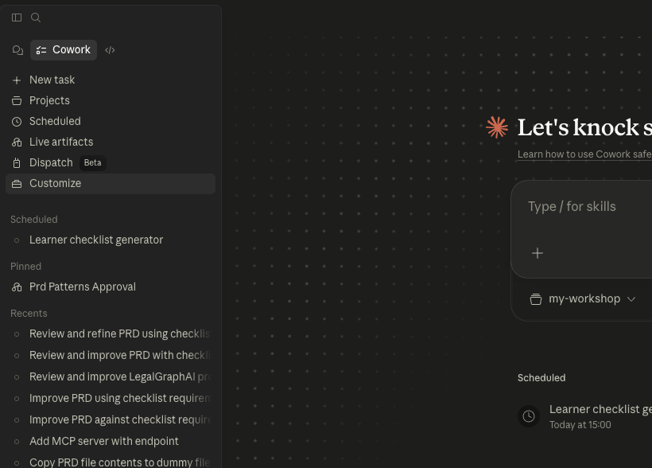
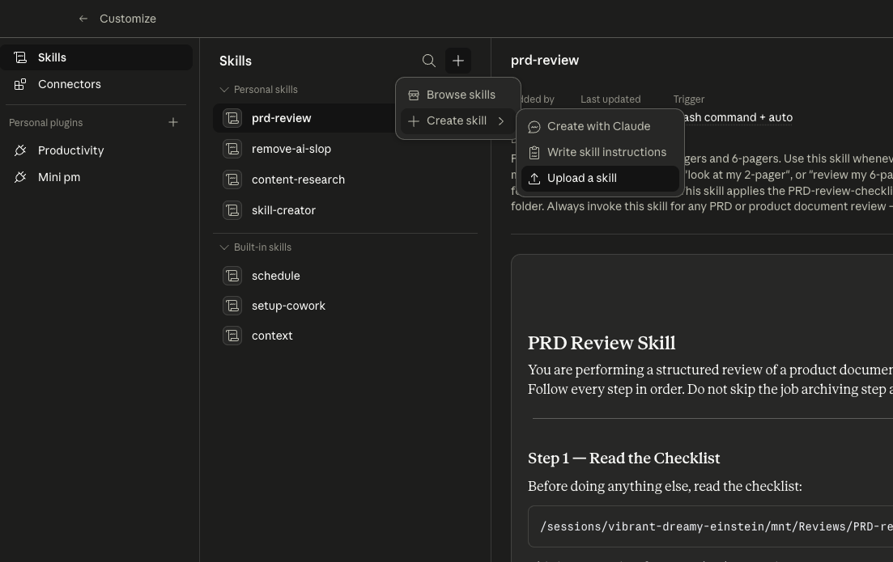
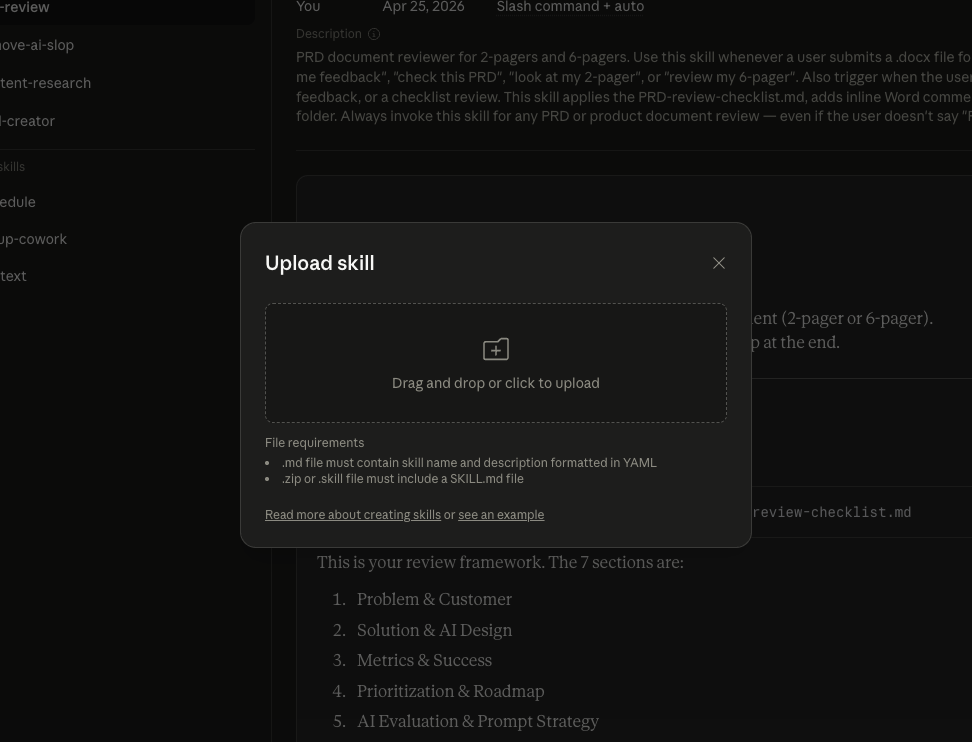
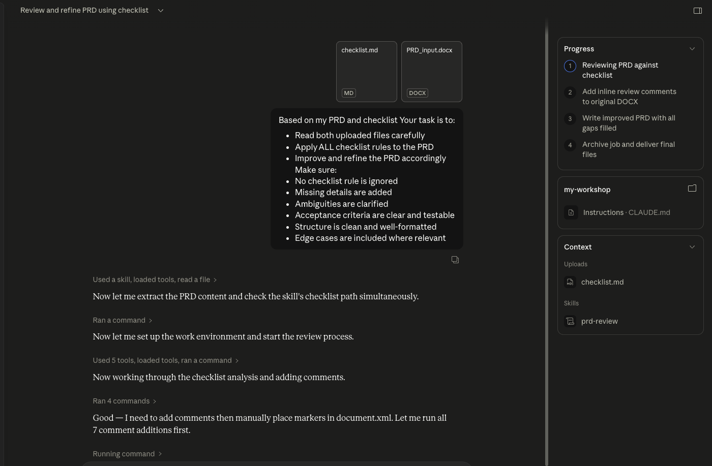
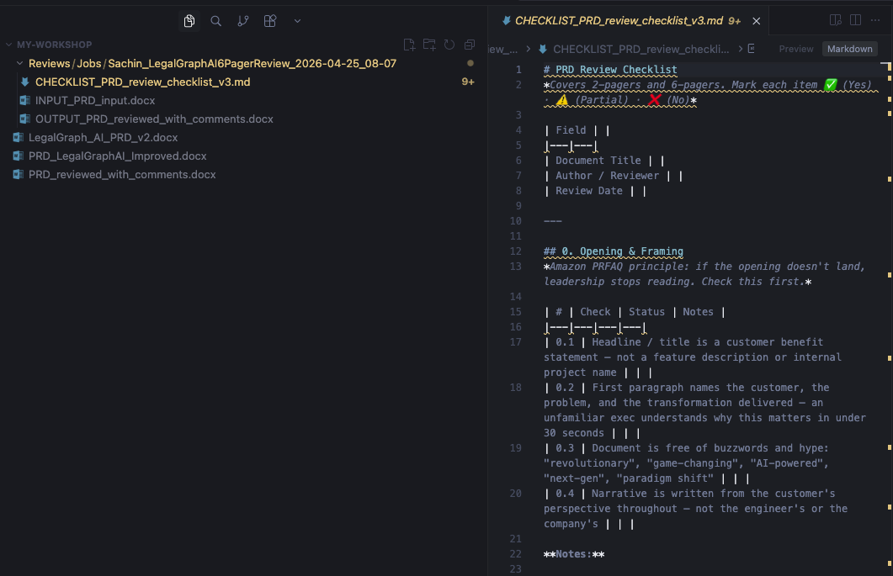
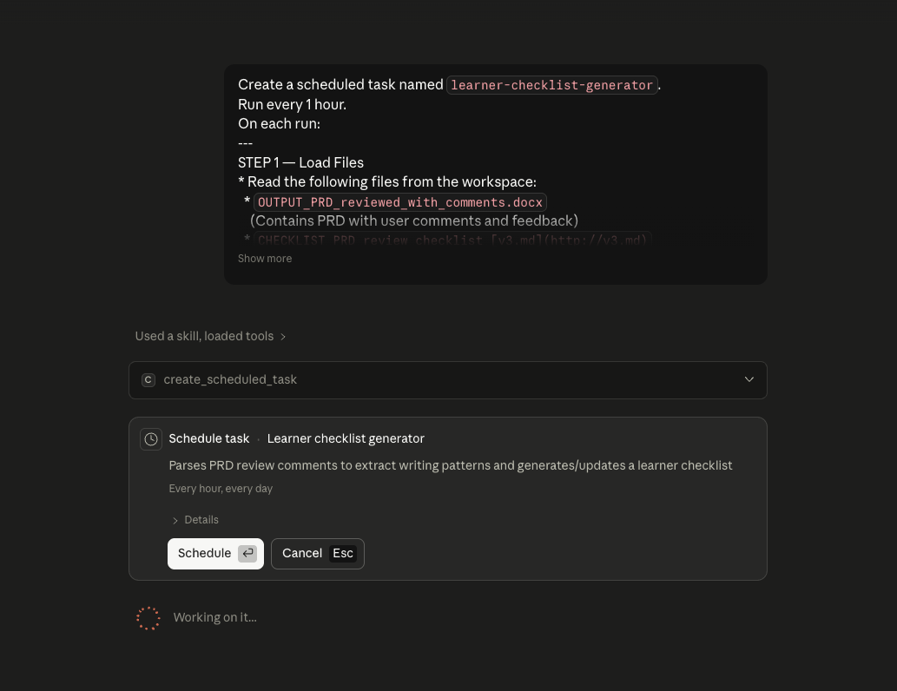
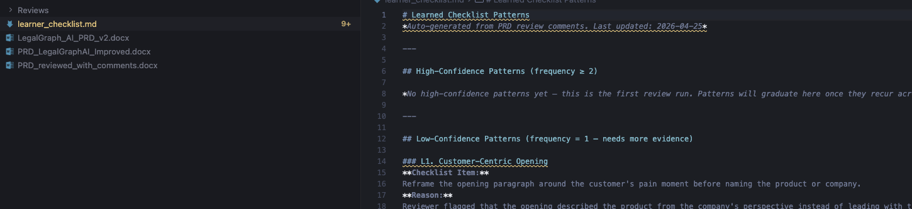
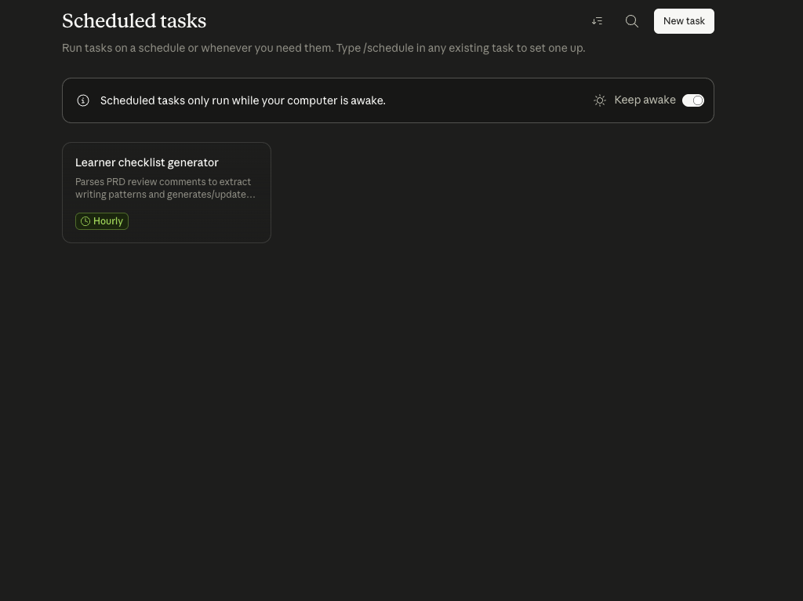
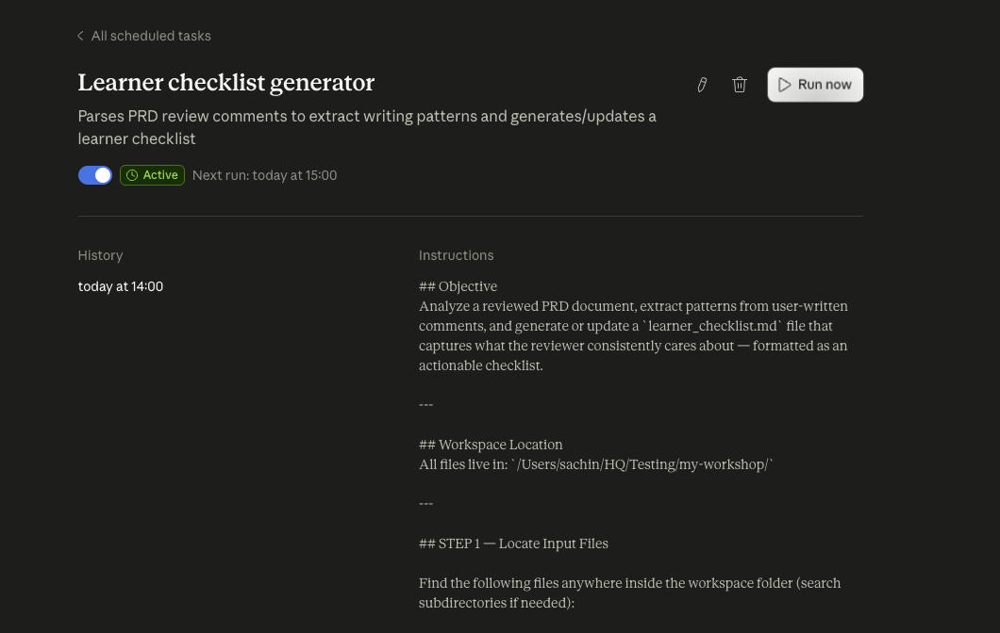

# The PRD Feedback Loop: How to Train AI Using Your Own Edits


---

## The Problem
Most AI workflows today are fundamentally static. You provide a prompt, tools like Claude generate a PRD, and then you manually refine it to match your expectations. However, all the valuable edits you make—your clarity improvements, added constraints, structural changes, and product thinking—are lost after that step. The AI does not learn from these corrections, which means it keeps repeating the same mistakes in future outputs. As a result, your unique way of thinking and writing PRDs never becomes part of the system, forcing you to repeatedly "fix" the AI instead of benefiting from it over time.


---

## What You Will Build

A three-part system that creates a **continuous learning cycle** around your PRD workflow:

| Part | What It Does | How Often |
|------|-------------|-----------|
| **PRD Skill** | Applies your checklist rules to generate an improved PRD | On demand |
| **Learning Scheduler** | Reads your edits, extracts behavioral patterns, builds candidate rules | Every 1 hour |
| **Approval Scheduler** | Sends high-confidence patterns to you via Slack, updates checklist on approval | Every 15 minutes |

The key insight: <span style="color:#2563EB">**you never write new rules manually. The AI infers them from watching how you edit its output.**</span>

---

## Prerequisites

Complete all four before starting. Do not skip these — the lesson will not work without them.

**1. Download the PRD Skill**
This is the skill file you will upload into Claude. It defines how Claude processes and improves your PRD.
[Download Skill File](https://pragyaallc-my.sharepoint.com/:u:/g/personal/sachin_parmar_legalgraph_ai/IQC8VfiPKDTtTJIz_2ZQcmbeAbkQrLqf9qTlX5trjdwCp6o?e=rYfDdS) *(link will be updated)*

**2. Claude Pro Subscription**
Scheduled tasks (the learning and approval schedulers) are a Claude Pro feature. Make sure you are signed into Claude with an active Pro subscription before starting.

**3. Download the Sample PRD**
This is the raw product requirements document you will feed into the system in Step 6.
[Download Sample PRD](https://pragyaallc-my.sharepoint.com/:w:/g/personal/sachin_parmar_legalgraph_ai/IQB9ewTdTDo2T74jgfymTUOnAdXk2dwfYVEPHhWvAjtGvkc?e=rSvgqK) *(link will be updated)*

**4. Download the Checklist**
This file defines the rules the AI uses to evaluate and improve your PRD. It also evolves over time as the system learns from your edits.
[Download Checklist](https://pragyaallc-my.sharepoint.com/:t:/g/personal/sachin_parmar_legalgraph_ai/IQD09xYg-LjFRY478BcFkDs0ASCZMa3zo-xryjSF59qt-ro?e=a5KtLt) *(link will be updated)*

---


## The Solution: A Self-Learning PRD Feedback Loop


<span style="color:#2563EB">**Core Idea:** Build a closed loop where your edits become structured learning signals that automatically evolve the AI's rules — with your explicit approval before anything changes.</span>

The loop has five phases that run in sequence:

```
Generate  →  Edit  →  Learn  →  Approve  →  Improve  →  Repeat
```

| Phase | Who Acts | What Happens |
|-------|----------|-------------|
| **Generate** | Claude (AI) | Produces an improved PRD using the current checklist |
| **Edit** | You (Human) | Reviews the PRD, adds comments, saves your version |
| **Learn** | Scheduler (AI) | Reads your edits, extracts behavioral patterns, stages candidate rules |
| **Approve** | You (Human via Slack) | Reviews high-frequency patterns, replies APPROVE or REJECT |
| **Improve** | System | Appends approved rules to the checklist, making the next run smarter |

This is the **self-learning agent loop** — the system gets better at your specific job by watching how you correct it, not by requiring you to write more prompts.

---

## System Architecture

```
┌──────────────────────────────────────────────────────────────┐
│                       YOUR WORKSPACE                          │
│                                                               │
│  PRD_input.docx                                         │
│  CCHECKLIST.md  ◄─── evolves over time │
│                           │                                   │
│                           ▼                                   │
│             ┌─────────────────────────┐                       │
│             │   PRD Skill (Prompt 1)  │                       │
│             │   Applies checklist     │                       │
│             │   rules to PRD          │                       │
│             └─────────────────────────┘                       │
│                           │                                   │
│                           ▼                                   │
│   OUTPUT_PRD_reviewed_with_comments.docx  ◄──── YOU EDIT THIS │
│                           │                                   │
│                           ▼                                   │
│   ┌────────────────────────────────────────────────────────┐  │
│   │   Scheduler: learner-checklist-generator  (1 hour)     │  │
│   │   Reads your comments → extracts patterns              │  │
│   │   Writes candidate rules → learner_checklist.md        │  │
│   └────────────────────────────────────────────────────────┘  │
│                           │                                   │
│                           ▼                                   │
│   ┌────────────────────────────────────────────────────────┐  │
│   │   Scheduler: slack-approval-checker  (15 minutes)      │  │
│   │   Filters patterns with Frequency >= 2                 │  │
│   │   Sends Slack DM → waits for APPROVE / REJECT          │  │
│   │   On APPROVE: appends rules to checklist.md            │  │
│   └────────────────────────────────────────────────────────┘  │
│                           │                                   │
│                           ▼                                   │
│   CCHECKLIST.md  ◄──── now updated     │
└──────────────────────────────────────────────────────────────┘
```

<span style="color:#6B7280">*The checklist that starts the process is the same checklist that gets improved at the end. Every iteration through the loop makes the system closer to how you actually think.*</span>

---

## Step-by-Step Lesson

---

### Step 1 — Create Your Workspace Folder

**What to do:** Create a new, empty folder anywhere on your machine. Name it something meaningful, for example: `prd-feedback-loop`. This folder will hold every file in this lesson.

**Why this matters in the agent loop:** The schedulers and all file read/write operations are scoped to a workspace in Claude. One clean folder means the AI always reads and writes exactly the files you intend — no accidental cross-contamination from other projects. Think of it as the container for your agent's memory.

---

### Step 2 — Open Claude 

**What to do:** Open the Claude desktop application. Confirm you are signed in and that your Pro subscription is active.

**Why this matters in the agent loop:** Claude is the runtime for this entire system. The skill runner, the schedulers, and all file access live inside it. Without Claude  running, none of the automated learning happens.

---

### Step 3 — Upload the Skill

**What to do:** Follow these three sub-steps exactly.

**3a.** In Claude, click on the **Customize** section in the left sidebar.



**3b.** Inside Customize, navigate to **Skills**.



**3c.** Click **Upload** and select the skill file you downloaded in the Prerequisites section.



Once uploaded, the skill will appear in your skills list. You do not need to configure anything else here.

**Why this matters in the agent loop:** A skill is a reusable, structured instruction set that tells Claude *exactly* how to process your PRD — consistently, every time. Without it, you would need to write a long prompt for every session. The skill is the AI's standard operating procedure for PRD review, and it stays stable across every run of the loop.

---

### Step 4 — Add the Workspace Folder to Claude

**What to do:** In Claude, add your workspace folder as an active project workspace. You will see a folder/workspace selector — point it to the `prd-feedback-loop` folder you created.


After adding it, Claude will have read and write access to that folder. All prompts, skills, and schedulers in this lesson operate within this boundary.

**Why this matters in the agent loop:** Claude operates with explicit file permissions. By registering the folder as your workspace, you are authorizing the agent to read your PRD and checklist, write output files, update `learner_checklist.md`, and persist state in `slack_state.json` — all of which are required for the loop to function.

---

### Step 5 — Run Prompt 1: Generate the Improved PRD

**What to do:** In the Claude Code chat, attach both files you downloaded in the Prerequisites directly in the chat window, then paste and run the prompt below:
- `PRD_input.docx`
- `CCHECKLIST.md`

```
Based on my PRD and checklist, your task is to:

1. Read both uploaded files carefully
2. Apply ALL checklist rules to the PRD
3. Improve and refine the PRD accordingly

Make sure:
- No checklist rule is ignored
- Missing details are added
- Ambiguities are clarified
- Acceptance criteria are clear and testable
- Structure is clean and well-formatted
- Edge cases are included where relevant
```



---

### Checkpoint — What Just Happened?

<span style="color:#16A34A">**You have just completed the Generate phase of the self-learning loop.**</span>

Here is exactly what the system did:

**Files it read:**
- `INPUT_PRD.docx` — your original PRD
- `CHECKLIST.md` — the current rule set

**What the skill did with them:**
- Read both files in full
- Went through every checklist rule one by one
- Identified gaps: unclear sections, missing edge cases, untestable acceptance criteria, vague language
- Produced an improved version with all gaps addressed

**Files now in your workspace:**
- A reviews folder which you can use for audits later on
- `PRD_reviewed_with_comments.docx` — the PRD with inline AI feedback, suggestions, and comments showing *why* each change was made
- `PRD_legalgraph_improved.docx` — the fully refined PRD with all improvements applied



---

### Your Next Action — This Is the Critical Step

<span style="color:#DC2626">**Open `PRD_reviewed_with_comments.docx`. Read it carefully. Now add your own comments.**</span>

This is where you inject your product thinking. As you read through the AI's improved PRD:

- Add a comment wherever you think something is still vague
- Rewrite any section that does not match how your team works
- Insert edge cases the AI missed
- Adjust structure to match your organization's standards
- Add examples or constraints that reflect your actual product context


When you are done, save the file. You do not need to rename it — the scheduler in the next step will read it exactly as `PRD_reviewed_with_comments.docx`.

**Why this step is the engine of the entire loop:** The gap between what the AI produced and what you changed is your *learning signal*. Every comment you add — the system will study all of it in the next phase and turn it into rules. The more deliberate and specific your edits, the better the system learns your standards.

<span style="color:#6B7280">*In a traditional workflow, these edits disappear the moment you close the file. In this loop, they become the AI's training data for every future PRD.*</span>

---

### Step 6 — Create the Learning Scheduler (Prompt 2)

**What to do:** In the Claude chat, paste and run the following prompt. This creates a scheduled background job that will run automatically every hour.

```
Create a scheduled task named learner-checklist-generator.
Run every 1 hour. On each run:

STEP 1 — Load Files
Read the following files from the workspace:
- PRD_reviewed_with_comments.docx
- CHECKLIST.md

STEP 2 — Extract User Intent from Comments
Parse ALL comments from the PRD document.
For each comment, identify what the user is trying to improve:
- Adding missing edge cases → pattern: "User prefers edge case coverage"
- Rewriting vague text → pattern: "User prefers clarity"
- Adding structure → pattern: "User prefers structured sections"
- Adding examples → pattern: "User prefers examples"

STEP 3 — Convert to Patterns
Group similar comments into patterns.
For each pattern create:
- checklist_item → Instruction style (like original checklist)
- reason → Why this pattern exists (based on user comments)
- frequency → Number of times this pattern appears

STEP 4 — Match Checklist Style
Ensure generated checklist items follow the SAME style as
CCHECKLIST.md:
- Clear instruction
- Actionable
- Testable
- No vague language

STEP 5 — Generate learner_checklist.md
Create or update file: learner_checklist.md
Format:
## Learned Checklist Patterns
Checklist Item: [rule]
Reason: [behavioral inference]
Frequency: [count]

STEP 6 — Merge with Existing File (if exists)
If learner_checklist.md already exists:
- Match new patterns with existing ones
- If similar: increase frequency
- If new: add new entry

IMPORTANT RULES:
- Only learn from USER comments (ignore AI-generated text)
- Do NOT duplicate similar checklist items
- Keep wording concise and professional
- Do NOT include patterns with frequency = 1
- Maintain clean formatting

OUTPUT: Save updated file as learner_checklist.md
```



---

### What the Learning Scheduler Does — Explained

<span style="color:#2563EB">**This is the Learn phase of the self-learning loop.**</span>

Every hour, this job wakes up and works through the following sequence:

**1. It reads your edited PRD** — specifically the comments and changes you made. It ignores the AI's original text and focuses only on what *you* added or changed.

**2. It identifies behavioral patterns.** If you added edge cases in three different sections, the system recognizes that you consistently want edge cases covered. That is a pattern, not a coincidence.

**3. It converts patterns into structured rules** — written in the same format and style as your existing checklist. Not vague observations like "user prefers detail" — actionable, testable checklist items like "All acceptance criteria must include at least one explicit failure/edge case scenario."

**4. It tracks frequency.** A pattern that appears once might be a one-off. A pattern that appears three times is a rule you implicitly follow. The system counts occurrences and only promotes high-frequency patterns for your review.

**5. It writes to `learner_checklist.md`** — a staging file that sits between your edits and your official checklist. <span style="color:#DC2626">**Nothing in your actual checklist changes yet.**</span> The system is learning quietly in the background, building a list of candidate rules that reflect your editing behavior. Your approval is required before any of them take effect.



<span style="color:#6B7280">*Think of it like a junior PM who watches you redline a document, takes careful notes, and waits to ask: "Should we add this as a standing rule for every PRD going forward?"*</span>

---

### Step 7 — Test the Learning Scheduler

You do not need to wait an hour. You can trigger the scheduler manually right now to verify it works.

**What to do:**

**7a.** In Claude Code, go to the **Scheduler** section.


**7b.** Find the task named `learner-checklist-generator` in the list.



**7c.** Click **Run** to trigger it immediately.



**7d.** Wait for it to complete, then open your workspace folder. You should now see a new file: `learner_checklist.md`.


Open `learner_checklist.md`. You will see structured checklist items — each one with a plain-English rule, the reason it was inferred, and the number of times that pattern appeared in your edits.

<span style="color:#16A34A">**This is your feedback loop in action for the first time.** The AI has studied your edits and translated them into candidate rules. But these rules have not yet touched your actual checklist. That step requires your explicit approval — which is what you will build next.</span>

---

### Step 8 — Create the Approval Scheduler (Prompt 3)

**What to do:** In the Claude chat, paste and run the following prompt. This creates the human-in-the-loop control layer — the piece that ensures *you* decide what gets added to your checklist, not the AI alone.

> **Before you paste this prompt:** Find the line that says `Send a direct message to: Sachin Parmar` and replace `Sachin Parmar` with your own Slack display name, a teammate's name, or a Slack channel (e.g. `#prd-reviews`). Use whatever destination makes sense for your workflow.

```
Create a scheduled task named slack-approval-checker.
Run every 15 minutes.

STEP 0 — Load State
Read slack_state.json (create if not exists)
Structure:
{
  "last_processed_message_ts": "",
  "last_sent_patterns_hash": ""
}

STEP 1 — Filter High-Frequency Patterns
Read learner_checklist.md
Extract ONLY items where Frequency >= 2
If no such items exist → STOP

STEP 1.1 — Prevent Duplicate Slack Messages
Generate a hash of the filtered patterns
Compare with last_sent_patterns_hash
If SAME → STOP (no new patterns to review)

STEP 2 — Send Slack DM
Send a direct message to: Sachin Parmar
Message:
  Subject: PRD Checklist Learning Updates
  Hi Sachin,
  The following checklist patterns have been observed multiple
  times in your PRD edits and are ready for review:
  [Insert filtered checklist items]
  Reply with ONLY one word:
  APPROVE → Accept and update checklist
  REJECT → Ignore these patterns

After sending: store the hash in last_sent_patterns_hash

STEP 3 — Check for Reply
Fetch messages from the DM conversation
Identify timestamp of last bot message (approval request)
From that timestamp: read ALL subsequent messages
Find latest message from Sachin Parmar

STEP 3.1 — Normalize Reply
Convert message to uppercase, trim spaces
Valid values: "APPROVE" or "REJECT"
If neither found → STOP

STEP 3.2 — Prevent Reprocessing
If reply timestamp == last_processed_message_ts → STOP

STEP 4 — Take Action
IF APPROVE:
  Read checklist.md
  For each approved pattern:
    Check if similar rule already exists
    If NOT: append to checklist in proper format
IF REJECT:
  Do nothing (ignore patterns)

STEP 5 — Update State
Update last_processed_message_ts = latest reply timestamp
Save slack_state.json

IMPORTANT RULES:
- ONLY process patterns with Frequency >= 2
- NEVER add duplicate or similar checklist items
- ALWAYS check for previous Slack sends using hash
- ALWAYS ensure idempotency (no repeated updates)
- ONLY consider the latest user reply
- DO NOT process partial or unclear responses

OUTPUT: Perform actions silently. Do NOT print anything.
```


---

### Test the Approval Scheduler

Just like Step 8, you can test this immediately without waiting 15 minutes.

**What to do:** Go to the **Scheduler** section in Claude, find the `slack-approval-checker` task, and click **Run**.

The scheduler will:
1. Read `learner_checklist.md`
2. Filter for patterns with Frequency >= 2
3. Send you a Slack DM with those patterns listed

Check your Slack. You should receive a message that looks like this:


**Now reply** to the Slack message with either `APPROVE` or `REJECT`.


The next time the scheduler runs (or you trigger it manually again), it will detect your reply and take action.

---

### What the Approval Scheduler Does — Explained

<span style="color:#2563EB">**This is the Approve and Improve phase of the self-learning loop.**</span>

Every 15 minutes, this job runs through the following sequence:

**1. It filters for confidence.** Only patterns that appeared two or more times in your edits are surfaced for review. Single-occurrence patterns stay in `learner_checklist.md` but are never sent to Slack. Recurring patterns are the signal; one-offs are the noise.

**2. It prevents duplicate messages.** Before sending anything, the system hashes the current set of high-frequency patterns and compares it against the last batch it sent you. If nothing new has been learned since the last send, it stays completely silent. You will never receive the same Slack message twice.

**3. It sends you a structured Slack DM.** Each message shows you the exact rule the AI wants to add, why it inferred that rule from your edits, and how many times it appeared. You have full visibility before committing to anything.

**4. Your single-word reply controls everything.** Type `APPROVE` or `REJECT` — nothing else. The system handles the rest. No forms, no configuration, no prompt engineering required from you.

**5. On APPROVE:** The new rules are appended to `CCHECKLIST.md` — the same file that powers the PRD generation in Step 6. <span style="color:#16A34A">**The loop is now closed.** The next time you run Prompt 1, Claude will use an improved checklist that reflects your editing standards.</span>

**6. On REJECT:** The patterns are discarded from consideration. The checklist stays unchanged. The scheduler will not re-surface these same patterns in future runs.

**7. State is persisted in `slack_state.json`.** This file tracks the timestamp of the last processed reply and the hash of the last sent patterns. It guarantees the system never processes a reply twice, never sends duplicate notifications, and always resumes correctly — even if Claude restarts between runs.

<span style="color:#6B7280">*You are not writing new rules. You are reviewing rules the AI inferred from watching you work — and deciding which ones are worth keeping. This is the difference between prompting an AI and actually training one on your behavior.*</span>

---

## The Complete Self-Learning Loop

Here is how all three parts connect into one continuous cycle:

```
YOU EDIT the AI-generated PRD
          │
          ▼
learner-checklist-generator  (runs every 1 hour)
  ├── Reads your comments from OUTPUT_PRD_reviewed_with_comments.docx
  ├── Extracts behavioral patterns
  ├── Converts them to structured checklist rules
  └── Writes candidate rules to learner_checklist.md
          │
          ▼
slack-approval-checker  (runs every 15 minutes)
  ├── Reads learner_checklist.md
  ├── Filters patterns where Frequency >= 2
  ├── Sends you a Slack DM with those patterns
  ├── Waits for your reply
  │
  ├── APPROVE ──► Appends rules to CCHECKLIST.md
  │                        │
  │                        ▼
  │               NEXT PRD generation uses the improved checklist
  │               → Better output → Fewer edits needed from you
  │
  └── REJECT ──► Discards patterns, checklist unchanged
```

<span style="color:#16A34A">**Every approved cycle makes future PRDs better — automatically, without you writing a single new prompt.**</span>

---

## Key Concepts in This System

| Concept | What It Means Here |
|---------|-------------------|
| **Self-learning loop** | The system improves its own rules by observing how you correct its output |
| **Learning signal** | The specific difference between what the AI wrote and what you changed |
| **Pattern extraction** | Converting your ad-hoc edits into structured, reusable checklist rules |
| **Frequency threshold** | Only patterns appearing 2+ times get promoted — filters noise from real preferences |
| **Human-in-the-loop** | You approve every rule change before it affects the system |
| **Idempotency** | Running the scheduler many times never causes duplicate updates or duplicate Slack messages |
| **State file (slack_state.json)** | Persistent memory that ensures the system always knows what it has already processed |

---

## What Makes This an Agent Loop — Not Just a Workflow

A standard AI call is stateless: prompt in, output out, nothing remembered.

An agent loop is different because it has four properties this system implements directly:

<span style="color:#DC2626">**Memory**</span> — The checklist accumulates learned rules across every session. Each loop cycle builds on the last one. The system remembers what you approved.

<span style="color:#DC2626">**Autonomy**</span> — The schedulers run in the background without you triggering them. The system continuously monitors for learning opportunities without requiring your attention.

<span style="color:#DC2626">**Feedback mechanism**</span> — The system's output (the improved PRD) feeds back into its own inputs (the checklist) via your edits. Output influences future output.

<span style="color:#DC2626">**Human oversight**</span> — You approve every rule change before it takes effect. The AI cannot modify its own behavior without your explicit sign-off.

This combination — autonomous background learning with human approval gates — is the core architecture pattern behind production self-improving AI systems. You have just built a working version of it, applied directly to a product management workflow you use every day.

---
