# The PRD Feedback Loop: How to Train AI Using Your Own Edits

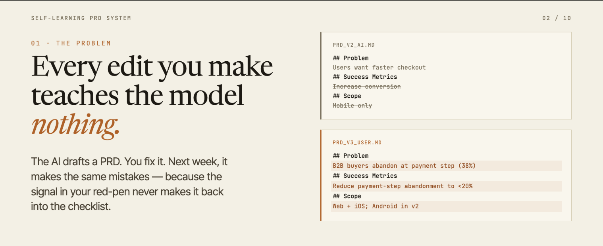

---

## The Problem

Most AI workflows today are fundamentally **static**. You provide a prompt, tools like Claude generate a PRD, and then you manually refine it to match your expectations. However, all the valuable edits you make — your clarity improvements, added constraints, structural changes, and product thinking — are **lost** after that step.

The AI does not learn from these corrections, which means it keeps repeating the same mistakes in future outputs. As a result, your unique way of thinking and writing PRDs never becomes part of the system, forcing you to repeatedly "fix" the AI instead of benefiting from it over time.

> [!IMPORTANT]
> **The core problem:** Every time you edit an AI-generated PRD, you are teaching — but the AI isn't listening. This lesson changes that.

---

## What Is a Self-Learning Agent Loop?

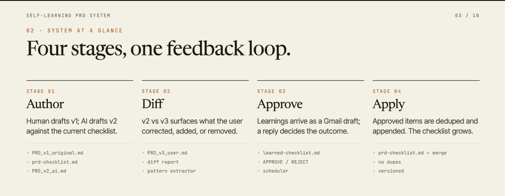

A <span style="color: #8e44ad">**self-learning agent loop**</span> is an AI system that continuously improves itself by observing and learning from human behavior — **without** being explicitly retrained or reprogrammed.

In this lesson, we build a loop where:

1. <span style="color: #2980b9">**AI generates**</span> a structured PRD using a predefined checklist
2. <span style="color: #d35400">**You refine it**</span> — your edits and comments are the learning signal
3. <span style="color: #8e44ad">**The system extracts patterns**</span> from what you changed and why
4. <span style="color: #27ae60">**High-confidence patterns**</span> are sent to you for approval via Slack
5. <span style="color: #27ae60">**Approved rules**</span> are automatically added to the master checklist
6. The next PRD is better — and the loop continues

```
Generate → Edit → Learn → Approve → Improve → Repeat
```

This is not prompt engineering. This is <span style="color: #8e44ad">**behavioral learning**</span> — the system builds a model of how *you* think, structured as rules the AI can apply.

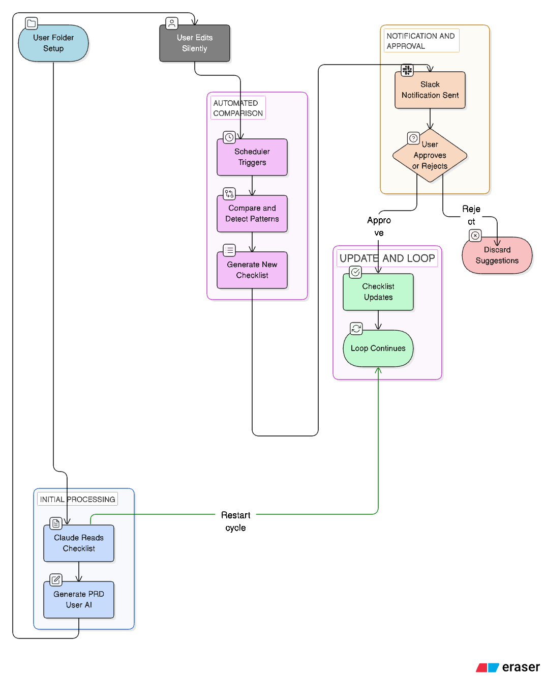

> [!IMPORTANT]
> **Key Insight:** Most people use AI as a one-shot tool — prompt in, output out. What we're building here is fundamentally different. Every edit you make is treated as a **training signal**. The system learns your patterns, infers your intent, and evolves its own rules over time. This is how production AI systems at scale actually work.

---

## Prerequisites

Before starting this lesson, make sure you have all four of the following:

| # | Requirement | Why You Need It |
|---|---|---|
| 1 | **Download the PRD Skill** | The skill gives Claude specialized instructions for applying checklist rules to PRDs — without it, the first prompt won't work correctly |
| 2 | **Active Claude Pro Subscription** | Scheduler tasks and workspace file access require a Pro account |
| 3 | **Download the Sample PRD** | This is your starting PRD — the AI's first input |
| 4 | **Download the Checklist File** | This is the set of rules the AI uses to evaluate and improve the PRD |

**Download Links:**

- <span style="color: #2980b9">**PRD Skill**</span> — Download from the course resources section and save it locally
- <span style="color: #2980b9">**Sample PRD**</span> — [Click to download PRD_input.docx](https://pragyaallc-my.sharepoint.com/:t:/g/personal/sachin_parmar_legalgraph_ai/IQC77a2fZILXS4BtU9_i9DRoAbTPlucKPxxTWlK-iABnL2w?e=Y5vUZf)
- <span style="color: #2980b9">**Checklist File**</span> — [Click to download PRD_review_checklist_v3.md](https://pragyaallc-my.sharepoint.com/:t:/g/personal/sachin_parmar_legalgraph_ai/IQD09xYg-LjFRY478BcFkDs0ASCZMa3zo-xryjSF59qt-ro?e=zFL2i0)

> [!NOTE]
> Do not start the lesson until all four items above are ready. The entire feedback loop depends on having both the PRD and checklist available in your workspace from the very beginning.

---

## Part 1: Setup — Create Your Workspace

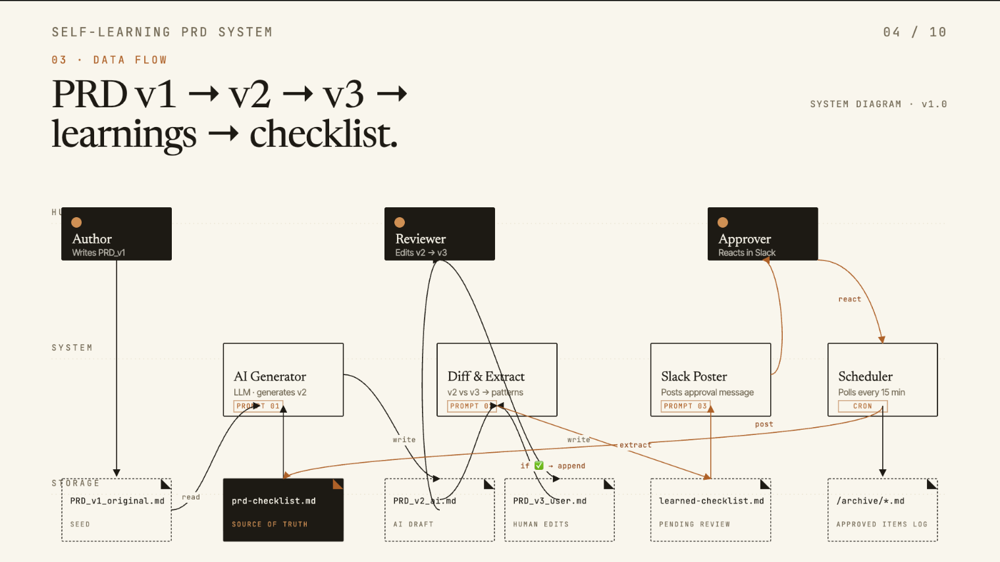

Before writing a single prompt, we need to give Claude a <span style="color: #8e44ad">**persistent workspace**</span> — a folder it can read from and write to across sessions. Think of this as the "long-term memory" of your agent. Without it, Claude has no way to access your files, compare versions, or save any outputs it generates.

### Step 1 — Create a Workspace Folder

Create a new folder on your machine. Suggested name: `self-learning-prd-agent`

This folder will hold every file in your learning loop — inputs, outputs, learned rules, and state files.

### Step 2 — Open Claude Code

Launch Claude Code on your system and make sure you are signed in to your Pro account.

### Step 3 — Upload the PRD Skill

This is a critical step that is unique to this workflow. The <span style="color: #8e44ad">**PRD Skill**</span> teaches Claude exactly how to read a checklist and apply it to a PRD — it defines the behavior of the AI in Phase 1.

1. In Claude Code, go to the **Customize** section
2. Navigate to the **Skills** tab
3. Upload the skill file you downloaded in the Prerequisites section

> [!IMPORTANT]
> **Why this matters in the self-learning loop:** The skill defines the AI's *starting behavior* — how it generates PRDs before it has learned anything from you. Think of the skill as the AI's initial training. Everything it learns later (from your edits) builds on top of this baseline. Without uploading the skill, the AI has no structured way to apply checklist rules, and the comparison in Phase 3 will produce meaningless patterns.

### Step 4 — Add Your Files to the Workspace Folder

Place the following two files inside `self-learning-prd-agent`:

- `INPUT_PRD_input.docx` → your downloaded sample PRD
- `CHECKLIST_PRD_review_checklist_v3.md` → your downloaded checklist

### Step 5 — Connect the Workspace Folder in Claude Code

In Claude Code, go to the **Workspace** section and add the `self-learning-prd-agent` folder. This gives Claude:

- Read access to your PRD and checklist
- Write access to save generated files directly into the folder
- Persistent file state across separate chat sessions


> [!IMPORTANT]
> **Checkpoint — What just happened?**
> You've given the agent a brain (the skill) and a memory (the workspace folder). The skill defines how the AI reasons about PRDs. The folder is where all generated outputs, learned patterns, and state files will live. This is the foundation of the entire feedback loop — every subsequent step depends on both being in place.

---

## Part 2: PRD Generation — AI Applies Your Rules

Now the loop begins its first revolution. Claude will read your PRD and your checklist, apply every rule it finds, and produce an improved, structured version. This output — `PRD_v2` — is the AI's **best current attempt**. It is the baseline you will compare against later.

The key idea here is <span style="color: #2980b9">**checklist-driven generation**</span>. Instead of asking Claude to "improve the PRD" with no structure, we give it an explicit set of rules. This makes the output reproducible, reviewable, and — most importantly — *comparable* to your edited version in Phase 3.

### Step 1 — Open a New Chat in Claude Code

Start a fresh chat so the context is clean and focused on this task only.

### Step 2 — Run the Following Prompt

> [!TIP]
> **Prompt — Click the copy icon in the top-right corner of the code block below, then paste it directly into Claude.**

```
Based on my PRD and checklist, your task is to:

1. Read both uploaded files carefully:
   - INPUT_PRD_input.docx → the original PRD
   - CHECKLIST_PRD_review_checklist_v3.md → the rules to follow

2. Apply ALL checklist rules to the PRD

3. Improve and refine the PRD accordingly

Make sure:
- No checklist rule is ignored
- Missing details are added
- Ambiguities are clarified
- Acceptance criteria are clear and testable
- Structure is clean and well-formatted
- Edge cases are included where relevant

Output Instructions:
- Save the improved PRD as: OUTPUT_PRD_reviewed_with_comments.docx
- Include inline comments where you made changes and why
- Keep structure clean with proper headings
```

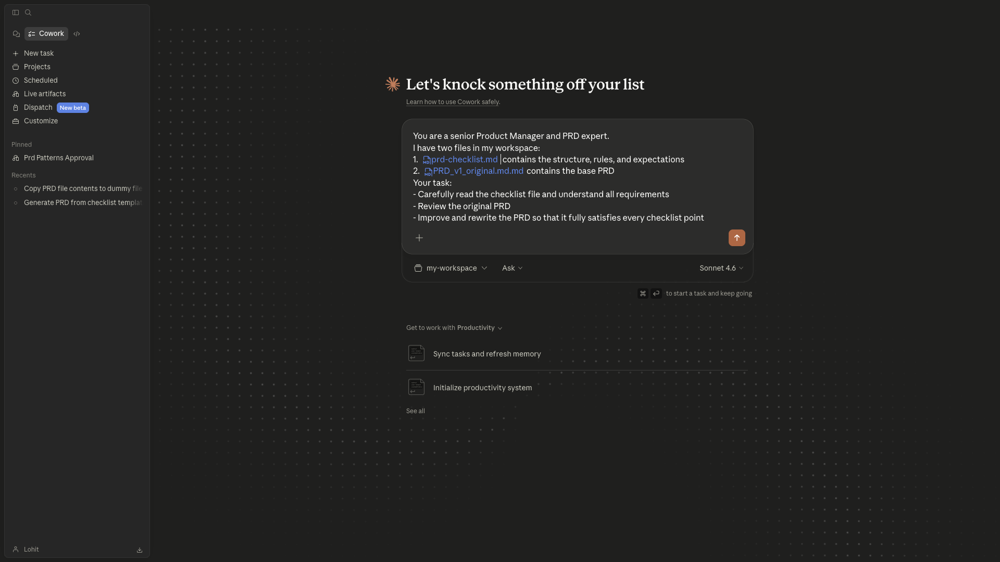

### Step 3 — Review the Output

Once Claude finishes, you will find `OUTPUT_PRD_reviewed_with_comments.docx` inside your workspace folder. Open it and:

- Read the inline comments Claude added — these explain *why* each change was made
- Note sections that were expanded, restructured, or clarified

### Step 4 — Your Role: Edit and Add Comments

<span style="color: #e74c3c">**This is the most important step in the entire lesson.**</span>

Create a copy of `OUTPUT_PRD_reviewed_with_comments.docx`. In this copy:

- Make your own edits — rewrite sections, add specificity, restructure as needed
- <span style="color: #d35400">**Leave comments**</span> explaining why you made each change (these become the learning signal)
- Save this file as `PRD_v2_user.docx`

The difference between `OUTPUT_PRD_reviewed_with_comments.docx` (AI version) and `PRD_v2_user.docx` (your version) is the <span style="color: #8e44ad">**training data for the self-learning loop**</span>.

> [!IMPORTANT]
> **Checkpoint — What just happened?**
>
> The AI used your checklist to produce its best version of the PRD (`OUTPUT_PRD_reviewed_with_comments.docx`). You then reviewed it, applied your own product thinking, and saved your improved version as `PRD_v2_user.docx`.
>
> **Why your comments matter:** In Phase 3, the system will read both files and try to understand *why* you made each change. Comments like "added edge case for anonymous users" or "rewrote for clarity — too vague" give the system concrete intent to learn from. The more explicit your comments, the higher the quality of the learned rules.
>
> <span style="color: #27ae60">**Your edits show what changed. Your comments show what you actually think. Both are the learning signal.**</span>

---

## Part 3: The Learning Engine — Pattern Extraction


Here is where the system starts getting <span style="color: #8e44ad">**genuinely intelligent**</span>. You have made edits to the AI's PRD. Now we need an automated process that looks at those edits, infers *why* you made them, and converts that reasoning into structured checklist rules.

We do this with a <span style="color: #2980b9">**scheduled task**</span> — a recurring background job that runs every hour. It wakes up, compares the two PRD files, identifies patterns in your changes, and writes new rules to `learner_checklist.md`.

This is <span style="color: #8e44ad">**behavioral inference**</span>: the system does not just log what changed — it reasons about *why* the change was made and converts that reasoning into a reusable rule.

### The Scheduled Prompt

> [!TIP]
> **Prompt — Click the copy icon in the top-right corner of the code block below, then paste it directly into Claude.**

```
Create a scheduled task named learner-checklist-generator.
Run every 1 hour.

On each run:

STEP 1 — Load Files
Read the following files from the workspace:
- OUTPUT_PRD_reviewed_with_comments.docx
  (AI-generated PRD with inline comments)
- CHECKLIST_PRD_review_checklist_v3.md
  (Original checklist — use this for style reference only)

STEP 2 — Extract User Intent from Comments
Parse ALL comments from the PRD document.
For each comment, identify what the user is trying to improve.

Examples:
- Adding missing edge cases → pattern: "User prefers edge case coverage"
- Rewriting vague text → pattern: "User prefers clarity"
- Adding structure → pattern: "User prefers structured sections"
- Adding examples → pattern: "User prefers examples in requirements"

STEP 3 — Convert to Patterns
Group similar comments into patterns.
For each pattern, create:
- checklist_item → Instruction style (like original checklist)
- reason → Why this pattern exists (based on user comments)
- frequency → Number of times this pattern appears

STEP 4 — Match Checklist Style
Ensure generated checklist items follow the SAME style as
CHECKLIST_PRD_review_checklist_v3.md.

Style rules:
- Clear instruction
- Actionable
- Testable
- No vague language

STEP 5 — Generate learner_checklist.md
Create or update the file: learner_checklist.md

Format:
---
# Learned Checklist Patterns

## Checklist Item: [rule]
- Reason: [why the user made this change]
- Frequency: [number of times pattern appeared]

(Continue for all patterns)
---

STEP 6 — Merge with Existing File (if exists)
If learner_checklist.md already exists:
- Match new patterns with existing ones
- If similar: increase frequency count
- If new: add as new entry

IMPORTANT RULES:
- Only learn from USER comments (ignore AI-generated text)
- Do NOT duplicate similar checklist items
- Keep wording concise and professional
- Do NOT include patterns with frequency = 1
- Maintain clean formatting

OUTPUT:
Save updated file as: learner_checklist.md
```

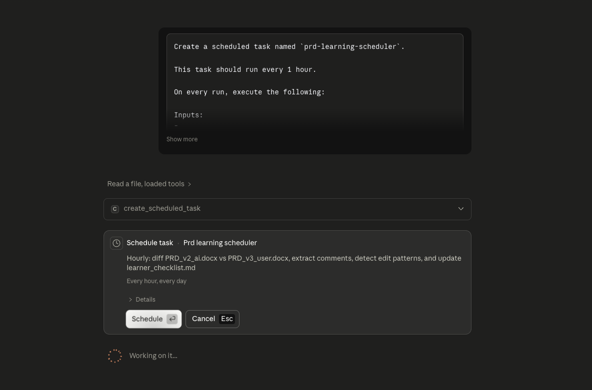

### How to Test the Scheduler

1. Go to **Scheduler** in the left sidebar


2. Click on your `learner-checklist-generator` task
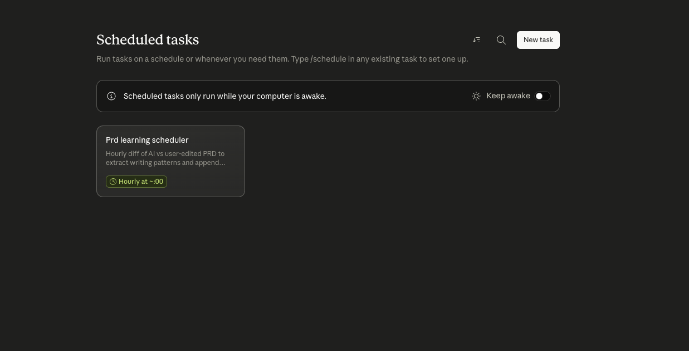

3. Click **Run** to trigger it immediately (don't wait an hour)
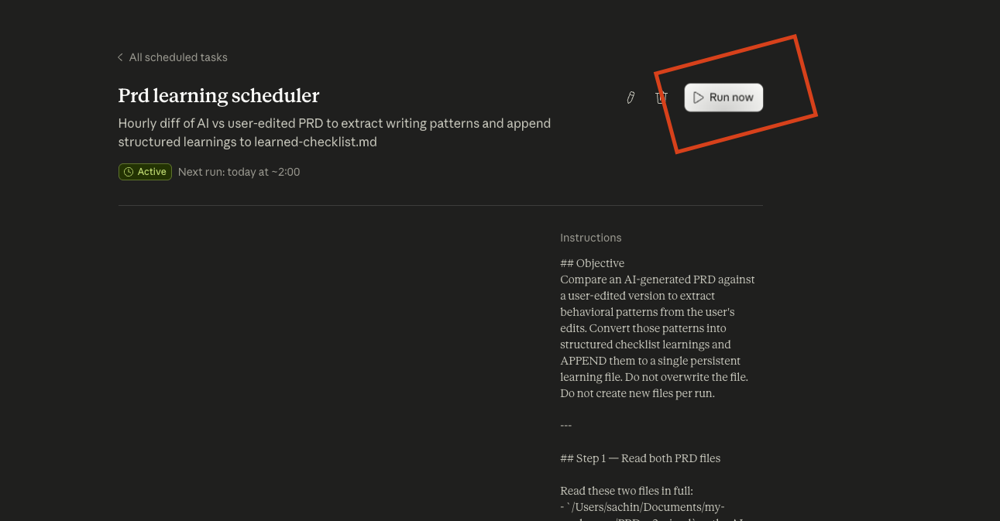

After it runs, open `learner_checklist.md` in your workspace folder. You should see structured checklist items derived directly from your edits and comments.

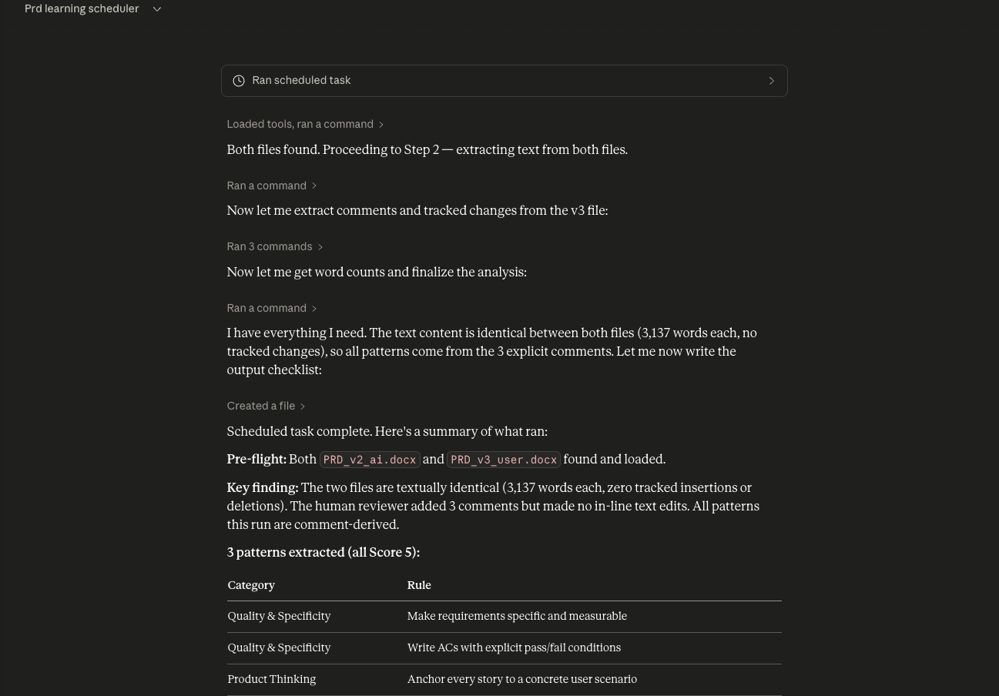

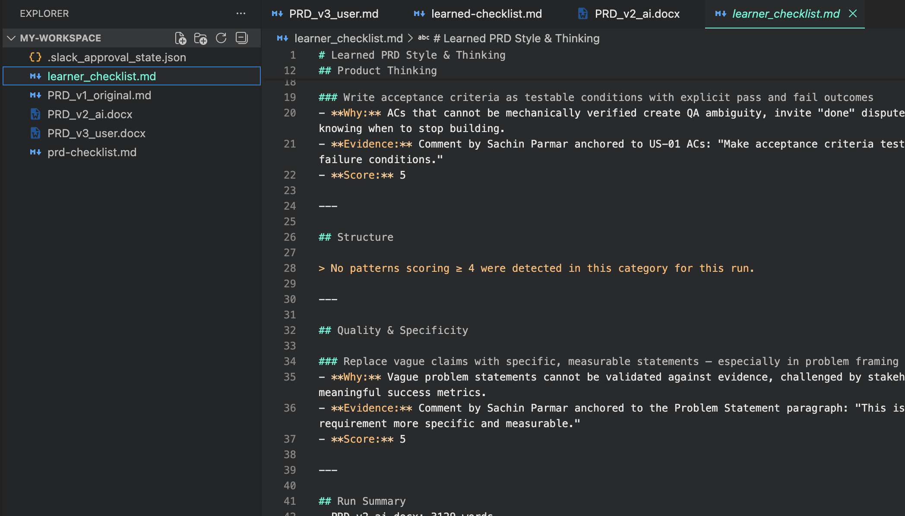

> [!IMPORTANT]
> **Checkpoint — What just happened?**
>
> You have created an autonomous background agent. Every hour, it wakes up, reads both PRDs, extracts what you changed and why, assigns a confidence score to each pattern, and writes structured rules to `learner_checklist.md`.
>
> <span style="color: #8e44ad">**This is behavioral learning in action.**</span> The system is not memorizing your edits — it is *inferring your intent* and encoding it as reusable rules.
>
> Notice the frequency counts: a pattern that appears once might be noise. A pattern that appears three times across different sections is a strong signal about how you think. The system uses this frequency to decide what is worth surfacing for approval — which is exactly what happens next.

---

## Part 4: Human-in-the-Loop — Slack Approval

We now have a system that automatically generates learned rules. But we do not want to blindly trust them — <span style="color: #e74c3c">**no learned rule should touch the master checklist without your explicit approval**</span>.

This is the <span style="color: #2980b9">**human-in-the-loop**</span> step. Before any pattern gets added to `checklist.md`, the system sends it to you via Slack DM. You review it and reply with a single word: `APPROVE` or `REJECT`.

This is what separates a toy demo from a production-grade workflow. It ensures you stay in control even as the system continuously learns. The same pattern — automated learning with human approval gates — is used in production AI systems at scale.

### Step 1 — Create the Slack Approval Scheduler

This scheduler runs every 15 minutes. It reads `learner_checklist.md`, filters patterns with `Frequency >= 2`, and sends only those to you for review. Patterns seen just once are not surfaced — they are considered low-confidence noise.

> [!NOTE]
> **Before pasting this prompt:** Replace `Sachin Parmar` with your own Slack display name. Use the name exactly as it appears in your Slack workspace.

> [!TIP]
> **Prompt — Click the copy icon in the top-right corner of the code block below, then paste it directly into Claude.**

```
Create a scheduled task named slack-approval-checker.
Run every 15 minutes.

STEP 0 — Load State
Read slack_state.json (create if not exists).
Structure:
{
  "last_processed_message_ts": "",
  "last_sent_patterns_hash": ""
}

STEP 1 — Filter High-Frequency Patterns
Read learner_checklist.md.
Extract ONLY items where Frequency >= 2.
If no such items exist → STOP.

STEP 1.1 — Prevent Duplicate Slack Messages
Generate a unique hash of the filtered patterns.
Compare with last_sent_patterns_hash in slack_state.json.
If SAME → STOP (no new patterns to review).

STEP 2 — Send Slack DM
Send a direct message to: Sachin Parmar

Message:
---
Subject: PRD Checklist Learning Updates

Hi Sachin,

The following checklist patterns have been observed multiple
times in your PRD edits and are ready for review:

[Insert filtered checklist items — only Frequency >= 2]

Reply with ONLY one word:
APPROVE → Accept and update checklist
REJECT  → Ignore these patterns
---

After sending, store the hash in last_sent_patterns_hash.

STEP 3 — Check for Reply
Fetch messages from the DM conversation.
Identify the timestamp of the last bot message (approval request).
From that timestamp, read ALL subsequent messages.
Find the latest message from Sachin Parmar.

STEP 3.1 — Normalize Reply
Convert message to uppercase.
Trim spaces.
Valid responses: "APPROVE" or "REJECT".
If neither found → STOP.

STEP 3.2 — Prevent Reprocessing
If reply timestamp == last_processed_message_ts → STOP.

STEP 4 — Take Action

IF APPROVE:
  Read checklist.md.
  For each approved pattern:
    Check if similar rule already exists.
    If NOT: append to checklist in proper format.

IF REJECT:
  Do nothing. Ignore patterns.

STEP 5 — Update State
Update:
  last_processed_message_ts = latest reply timestamp
Save slack_state.json.

IMPORTANT RULES:
- Only process patterns with Frequency >= 2
- Never add duplicate or similar checklist items
- Always check for previous sends using hash (idempotency)
- Only consider the latest user reply
- Do NOT process partial or unclear responses
- Perform all actions silently — no console output

OUTPUT:
Silently update checklist.md if approved.
Update slack_state.json.
```

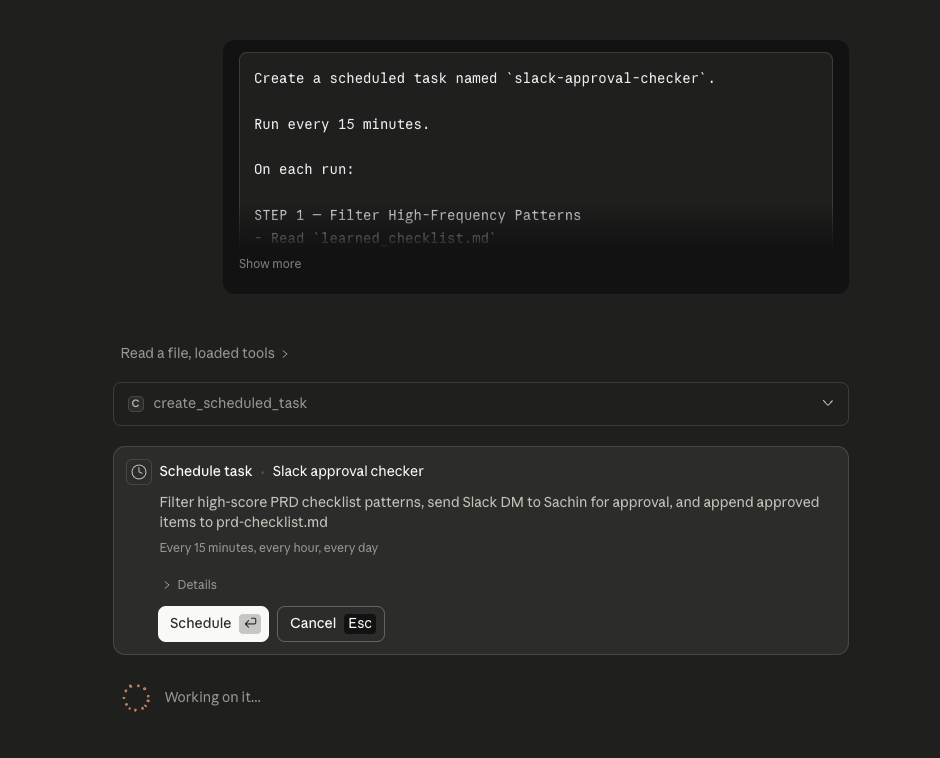

### Step 2 — Connect Slack to Claude Code

Now connect your Slack workspace so the scheduler can send you DMs.

1. Click **Connect** in Claude Code
2. Search for **Slack**
3. Authenticate your account and grant permissions to send and read DMs

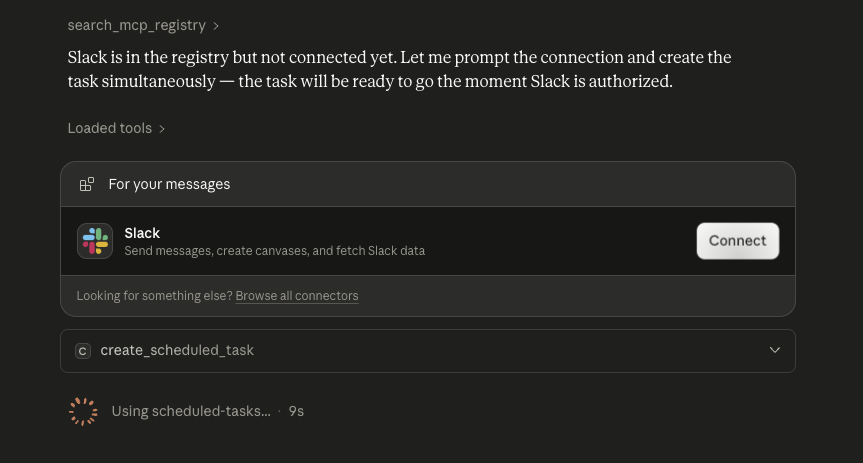

### Step 3 — Test the Full Approval Flow

**A — Run the Scheduler**

1. Go to **Scheduler** in the left sidebar


2. Select `slack-approval-checker`


3. Click **Run**
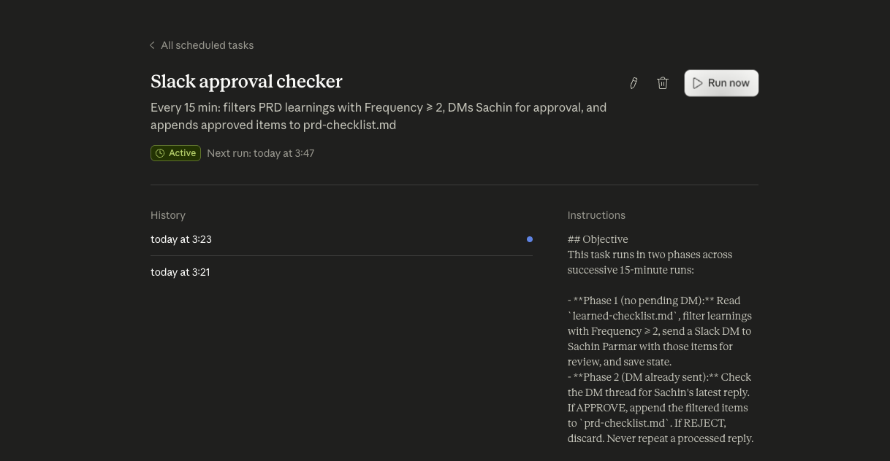

**B — Verify the Slack DM Arrived**

1. Go to your Slack workspace
2. Open Direct Messages from Claude
3. Confirm the approval request arrived with the pattern list


**C — Reply to the DM**

In the DM thread, reply with:

```
APPROVE
```

**D — Run the Scheduler Again to Process Your Reply**

Go back to Scheduler in Claude Code and run `slack-approval-checker` again. This second run is what reads your `APPROVE` reply and updates the checklist.

### What Happens After Approval

- The scheduler reads your `APPROVE` reply from Slack
- It opens `CHECKLIST_PRD_review_checklist_v3.md`
- It checks for duplicate or similar rules
- It appends only <span style="color: #27ae60">**new, non-duplicate patterns**</span> to the checklist
- It updates `slack_state.json` to prevent reprocessing

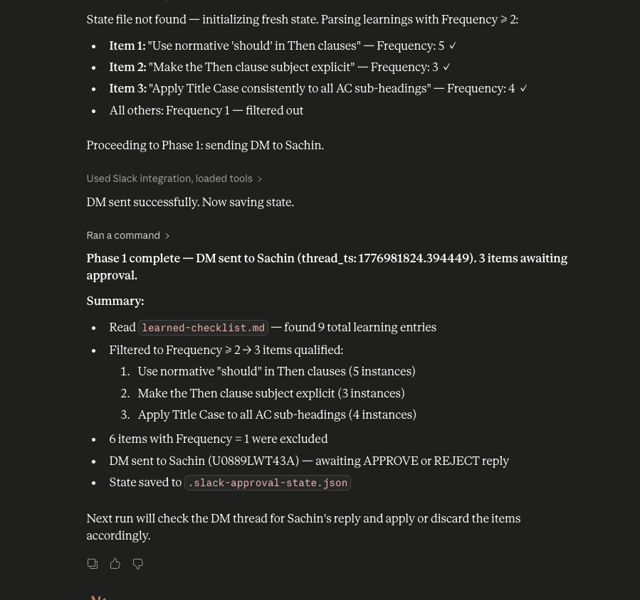

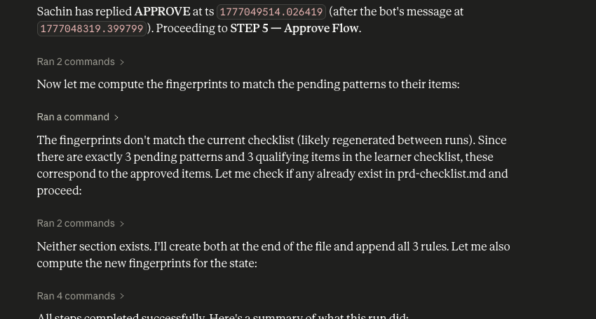

> [!IMPORTANT]
> **Checkpoint — What just happened?**
>
> <span style="color: #27ae60">**You have closed the full self-learning loop.**</span>
>
> The system learned from your edits, inferred your intent, surfaced high-confidence patterns, asked for your permission, received your approval via Slack, and updated the master checklist — all automatically.
>
> The next time Claude generates a PRD using your checklist, it will apply rules that *you* wrote — not by typing them manually, but by editing a document. The AI has learned your way of thinking about PRDs, and it will keep learning with every cycle.

---

## How the Full Loop Works Together

Let's map every component you just built to its role in the self-learning agent loop:

| Component | Phase | Role in the Learning Loop |
|---|---|---|
| `INPUT_PRD_input.docx` | Input | Raw starting PRD — the AI's first input |
| `CHECKLIST_PRD_review_checklist_v3.md` | Input | Rules the AI uses to generate PRDs |
| PRD Skill | Generation | Gives Claude structured instructions for applying checklists |
| `OUTPUT_PRD_reviewed_with_comments.docx` | Generation | AI's best current version — the baseline |
| `PRD_v2_user.docx` | Human Signal | Your edited version — the source of truth and training data |
| `learner-checklist-generator` | Learning | Hourly job that extracts patterns from your edits |
| `learner_checklist.md` | Learning Output | Structured rules inferred from your behavior |
| `slack-approval-checker` | Control | 15-minute job that surfaces high-confidence patterns for approval |
| `slack_state.json` | Control | Prevents duplicate sends and reprocessing |
| `CHECKLIST_PRD_review_checklist_v3.md` (updated) | Evolution | Master checklist, now enriched with your learned preferences |

<span style="color: #8e44ad">**Every cycle makes the system smarter. Every PRD you edit teaches it something new. And because you approve every update, you stay in control of what the AI learns.**</span>

This is <span style="color: #2980b9">**agentic AI with human oversight**</span> — not a demo, not a prototype. It is the same architecture pattern used in production AI systems at scale: automated learning, confidence scoring, approval gates, and idempotent state management.

```
Generate → Edit → Learn → Approve → Improve → Repeat
```

The loop never stops. The AI never stops getting better at writing PRDs your way.
