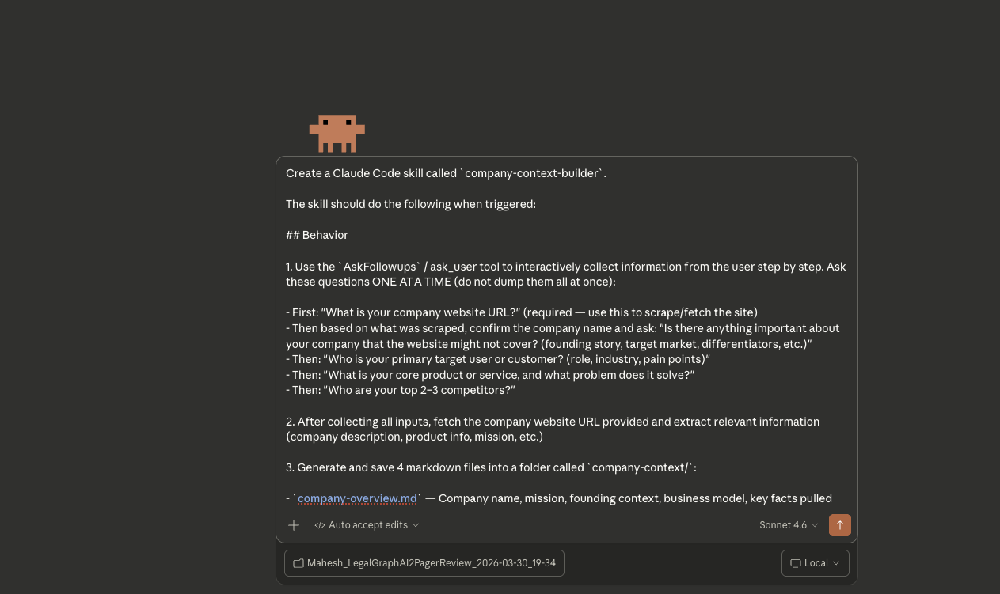
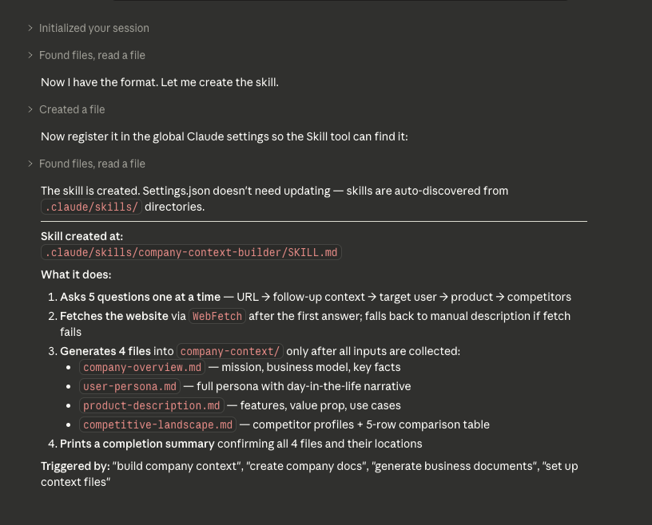
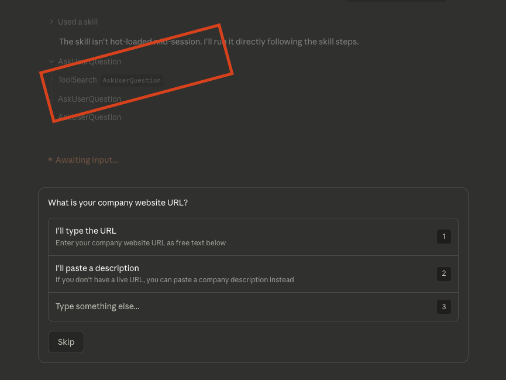

# Lesson 1.1 — Building Your First Claude Code Skill: The Company Context Builder

---

## Where You Are

In Lesson 1.0 you installed Claude Code. In this lesson, you'll create a project folder, add it to Claude Code as your workspace, and build your first skill inside it.

Before you can do anything useful — market research, PRDs, competitive analysis — Claude needs to understand your company. Who you are, what you build, who your users are, who you compete with.

You could write those files manually. Or you could build a skill that does it for you.

This lesson teaches you how to create your first **Claude Code Skill** — a reusable capability you install once and trigger with plain English whenever you need it. The skill you're building today is the `company-context-builder`. You give it your company website. It scrapes it, asks you smart follow-up questions, and generates four structured context files — ready for the CLAUDE.md setup in Lesson 1.3.

---

## What You'll Learn

- What a Claude Code Skill is and how it differs from a slash command
- How to create a skill by prompting Claude Code — no code, no config files to edit manually
- How to trigger the skill and walk through it interactively
- What the four output files look like and why they matter

---

## What Is a Claude Code Skill?

Before you build one, you need to understand what it is.

A **Skill** is a prompt file that Claude Code loads and executes when it detects a matching phrase. You describe the behavior once, save it as a `.md` file in the right folder, and Claude triggers it automatically whenever you say something that matches.

| | Slash Command | Skill |
|--|--------------|-------|
| **How you trigger it** | You type `/command-name` | You say something natural like "build company context" |
| **What it does** | Runs a fixed template | Runs multi-step, adaptive behavior |
| **Good for** | Structured, repeatable output | Interactive workflows with back-and-forth |
| **Example** | `/market-research` | "Set up my company context files" |

The `company-context-builder` skill is a good first skill to build because it is interactive — it asks you questions, adapts to what it finds on your website, and produces four files tailored to your specific company. A slash command could not do this. A skill can.

Skills live in:
- `~/.claude/skills/` — global, available in every project, every session
- `.claude/skills/` — project-level, only available in that folder

You're building a global skill. Once installed, it works for any company, in any project, any time you need to generate context files.

---

## What the Skill Does

When triggered, the `company-context-builder` skill runs a structured workflow:

```
You say "build company context"
    ↓
Skill asks: What is your company website URL?
    ↓
Claude scrapes the website — reads the homepage, about page, product pages
    ↓
Claude identifies what's missing — no competitor info? No pricing? Unclear personas?
    ↓
Claude asks targeted follow-up questions, one at a time (3–6 max)
    ↓
Claude generates four files in company-context/:

    company-context/company-overview.md
    company-context/user-persona.md
    company-context/product-description.md
    company-context/competitive-landscape.md
    ↓
Claude prints a summary of what was created
```

These four files are exactly what Lesson 1.3 needs to build your CLAUDE.md. You're not manually writing them — the skill generates them from your real company information.

---

## Pre-Flight Checklist

- [ ] Lesson 1.0 complete — Claude Code is installed and running
- [ ] You have your company website URL ready (or you'll use LegalGraph's URL for the bootcamp demo)
- [ ] Claude Code Desktop is open

> **Want to use the context files we've already built for this bootcamp?**
> If you'd rather skip building your own and use the LegalGraph context files used throughout these labs, go to [Lesson 1.2 — Download the Project Repository](./Lesson1.2-understand-the-interface.md) first. It walks you through downloading the pre-built files and adding them to Claude Code.

---

## Step 0 — Create Your Project Folder and Add It to Claude Code

Before you create the skill or run any prompts, you need a working folder and you need Claude Code pointed at it.

**1. Create a project folder on your computer**

Pick a location you'll remember — Desktop or Documents works well. Create a new folder and name it something like `my-company-context` or `bootcamp-workspace`.

- **Mac:** Open Finder → navigate to Desktop or Documents → right-click → **New Folder**
- **Windows:** Open File Explorer → navigate to Desktop or Documents → right-click → **New** → **Folder**

**2. Add the folder to Claude Code Desktop**

Claude Code can only read and write files it can see. You need to add your new folder before running anything.

1. Open Claude Code Desktop
2. Click the **+** button or folder icon in the chat sidebar
3. Select the folder you just created
4. The folder is now your active workspace — all files the skill generates will be saved here

**Confirm it worked** — type this in Claude Code:

```
What is my current working directory?
```

Claude should return the path to your new folder.

---

## Step 1 — Create the Skill

You don't write the skill file manually. You prompt Claude Code to create it for you.

Open Claude Code Desktop and paste this entire prompt:

```
Create a Claude Code skill called `company-context-builder`.

## Behavior

1. First, always ask the user for their company website URL. This is mandatory and must be the very first question.

2. Fetch and scrape the provided website URL to extract as much context as possible (mission, product, team, market, etc.)

3. After scraping, analyse what was found and use the `AskUserQuestion` tool to present the user with structured options — do NOT ask open-ended questions. For each gap, Claude should infer the most likely answers from the scraped content and present them as numbered or lettered choices. The user selects; Claude proceeds. For example:

   - **Competitors gap** → "Based on your website, I identified these likely competitors: (A) Ironclad (B) Kira Systems (C) Evisort (D) Other — please specify. Which are accurate? Select all that apply."
   - **Target customer unclear** → "Your primary buyer appears to be one of: (A) General Counsel (B) Head of Legal Operations (C) Senior Associate (D) Other. Which is closest?"
   - **Business model missing** → "Your pricing model is most likely: (A) Subscription / SaaS (B) Usage-based (C) Enterprise contract (D) Other. Which fits?"
   - **Product description vague** → "Your core value proposition seems to be: (A) Speed — reduce contract review time (B) Risk — flag risky clauses automatically (C) Compliance — ensure contracts meet policy standards (D) Other. Which is primary?"

   Claude should infer and populate the options from what it found on the website — the user should only need to confirm, correct, or pick "Other". Aim for 3–6 option-based questions maximum, asked one at a time.

4. Once enough context is gathered, generate and save 4 markdown files into a `company-context/` folder:

   - `company-overview.md` — Company name, mission, business model, founding story, key facts
   - `user-persona.md` — Detailed persona with demographics, goals, pain points, and a day-in-the-life narrative
   - `product-description.md` — Core product/service, features, value proposition, use cases
   - `competitive-landscape.md` — Competitor overview, markdown comparison table (3+ dimensions), positioning summary

5. After saving all files, print a brief summary of what was created.

## Skill Metadata

- **Skill name**: `company-context-builder`
- **Trigger**: When user says "build company context", "create company docs", "generate business documents", "set up context files", or similar
- **Output**: 4 markdown files in `company-context/` folder

## Implementation Notes

- Use `web_fetch` or `curl` to scrape the website — if it fails, ask the user to paste a description manually
- Questions must be asked ONE AT A TIME using the `AskUserQuestion` tool
- For each question, Claude must analyse the scraped content first and pre-populate lettered options based on its best inference — the user selects, not types
- Do NOT ask open-ended questions — always give the user options to choose from, with an "Other — please specify" fallback
- Claude decides which questions to ask based on what the website reveals and what's still unclear — do NOT hardcode a fixed question list
- Do not generate any files until all necessary context has been collected
- The competitive landscape file must always include a markdown comparison table
```



Claude Code will create the skill file automatically. You should see a confirmation that the file was written to `~/.claude/skills/company-context-builder.md`.

---

### Spotlight: The `AskUserQuestion` Tool

Look at line 3 of the prompt you just pasted:

> *"After scraping, use the `AskUserQuestion` tool to ask intelligent follow-up questions..."*

And in the Implementation Notes:

> *"Questions must be asked ONE AT A TIME using the `AskUserQuestion` tool"*

This is not just a phrasing choice. `AskUserQuestion` is a **Claude Code tool** — a built-in capability that pauses skill execution, surfaces a question to you in the chat, and waits for your answer before continuing. Without it, Claude would try to guess or proceed on incomplete information. With it, the skill becomes genuinely interactive.

**Why `AskUserQuestion` exists**

Claude Code has a set of tools it can call during a skill run: `web_fetch` to read URLs, `write_file` to save files, `read_file` to open them. `AskUserQuestion` is the tool that creates a back-and-forth conversation. It's what turns a one-shot prompt into a dialogue.

**Why this matters for PMs specifically**

As a PM, you deal with information that is never fully in one place. Your company's real ICP isn't on the website. Your competitive differentiation isn't in a public doc. Your north star metric isn't in a README.

If an AI tool can only work with what it can find on its own, it produces generic output. The `AskUserQuestion` tool is what bridges that gap — it lets Claude identify exactly what it's missing and pull that information from the only source that has it: **you**.

**What makes this skill's approach better than asking open-ended questions**

The skill doesn't ask "who are your competitors?" — that puts all the work on you. Instead, it:

1. Scrapes the website first
2. Analyses what it found and infers the most likely answers
3. Presents those inferences as options: *"Based on your website, I think your top competitors are (A) Ironclad (B) Kira Systems (C) Evisort — which is accurate?"*
4. You confirm, correct, or pick "Other"

This is the difference between a blank form and a pre-filled form. The cognitive load drops dramatically. You're reviewing Claude's analysis, not starting from zero. The output is grounded in both what Claude found and what you confirmed — not just one or the other.

> **The pattern is transferable.** `AskUserQuestion` + analyse-first + options = a skill that feels like a smart colleague doing prep work before asking you anything. You can apply this pattern to any skill: user research interview guides, PRD scoping sessions, competitive positioning workshops. Any workflow where Claude can do inference work before putting a question to you.




---

## Step 2 — Trigger the Skill

Now test it. In Claude Code Desktop, type exactly:

```
build company context
```

Claude will match this phrase to your skill's trigger list and activate it immediately.

The first thing it does is ask for your company website URL — that's built into the skill. It will not proceed until you provide one.



---

## Step 3 — Review the Generated Files

Open your `company-context/` folder and read through all four files before moving on.

Check these things:

**company-overview.md**
- Is the business model accurate?
- Is the stage and funding correct?
- Is the one-line description specific, not generic marketing?

**user-persona.md**
- Is this a real person at a real type of company — not a vague role description?
- Does the "day in the life" narrative feel true to how this person actually works?

**product-description.md**
- Is the "What It Does" section written in plain English — not copied from your marketing site?
- Do the use cases match what drives actual deals?

**competitive-landscape.md**
- Are the right competitors in the table?
- Does "Where We Win" match your actual sales positioning?

If something is off, run a quick correction:

```
@company-context/user-persona.md

The persona is correct but the company size is wrong — our primary buyer is at companies with 500–2000 employees, not enterprise. Update the file to reflect this. Do not change any other section.
```

This is faster than starting over. The skill got you 80% of the way. Targeted corrections get you to 100%.

---

## What Happens Behind the Scenes

**1. You say "build company context" — Claude matches the trigger**
Claude Code scans your skills folder at the start of every session. When you type a phrase that matches one of the skill's trigger patterns, Claude loads the full skill file content into context and begins executing the instructions inside it.

**2. The skill is a set of instructions, not a script**
There is no code in a skill file. It is a plain-English instruction document that tells Claude exactly what to do, in what order, under what conditions. Claude reads it the same way it reads any of your prompts — it just loads it automatically instead of requiring you to type it.

**3. Claude decides what questions to ask**
The skill does not have a hardcoded question list. It tells Claude to look at what is missing and ask about that. This is why the interaction adapts — a SaaS company with clear pricing will get different questions than a services firm with no pricing page. The skill is designed to be intelligent, not mechanical.

**4. The files are permanent artifacts**
Once saved to `company-context/`, these files exist independently of the conversation. They do not disappear when you close Claude Code. You can `@` reference them in any future session, pass them to other prompts, or share them with teammates.

**5. These files feed directly into Lesson 1.3**
The CLAUDE.md setup in Lesson 1.3 uses these four files as its source of truth. Instead of writing CLAUDE.md from scratch, you will `@` reference the files the skill generated and ask Claude to synthesize them into your persistent context layer. The skill output is the input to the next lesson.

```
Lesson 1.1
"build company context" → skill triggers
    ↓
Website scraped → gaps identified
    ↓
Follow-up questions asked one at a time
    ↓
company-context/ folder created with 4 files
    ↓
Lesson 1.3
@company-context/*.md → Claude synthesizes → CLAUDE.md written
    ↓
Every future session starts with your company already loaded
```

---

## Things to Keep in Mind

**On website scraping:**
Most company websites have enough on their homepage and product page to get started. If yours is thin, that's fine — the skill will ask more questions to fill the gaps. If your site blocks scraping entirely, paste a manual description and the skill will work from that.

**On the follow-up questions:**
The skill asks a maximum of 6 questions. If you find it asking about something obvious, you can answer quickly and move on. If it asks something you don't know (like exact ARR), say "I don't have that number" — the skill will leave that field blank rather than guess.

**On editing the generated files:**
Treat the skill output as a first draft, not a final document. It will be accurate for factual things the website states clearly. It may be generic for things the website doesn't say. A 5-minute review and a few correction prompts is faster than writing from scratch.

**On running the skill again:**
If you need to rebuild context for a different company — say, a competitor you want to analyze — trigger the skill again with a different URL. The files will be regenerated. The skill does not remember previous runs.

---

## Your Action Items

1. Create a project folder on your computer (Desktop or Documents)
2. Add that folder to Claude Code Desktop — confirm it's your active workspace
3. Paste the Step 1 prompt into Claude Code — verify `company-context-builder.md` appears in `~/.claude/skills/`
4. Type `build company context` and walk through the full interaction
5. Use your own company URL — or use `https://legalgraph.com` for the bootcamp demo
6. Review all four generated files in `company-context/`
7. Run correction prompts for anything inaccurate or too generic
8. Confirm all four files exist: `ls company-context/`

---

## What You've Learned

### Tools
- **`AskUserQuestion`** — pauses skill execution and asks you a question, then resumes with your answer. This is what makes skills interactive rather than one-shot. It's the tool that bridges the gap between what Claude can find on its own and what only you know.
- **`web_fetch`** — lets Claude read a URL and extract structured information from it. Used here to scrape your company website before asking any follow-up questions.
- **`write_file`** — saves generated content as permanent files in your workspace. This is why the four context files outlive the conversation — they exist on disk, not just in chat history.

### Context Building
- **Why context files matter** — Claude produces generic output when it has no company context. The four files you built (company overview, user persona, product description, competitive landscape) give Claude the specific information it needs to produce output grounded in your actual product, market, and users.
- **How to build context from a website** — you don't have to write context manually. Give Claude a URL, let it scrape what it can, then answer only the gaps. The skill pattern automates most of the work.
- **Context files are reusable artifacts** — they live in `company-context/` and persist across sessions. Any future lesson that needs company context `@` references these files. You build them once; they pay off every session.
- **How to correct AI-generated context** — use `@` file references with targeted correction prompts. Don't start over; fix what's wrong. The skill gets you 80% there; you close the last 20% with precise edits.

### Creating Skills
- **What a Skill is** — a plain-English `.md` instruction file that Claude loads and executes when it detects a matching trigger phrase. No code. No config. Just instructions.
- **How to create a Skill by prompting** — you described the behavior you wanted and Claude wrote the skill file for you. This is the meta-lesson: Claude Code can build its own capabilities when you prompt it correctly.
- **Skills vs. slash commands** — slash commands run fixed templates; skills run adaptive, multi-step workflows with branching logic and human input. Use skills when the task requires judgment or back-and-forth.
- **Global vs. project skills** — skills in `~/.claude/skills/` are available in every project. Skills in `.claude/skills/` are scoped to one folder. The `company-context-builder` is global because you'll use it across multiple projects.
- **The `AskUserQuestion` + conditional pattern** — the most powerful skill design pattern: scrape or read what's available, identify gaps, ask only what's missing, then generate. Adaptive, not mechanical. You can apply this pattern to any skill you build from here.

---

You now have four structured context files that tell Claude exactly who you are, what you build, who your users are, and who you compete with. Lesson 1.3 turns these into CLAUDE.md — the persistent memory that loads at the start of every future session.

---

*Next: [Lesson 1.2 — Download the Project Repository](./Lesson1.2-understand-the-interface.md)*
