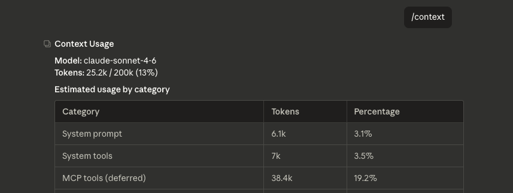
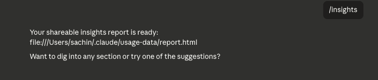

# Lesson 2.1 — Slash Commands in Claude Code: Speed Up Your PM Workflow

---


## Coming From Module 1

In Module 1, you built two CLAUDE.md files — one for your personal working style, one for LegalGraph's product context. Claude now knows who you are, what you're building, and how you like to work.

Everything you did in Module 1 was typed: full instructions, full prompts. That works well. But Claude Code also has a built-in command system that lets you trigger common actions with a single keystroke — no full sentences required.

That's what this lesson covers.

---

## What Are Slash Commands?

Slash commands start with `/`. Type `/` in the Claude Code chat and a menu of available commands appears automatically.

Each command triggers a specific behavior — scanning files, compressing a session, resetting context — without you having to describe what you want.

**The key distinction:**
- `@filename` → points Claude at a file (passes its contents into context)
- `/command` → triggers an action (tells Claude to *do* something)

You used `@` extensively in Module 1. Now you're learning `/`.

---

## 5 Slash Commands Every PM Should Know

### 1. `/init` — Set Up CLAUDE.md for a New Project

**What it does:** Scans your current project folder and auto-generates a starter `./CLAUDE.md` based on what it finds — file names, folder structure, any existing documentation.

**Why it matters:** When you join a project mid-stream (no CLAUDE.md exists yet), `/init` gives you a first draft instantly. Faster than writing it from scratch.

**How to use it:**
1. Open Claude Code in the new project folder
2. Type `/init` and press Enter
3. Claude scans the folder, generates CLAUDE.md, and saves it

> **Important:** `/init` gives you a starting point, not a finished file. Review it — then layer in your PM context: personas, north star metrics, working instructions. Same process as Lesson 1.3, just starting from a better draft.

**Try it:**
```
/init
```
You should see Claude scan your project folder and either create a new `CLAUDE.md` or suggest improvements to an existing one. After it runs, open the file and check what it produced.


---

### 2. `/cost` — Track Token Usage and Spend

**What it does:** Shows a breakdown of tokens consumed in the current session — input tokens, output tokens, cache usage, and estimated cost.

**Why it matters for PMs:** Long research sessions, chained prompts, and `@`-loading large files all burn tokens fast. `/cost` tells you exactly where you stand before you hit a budget limit or get surprised by a bill.

**How to use it:**
1. Type `/cost` at any point during a session
2. Claude displays a usage summary for the current session

**What to look for:**

| Metric | What it means |
|--------|---------------|
| Input tokens | Tokens Claude received — your prompts + all `@` files loaded |
| Output tokens | Tokens Claude generated — the responses |
| Cache read tokens | Tokens served from cache — these cost less |
| Estimated cost | Total $ spend for this session so far |

> **Good habit:** Run `/cost` after a long research session before you chain another prompt. If input tokens are high, it's because you've loaded large files via `@`. Consider whether all those files still need to be in context.

**Try it:**
```
/cost
```
Note the token count. Then load a large file with `@` and run `/cost` again — you'll see the input token count jump. That's the cost of loading context.


---

### 3. `/context` — See and Manage What Claude Is Working With

**What it does:** Shows you what's currently loaded in Claude's active context window — which files are referenced, how much of the context window is used, and what Claude can currently "see."

**Why it matters for PMs:** Context window space is finite. If you've been working through a long session and loading multiple files with `@`, Claude's context fills up. When it's full, older parts of the conversation start dropping out — which means Claude may forget earlier instructions or lose track of constraints you gave it upfront. `/context` lets you see that before it becomes a problem.

**How to use it:**
1. Type `/context` at any point in your session
2. Claude displays what's currently in context — files, messages, and how full the window is

**What to look for:**
- Are all the files you `@` referenced still in context?
- Is the window getting close to full? If so, consider using `/compact` to compress history
- Did Claude load the right CLAUDE.md?

> **Good habit:** Run `/context` before a long generation task — like writing a full PRD or running a market research session. If context is nearly full, compress it first. Generating into a full context window produces lower-quality output.

**Try it:**
```
/context
```
Check how much of the context window is used. If you've been prompting for a while, you may be surprised how fast it fills.




---

### 4. `/insights` — Surface Patterns Across Your Loaded Context

**What it does:** Analyzes what's loaded in your current context — research files, personas, product docs — and surfaces key patterns, gaps, and strategic observations you may have missed.

**Why it matters for PMs:** After you've loaded a batch of files with `@`, it's easy to lose track of the big picture while you're deep in the details. `/insights` steps back and asks: what does all of this add up to? What's consistent across sources? What's contradictory? What's missing?

**How to use it:**
1. Load the context files you want analyzed using `@`
2. Type `/insights`
3. Claude synthesizes across everything loaded and returns a structured observations summary

**What you get back:**
- Key patterns across the loaded documents
- Tensions or contradictions worth investigating
- Gaps — things that should be in your context but aren't
- One or two sharp strategic questions the data raises

> **Best used after:** loading research outputs, competitor files, or a batch of user interview notes. Before a strategy session or before writing a PRD, run `/insights` to orient yourself.

**Try it:**
```
@company-context/competitive-landscape.md
@company-context/user-persona.md
/insights
```
Claude should return observations about how the competitive landscape maps to your persona's pain points — and flag any gaps between what competitors offer and what your persona actually needs.



---

### 5. `/schedule` — Turn a Goal into an Ordered Work Plan

**What it does:** Takes a goal or deliverable you describe and breaks it into a sequenced, time-aware work plan — with specific Claude Code steps, file outputs, and prompts to run at each stage.

**Why it matters for PMs:** PMs often know *what* they need to produce but not the exact sequence of steps to get there efficiently in Claude Code. `/schedule` maps out the workflow: what to do first, what depends on what, and what to skip. It's a session planner built for Claude Code's toolset.

**How to use it:**
1. Type `/schedule` followed by your goal
2. Claude returns a step-by-step plan with commands, `@` file references, and slash commands at each stage

**Example:**
```
/schedule I need to deliver a competitive analysis and a draft PRD for LegalGraph's new document automation feature by end of week
```

Claude returns something like:
```
Day 1 — Research
  /init → verify CLAUDE.md is current
  @company-context/competitive-landscape.md + /market-research → run competitive scan
  Save output to outputs/competitive-scan.md

Day 2 — Synthesis
  @outputs/competitive-scan.md + @company-context/user-persona.md
  /insights → surface key gaps
  Draft positioning statement

Day 3 — PRD
  @outputs/competitive-scan.md + @company-context/product-description.md
  /prd → generate first draft
  Review and correct
```

> **Use this at the start of a project sprint**, not mid-session. It's most useful when you have a clear deliverable and want Claude Code to map the efficient path to it.

**Try it:**
```
/schedule I need to run market research and write a one-pager for a new feature for LegalGraph
```


---

## Full Command Reference


The 5 commands above are the ones you'll use most as a PM. Here's the complete set worth knowing:

| Command | What it does |
|---------|--------------|
| `/init` | Scan a new project and auto-generate a CLAUDE.md for it |
| `/cost` | Show tokens used and estimated cost for this session |
| `/context` | See what's currently loaded in Claude's context window |
| `/insights` | Surface patterns, gaps, and observations across loaded context files |
| `/schedule` | Turn a goal into a sequenced Claude Code work plan |
| `/help` | List all available commands and what they do |
| `/clear` | Wipe the conversation history and start fresh |
| `/compact` | Compress conversation history when context gets long |
| `/model` | View or switch the active Claude model (e.g., Sonnet → Opus) |
| `/memory` | Open and edit your CLAUDE.md files directly from the chat |
| `/review` | Review your staged git changes before committing |
| `/doctor` | Diagnose Claude Code setup issues — run this if something feels broken |
| `/vim` | Toggle vim keybindings for the input prompt |

**Full slash command docs:** [docs.anthropic.com/en/docs/claude-code/slash-commands](https://docs.anthropic.com/en/docs/claude-code/slash-commands)

---

## Things to Keep in Mind

- **Slash commands work everywhere** — desktop app, IDE extension, terminal. Same commands, same behavior.
- **You can't undo `/clear`.** It's gone. If there's output you need, save it to a file first.
- **`/compact` is not the same as `/clear`.** People confuse these. Compact = compress + continue. Clear = start over.
- **`/init` doesn't overwrite an existing CLAUDE.md** without asking. Safe to run even if a CLAUDE.md already exists.
- **`/insights` and `/schedule` work best with loaded context.** Run them after you've `@` referenced the relevant files — not on an empty session.

---

## What You've Learned

- **What slash commands are** — single-keystroke actions that trigger Claude Code behaviors, distinct from `@` file references
- **`/init`** — generates a CLAUDE.md for any project folder you open, giving you a structured starting point without writing from scratch
- **`/cost`** — shows real-time token usage and estimated spend so you can manage context load and budget across a session
- **`/context`** — surfaces what Claude can currently see, how full the context window is, and whether the right files are loaded before you run a long task
- **`/insights`** — synthesizes patterns, contradictions, and gaps across everything loaded in context; most useful before strategy sessions and PRD writing
- **`/schedule`** — converts a deliverable goal into a sequenced Claude Code work plan with specific commands and file references at each step
- **The full command set** — there are a dozen commands worth knowing; the five above are the PM-critical ones

---

*Next: [Lesson 2.2 — Custom Slash Commands](./Lesson2.2-Custom-Slash-Commands.md)*
