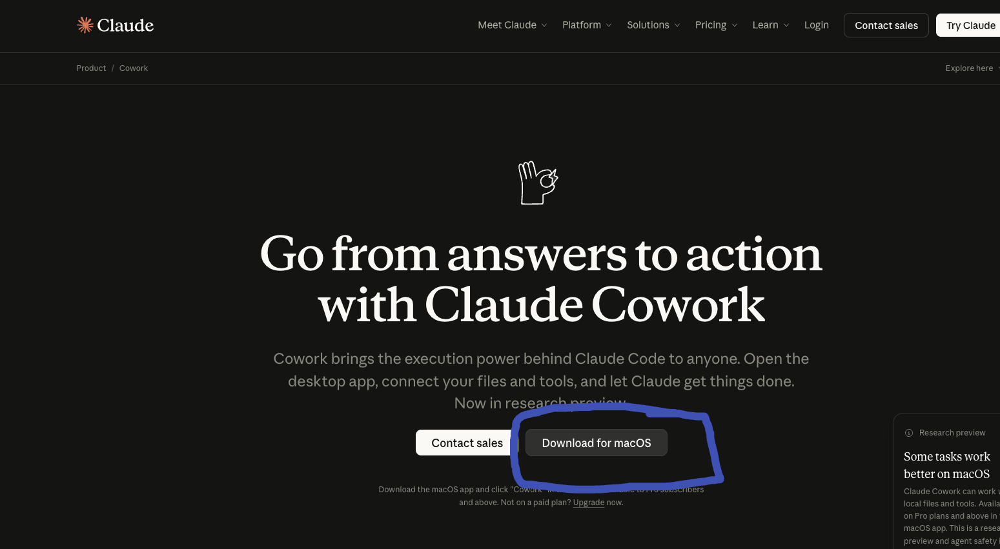
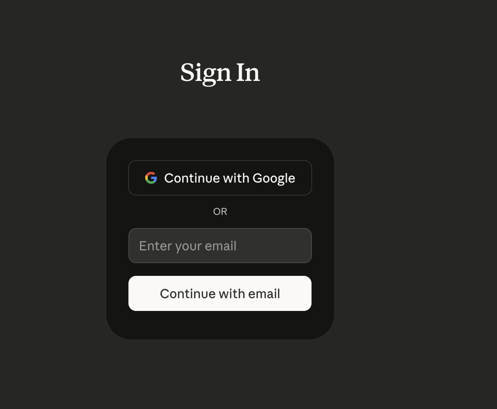
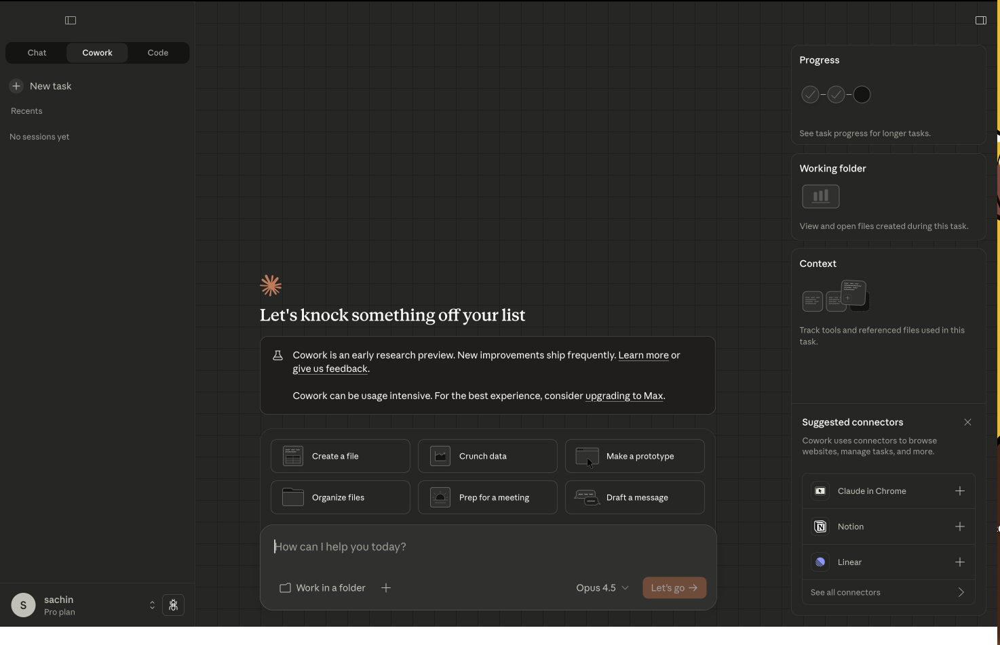

# 0.1: Installation

## Lesson overview

In this lesson you will set up everything needed to use **Claude Cowork** for the rest of the course. You will:

- Install the Claude Desktop app on your Mac
- Enable Cowork and sign in
- Choose a working folder for your files
- Confirm that Claude can read and write in that folder

By the end of this module, you’ll be ready to practice real product management workflows with Cowork.

---

## Before you begin

- **Platform:** Claude Cowork is available **only on macOS** via the Claude Desktop app. Windows support is planned but not yet available.
- **Subscription:** You need a **Claude Pro** plan to use Cowork. Confirm your account is on a Pro plan before starting.

---

## Step 1: Open the Claude Cowork product page

1. In your browser, go to: **https://claude.com/product/cowork**
2. Use this page to read about Cowork and to download the macOS desktop app.

---

## Step 2: Sign in and open Cowork

After you have installed and opened the Claude Desktop app:

1. **Sign up or log in** with your Anthropic account (or create one if needed).

   

   

2. In the left sidebar, **click Cowork** (next to Chat and Code).

   

3. You should see the **Cowork workspace view**, where you can choose or create the working folder Claude will use for this course.

   

---

## You’re ready

You’ve installed the app, signed in, and opened Cowork. In the next lessons you’ll use this workspace to run product management workflows with Claude.
