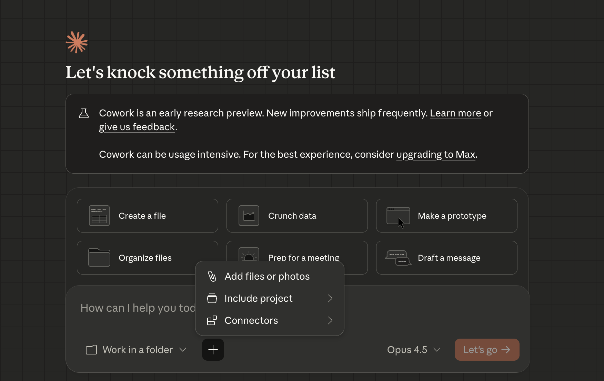
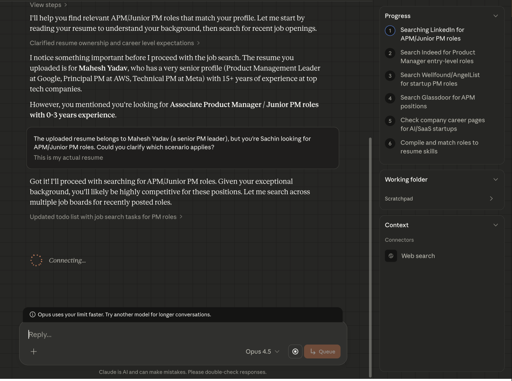
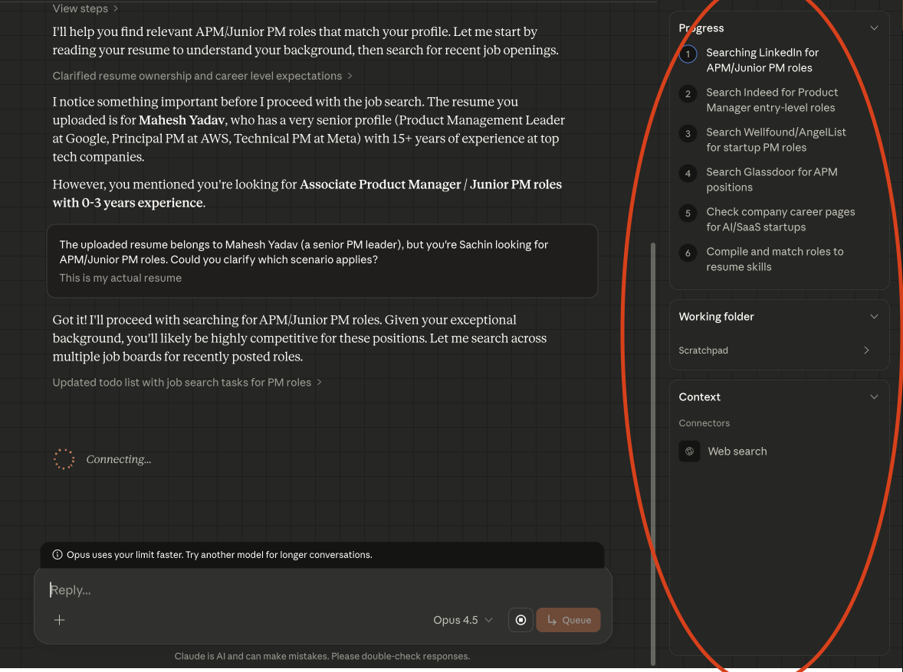
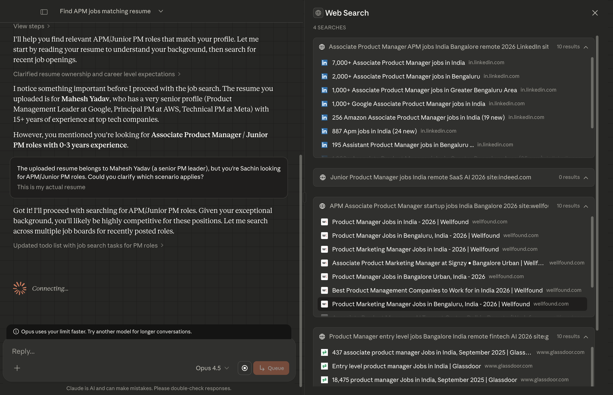
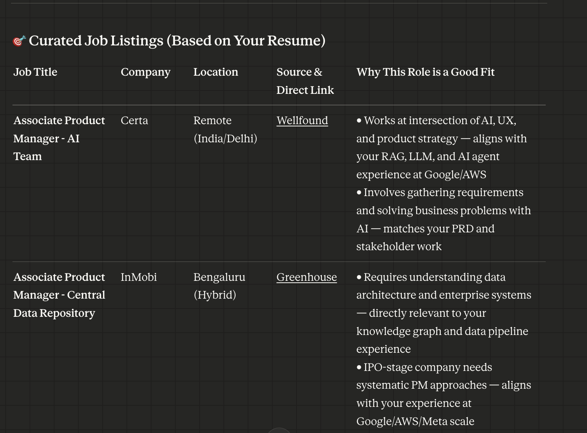

# 1.0: Cowork in Action — Job Searcher


## Lesson overview

Applying for jobs manually is painful: hopping between job portals, redoing filters, and still missing good roles. In this hands-on lesson you’ll use **Claude Cowork as your personal job searcher**—automating discovery so you can focus on choosing where to apply and writing strong applications.

---

## What you’ll learn

By the end of this lesson you will be able to:

- Use **Claude Cowork** to search for jobs using your **resume**
- Define **job filters** (role, location, experience, industry, recency)
- Get a **curated list of job opportunities** with direct application links
- See how Cowork **plans, searches, and reasons** behind the scenes

---

## Scenario

You’re actively looking for a new role and want Cowork to do the repetitive job-search work. Instead of browsing job sites every day, you’ll delegate the task to Cowork and get **recent, high-quality listings** that match your profile.

---

## Step 1: Open Claude Cowork

1. Open the **Claude Desktop app** on your Mac.
2. Switch to the **Cowork** tab in the sidebar.


---

## Step 2: Add your resume

1. Put your latest resume (`.pdf` or `.docx`) in the **working folder** that Cowork is using.
2. Claude will use it to understand your background, skills, and experience.



---

## Step 3: Run a job search prompt

Use the prompt below as a starting point. Adjust role, location, experience level, and other details to fit your goals.

```
You have access to my resume in this folder.

I am looking for a new role as:
[TARGET ROLE — e.g., "Associate Product Manager in fintech, remote or hybrid"]

Please do the following:
- Search across major job boards and company career pages
- Apply these filters:
  - Location: [e.g., "remote-friendly or Europe-based"]
  - Experience level: [e.g., "0–3 years, APM / Junior PM"]
  - Industry: [e.g., "fintech, SaaS, consumer tech"]
  - Posting date: **Open in the last 24 hours**
- Prioritize roles that closely match my resume and skills

Return the results in a table with:
- Job title
- Company
- Location (remote / hybrid / on-site)
- Source or application link
- 1–2 bullet points explaining why this role is a good fit for me
```



---

## Step 4: Watch Cowork in action

After you submit the prompt:

- Cowork shows an **execution plan** for the task.
- It runs **live web searches** on job boards and company career pages.
- Your filters are applied (including **postings from the last 24 hours**).
- You can follow progress in the **right-hand activity panel**.
- Cowork returns a **structured table** of jobs with application links.

---

## Step 5: See how Cowork processes the task

Use the activity panel to see how Cowork handles your request:

1. **Plan first** — Cowork outlines sources, filters, and steps before it runs anything.
2. **Clarifying questions** — If something is unclear (salary, role titles, locations), Cowork asks early.
3. **Automatic context** — Cowork turns on what it needs (e.g. **web search**) to fetch live listings.
4. **Transparent searches** — Expand any web search step to see which sites were used, what was collected, and where each link came from.







---

## You’re ready

You’ve used Cowork to search for jobs from your resume and filters. In the next lessons you’ll use the same workspace for market research and presentation building.
