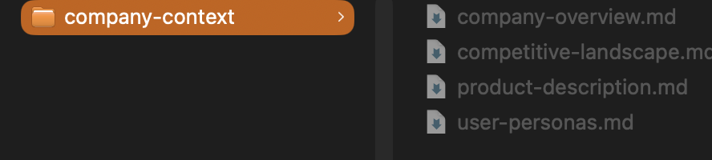
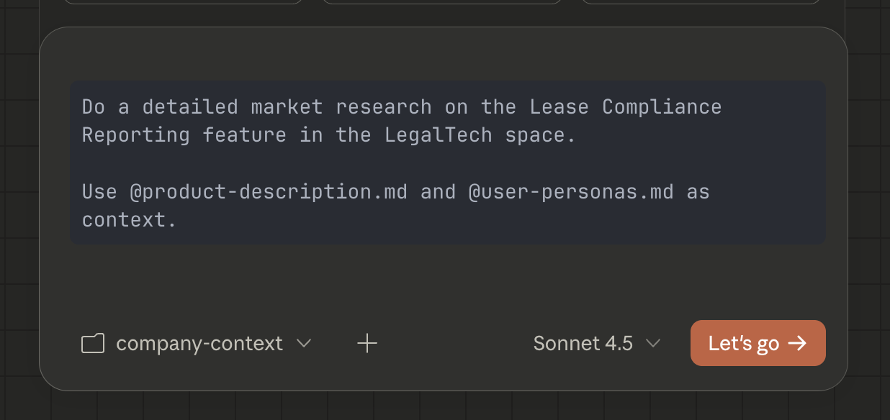
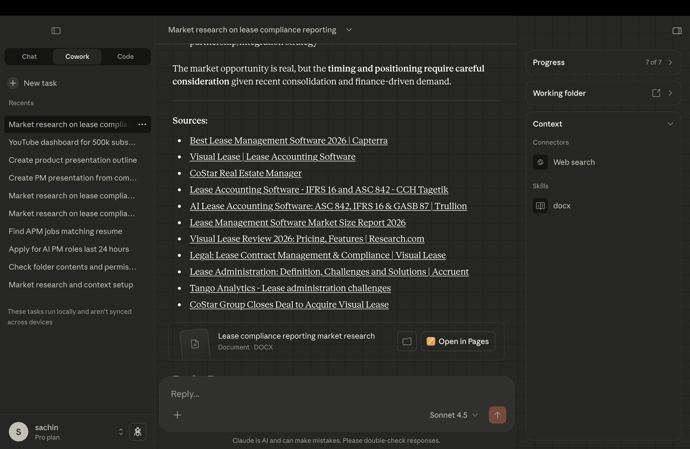
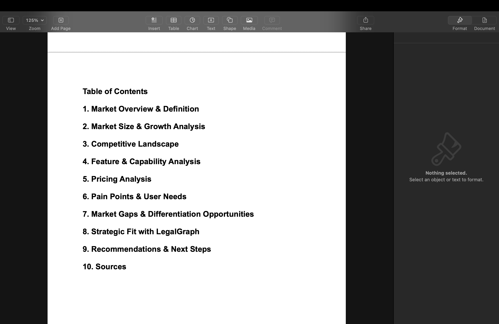

# 1.1: Doing Market Research in Cowork


> **Tip — Golden prompts for PM tasks**  
> If you want to do more PM tasks in Cowork—such as **user research**, **market research**, **PRD creation**, and more—check out the **Golden Prompts** doc designed by Mahesh. It has ready-to-use prompts so you can run these workflows easily:  
> **[Golden prompts to scale PM's 10X](https://docs.google.com/document/d/1B2Y5z06zXl8uoFgPtdABRx5L3wzmEQ3bsaANkmq1oHo/edit?tab=t.d6qva2ddb5pu)**

---

## Lesson overview

Product managers often need to size a market, understand trends, or gather competitive intelligence—but manually scanning reports, news, and websites is slow. In this lesson you’ll use **Claude Cowork** to run a structured market research workflow: define a research question, point Cowork at the web and your files, and get a synthesized report with sources and key findings.

---

## What you’ll learn

- Define a **market research question** (e.g. TAM for a product category, main competitors in a space).
- Give Cowork a **working folder** with context (company overview, product description, user personas).
- Use a **prompt** that asks Cowork to search the web, use your files (with **@**), and produce a **short report** saved as a file.
- See how Cowork **loads context**, runs **web search**, **synthesizes**, and **saves the output** in your workspace.

---

## Step 1: Open Claude Cowork

1. Open Claude and switch to **Cowork** (ensure Cowork mode is enabled).


---

## Step 2: Create a context folder

1. On your system, create a folder that will hold your background context.
2. Add files such as: company overview, product description, user personas, and any existing notes or assumptions.

**Example folder structure:**

```
├── context/
│   ├── company-overview.md
│   ├── product-description.md
│   └── user-personas.md
```

This folder gives Claude the **business context** it needs before answering your queries.



---

## Step 3: Give Claude access to context

1. In Cowork, **select the folder** you created so Claude can read it.
2. In prompts you can also reference specific files with **@filename**.

**Tip:** Typing `@` in the prompt shows all available files in the selected folder.

---

## Step 4: Run your market research query

Use a prompt that states your research question and asks for a report. Ask Cowork to save the result as a file.

**Example:**

```
Do a detailed market research on the Lease Compliance Reporting feature in the LegalTech space and store the result in a file.

Use @product-description.md and @user-personas.md as context.
```

To name the output file, add an instruction like:

```
Store the output as market-research-lease-compliance.md
```

Cowork will generate the research and save it in your workspace.



---

## Step 5: See how Cowork processes the query

When you submit the query, Cowork:

1. **Loads context** — Reads the selected folder and any @-referenced files.
2. **Searches the web** — Runs live searches to gather up-to-date information.
3. **Synthesizes** — Combines web data with your context.
4. **Formats output** — Structures the response clearly.



5. **Creates the file** — Saves the final report as a markdown file in your workspace.




---

## You’re ready

You’ve used Cowork to run market research with your context and save a report to your folder. Next, you’ll use the same workspace to build a presentation.
