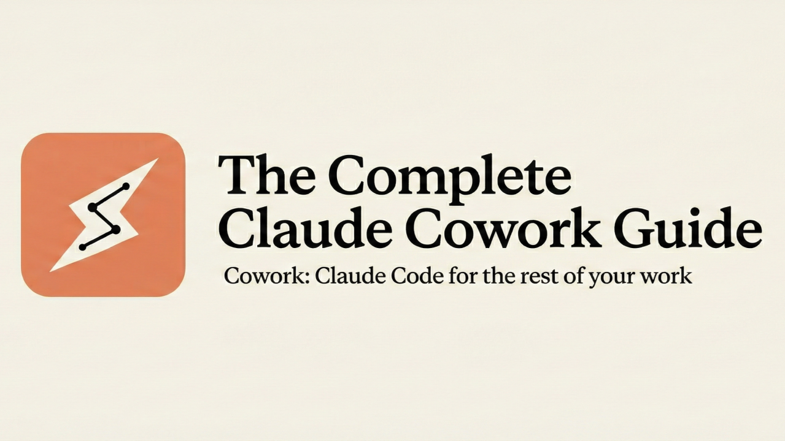
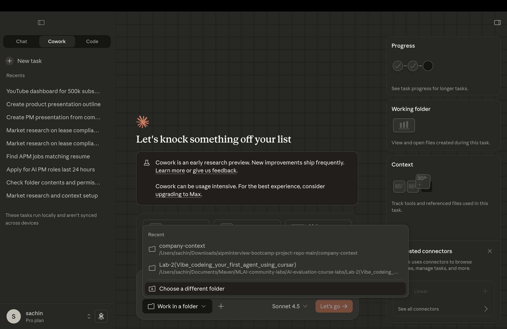
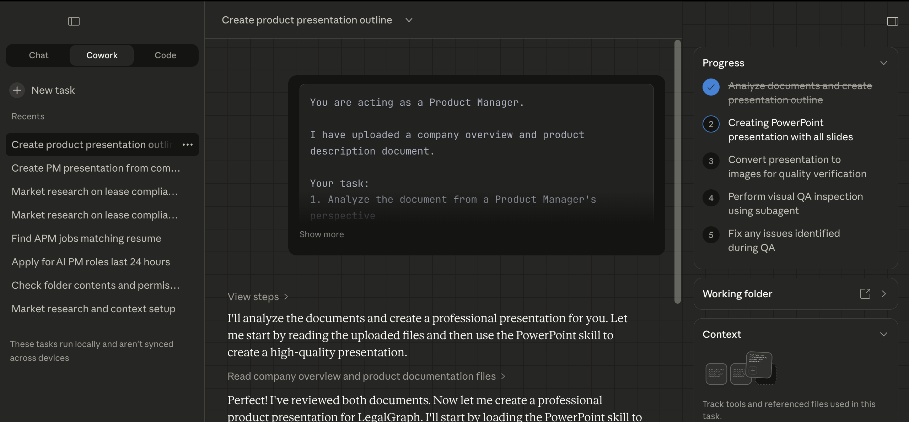
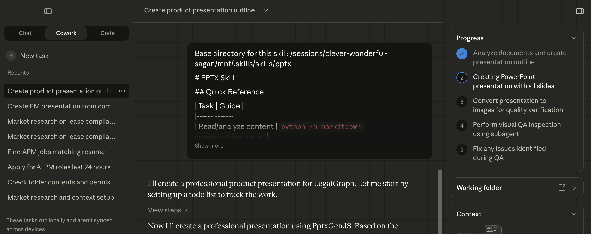
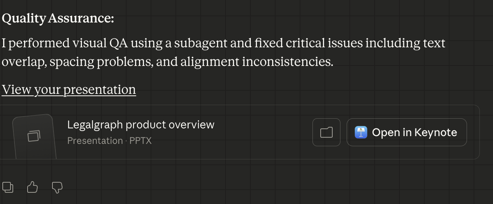
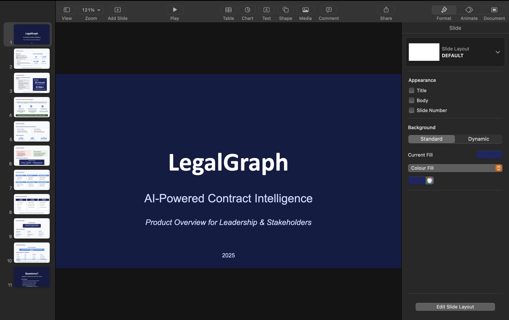

# 1.2: From Company Docs to PM Presentation



## Lesson overview

In this lesson you’ll simulate a **Product Manager workflow**: start with raw company documents (company overview, product description, etc.) and turn them into a **clear, structured presentation** using **Claude Cowork**. You’ll upload company information, work in a Cowork workspace, and generate a **PM-ready presentation** that covers product context, problem, solution, and strategy—similar to stakeholder updates, leadership reviews, or interview case work.

---

## What you’ll learn

- Use **Claude Cowork** for structured PM tasks
- Turn unstructured company docs into a presentation
- Write prompts that work for real product workflows

---

## Scenario

You’ve just joined a startup as a **Product Manager**. Your manager says:

> "Go through this company overview and product description, and prepare a crisp presentation explaining the product, its value, and roadmap."

You have limited time, so you use **Claude Cowork** to speed up the task.

---

## Step 1: Open Claude Cowork

1. Open the **Claude** app.
2. Switch to **Cowork** in the sidebar.


---

## Step 2: Add your context folder and files

1. Use the **same folder** you set up earlier (e.g. company overview, product description)—or create a new folder such as **`PM_Presentation_From_Company_Docs`**.
2. Put your documents in that folder, for example:
   - Company overview
   - Product description
   - Market or customer context (if you have it)



---

## Step 3: Run the presentation prompt

1. In the Cowork chat, paste the prompt below.
2. Reference your files with **@filename** (e.g. `@company-overview.pdf`, `@product-description.docx`). Typing **@** in the chat lists files in your folder—choose the ones you added.

**Prompt to use:**

```
You are acting as a Product Manager.

I have uploaded a company overview and product description document. Please use @[company-overview-filename] and @[product-description-filename] for context (replace with your actual file names).

Your task:
1. Analyze the document from a Product Manager's perspective
2. Create a structured presentation outline with clear slide titles
3. Each slide should include concise bullet points
4. The presentation should cover:
   - Company overview
   - Problem statement
   - Product solution
   - Target users
   - Key value proposition
   - Core features
   - High-level product roadmap
   - Success metrics (KPIs)

Keep the tone professional and suitable for leadership or stakeholders.
```



---

## Step 4: See how Cowork processes the query

When you submit the prompt, Cowork:

1. **Reads context** — Loads the files in your workspace.
2. **Understands** — Combines context and content.
3. **Structures** — Turns unstructured text into a PM-style outline.
4. **Outputs** — Produces a presentation-ready outline.





---

## You’re ready

You’ll get a **slide-by-slide presentation outline** with a clear, PM-focused structure. You can use it for internal stakeholder presentations, interview case studies, or founder and leadership reviews.



You’ve finished Module 1. Next, you’ll use Cowork to create a visualizer and dashboard in Module 2.
