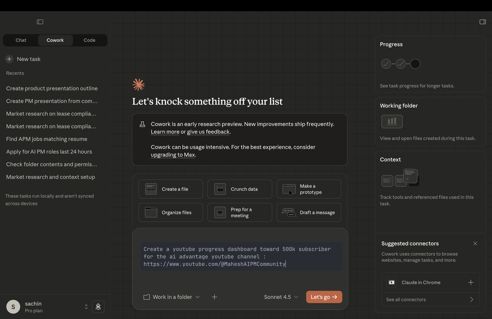
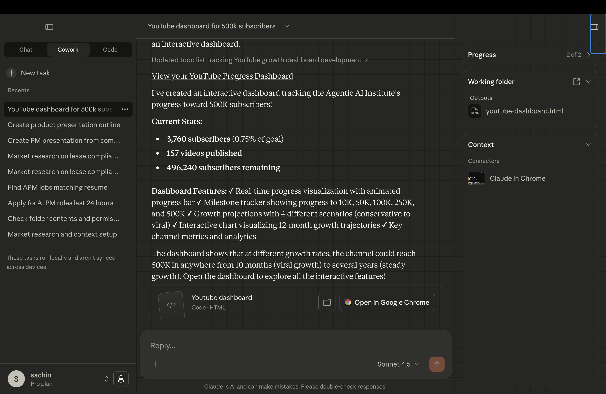
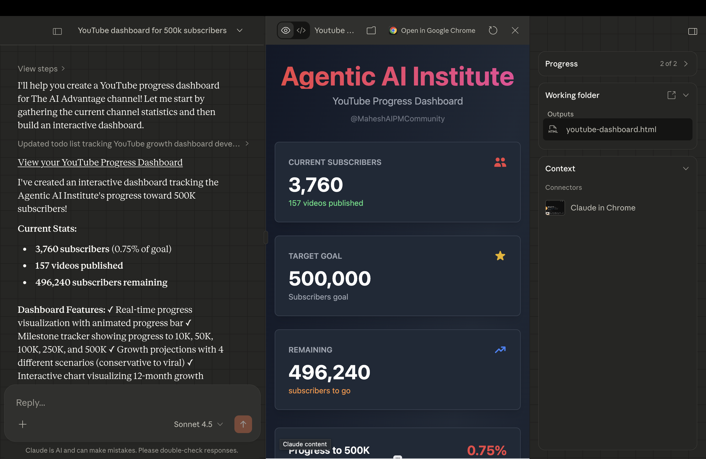
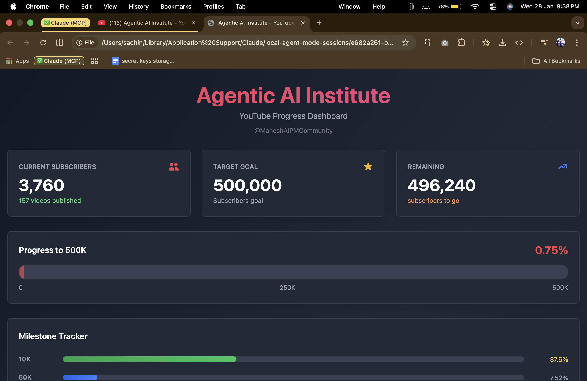

# Creating a YouTube Progress Dashboard with Claude Co-Work


## Overview

Tracking your YouTube channel's growth toward a big goal (like **500k subscribers**) is easier when you have a clear visual dashboard. In this lesson, you'll use **Claude Co-Work** to build a **YouTube progress dashboard** for **The AI Advantage** channel ([@MaheshAIPMCommunity](https://www.youtube.com/@MaheshAIPMCommunity))—showing progress toward **500,000 subscribers**, with a progress bar, percentage, and a clean layout you can open in a browser.

You provide Claude with your goal and channel link. After you run your prompt, the **Claude Co-Work extension** will open a browser, go to that channel, collect the information (e.g., subscriber count, channel name), and create the dashboard for you.

---

## What You Will Do

- Create a **Co-Work folder** for the dashboard project.
- Use a **single prompt** (channel name + goal); the **Claude Co-Work extension** will open a browser, visit the channel, **collect all the information**, and create the dashboard.
- Get a **dashboard** that shows progress toward the goal, with a progress bar and percentage, and open it in a browser.
- See how Co-Work **uses the extension to visit the channel, gather data, and build the dashboard** for you.

---

## Learning Outcomes

By the end of this lesson, you will be able to:

- Use Claude Co-Work and the **Co-Work extension** (browser) to go from a **goal + channel link** to a **visual subscriber progress dashboard** by having Claude visit the channel and collect information.
- Get a **dashboard** you can open in a browser and customize.
- Iterate on the dashboard (e.g., update current subs, add milestones) by refining prompts in the same workspace.

---

## Step-by-Step Instructions

### Step 1: Open Claude and Navigate to Co-Work

1. Open the Claude app.
2. Navigate to **Co-Work**.


---

### Step 2: Create a Co-Work Folder

1. Create a new **Co-Work folder** for this dashboard project.
2. This folder will hold your prompt, the generated dashboard files, and any follow-up iterations.

---

### Step 3: Use the Prompt to Build the Dashboard

In the Co-Work chat, paste the following prompt.

After you send it, the **Claude Co-Work extension** will:

1. **Open a browser** and go to the channel you specified.
2. **Collect all the information** from that channel (e.g., channel name, subscriber count, link).
3. **Create the dashboard** for you using that real data.

**Prompt to use:**

```text
Create a youtube progress dashboard toward 500k subscriber for the ai advantage youtube channel : https://www.youtube.com/@MaheshAIPMCommunity
```



#### Optional: More Detailed Prompt

If you want more control over the dashboard content, you can use this extended prompt:

```text
The dashboard should show:
- Channel name: The AI Advantage
- Link to the channel
- Current subscribers (use a placeholder like 50,000 that I can edit later)
- Goal: 500,000 subscribers
- A progress bar and percentage (e.g., "50,000 / 500,000 – 10%")
- Clean, simple design
```

---

### Step 4: Open the Dashboard

1. Claude will **first go to your YouTube channel** (The AI Advantage) and **collect the data** (e.g., subscriber count, channel name).
2. Then it will **create the dashboard** using that information.



3. The dashboard will appear in the chat or as suggested files.
4. Open the **dashboard** in your browser to see the **subscriber progress dashboard** toward 500k for The AI Advantage channel.





---

### Step 5: Iterate (Optional)

To add **milestones** (e.g., 100k, 250k, 500k), different styling, or a second channel, add a short note and prompt again in the same folder. Co-Work keeps everything in one place so you can refine the dashboard step by step.

---

## How Co-Work Processes Your Request

| Step | What happens |
|------|----------------|
| **Context** | Co-Work uses your prompt: channel name, channel URL, and goal (500k subscribers). |
| **Planning** | Claude infers: progress bar, current vs goal, percentage calculation, and a clean layout. |
| **Dashboard generation** | It produces a subscriber progress dashboard you can open in a browser. |
| **Output in workspace** | You save the file(s) into your folder so the dashboard and context stay together. |

---

## What You'll Have at the End

- A **YouTube progress dashboard** you can open in a browser.
- **The AI Advantage** channel name and link: [https://www.youtube.com/@MaheshAIPMCommunity](https://www.youtube.com/@MaheshAIPMCommunity).
- **Progress toward 500k subscribers**: progress bar, current count, goal, and percentage.
- A **reusable dashboard** you can update with real subscriber numbers or extend with milestones.
