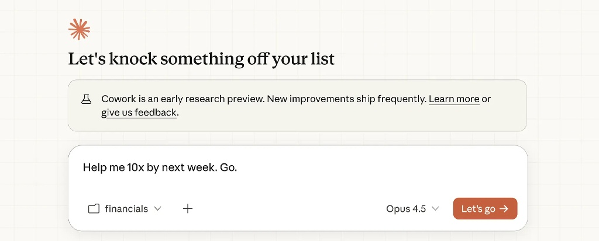
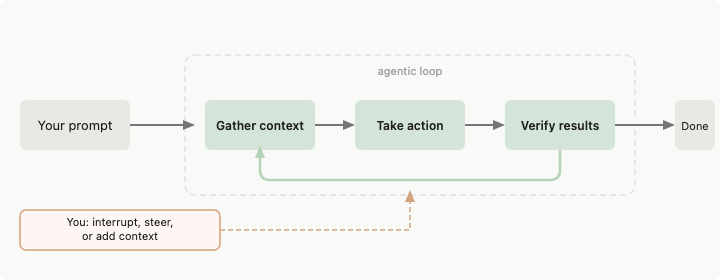
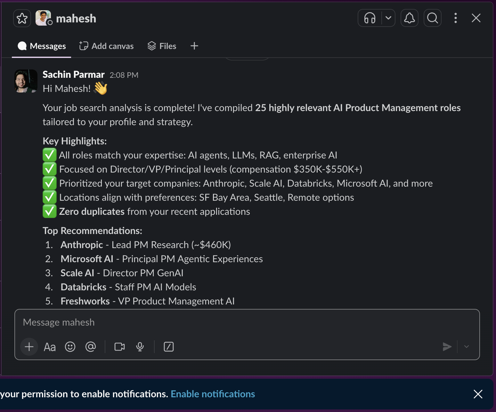

# Build a Job Assistant Using Claude Cowork



---

Applying for jobs manually is painful: hopping between job portals, redoing filters, and still missing good roles. In this hands-on lab you’ll use **Claude Cowork as your personal job searcher**—automating discovery so you can focus on *choosing where to apply* and *writing strong applications*.

This lesson is structured as a story in three parts: first you'll learn about **context** (giving Claude the right inputs), then **automation** (having Claude find and apply to jobs), and finally **connectors** (getting notified when tasks are done). By the end, you'll have a repeatable pattern you can use for other workflows.

---

### What is Claude Cowork?

Claude Cowork is an agentic AI workspace, layered on top of the standard Claude interface, that can take actions for you inside specific folders, files, and connected apps. It is built on the same foundations as Claude Code, but designed for knowledge workers and product managers who don't need to think in terms of code, variables, or Booleans.

Compared to a regular chat-style assistant, Cowork operates with much more autonomy. Once you give it a clear task, it will propose a plan and then methodically work toward the goal—often spinning up multiple sub-agents in parallel—while showing you a running log of what it's doing and why. Because Cowork is optimized for longer-running work, it can stay focused on multi-step tasks without timing out or losing context.

You choose which folders Cowork can see. Within those boundaries, it can read, edit, and organize your files, and—with the right extensions—can also work with your Chrome browser and select productivity tools. In this course, you will use that capability to complete core product management workflows like structured market research, user research synthesis, browser-based data gathering, file organization, and clean, repeatable document creation.

---

### How does it work?

**(the agentic loop):**



- **Step 1 — Gather context:** Before doing anything, Claude reads all available inputs (files, instructions, history) to understand the full picture.
- **Step 2 — Plan:** Claude maps out a sequence of steps to complete the task. This plan is visible to you so you can review and correct it before anything happens.
- **Step 3 — Confirm:** Before taking any action that affects the outside world (writing a file, opening a browser, sending a message), Claude pauses and asks for your permission.
- **Step 4 — Act:** Claude executes the plan step by step, using tools (web search, browser, file system, connectors) to get the work done.
- **Step 5 — Report back:** Once done, Claude surfaces what it completed, what it skipped, and what needs your attention — so you stay in control at every stage.

> **Why this matters for this lab:** Every step in this lab maps directly to one of these five stages. As you follow along, you will see the callouts that show you exactly which stage Claude is in at each moment.

### Claude Cowork vs Claude Code

| Aspect | Claude Cowork | Claude Code |
|--------|---------------|-------------|
| **Primary Purpose** | Collaborative AI workspace for workflows & tasks | Coding-focused AI assistant |
| **Core Use Case** | Job search, market research, document analysis, PM workflows | Writing, debugging, and explaining code |
| **Context Handling** | Uses folders, files, and shared workspace context | Mostly prompt-based, limited persistent context |
| **Collaboration** | Designed for multi-step, multi-file collaboration | Single-user, single-session focused |
| **File Operations** | Reads, writes, updates multiple files systematically | Can read/write files but less workflow-oriented |
| **Non-Code Tasks** | Strong (research, analysis, automation, documentation) | Limited (mainly code-related) |
| **Automation Feel** | Agent-like, task-driven execution | Assistant-style, reactive |
| **Best For** | Product managers, analysts, job seekers, ops teams | Developers writing or debugging code |

### Claude Cowork Use Cases for PMs

Claude Cowork is especially well suited to product management work. In this course you will practice these core use cases:

| Use case | What Cowork helps you do |
| -------- | ------------------------- |
| **Market research** | Gather and synthesize market signals from the web, reports, and your own notes into structured insights and summaries. |
| **PRD creation** | Turn scattered inputs—user stories, requirements, and stakeholder notes—into clear, structured Product Requirements Documents. |
| **Competitive analysis** | Research competitors (pricing, features, positioning), pull data from public sources, and build comparison matrices and reports. |
| **Data analysis** | Work with spreadsheets and datasets: clean, summarize, and visualize data, and draft findings for stakeholders. |
| **Presentation building** | Create slide decks from outlines or raw content—with consistent structure, speaker notes, and clear narrative flow. |

---

### Prerequisites

1. **Strategy document** — A document you will provide to Claude Cowork as context. Not sure how to write one? Use **Mahesh’s strategy template**: [Strategy for getting an AI role](https://docs.google.com/document/d/17cwpnIcWGhaYpX2T9rsJEMrEeOjovghDvXLFER3RdSc/edit?tab=t.0) — duplicate it and fill in your job-search criteria, target roles, and preferences.
2. **Claude Cowork subscription** — An active Claude Cowork subscription.

### How to set up Claude Cowork on your machine

To use Claude Cowork for this lab, you need the **Claude Desktop app** on your Mac and Cowork enabled. Follow the step-by-step guide:

- **[Click here](Overview/0.1-installation.md)** for the full installation guide (0.1: Installation) — Install the Claude Desktop app, sign in, enable Cowork, and choose a working folder so Claude can read and write your files.

**Quick summary:** Go to [claude.com/product/cowork](https://claude.com/product/cowork), download the macOS app, sign in with your Anthropic account, then open **Cowork** in the left sidebar and set your workspace folder.

---

## Part 1: Context — Give Claude what it needs

Before Claude can find or apply to jobs, it needs to know *who you are* and *what you want*. That's **context**. In this section you'll learn what to share and how.

### Your three files

Before asking Claude to find jobs for you, give it the *right context*. You have three files:

| File | What it is |
|------|------------|
| **Strategy** | Your job-search criteria, target roles (e.g. AI PM, PM), and preferences (from Mahesh’s template). |
| **Resume** | Your resume so Claude can match your experience to roles. |
| **CSV sheet** | `jobs_applied.csv` — the list of jobs you’ve already applied to in the last 2 days (so Claude can avoid duplicates and build on your pipeline). |

---

### Hands on: Find your jobs

1. Open **Claude** and navigate to **Cowork**.
2. Add a **folder** that contains all three files: your strategy document, resume, and `jobs_applied.csv`.

> **Claude Code loop — Step 1: Gathering context**
> By sharing your folder, you are giving Claude the raw material it needs to make decisions. This is the first thing Claude does in every agentic task: read and understand all available context before doing anything else.

---


---

3. **Prompt Claude Cowork** to find your top 10 relevant jobs. For example, use this prompt:

---

**Example prompt:**

```
You have access to the following inputs:
1. My resume (skills, experience, roles, preferences)
2. My job search strategy (target roles, locations, constraints, priorities)
3. A CSV file containing jobs I applied to in the last 2 days

Your task:
- Analyze my resume to understand my skills, experience level, and role fit
- Use my job search strategy to define what "relevant jobs" mean for me
- Read the CSV file and identify companies, roles, and job types I have already applied to
- Avoid suggesting duplicate roles or the same company + role combinations

Now do the following:
1. Search for new and relevant job openings that match my resume and strategy
2. Prioritize jobs posted in the last 24–48 hours
3. Rank jobs by relevance (best fit first)
4. For each job, extract:
   - Company Name
   - Job Title
   - Location
   - Job Type (remote / hybrid / onsite)
   - Experience Level
   - Job Posting Date
   - Job URL
   - Short reason why this role is a good match for me

Output:
- Create a new CSV file named `recommended_jobs.csv`
- Store all the selected job listings in this CSV
```

---

You’ll end up with **`recommended_jobs.csv`** containing your top 10 recommended roles.

---


---

### How Claude Cowork processes your query

After you send the prompt, Claude Cowork works through your request in a clear sequence:

1. **Analyze context** — Claude reads and analyzes all the files you shared (strategy, resume, `jobs_applied.csv`) to understand your profile, preferences, and what you’ve already applied to.

> **Claude Code loop — Step 1: Gathering context**
> Claude is not guessing. It is grounding every future decision in the files you shared. No files = no context = generic, unhelpful output.

---


---

2. **Create a plan** — It creates a plan for how to find and rank relevant jobs (e.g. what to search for, how to filter, what to avoid).

> **Claude Code loop — Step 2: Planning**
> Before touching anything, Claude maps out the full sequence of steps. You can see this plan in the activity panel. Review it — if the plan looks wrong, correct it now before Claude acts.


3. **Set context** — It uses that plan to set its own search and filtering context so the next steps stay aligned with your resume and strategy.

> **Claude Code loop — Step 2 (continued): Locking in the plan**
> Claude is anchoring its next actions to the plan it just created. This is how it stays on track across multiple steps without drifting.

4. **Run web search** — It performs web searches (e.g. job boards, company sites) to discover new openings that match your criteria.

> **Claude Code loop — Step 3: Acting**
> Claude now executes — searching job boards, filtering results, ranking by fit. This is the only step where Claude is doing work on the outside world. Everything before this was preparation.

5. **View web search logs** — You can open and review the **web search logs** in Cowork to see which searches were run and what was found; this keeps the process *transparent*.

> **Claude Code loop — Step 4: Reporting back**
> The logs are Claude showing its work. This is not just a UI feature — it is Claude’s chain-of-thought made visible so you can verify, correct, or build on what it found.

---


---


---

You can follow along as Claude moves from **analyzing your files** → **planning** → **searching** → **building** `recommended_jobs.csv`.

---


---


---

### Why this mirrors how Claude Code works under the hood

The five steps you just saw — analyze context, create a plan, set context, run web search, build output — are not just a Cowork-specific workflow. They reflect the fundamental loop that powers Claude Code and all of Anthropic's agentic systems.

Understanding this loop helps you prompt Claude more effectively, because you are working *with* how it thinks rather than against it.

**The Claude agentic loop, mapped to this lab:**

| What you saw in the lab | What Claude is doing internally |
|-------------------------|----------------------------------|
| You gave Claude your strategy doc, resume, and `jobs_applied.csv` before asking it to do anything | **Context gathering first** — Claude always reads all available context before deciding on an action. It does not guess or hallucinate your preferences; it grounds its decisions in what you have given it. |
| Claude produced an explicit plan (visible in the activity panel) before running any searches | **Plan before act** — Claude does not jump straight to execution. It reasons about the task, identifies sub-steps, and produces a plan. This plan is visible so you can catch misunderstandings early. |
| Claude asked for permission before opening your browser and taking actions on your behalf | **Confirmation before change** — Whenever an action is irreversible or has side effects (opening a browser, filling a form, sending a message), Claude pauses and asks. Claude acts with autonomy but never *without* your awareness. |
| Claude ran web searches, updated `recommended_jobs.csv`, and showed you logs of what it found | **Act, then report** — After confirmation, Claude completes the task in steps and surfaces what it did. The transparency logs are Claude's internal chain-of-thought made visible to you. |
| Claude sent you a Slack message when the task was done | **Close the loop** — Claude knows when a task is complete and reports back: what was done, what was skipped, and what needs your attention. |

**The pattern in one line:**

> Gather context → Plan → Confirm → Act → Report back

This is the same loop whether you are using Claude Cowork for job search, running Claude Code to refactor a codebase, or using any other Anthropic agentic product. When you understand this loop, you can structure your prompts to match it: give Claude rich context upfront, let it plan before you push it to act, and review its work at the reporting stage before moving to the next step.

---

### What we learned about context

Using this job-assistant example (strategy, resume, `jobs_applied.csv`), we saw that:

1. **The context is yours** — Your strategy, resume, and CSV are *your* context. You decide what to share with Claude Cowork; it uses only what you provide.
2. **It learns from your context** — Claude Cowork uses your files every time you run it. As you update your strategy or add new applications to your CSV, it can learn from and build on that information.
3. **You can give instructions it remembers** — You can give Claude Cowork instructions (e.g. *“always prioritize remote roles”* or *“exclude these companies”*) and it can remember them for the session or for future runs, so you don’t have to repeat yourself.

---

## Let’s see how you can apply for jobs using Claude Cowork

You now have a CSV file (**`recommended_jobs.csv`**) with the most relevant jobs according to your strategy template. Next, we’ll use Claude Cowork to **apply to those jobs** using that file and your resume.

**What you’ll do:**

1. In the same Claude Cowork session (or a new one), make sure Claude has access to:
   - **`recommended_jobs.csv`** — the list of top jobs it found for you
   - **Your resume** — so it can tailor applications
2. **Prompt Claude Cowork** to use that file and your resume and start applying to the jobs. For example:

---

```
Use the file @recommended_jobs.csv (my top recommended jobs) and my resume @resume.pdf.

- Analyse my resume and match it with each job in the CSV.
- Open each job link using the browser tool and apply to the relevant role.
- Guide me through submitting each application, or complete the steps you can do yourself.
- If a job page doesn’t load or isn’t found, skip it and move to the next job link.
```

---


---

You can refine the prompt (e.g. *“apply to the first 3 jobs only”* or *“focus on roles that are remote”*). Claude Cowork will use the CSV and your resume to tailor each application and help you submit.

### How it will process

Claude analyzes your CSV file and, based on that, applies to the jobs *step by step*:

1. **Opens the browser and asks for permission** — It opens the browser tool and may ask you for permission (e.g. to access a page or automate actions). **Give permission** when prompted.

> **Claude Code loop — Step 3: Confirmation before action**
> This permission prompt is not optional friction — it is a core safety principle. Claude will always pause and ask before taking an action that affects the outside world (filling forms, clicking buttons, submitting applications). You are in control.

---


---

2. **Goes to each job link one by one** — It visits each application URL from the CSV in turn.

> **Claude Code loop — Step 3 (continued): Acting**
> Claude is now executing the plan, one job at a time. It uses the context it gathered earlier (your resume, strategy) to navigate each page.

---


---

3. **Fills in the details** — Because it has your context (resume, strategy), it knows your key information (name, email, experience, etc.) and fills in the form fields.

> **Claude Code loop — Step 1 (in action): Context pays off here**
> Every field Claude fills in correctly is the result of the context you gave it at the start. The richer your resume and strategy doc, the more accurately Claude can fill in your details.

---


---

4. **Uploads what it can** — It will upload your resume and complete as many fields as possible. You may need to confirm or complete a few steps yourself depending on the site.

> **Claude Code loop — Step 4: Reporting back**
> After each application, Claude surfaces what it completed and what it could not do (e.g. custom uploaders it cannot access). This is your cue to review and fill in any gaps before submitting.

### Limitation

- **Speed** — When applying via forms, Claude Cowork can be slow (often 15–20 seconds per step). The same actions might take you 1–2 seconds manually.
- **Missing fields** — It sometimes skips or ignores some form fields, so *review each application before submitting*.
- **Resume upload** — It may not always be able to upload your resume (e.g. if the site uses a custom uploader or blocks automation). In those cases, you’ll need to upload it yourself.

---

## Let’s see how you can add connectors

Suppose your first task (finding and applying to jobs) is done, and you want a **confirmation message in Slack** so you know it’s complete. Here’s how to add the Slack connector and use it.

### How to connect Slack

1. Go to **Connection** → **Manage connector**.

---


---

2. Click on **Browser connector** (or the option that lets you browse connectors).

---


---

3. Search for **Slack**.

---


---

4. **Connect Slack with Claude** (click **Allow**).
5. Once done, you’re connected to the **Slack connector**.

---


---

### Now let’s try it

Once the task is done, it will send a message on your Slack. Use a prompt that includes *both* the job-finding task and the Slack instruction at the end. Example:

---

```
You have access to the following inputs:
1. My resume (skills, experience, roles, preferences)
2. My job search strategy (target roles, locations, constraints, priorities)
3. A CSV file containing jobs I applied to in the last 2 days

Your task:
- Analyze my resume to understand my skills, experience level, and role fit
- Use my job search strategy to define what "relevant jobs" mean for me
- Read the CSV file and identify companies, roles, and job types I have already applied to
- Avoid suggesting duplicate roles or the same company + role combinations

Now do the following:
1. Search for new and relevant job openings that match my resume and strategy
2. Prioritize jobs posted in the last 24–48 hours
3. Rank jobs by relevance (best fit first)
4. For each job, extract:
   - Company Name
   - Job Title
   - Location
   - Job Type (remote / hybrid / onsite)
   - Experience Level
   - Job Posting Date
   - Job URL
   - Short reason why this role is a good match for me

Output:
- Create a new CSV file named `recommended_jobs.csv`
- Store all the selected job listings in this CSV
- Once this is done, send a message on Slack to Mahesh Yadav: "It's done."
```

---

### How it works

When you run the prompt, Claude Cowork does the following:

1. **Finds relevant jobs** — It uses your resume, strategy, and CSV to search, rank, and build **`recommended_jobs.csv`**.

---


---

2. **Calls the Slack connector** — After the job-finding task is done, it invokes the Slack tool/connector.

---


---

3. **Searches for Mahesh Yadav** — It looks up Mahesh Yadav in your connected Slack workspace (user or channel).

---


---

4. **Drafts and sends the message** — If found, it drafts the confirmation message (e.g. *”It’s done.”*) and sends it to Mahesh.

> **Claude Code loop — Step 4: Closing the loop**
> This Slack message is Claude’s final “report back.” The task is complete, the output exists (`recommended_jobs.csv`), and Claude notifies you so you can take the next action. This is the end of one full agentic loop: context → plan → act → report.

---



---

Replace *Mahesh Yadav* with the Slack user or channel you want to notify.

---

## Summary: What you've learned

You've completed the full story in three parts:

| Part | What you learned |
|------|------------------|
| **Context** | How to give Claude the right inputs (strategy, resume, `jobs_applied.csv`) so it knows who you are and what you want—and how it analyzes your files, plans, and runs web search to build **`recommended_jobs.csv`**. |
| **Automation** | How to have Claude apply to jobs using the browser: open links, fill forms, and upload your resume—plus what to expect (speed, missing fields, upload limits) so you can review before submitting. |
| **Connectors** | How to add Slack (or other connectors) and get a confirmation message when a task is done, so you stay in the loop without checking manually. |

**Takeaway:** The same pattern—**context → automation → connectors**—works for other workflows. Use this lab as a template for market research, PRDs, competitive analysis, or any multi-step task where you want Claude to do the work and notify you when it's done.

*Happy job hunting.*

---

### Limitations

Cowork is a research preview. Current limitations:

**Platform**

| Limitation | Details |
| ---------- | ------- |
| **Mac & Windows only** | Windows support launched Feb 2026. Linux is not officially supported. |
| **Windows ARM64 not supported** | ARM64 devices on Windows will not run Cowork. |
| **Desktop app required** | No web or mobile version — must use the Claude Desktop app. |

**Session & Memory**

| Limitation | Details |
| ---------- | ------- |
| **No memory across sessions** | Starts fresh each time — Claude has no recollection of previous runs. |
| **No session sharing** | Can't share a session or collaborate with others in real time. |
| **No cross-device sync** | Local to your machine only. |
| **App must stay open** | Closing the app or letting your computer sleep ends the session. |
| **5-hour task limit** | Tasks running longer than 5 hours are interrupted when the quota resets. |

**Browser Automation**

| Limitation | Details |
| ---------- | ------- |
| **Slow** | Chrome automation is 15–20 seconds per step — the same action takes 1–2 seconds manually. |
| **Accuracy issues** | Claude can misclick or take unexpected actions when navigating complex pages. |
| **No dynamic pages** | The web fetch tool reads static HTML only — JavaScript-rendered content may not load correctly. |
| **Stability** | Prolonged Chrome automation sessions can cause Cowork to become unresponsive. |

**Connectors**

| Limitation | Details |
| ---------- | ------- |
| **Connectors unreliable** | File system + Chrome + web search work best. Gmail, Calendar, Slack, etc. are hit or miss. |
| **Session state loss** | Connectors like Gmail and Slack sometimes lose their session after restart — toggle them off and back on to fix. |
| **No multi-account support** | Can't connect two accounts of the same service (e.g. two Gmail accounts) simultaneously. |

**Files & Workspace**

| Limitation | Details |
| ---------- | ------- |
| **One folder at a time** | Can't access multiple folders or locations simultaneously. |
| **No Projects** | Unlike Claude chat, there are no saved project contexts. |
| **PDF limitations** | Scanned or heavily formatted PDFs may not be read accurately. |
| **Write restrictions** | Claude can only write files inside the working folder you set — not elsewhere on your machine. |

**Usage & Cost**

| Limitation | Details |
| ---------- | ------- |
| **High token consumption** | Agentic tasks use significantly more tokens than regular chat. On a Max 5x plan, expect 10–20 substantial operations before hitting your limit. |
| **Scheduled tasks require app open** | Scheduled tasks only run while your computer is awake and the Claude Desktop app is open. |

---
