# Building an AI-Powered Contract Analyzer
### From PRD → Mockup → Backend → Automation → Deployment

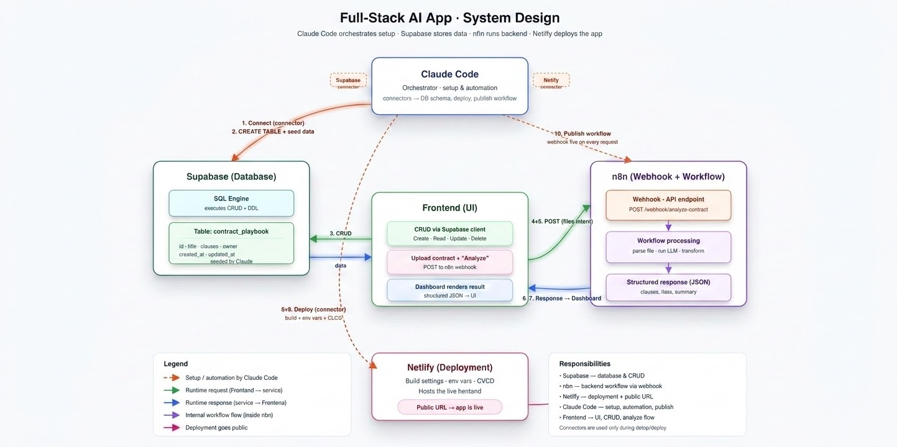

---

## What You're Building

By the end of this lesson, you will have a **fully deployed, AI-powered contract analysis tool** that:

- Accepts uploaded contracts (PDFs/docs)
- Extracts and scores key terms automatically using Claude AI
- Stores structured playbook data in a Supabase database
- Triggers an n8n automation workflow via webhook on each analysis
- Is live on the internet via Netlify — shareable with anyone

Every step in this lesson connects to the next. Here's the flow:

```
PRD → Mockups (Claude Code) → Supabase DB → Claude Code App → n8n Webhook → Netlify Deploy
```

---

## Prerequisites — Complete These Before Starting

Before you begin, make sure you have the following ready:

| Item | Why You Need It |
|------|-----------------|
| Downloaded the PRD | The source of truth for what you're building — [Download PRD](https://pragyaallc-my.sharepoint.com/:t:/g/personal/sachin_parmar_legalgraph_ai/IQBKtu5D_GJHTrdiIK5INdeCAUv8pW1MAbBNcNSF0mY8lBQ?e=TFMfsK) |
| Downloaded the n8n workflow file | Pre-built automation you'll import into n8n — [Download n8n Workflow](https://pragyaallc-my.sharepoint.com/:u:/g/personal/sachin_parmar_legalgraph_ai/IQBiK9oT3JzGQa_QeDhtBNCjAV98s0FF7bTadTd15B_Mkb4?e=NMMAdl) |
| Active n8n account (cloud or self-hosted) | Runs the automation layer |
| Claude Code with Pro subscription | Powers the AI coding and MCP connectors |
| Supabase account (free tier is fine) | Hosts your database |
| Netlify account (free tier is fine) | Deploys your frontend |

---

## Step 0 — Generate Your App Mockups from the PRD

Before writing a single line of code, you'll use Claude Code to generate UI mockups directly from your PRD. This gives you a visual target and ensures the app you build matches the product spec.

**Why this step matters:** Starting from mockups means your database schema (Step 1) and your app UI (Step 2) are designed together — not retrofitted.

### 0.1 Load the PRD into Claude Code

1. Open Claude Code in your terminal
2. Use the `@` symbol to attach your PRD file to the prompt:

```
@your-prd-file.pdf
```

### 0.2 Generate Mockups

Copy and run this prompt in Claude Code, attaching your PRD:

```
Using the PRD I've attached (@your-prd-file.pdf), generate UI mockups for this contract analyzer app.

Create:
1. A homepage / upload screen where users can upload a contract file
2. An analysis results screen showing extracted key terms, risk scores, and a summary
3. A playbook management screen showing the contract_playbook table data

Use clean, minimal HTML/CSS (no external frameworks needed for the mockup). 
Each screen should be a separate section or page.
Make the design functional enough to hand off to a developer.
```

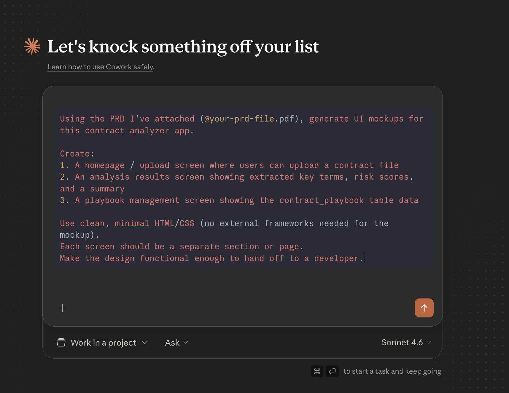


3. Review the generated mockups — these are your UI blueprint for the rest of the lesson

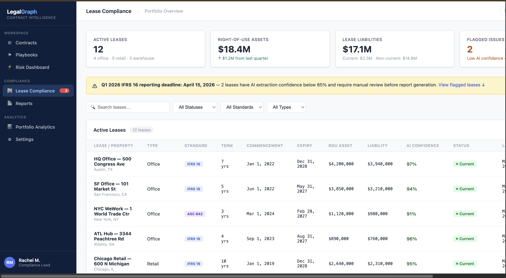

---

## Step 1 — Set Up Supabase

Now that you know what you're building (from the mockups), you'll set up the database that stores the contract playbook — the rules your AI uses to score every contract.

### 1.1 Create a New Supabase Project

1. Go to [https://supabase.com](https://supabase.com) and log in

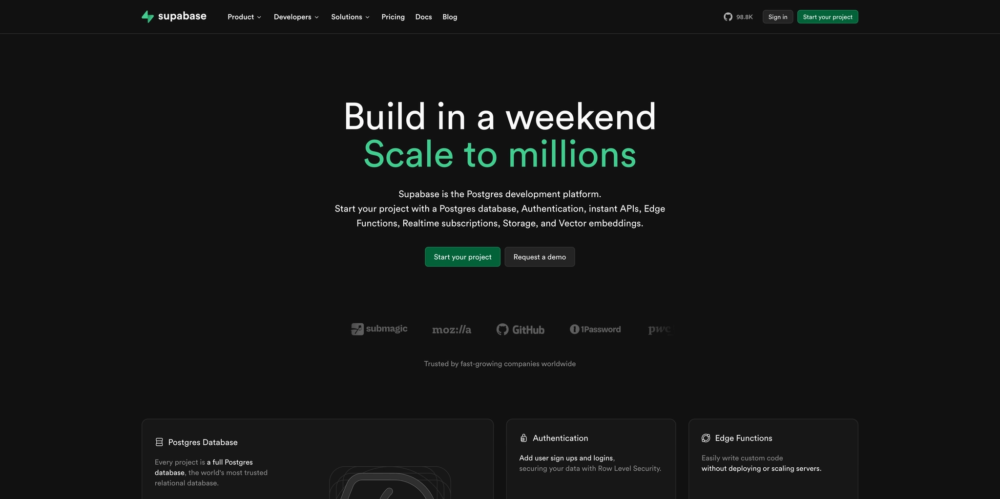

2. If this is your first time, Supabase will prompt you to **create an organization** — give it any name (your name or company name works fine)


3. Click **New Project**, then enter:
   - A **project name** (e.g., `contract-analyzer`)
   - A strong **database password** — save this, you'll need it later
  
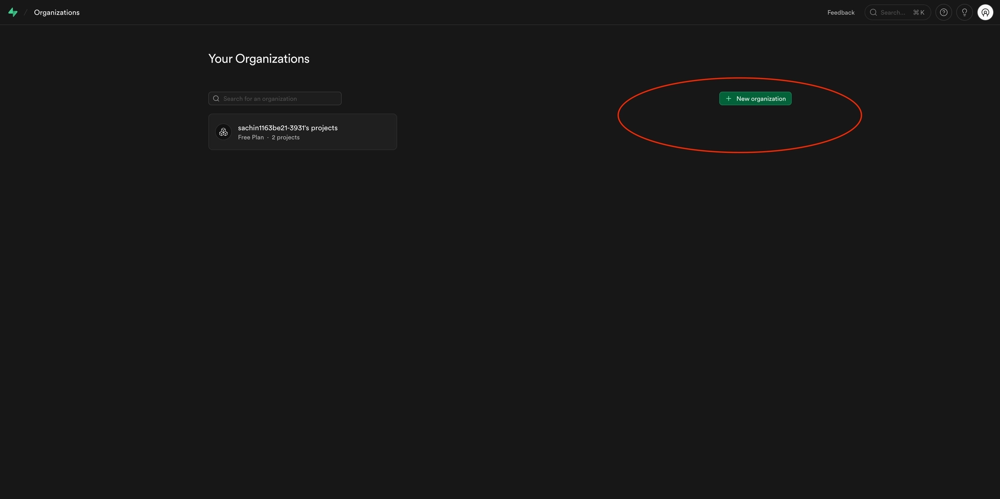

1. Select the **region** closest to you
2. Click **Create Project** and wait ~1–2 minutes for it to provision

### 1.2 Run the SQL Schema

Once your project is ready, you'll create the `contract_playbook` table — this is the brain of the analyzer. It defines what terms to look for in each contract type and how risky each term is.

1. In the left sidebar, click **SQL Editor**
2. Paste the following SQL and click **Run**:

```sql
CREATE TABLE contract_playbook (
  id UUID DEFAULT gen_random_uuid() PRIMARY KEY,
  contract_type TEXT NOT NULL,
  key_term_name TEXT NOT NULL,
  key_term_label TEXT NOT NULL,
  key_term_description TEXT,
  risk_weight INTEGER DEFAULT 1,
  created_at TIMESTAMPTZ DEFAULT NOW()
);

INSERT INTO contract_playbook (contract_type, key_term_name, key_term_label, key_term_description, risk_weight) VALUES
  ('NDA', 'governing_law',         'Governing Law',         'The jurisdiction whose laws govern the agreement', 2),
  ('NDA', 'term_duration',         'Term Duration',         'How long the NDA remains in effect', 3),
  ('NDA', 'confidentiality_scope', 'Confidentiality Scope', 'What information is covered as confidential', 5),
  ('NDA', 'permitted_disclosure',  'Permitted Disclosures', 'Who the receiving party may share info with', 4),
  ('NDA', 'return_destruction',    'Return/Destruction',    'Obligations to return or destroy confidential info', 3),
  ('NDA', 'remedy_clause',         'Remedy Clause',         'Remedies available for breach', 4),
  ('MSA', 'payment_terms',         'Payment Terms',         'When and how payments must be made', 5),
  ('MSA', 'liability_cap',         'Liability Cap',         'Maximum financial exposure for either party', 5),
  ('MSA', 'ip_ownership',          'IP Ownership',          'Who owns work product and deliverables', 5),
  ('MSA', 'termination_rights',    'Termination Rights',    'Conditions under which either party may terminate', 4),
  ('MSA', 'indemnification',       'Indemnification',       'Who indemnifies whom and under what circumstances', 4),
  ('MSA', 'sla_terms',             'SLA Terms',             'Service level commitments and remedies for breach', 3);
```

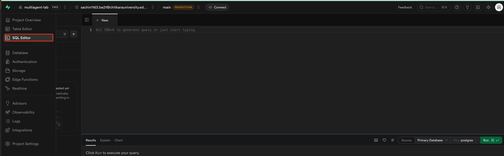

3. Go to **Table Editor** in the sidebar and confirm you see the `contract_playbook` table with 12 rows — 6 for NDAs, 6 for MSAs

### 1.2.1 Grab Your Supabase Credentials

You'll need two values from Supabase — save both, they're used in Step 2 and Step 3.

**Service Role Secret Key**

1. In the left sidebar, click **Project Settings**
2. Click **API Keys**
3. Scroll to the **Legacy API Keys** section
4. Copy the **`service_role`** secret key — this gives your n8n workflow full database access


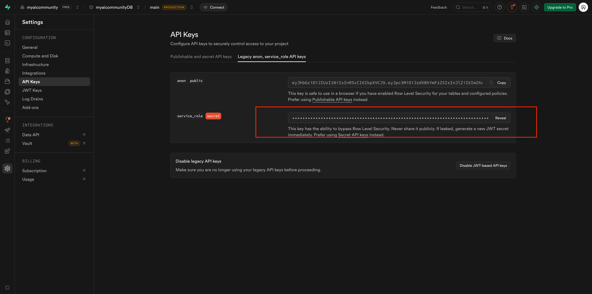

> Do not use the `anon` key here — it has restricted permissions and will not work for server-side automation.

**Host URL (Supabase Project URL)**

1. In the left sidebar, click **Project Overview**
2. Click the **Connect** button (top right of the overview page)

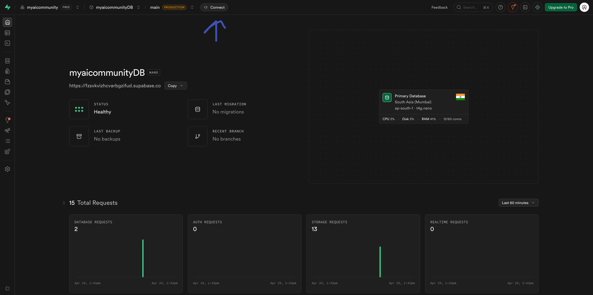

3. Copy the **Supabase URL** shown — it will look like:
   ```
   https://xxxxxxxxxxxx.supabase.co
   ```

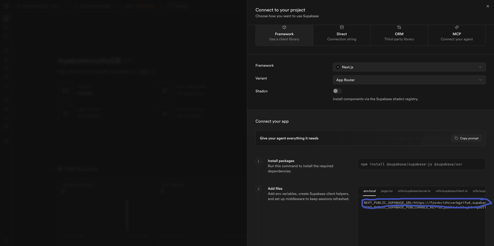

Keep both values handy — you'll paste them into the Supabase node in n8n (Step 2) and as environment variables in Netlify (Step 3).

### 1.3 Connect Supabase to Claude Code

Now you'll give Claude Code direct access to your Supabase database so it can read and write data as it builds your app.

1. In Claude Code, open the **Connectors** section

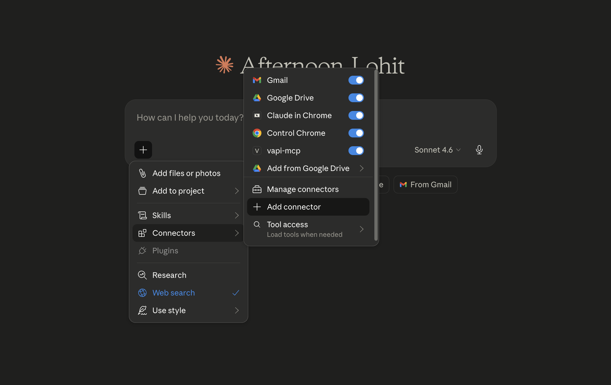

2. Search for **Supabase**

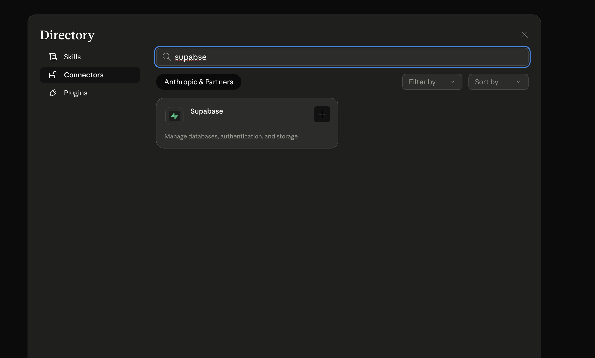

3. Click **Authorize** and follow the prompts to link your Supabase project
4. Once connected, run this prompt in claude cowork

```
I've connected my Supabase project. It has a contract_playbook table with columns:
id, contract_type, key_term_name, key_term_label, key_term_description, risk_weight, created_at.

Build a contract analyzer web app based on the mockups we generated. The app should:
1. Allow users to upload a contract (PDF or text)
2. Use Claude AI to extract key terms matching those in the contract_playbook table
3. Display a risk-scored analysis of the uploaded contract
4. Show which terms were found, which were missing, and an overall risk score

Use the Supabase connection to fetch the playbook data at runtime.
```

> **Connection point:** Your app now reads its scoring rules from Supabase. When you update the playbook table, the app's analysis logic updates automatically — no code changes needed.

---

## Step 2 — Connect to n8n for Automation

Your app can analyze contracts — now you'll wire it to n8n so that every analysis automatically triggers a workflow. This is where the real power of agentic automation kicks in: Claude extracts the terms, n8n orchestrates what happens next (notifications, logging, CRM updates, etc.).

---


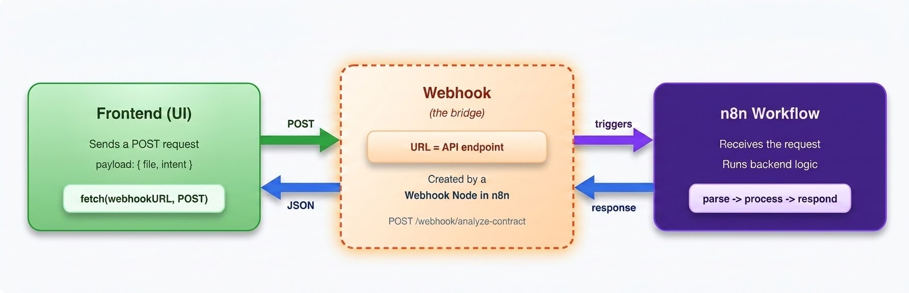

**Q: We've built the frontend and connected it to the database — but how does n8n actually connect to our frontend?**

**A: Through a webhook — it's the bridge between your app and your automation.**

Here's how it works:

1. In n8n, you add a **Webhook node** to your workflow. n8n gives you a unique URL for that node — this URL is a live API endpoint that listens for incoming data.
2. In your frontend, when the user clicks **Analyze Contract**, your app sends a **POST request** to that webhook URL — passing along data like the contract file and detected intent.
3. n8n receives the request, runs the workflow (AI extraction, database write, notifications — whatever you've configured), and sends back a **response**.
4. Your frontend receives that response and displays the results directly in the UI.

```
Frontend (user clicks Analyze)
        │
        │  POST request  { contract_type, terms, risk_score }
        ▼
  n8n Webhook URL
        │
        ▼
  n8n Workflow runs
  (processes data, writes to Supabase, sends notifications)
        │
        │  response  { status, result }
        ▼
  Frontend displays result to user
```

> Think of the webhook URL as a doorbell. Your frontend rings it with data; n8n answers and does the work.

---

### 2.1 Import the Workflow into n8n

1. Log into your n8n account

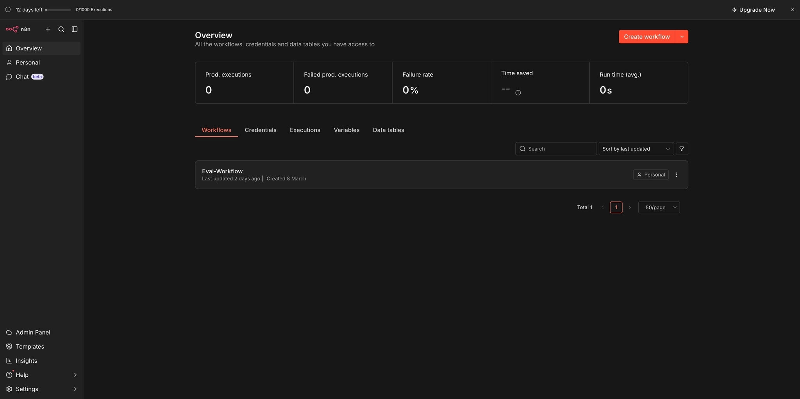

2. Click **New Workflow → Import from file**

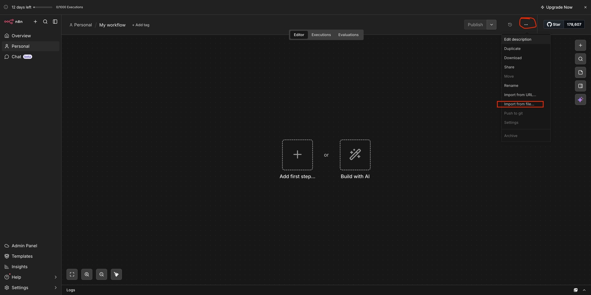

3. Upload the n8n workflow file you downloaded in the prerequisites
4. Once imported, click on the **Webhook** node in the workflow canvas
5. Copy the **Webhook URL** shown in the node — it will look like:
   ```
   https://your-n8n-instance.app.n8n.cloud/webhook/xxxxxxxx
   ```

   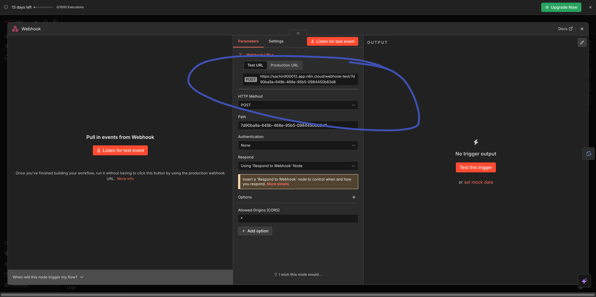


6. Click on the **Supabase** node in the workflow canvas to open its settings


7. In the **Credentials** section, click **Create New Credential** and paste the following from your Supabase project (found under **Project Settings → API**):
   - **Host URL** — your Supabase project URL, e.g. `https://xxxx.supabase.co`
   - **Service Role Secret Key** — the `service_role` key (not the `anon` key — the service role key has full DB access)

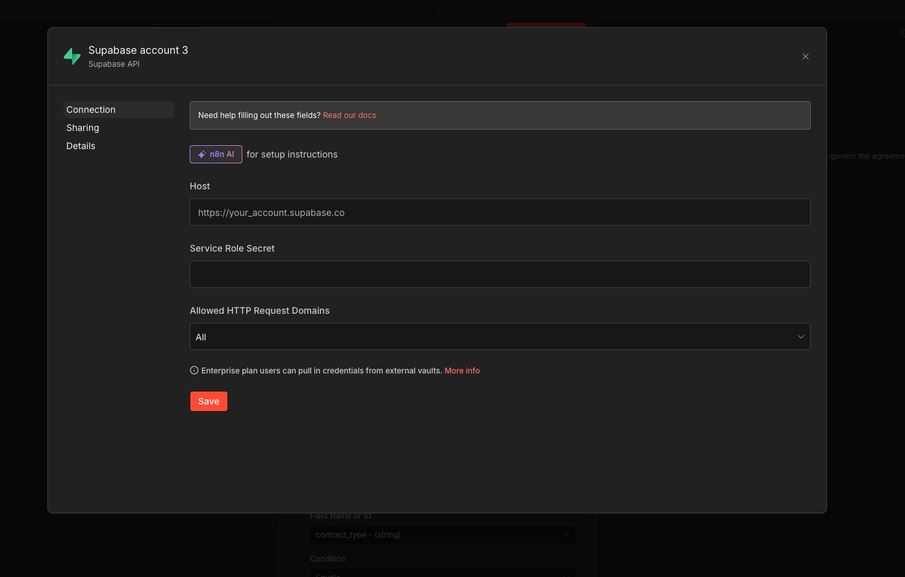

8. Once credentials are saved, select the **table name** (`contract_playbook`) and configure the **field values** to map the incoming webhook payload columns to the correct table fields

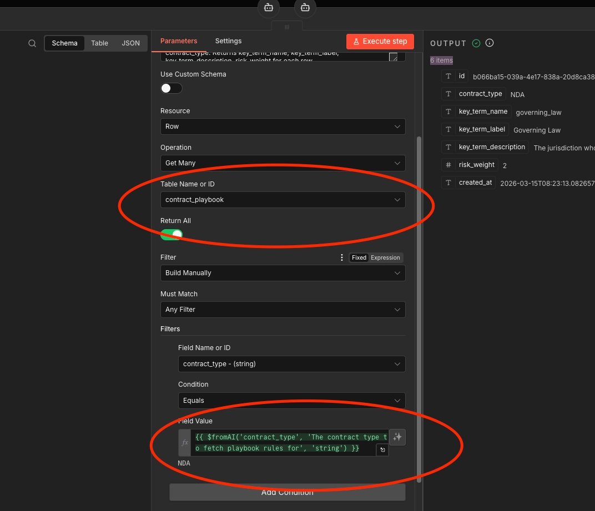

9.  Now Click **Publish** (top right toggle) to publish the workflow — the webhook won't receive requests until it's active 

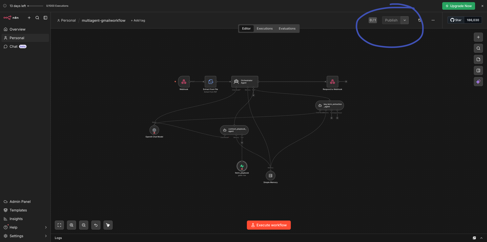

### 2.2 Wire the Webhook into Your App

Come back to Claude Code and run this prompt, replacing the placeholder with your actual webhook URL:

```
Add a webhook trigger to the contract analyzer app.

When a user clicks "Analyze Contract", after the AI analysis is complete, 
make a POST request to this n8n webhook URL: [PASTE YOUR WEBHOOK URL HERE]

Send the following payload:
{
  "contract_type": "<detected contract type>",
  "terms_found": ["<list of matched terms>"],
  "terms_missing": ["<list of missing terms>"],
  "risk_score": <overall score>,
  "analyzed_at": "<ISO timestamp>"
}

Handle errors gracefully — if the webhook fails, the analysis result should still display to the user.
```

### 2.3 Test the Integration

1. Upload a sample contract in your frontend that you have build on claude and click **Analyze**
2. Check your n8n workflow execution history — you should see a successful run appear within seconds
3. If the execution shows an error, check that your workflow is **Active** and the webhook URL is copied exactly

> **Connection point:** Every contract analysis now flows through two systems simultaneously — Claude AI extracts the intelligence, n8n routes it to wherever your business needs it. You've built an agentic pipeline, not just an app.

---

## Step 3 — Deploy the Frontend to Netlify

Your app works locally. Now you'll deploy it to the internet so anyone can use it — no local server required.

### 3.1 Connect Netlify via Claude Code

1. In Claude Code, open the **Connectors** section
2. Search for **Netlify**
3. Click **Authorize** and complete the OAuth flow to link your Netlify account

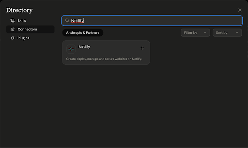

### 3.2 Deploy Your App

Once authenticated, run this prompt in Claude Code:

```
Deploy the current contract analyzer app to Netlify.

Make sure:
- All environment variables (Supabase URL, Supabase anon key, n8n webhook URL) are set as Netlify environment variables — do not hardcode them in the source
- The build is production-optimized
- The deploy is set to auto-publish

Return the live Netlify URL when done.
```

Claude Code will handle the build, configuration, and deployment automatically.

### 3.3 Verify Your Live App

1. Once the deployment completes, copy the **Netlify URL** from Claude Code's output
2. Open it in your browser
3. Upload a test contract and click **Analyze**
4. Confirm:
   - The analysis results display correctly
   - The n8n workflow execution log shows a new run
   - The risk scores match what you'd expect based on the playbook

> **Connection point:** Everything you built — the Supabase playbook, the Claude AI analysis, the n8n automation — is now running in production behind a public URL. You went from PRD to deployed product in a single workshop session.
>
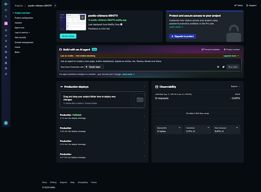

---

## What You Just Built — End-to-End Architecture

```
User uploads contract
        │
        ▼
  Netlify Frontend
  (Claude Code built + deployed)
        │
        ▼
  Claude AI Analysis
  ← reads contract_playbook from Supabase
  → scores terms by risk_weight
        │
        ├──► Results displayed to user
        │
        └──► POST to n8n Webhook
                  │
                  ▼
            n8n Workflow
            (notifications, logging, CRM, etc.)
```

| Layer | Tool | What It Does |
|-------|------|--------------|
| Database | Supabase | Stores the contract playbook (scoring rules) |
| AI | Claude (via Claude Code) | Extracts and scores key terms from uploaded contracts |
| Automation | n8n | Orchestrates downstream actions on every analysis |
| Frontend | Netlify | Hosts the live web app |
| Builder | Claude Code | Generates, connects, and deploys everything |

---

## Troubleshooting

**Supabase connection fails in Claude Code**
→ Re-authorize via Connectors. Make sure you selected the correct project during authorization.

**n8n webhook returns 404**
→ Check that the workflow is **Active** (toggle in top-right of n8n). Inactive workflows don't listen on the webhook endpoint.

**Netlify deploy fails on environment variables**
→ In your Netlify dashboard, go to Site Settings → Environment Variables and add `SUPABASE_URL`, `SUPABASE_ANON_KEY`, and `N8N_WEBHOOK_URL` manually, then trigger a redeploy.

**Analysis returns no terms found**
→ Verify the `contract_playbook` table has data (12 rows expected). Re-run the SQL INSERT from Step 1.2 if the table is empty.

---

*Lesson complete. You've shipped a production AI product — from spec to deployment — using Claude Code as your co-builder.*