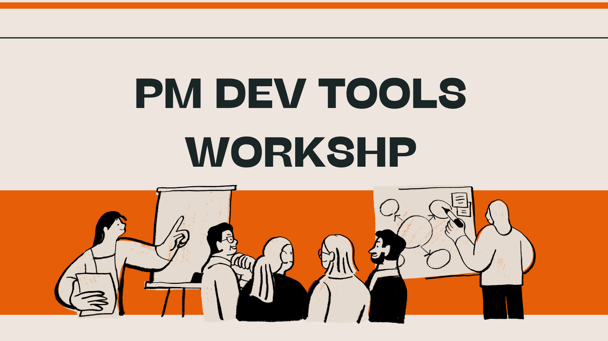

# PM Dev Tools Workshop



## What This Workshop Is

This workshop teaches Product Managers how to work directly inside a codebase — using the same tools engineers use every day.

You will not become a software engineer. You will become a PM who can **run a live app, direct code changes in plain English, read diffs, and ship changes through a Pull Request** — without writing a single line of code manually.

By the end, you will have gone from zero to completing a full development cycle: clone a repo → create a branch → run the app → modify the UI with Claude Code → commit → push → open a Pull Request.

---

## The Story of This Workshop

Every module builds directly on the last. Here is the journey:

```
GitHub Account       GitHub Desktop      VS Code + Claude    Branch              Make Changes        Push + PR
(your identity)  →   (your local tool) → (your workspace)  → (your workspace)  → (your edit)      → (your PR)
Module 01            Module 01           Module 02           Module 03           Module 04           Module 05
```

**Module 01** — You start with nothing. You create a GitHub account — your identity in the developer world — and install GitHub Desktop so you can clone a real repository to your machine.

**Module 02** — The repo is on your machine but you can't do anything with it yet. You install Node.js and VS Code, then connect Claude Code to your account. Now you have an AI agent running inside your project.

**Module 03** — Before touching any code, you learn the single most important habit in software development: always work on a branch. You create and publish your own branch — an isolated copy of the project where your changes can't break anything.

**Module 04** — With your branch ready, you open the project in VS Code, use Claude Code to run the app, and view it live in your browser. Then you give Claude a plain-English instruction to modify the UI and watch it propose the change, ask for permission, and write it — in real time.

**Module 05** — Your change is sitting on your machine. You push it to GitHub, write a proper commit message and PR description, and open a Pull Request. You learn how the review and merge cycle works — and how to write PRs that get approved fast.

---

## Prerequisites

| Requirement | Details |
|---|---|
| **Computer** | Mac or Windows — both are supported |
| **Claude Subscription** | A paid Claude.ai plan (Pro or above) is required for Claude Code |
| **Time** | Allow approximately 2–3 hours to complete all five modules |
| **Prior coding experience** | None required |

---

## Curriculum

### Module 01 · Getting Started with GitHub

Your starting point. You create your GitHub identity and download the repo that you will work in for the rest of the workshop.

| Lesson | What You Will Do |
|---|---|
| [Lesson 01 · Creating Your GitHub Account](./module-01-getting-started-with-github/lesson-01-creating-your-github-account.md) | Sign up for GitHub and understand what it is and why PMs need it |
| [Lesson 02 · Setting Up GitHub Desktop](./module-01-getting-started-with-github/lesson-02-setting-up-github-desktop.md) | Install GitHub Desktop, sign in, and clone the workshop repository to your machine |

---

### Module 02 · Installing VS Code and Claude Code

You now have a repo on your machine but no way to open or run it. This module gives you the two tools that turn your machine into a working AI-powered development environment.

| Lesson | What You Will Do |
|---|---|
| [Lesson 01 · Installing Node.js and VS Code](./module-02-installing-vscode-and-claude-code/lesson-01-installation.md) | Install the JavaScript runtime and the code editor you will use throughout the workshop |
| [Lesson 02 · Setting Up Claude Code](./module-02-installing-vscode-and-claude-code/lesson-02-setting-up-claude.md) | Install Claude Code, authenticate it with your Claude account, and run it inside VS Code |

---

### Module 03 · Creating a Branch

Before making any change to a codebase, you need your own workspace. A branch keeps your work isolated from the main project until it is reviewed and approved. This is the habit that separates safe, collaborative development from chaos.

| Lesson | What You Will Do |
|---|---|
| [Lesson 01 · Creating a Branch](./module-03-creating-branches/lesson-01-creating-a-branch.md) | Create a properly named branch in GitHub Desktop and publish it to GitHub |

---

### Module 04 · Making Changes in Your Cloned Repo

Your branch is ready. Now you will open the project in VS Code, start the app locally using Claude Code, view it in your browser, and direct Claude to make a real UI change — all without touching the code yourself.

| Lesson | What You Will Do |
|---|---|
| [Lesson 01 · Running and Editing with Claude Code](./module-04-making-changes-in-cloned-repo/lesson-01-running-and-editing-with-claude.md) | Run the client app at localhost, then prompt Claude to add two new cards to the Course Curriculum section |

---

### Module 05 · Branching and Pull Requests

Your change is live on your machine. This final module covers the last step: pushing your work to GitHub, writing a clear PR, and understanding the review and merge cycle that every change at every tech company goes through.

| Lesson | What You Will Do |
|---|---|
| [Lesson 01 · Pushing Changes and Creating a Pull Request](./module-05-branching-and-pull-requests/lesson-01-creating-a-pull-request.md) | Commit your changes, push to GitHub, and open a Pull Request with a proper title and description |

---

## Start Here

If you are starting fresh, begin at the first lesson:

**[→ Module 01, Lesson 01: Creating Your GitHub Account](./module-01-getting-started-with-github/lesson-01-creating-your-github-account.md)**

---

## Quick Reference — The Full Flow

```
1. Create GitHub account              Module 01 · Lesson 01
2. Install GitHub Desktop + clone     Module 01 · Lesson 02
3. Install Node.js + VS Code          Module 02 · Lesson 01
4. Install + auth Claude Code         Module 02 · Lesson 02
5. Create a branch                    Module 03 · Lesson 01
6. Run app + make UI change           Module 04 · Lesson 01
7. Commit + Push + Pull Request       Module 05 · Lesson 01
```
