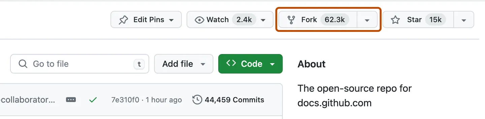

# Module 01 · Getting Started with GitHub

## What is GitHub?

GitHub is the world's largest platform for hosting and collaborating on code. At its core, it uses **Git** — a version control system that tracks every change ever made to a file, by every person, at every point in time.

Think of it like **Google Drive for code**, but with superpowers:

| Google Drive | GitHub |
|---|---|
| Stores files | Stores code + full change history |
| See who edited last | See every line changed, by whom, and why |
| Share a link | Fork, contribute, submit Pull Requests |
| No rollback | Revert to any version at any point in time |

GitHub is where open source software lives. Over **100 million developers** use it to build everything from personal projects to the infrastructure powering the internet.

### Why you need it as a PM

- Read and navigate codebases your team works in
- Review Pull Requests and understand what's actually shipping
- Fork repos, run demos, and contribute to open source projects
- Collaborate with engineers using the same tools they use daily

---

## Phase 1 · Creating a GitHub Account

> You need a GitHub account to fork repos, submit Pull Requests, and earn your open source contributor badge.

### Steps

**1. Go to [https://github.com](https://github.com)**


---

**2. Click the "Sign Up" button in the top right corner**


---

**3. Click "Continue with Google"**


---

**4. Connect with your Gmail account**

Follow the setup prompts — it takes less than 2 minutes.


---

> ✅ **You're done!** You now have a GitHub account. Welcome to the world's largest developer community — over 100 million developers call this home.

---

## Phase 2 · Forking a Repository

Forking means creating your own personal copy of someone else's repository. Your fork lives in your GitHub account — you can freely edit it without affecting the original project.

> **Why fork?** It's how you contribute to open source, experiment with someone else's code, or start from a template without touching the original.

### Fork the Workshop Repository

We'll practice by forking the AI Community Site repo.

**1. Go to the repository**

Open: [https://github.com/sachin0034-tech/ai-community-site](https://github.com/sachin0034-tech/ai-community-site)

---

**2. Click the "Fork" button in the top-right corner**

You'll see it next to the Star and Watch buttons at the top of the page.



---

**3. Configure your fork**

A dialog will appear asking where to fork it:

- **Owner** — select your GitHub username (not an organization)
- **Repository name** — keep it as-is, or rename it
- Leave "Copy the `main` branch only" checked

Then click **"Create fork"**.

---

**4. Wait for GitHub to create your fork**

It takes a few seconds. You'll be redirected to your own copy at:

```
https://github.com/<your-username>/ai-community-site
```

---

> ✅ **Fork complete!** You now have your own copy of the repo. Any changes you make here won't affect the original — and later you can submit a Pull Request to propose your changes back.

### Fork vs. Clone — What's the difference?

| | Fork | Clone |
|---|---|---|
| **Where it lives** | On GitHub (your account) | On your local machine |
| **Connected to original?** | Yes — can pull upstream updates | Only if you set a remote |
| **Use case** | Contribute to someone else's repo | Work locally on any repo |

> In practice you do **both**: fork on GitHub, then clone your fork to your machine.

---

## What You Learned in This Lesson

| Concept | What It Means |
|---|---|
| **GitHub** | A platform that stores code and tracks every change ever made — by anyone, at any time |
| **Git** | The underlying system that powers GitHub — it records the full history of a project |
| **GitHub Account** | Your identity on GitHub — required to fork repos, contribute code, and open Pull Requests |
| **Fork** | Your personal copy of someone else's repo — lets you experiment or contribute without touching the original |
| **Why PMs need it** | You can read what's actually shipping, review diffs, and collaborate using the same tools engineers use |

---

## Next Lesson

You have an account — now you need the desktop tool that makes working with GitHub fast and visual.

**[→ Lesson 02: Setting Up GitHub Desktop](./lesson-02-setting-up-github-desktop.md)**
