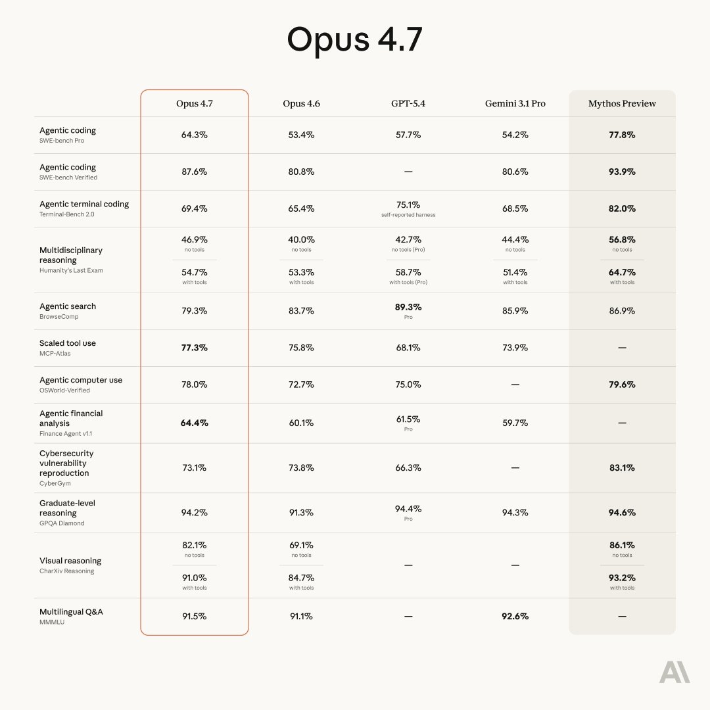
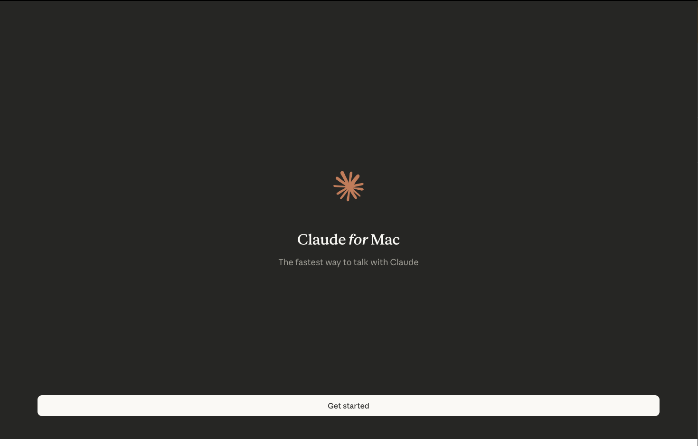
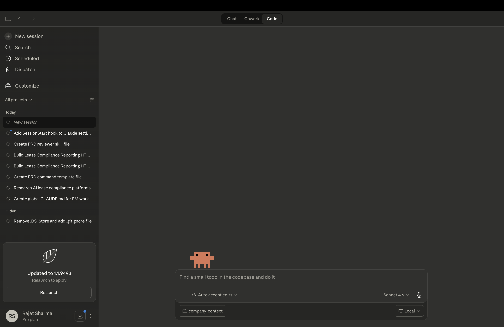
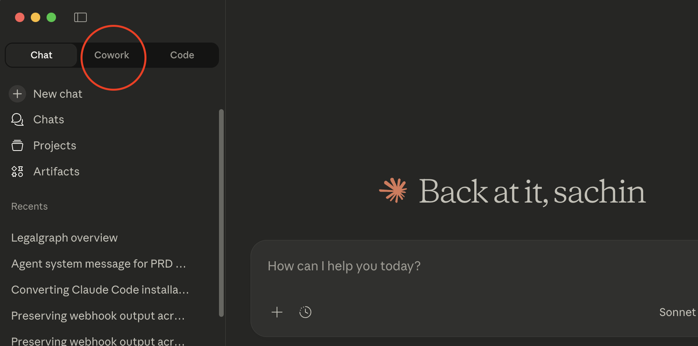

# Lesson 1.0 — Installation & Claude Overview

## Overview

In this lesson you will learn what Claude is, understand its core products and models, and set up everything needed to use **Claude Code** for the rest of the course.

By the end of this module you will:

- Understand what Claude is and how Anthropic positions it
- Know the four Claude products: Chat, Code, Co-work, and Design
- Understand the Claude model tiers and when to use each
- Install the Claude Desktop app 

---

## What is Claude?

**Claude** is Anthropic's AI assistant built to be helpful, harmless, and honest. Unlike generic chatbots, Claude is designed for real knowledge work: reasoning through complex problems, writing and editing long-form content, generating and reviewing code, and acting as a thinking partner across disciplines.

Anthropic's core differentiator is **safety-first AI**. Claude is trained with **Constitutional AI (CAI)** a technique that teaches the model to be reliable, transparent, and aligned with human values, not just capable.

### Why Claude for Product Management?

| Capability | PM Use Case |
|---|---|
| Long-context reasoning | Read full PRDs, research docs, and transcripts |
| Structured output | Generate tables, specs, and prioritization frameworks |
| Code fluency | Review technical specs, write SQL, scaffold prototypes |
| Iterative thinking | Refine strategies, stress-test assumptions, draft narratives |

---

## Claude Four Core Products

Claude is available across four distinct surfaces, each designed for a different type of work:

### Chat
The standard conversational interface at `claude.ai`. Best for Q&A, writing assistance, research synthesis, and one-off tasks. No file system access — purely dialogue-based.

### Code
An **agentic coding environment** where Claude can read and write files, run terminal commands, manage full projects, and execute multi-step workflows autonomously. This is what you will use throughout this course.

### Co-work
A collaborative workspace where Claude works **alongside you** on documents, structured tasks, and iterative workflows — think of it as a shared editor with an AI partner.

### Design
Claude's visual and creative layer for UI/UX mockups, design feedback, layout suggestions, and visual asset generation.

> **For this course you will be using Claude Code** — the most powerful surface for product management workflows involving documents, structured files, and automation.

---

## Claude Models

Anthropic offers three model tiers. Each trades off speed against reasoning depth:

| Model | Speed | Intelligence | Best For |
|---|---|---|---|
| **Claude Haiku 4.5** | Fastest | Good | Quick tasks, high-volume work, real-time apps |
| **Claude Sonnet 4.6** | Balanced | High | Most everyday work — recommended default |
| **Claude Opus 4.7** | Slower | Highest | Deep reasoning, complex analysis, long research |

### Which model should you use?

- **Day-to-day PM work** → Sonnet 4.6 (fast + smart enough for strategy)
- **Deep competitive research or complex PRDs** → Opus 4.7
- **Quick lookups or automations** → Haiku 4.5

**[Click Here to Read More →](https://platform.claude.com/docs/en/about-claude/models/overview)**

> Claude Code defaults to **Sonnet 4.6**, which is the right balance for this course.

---

## Setting Up Claude Code

### Before You Begin

- **Platform:** Claude Code is available on **macOS and Windows** via the Claude Desktop app.
- **Subscription:** You need a **Claude Pro** plan to use Claude Code. Confirm your account is on a Pro plan before starting.

---

### Step 1: Open the Claude Download Page

Go to `https://claude.ai/download` in your browser.

- **Mac** → Click **Download for Mac** to get the macOS `.dmg` installer
- **Windows** → Click **Download for Windows** to get the `.exe` installer

---

### Step 2: Install and Sign In

**Mac**

1. Open the downloaded `.dmg` file
2. Drag the Claude app into your **Applications** folder
3. Open Claude from Applications or Spotlight (`Cmd + Space`, type **Claude**)
4. **Sign up or log in** with your Anthropic account (create one if needed)

**Windows**

1. Run the downloaded `.exe` installer and follow the setup prompts
2. Open Claude from the **Start menu** or the taskbar shortcut created during installation
3. **Sign up or log in** with your Anthropic account (create one if needed)

---

### Step 3: Open Claude Code

After signing in (Mac or Windows):

1. In the left sidebar, **click Code** (next to Chat)

   

2. You will see the **Claude Code workspace view**, where you can choose or create the working folder Claude will use for this course

---

### Step 4: Choose Your Working Folder

1. In the Claude Code workspace, click **Open Folder** (or equivalent prompt)
2. Navigate to the folder you want Claude to use as its working directory for this course
3. Confirm access — Claude will ask for permission to read and write files in that folder
4. Once confirmed, you are ready to go

---

### Step 5: Verify the Setup

Run a quick test to confirm everything works:

1. In the Claude Code input, type: `What files are in this folder?`
2. Claude should list the contents of your working directory
3. If it does — setup is complete

---

## Summary

| What You Learned | Key Takeaway |
|---|---|
| What Claude is | Safety-first AI assistant by Anthropic, built for real knowledge work |
| Four Claude products | Chat, Code, Co-work, Design — each for a different workflow |
| Claude model tiers | Haiku (fast) → Sonnet (balanced) → Opus (deep) |
| Setup | Download → Install → Sign in → Open Code → Set folder → Verify |

You are now ready to practice real product management workflows with Claude Code.
