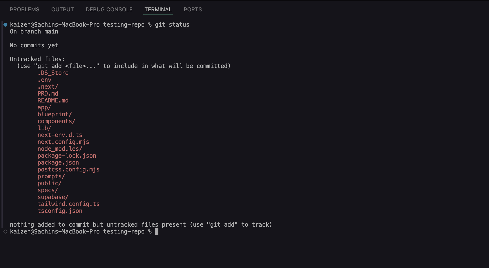

# Building Your First Real Full-Stack Application with Claude Code


> **Lab Level:** Beginner-Friendly | **Time:** 2–3 Hours | **What You'll Build:** A real, working web application from scratch — with AI doing most of the heavy lifting.

---

## Before We Start — Let's Have an Honest Conversation

If you've been following along with this cohort, you've already done some impressive things. You've built automated workflows in n8n. You've created prototypes with Claude. You've connected tools and seen how AI can act like an agent.

But here's the thing — every time someone asks, *"Can I actually build a real product with this?"* — the honest answer has been: *"Not yet. This is still a prototype."*

Today that changes.

What you're about to build is not a workflow. It's not a demo. It's a **real application** — one with a proper frontend that users can open in a browser, a real database that stores data, a real authentication system where people can sign up and log in, and real AI features powered by Azure AI Foundry.

And the most exciting part? You're going to use Claude Code to build almost all of it. You'll write very little code by hand. Instead, you'll *direct* Claude — giving it your vision, your plan, your requirements — and watch it build.

This lab is going to be an experience. Some steps will feel unfamiliar. Some terms might be new. But we've designed every step so you can get through it even if you've never written a single line of code before. Let's go.

---

## What You'll Learn

By the end of this lab, you will understand:

- How to get a project from GitHub onto your own computer
- What a design system is and why developers create one before writing any code
- How to use Claude Code's skill system to set up a project structure automatically
- What Next.js is and why it's one of the most popular tools for building web apps
- How to connect your app to a real cloud database (Supabase)
- How to let Claude plan your entire application for you using `/plan`
- What a PRD is and why it matters before you build anything
- What specs are and how they turn your vision into structured instructions
- How to build your entire app phase by phase using Claude's implementation skill
- How to integrate Azure AI Foundry so your app has real AI capabilities
- How to verify your app is working — live, in the browser

---

## What You Need Before Starting

Before you begin, make sure you have these accounts and tools set up:

- **GitHub account** — this is where code lives on the internet. Free at github.com
- **Supabase account** — your cloud database. Free at supabase.com
- **Claude Code installed** — the AI coding assistant we'll use throughout. You set this up in Week 0
- **VS Code installed** — your code editor. Also from Week 0
- **Node.js installed** — the engine that runs JavaScript on your computer. If you haven't installed it, go to nodejs.org, download the LTS version, and click install

If you're missing any of these, go back to the Week 0 setup guides before continuing.

---

## Phase 1 — Getting the Code

### Step 1: Understanding GitHub (and Why We Start Here)

Before we touch any AI tool, we need to talk about **GitHub**.

Think of GitHub like Google Drive, but for code. Instead of storing documents, it stores software projects. These projects are called **repositories** — or "repos" for short.

When an instructor creates a starter project for you, they put it on GitHub. Your job is to:
1. Make your own personal copy of it — this is called **forking**
2. Download that copy to your computer — this is called **cloning**

Why two steps? Because GitHub is a shared platform. If everyone edited the same project directly, it would be chaos. By forking, you get your own version that only you control. Nobody else can accidentally overwrite your work, and you can't break the original.

### Step 2: Fork the Repo

Go to this link in your browser:

**[https://github.com/sachin0034-tech/week-5-claudeapp](https://github.com/sachin0034-tech/week-5-claudeapp)**

1. In the top-right corner of the page, click the **Fork** button


2. GitHub will ask where to fork it — select your own account
3. Click **Create Fork**


You now have your own copy of the project on GitHub under your account.

### Step 3: Copy the Repo URL

1. On your newly forked repo page, click the green **Code** button
2. Make sure **HTTPS** is selected
3. Copy the URL shown — it will look like `https://github.com/YOUR-USERNAME/week-5-claudeapp.git`


### Step 4: Clone the Repo to Your Computer

Now we download the project to your machine.

**Open your terminal:**
- **Mac:** Press `Cmd + Space`, type `Terminal`, press Enter. Or in VS Code press `` Ctrl + ` `` (the backtick key, top-left of your keyboard)
- **Windows:** Press `Win + X` and click **Terminal**. Or in VS Code press `` Ctrl + ` ``

In the terminal, type this command (paste your URL where it says `<your repo URL>`):

```
git clone <your repo URL>
```

Press Enter. You'll see files downloading. When it finishes, the project folder is on your computer.


### Step 5: Open the Project in VS Code

1. Open **VS Code**
2. Click **File** in the top menu
3. Click **Open Folder**
4. Find the folder that was just cloned (it will be called `week-5-claudeapp`)
5. Click **Open**


### Step 6: Enable Autosave

This is a small but important step — autosave makes sure Claude always reads your latest changes.

1. In VS Code, click **File** in the top menu
2. Click **Auto Save** to enable it (a checkmark will appear next to it)


### Step 7: Understand the Folder Structure

With the project open, look at the file panel on the left side of VS Code. Here's what every folder and file does:

```
week-5-claudeapp/
│
├── PRD.md                          # The product vision — what we're building and why
├── README.md                       # This guide
│
├── prompts/
│   └── azure_integration.md        # Instructions for connecting Azure AI Foundry
│
└── .claude/                        # Claude Code configuration (not app source code)
    ├── CLAUDE.md                   # Claude's briefing doc for this project
    ├── settings.local.json         # Local Claude Code permission settings
    │
    ├── knowledge/                  # Reference documents Claude reads before coding
    │   ├── design-system.md        # Colors, fonts, spacing, and component styles
    │   └── azure-endpoint.md       # Azure AI client setup details
    │
    └── skills/                     # Custom Claude Code automation scripts
        ├── rules/rules.md          # Tech stack rules and hard constraints
        ├── implementation/         # Step-by-step build instructions
        ├── create-spec/            # Templates for generating feature specs
        ├── frontend-setup/         # Script for scaffolding the frontend
        └── blueprint/              # High-level project blueprint
```

The most important thing to notice: everything under `.claude/` is **instructions for Claude**, not your app's actual code. The real app code will be created by Claude in the next steps. Think of `.claude/` as the briefing room where Claude gets its orders before going to work.

---

## The Design System — Your App's Visual Identity


Before any code gets written, good development teams create a **design system**. This is a document that defines the visual language of the app: what colors to use, what fonts, what spacing, what buttons look like, how cards are styled.

Why does this matter? Because without it, Claude might make the header blue, the buttons red, and the sidebar purple — and your app will look like a mess. A design system is the single source of truth that keeps everything visually consistent.

This project already has a design system defined. Open `.claude/knowledge/design-system.md` and take a look — you'll see decisions like primary colors, typography choices, and component styles already documented. Claude will read this file before writing any UI code, so your app will look polished and consistent from the start.

**Want to create your own design system?**

If you have a specific visual vision for your app, open `.claude/knowledge/design-system.md` and update it. Here's what to define:

- **Brand colors** — a primary color (buttons, links, highlights), a secondary color, and neutral grays for backgrounds and text
- **Typography** — one font for headings, one for body text. Google Fonts is free
- **Spacing** — how much padding goes around buttons, cards, and page sections
- **Component styles** — what buttons look like, what input fields look like, what the navigation bar looks like

You can even describe your vision in plain English to Claude and ask it to write the design system document for you.


### > **Note:** If you need to create your own design system, see this guide — [Click Here](./create-design-system.md)

---

## Phase 2 — Setting Up Your Environment

### Step 1: Open a New Terminal in VS Code

1. In VS Code, click **Terminal** in the top menu
2. Click **New Terminal**

A panel opens at the bottom of VS Code with a blinking cursor.


### Step 2: Run Claude Code

In the terminal, type:

```
claude
```

Press Enter. Claude Code starts up and gives you a prompt to type in.


### Step 3: Brief Claude on the Project

Every project has a `CLAUDE.md` file — an onboarding document that tells Claude what this project is, what skills it can use, and how to behave. The first thing we always do is make Claude read it.

Run this prompt:

```
Read @CLAUDE.md and confirm you understand the session flow and all available skills.
```

**What is `@` in Claude?** The `@` symbol is how you point Claude to a specific file. When you type `@CLAUDE.md`, Claude opens and reads that exact file. When you type `@PRD.md`, it reads your product requirements document. This is how you give Claude context without copy-pasting file contents manually — you just reference them by name.

After running this prompt, Claude will summarize what it found. It may ask you to do some setup tasks or provide credentials — for now, just let it finish reading and confirming it understands the folder structure. We'll handle credentials in the next steps.


### Step 4: Set Up the Frontend Folder Structure

Your project has the skills and configuration, but no actual app code yet. Now we'll use Claude's `frontend-setup` skill to create the entire Next.js frontend structure automatically.

Run this prompt:

```
use @.claude/skills/frontend-setup/ and setup the project structure from end to end
```

Watch the terminal — Claude will create all the folders and files needed for a production-ready Next.js application.


> **Note:** Claude will ask for permission to create files and run commands — just click **Allow** each time.

Once done, your project will look like this:

```
WEEK-5-CLAUDEAPP/
│
├── .claude/
├── .next/
│
├── app/
│   ├── api/
│   ├── dashboard/
│   │   └── chat/
│   ├── login/
│   │   └── page.tsx
│   ├── signup/
│   ├── globals.css
│   ├── layout.tsx
│   └── page.tsx
│
├── components/
├── lib/
│
├── prompts/
│   └── azure_integration.md
│
├── .env.local.example
├── next.config.ts
├── package.json
├── postcss.config.mjs
├── PRD.md
├── README.md
├── tailwind.config.ts
└── tsconfig.json
```

**What is Next.js?** Next.js is a framework for building web applications. Think of a framework like a fully-equipped restaurant kitchen — the stoves, refrigerators, and prep tables are already installed. You don't build the kitchen from scratch; you just start cooking. Next.js is used by companies like Netflix, TikTok, and Airbnb. It handles both what users see in the browser and how data moves between your app and database — all in one project.

When Claude is done, your project will have a complete folder structure ready for real code to be added.

### Step 5: Set Up Your Environment Variables

Now look at your project files — you'll see a file called `.env.example` or `.env.local.example`.

**Rename this file to `.env`**

1. Right-click the file in VS Code's file explorer
2. Click **Rename**
3. Type `.env` and press Enter


This file stores your app's **secret keys** — private credentials that connect your app to external services. Think of it like a keychain: each key unlocks a specific door (your database, your AI service, etc.).

### Step 6: Get Your Supabase Credentials

Now fill in the `.env` file with your real Supabase credentials.

**Get the Project URL:**
1. Log into Supabase at supabase.com and open your project
2. On the project overview page you will see the **Project URL** — copy it and paste as `NEXT_PUBLIC_SUPABASE_URL`

**Get the API Keys:**
1. In the left sidebar, click **Project Settings** → **API**
2. Scroll down to the **Legacy API Keys** section
3. Copy the **anon / public** key → paste as `NEXT_PUBLIC_SUPABASE_ANON_KEY`
4. Copy the **service_role** secret key → paste as `SUPABASE_SERVICE_ROLE_KEY`


---

## Phase 3 — Planning with AI


This is where Claude goes from being a code-writer to being your **co-founder**.

### What is `/plan`?

Type `/plan` in Claude to activate **Planning Mode**.

In planning mode, Claude shifts its focus entirely to *thinking and designing* before touching any code. It reads your requirements, figures out the best architecture, designs the database structure, and documents everything in a blueprint file — before a single line of app code is written.

Why does this matter? Because jumping straight into code without a plan is like starting construction without blueprints. You might get three floors up before realizing the foundation is in the wrong place. Planning first saves you from rebuilding everything later.

### Step 1: Add Your PRD

The project already includes a `PRD.md` file with the product requirements for the app we're building. Open it and read through it so you understand what we're creating.

If you want to build a different app, replace the content of `PRD.md` with your own requirements. Not sure how to write one? Go to ChatGPT or Claude at claude.ai, describe your app idea, and ask: *"Write a product requirements document for this app idea: [your idea]."* Paste the output into `PRD.md`.

### Step 2: Run the Planning Prompt

First type `/plan` and then add my full prompt:/pla

```
/plan use @PRD.md I want to build a legal contract review app. The app has signup and login using a custom users table in Supabase. After login the user lands on a dashboard with three panels — a left sidebar showing chat history and a new chat button, a center panel with the chat interface and file attachment button, and a right panel showing execution steps like Cowork. The user can upload a PDF or DOCX contract, type a question, and the app sends the contract text and the question to an Azure AI agent and shows the response in the chat. Chat sessions and messages are saved in Supabase. After every assistant response a feedback form appears and the rating and comment are saved in Supabase. Create a detailed plan and save it as /blueprint/app-plan.md.
```


Claude will think through your entire application and produce a comprehensive blueprint. This takes a minute or two — it's doing real architectural thinking.

When it's done, open `blueprint/app-plan.md` and read through it. You'll see the database schema, feature breakdown, and build order. **Actually read this** — it's Claude's interpretation of your vision. If anything looks wrong, tell Claude now before any code is written.

### Step 3: Create the Database in Supabase

Now we take the database schema from the blueprint and create the actual tables.

1. Open `blueprint/app-plan.md`
2. Find the **Database Schema** section — it will contain SQL code starting with `CREATE TABLE`
3. Copy all of that SQL code


4. Go to your Supabase project in the browser
5. In the left sidebar, click **SQL Editor**
6. Paste the SQL into the editor
7. Click **Run** (or press `Ctrl+Enter`)


You'll see success messages as each table is created. To verify, click **Table Editor** in the Supabase sidebar — you should see all your tables listed there.

Your database is now live and ready to store real data.

---

## Phase 4 — Writing Specs

### What Are Specs?

If a PRD answers *what* you're building, then **specs** answer *how* each individual feature works.

A spec is a detailed document for one feature. It describes what the user sees and does, what happens when they interact with it, what data gets saved or retrieved, what error cases to handle, and what success looks like.

Think of specs like instructions for a contractor. The PRD says "we need a kitchen." The spec says "36-inch sink under the window, connected to hot and cold water, with a garbage disposal and a sprayer attachment." Without specs, Claude might build the feature — just not quite the way you imagined.

### Step 1: Generate Specs with Claude

Run this prompt:

```
use @.claude/skills/create-spec/ Read /blueprint/app-plan.md and generate all feature spec files based on that plan.
```


Claude reads your blueprint and generates a spec file for each feature. These will appear in your `/specs/` folder. Open a few of them and read through — these are the detailed instructions Claude will follow when it starts building.

If anything in a spec doesn't match your vision, edit it before moving to the next phase. Specs are your voice. They're the contract between what you imagined and what gets built.


---

## Phase 5 — Building the App

You've planned the architecture. You've created the specs. You have a real database waiting for data. Now Claude builds everything.

### Step 1: Run the Implementation

Run this prompt:

```
Use @.claude/skills/implementation/ Read all files in /specs and blueprint/app-plan.md build the complete app phase by phase. Install all dependencies and run the app when done.
```

Here's what each part does:

- **`Use @.claude/skills/implementation/`** — tells Claude to follow the implementation skill rules, which define exactly how to build this type of app correctly
- **`Read all files in /specs`** — Claude reads every spec before writing any code
- **`and blueprint/app-plan.md`** — Claude cross-references the master plan throughout the build
- **`build the complete app phase by phase`** — Claude builds in the correct order (authentication first, then dashboard, then features)
- **`Install all dependencies and run the app when done`** — Claude handles all package installation and starts the development server

Watch the terminal as Claude works. You'll see it creating components, writing API routes, building the authentication flow, and connecting everything to your Supabase database. You may see some errors appear and disappear — that's normal. Claude diagnoses and fixes issues as it goes.

Build time depends on your app's complexity. For this application, expect 15–45 minutes.

### Step 2: Open Your App

When Claude finishes, it will show you a URL like:

```
✓ Local:   http://localhost:3000
```

If you don't see this automatically, open a **new terminal** in VS Code (`Terminal > New Terminal`) and run:

```
npm run dev
```

Then copy the localhost URL and paste it into Chrome.


### Step 3: Sign Up and Verify

1. Click **Sign Up** and create a new account with your email and password


2. Go to your Supabase project → **Table Editor** → open the **users** table
3. You should see a row with your email address — this confirms authentication is working end-to-end


4. Go back to your app and **Log In** with the account you just created
5. You'll be redirected to the main chat interface


The frontend is now complete.

> **Note:** All chat session messages and user feedback are saved in Supabase automatically. You can verify this in the Table Editor — check the `messages` and `feedback` tables after your first conversation.

---

## Phase 6 — Integrating Azure AI Foundry

The app is running, but the AI brain isn't connected yet. Right now if you upload a contract and ask a question, nothing happens. In this phase we connect Azure AI Foundry so the app can actually think.

### How This Works

The project includes a file called `prompts/azure_integration.md`. This file contains the exact instructions Claude needs to wire Azure AI Foundry into the frontend — including which files to modify, how to call the Azure endpoint, and how to pass the contract content and user question to the AI.

**Where did this file come from?** It was created by going to Azure AI Foundry, finding the **Sample Code** section for the deployed model, copying the code snippet, and turning it into a prompt that Claude can follow. This is a pattern worth remembering — whenever you need to integrate a new service, find its sample code, and use it as context for Claude.


### Step 1: Run the Azure Integration Prompt

Run this prompt:

```
Run @prompts/azure_integration.md and integrate the azure with my frontend
```

Claude will read the integration instructions and modify your app's code to connect to Azure AI Foundry.


### Step 2: Add Your Azure Credentials to the .env File

After Claude finishes the integration, open your `.env` file. You'll need to add two new values:

```
AZURE_AI_ENDPOINT=your_azure_endpoint_url_here
AZURE_AI_API_KEY=your_azure_api_key_here
```

To find these values:
1. Go to your Azure AI Foundry project
2. Navigate to your deployed model
3. Find the Agent Click on Get Code copy**Endpoint** URL and copy it


4. Find the **API Key** and copy it


1. Paste both into your `.env` file

### Step 3: Test the Full Flow

1. Close all running terminals and restart the app (`npm run dev` in a new terminal)
2. Open `http://localhost:3000` in Chrome
3. Log in to your account
4. Upload a PDF or DOCX contract using the file attachment button
5. Type a question about the contract in the chat input
6. Press Enter

You should now see a real AI response analyzing your contract — powered by Azure AI Foundry, stored in Supabase, displayed in your UI.

Your full-stack AI application is live.


> **Getting an error?** Don't worry — just copy the full error message from the browser or terminal and paste it into Claude: *"I'm seeing this error, fix it for me."* Claude will diagnose and fix it for you.

All chat session messages and user feedback are saved in Supabase automatically.


---

## Phase 7 — Pushing Your Code to GitHub

Your app is working. Now let's save your work to GitHub so it's backed up and shareable.

### Why Push to GitHub?

Right now your code only lives on your computer. If you lose your laptop, you lose everything. Pushing to GitHub means your work is safely stored in the cloud. It also means you can share your project with others, collaborate with teammates, and deploy it to a live server later.

### Step 1: Check What Has Changed

Open a terminal in VS Code (`Terminal > New Terminal`) and run:

```
git status
```

You'll see a list of files that have been added or modified since you cloned the repo. These are all the files Claude created for you.



### Step 2: Make Sure Your .env File Is Protected

Before adding any files, confirm that your `.env` file is listed in `.gitignore`. This file contains your secret API keys — **it must never be pushed to GitHub**.

Run:

```
cat .gitignore
```

Look for a line that says `.env` or `.env.local`. If it's there, you're safe to continue. If it's not, run this command first to add it:

```
echo ".env" >> .gitignore
```

### Step 3: Stage All Your Changes

Now add all your new and modified files to the staging area — this tells Git which files you want to include in your commit:

```
git add .
```

Run `git status` again and you'll see the files are now highlighted in green, meaning they're staged and ready to commit.

### Step 4: Commit Your Changes

A commit is a snapshot of your project at this moment in time. Give it a clear message describing what you built:

```
git commit -m "Build full-stack AI contract review app with Supabase and Azure AI"
```

You'll see a summary of how many files changed. This snapshot is now saved in your local Git history.

### Step 5: Push to GitHub

Now send your committed changes up to GitHub:

```
git push origin main
```

If your default branch is called `master` instead of `main`, use:

```
git push origin master
```

You'll see output showing the files being transferred. When it finishes, go to your forked repo on GitHub in the browser — refresh the page and you'll see all your new files there.


> **Getting an authentication error?** GitHub no longer accepts passwords over HTTPS. If you're prompted for a password and get rejected, you need a **Personal Access Token (PAT)**. Go to GitHub → Settings → Developer Settings → Personal Access Tokens → Generate New Token. Give it `repo` scope, copy it, and use it as your password when prompted.

### Quick Reference — Git Commands

| What | Command |
|---|---|
| See what changed | `git status` |
| Stage all changes | `git add .` |
| Commit with a message | `git commit -m "your message"` |
| Push to GitHub | `git push origin main` |
| Pull latest changes | `git pull origin main` |

---

## What You Just Built — And Why It Matters

Let's zoom out for a moment.

You started this lab with an empty folder. You ended with a working, full-stack web application that has:

- **User authentication** — sign up, log in, session management
- **A database** — real tables in Supabase storing users, chat sessions, messages, and feedback
- **A complete UI** — a three-panel chat interface with file upload
- **AI capabilities** — contract analysis powered by Azure AI Foundry
- **Feedback system** — users can rate and comment on every AI response

Here's what *you* did:
- You provided the **vision** through the PRD
- You made **product decisions** about features and flows
- You **directed** Claude at every phase
- You **verified** the output before moving forward

That is the role of an AI-enabled product builder. You're not writing code — you're directing an AI system that writes code on your behalf. The better you get at giving clear direction through PRDs, specs, and precise prompts, the better and faster your results will be.

---

## Quick Reference — All Commands in This Lab

| Step | Command |
|---|---|
| Clone the repo | `git clone <your repo URL>` |
| Start Claude | `claude` |
| Brief Claude | `Read @CLAUDE.md and confirm you understand the session flow and all available skills.` |
| Set up frontend | `use @.claude/skills/frontend-setup/ and setup the project structure from end to end` |
| Enter planning mode | `/plan` |
| Generate the blueprint | `/plan use @PRD.md I want to build a legal contract review app...` (full prompt above) |
| Generate specs | `use @.claude/skills/create-spec/ Read /blueprint/app-plan.md and generate all feature spec files based on that plan.` |
| Build the app | `Use @.claude/skills/implementation/ Read all files in /specs and blueprint/app-plan.md build the complete app phase by phase. Install all dependencies and run the app when done.` |
| Start dev server manually | `npm run dev` |
| Azure integration | `Run @prompts/azure_integration.md and integrate the azure with my frontend` |
| Check git status | `git status` |
| Stage all changes | `git add .` |
| Commit your work | `git commit -m "your message"` |
| Push to GitHub | `git push origin main` |

---

## Concepts Glossary

**Repository (Repo):** A project stored on GitHub. Contains all code, files, and history for an application.

**Fork:** Your personal copy of someone else's GitHub repository. Changes you make don't affect the original.

**Clone:** Downloading a GitHub repository to your local computer.

**`@` in Claude:** The way you reference a file in Claude Code. `@filename.md` tells Claude to read that specific file for context.

**Next.js:** A JavaScript framework for building full-stack web applications. Used by Netflix, TikTok, Airbnb, and thousands of others.

**Supabase:** A cloud platform providing a PostgreSQL database, user authentication, and file storage — free on the starter plan.

**Environment Variables (.env):** A file storing secret config values your app needs at runtime — API keys, database URLs, etc. Never commit this file to GitHub.

**PRD (Product Requirements Document):** A document describing what an app does, who it's for, and what features it has. Written before any code is created.

**`/plan`:** A Claude Code command that activates Planning Mode — Claude designs the full architecture before writing code.

**Blueprint:** The technical plan Claude generates from your PRD — includes database schema, architecture overview, and phased implementation order.

**Specs (Specifications):** Detailed documents describing exactly how a single feature should work — user flows, data operations, error cases, and success criteria.

**Design System:** A set of visual rules (colors, fonts, spacing, component styles) that keeps your app looking consistent.

**Skills:** Pre-built automation scripts in Claude Code that handle specific tasks — like scaffolding a frontend or generating specs from a blueprint.

**Azure AI Foundry:** Microsoft's platform for deploying and calling large language models. The AI brain that powers the contract analysis in this app.

---

*This lab is part of Cohort 9 — Week 5. For questions and support, reach out in the community Slack.*
