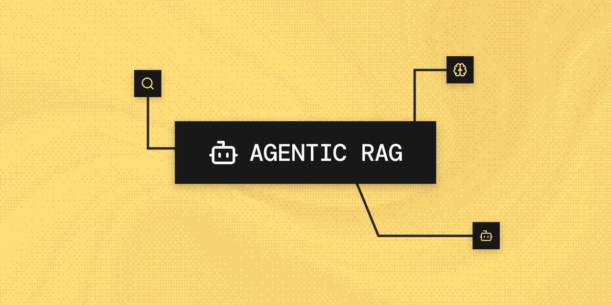

# Lab 1.3: Agentic RAG — When One Retriever Isn't Enough



In Lab 1.2 you built a working RAG pipeline. A user uploads a contract. The system chunks it, embeds it, and stores it. When someone asks a question, it pulls the five most relevant chunks and hands them to an AI that writes an answer.

That works. Until the question gets hard.

Try asking your Lab 1.2 system: *"Is this lease safe to sign?"*

Watch what happens. It retrieves five chunks. Maybe it finds the rent escalation clause. Maybe it finds a notice period. It hands everything to one AI and that AI tries to simultaneously understand the contract, identify the risks, extract the timeline, cross-reference clauses, and write a coherent answer — all in one pass.

The answer comes back. It sounds confident. But it missed the 5-year lock-in buried in clause 7. It didn't notice that the termination penalty is six months of rent. It skipped the auto-renewal clause that kicks in if you don't give 90 days notice.

**This is the core limitation of basic RAG: one retriever, one AI, one chance to get it right.** For simple factual questions — "Who are the parties?" — it works fine. For complex analysis — "What are the risks in this lease?" — it fails quietly.

The fix isn't a better prompt. It's a different architecture.

---

## The Problem with Basic RAG on Lease Contracts

A lease contract is not one document. It's ten overlapping concerns packed into one PDF:

- **Lock-in clauses** — how long are you committed? What happens if you leave early?
- **Termination rights** — can the landlord evict you? Under what conditions?
- **Penalty clauses** — what do you owe if you break the lease?
- **Rent escalation** — when does rent go up, by how much, and is it capped?
- **Notice periods** — when do you need to act, and how far in advance?
- **Security deposit rules** — what's refundable? What triggers a deduction?
- **Renewal terms** — does the lease auto-renew? When must you opt out?
- **Maintenance obligations** — what are you responsible for vs the landlord?

When a basic RAG system retrieves five chunks and dumps them on a single AI, it's asking that AI to be an expert in all eight areas simultaneously. Some clauses get analyzed. Others get ignored. The model doesn't know what it missed — and neither do you.

**Agentic RAG solves this by splitting the job.** Instead of one AI doing everything, you build a team of specialized agents. Each agent has one job and does it well. The retrieval is planned before it happens. The analysis is split between specialists. The final answer is assembled from expert outputs.

---

## What You'll Build

A three-layer agentic system for lease contract analysis:

```
User Question
      ↓
Retrieval Planning Agent
(Understands what to look for)
      ↓
Retrieval Orchestrator Agent
(Searches the vector store, routes findings to specialists)
      ├──→ lease_contract_vector_search (pulls contract clauses)
      ├──→ lease_risk_analysis_agent (flags business and financial risks)
      └──→ lease_obligation_timeline_agent (extracts dates and deadlines)
      ↓
Structured Answer (risk analysis + obligation timeline + summary)
```

Three agents. One vector store. Two specialists. One user who gets a real answer.

By the end of this lab, you will:

- Understand why single-agent RAG breaks on complex documents
- Build a multi-agent retrieval system where each agent has a defined role
- Know how to pass structured data between agents using n8n's expression system
- Have a live lease contract analyzer that separates risk analysis from obligation extraction

---

## Before You Start

✅ **n8n account** — the same one from Lab 1.2. You'll be building new workflows inside it.

✅ **OpenAI API key** — already set up in n8n from Lab 1.1. You won't need to add it again unless you're starting fresh.

✅ **A contract PDF** — use the same sample contract 
. [Download it here](https://pragyaallc-my.sharepoint.com/:b:/g/personal/sachin_parmar_legalgraph_ai/IQDCjXtik46fSrlq-FwTPD7xASjbyEXBKIPCqTLCAloobR0?e=caCgUB) if you don't have it.

---

## Phase 1: Build the Ingestion Pipeline

This pipeline is nearly identical to Lab 1.2 — the difference is that you're ingesting a lease contract, not a vendor agreement. The vector store you build here is what the agentic retrieval system searches in Phase 2.

### Create a new workflow

Log into your n8n account. Click **"Create Workflow"** in the top right to open a blank canvas.

Do not modify your Lab 1.2 workflow. This is a fresh one.


> This workflow runs once per document. Every time someone uploads a new lease, this pipeline fires, processes it, and stores it. The agentic retrieval workflow you build in Phase 2 then searches across everything stored here.

---

### Add the n8n Form trigger

Click **"Add Node"** on the canvas. Search for **"n8n Form"** and select it.

In the **Trigger** dropdown inside the node settings, select **"On new n8n Form event"**.


---

### Configure the form

Inside the Form settings, set the **Form Title** to:

```
Upload Contract
```

Then click **"Add Form Element"**.


In the new element:
- Set the **Label** field to `file0`
- Set the **Element Type** dropdown to **File**


---

### Test the form trigger

Click **"Execute Step"** on the Form node. A new browser tab opens with your upload form.


Click **"Choose File"**, select your lease contract PDF, and click **"Submit"**.


Come back to n8n. The node should show a green checkmark.

> If the node doesn't show a result after you submit the form, make sure you're still in "Execution" mode in n8n — not editing mode.

---

### Add the Simple Vector Store node

Click **"Add Node"**, search for **"Simple Vector Store"**, and select it.


When prompted for an action, choose **"Add Document to Vector Store"**.


Connect it to the Form trigger node.

---

### Create the memory key

Inside the Simple Vector Store settings, find the **Memory Key** field. Click the **(+)** symbol next to it.

n8n will automatically generate a key — something like `vector_store_key`. Leave it as is.


> **Copy this key.** You will paste it into the retrieval workflow in Phase 2. If the keys don't match exactly, the agents will search an empty store and return nothing.

---

### Add the embedding model

Inside the Simple Vector Store node, click **"Embedding"**. Choose **"Embeddings OpenAI"** from the options.


Select your existing OpenAI credential. Select the model `text-embedding-3-small`.


> Whatever embedding model you use to ingest, you must use the same model to retrieve. The vector store is indexed in that model's coordinate system — a different model speaks a different language.

---

### Configure the document loader

Inside the Simple Vector Store node, click **"Document"**.


Select **"Default Data Loader"**.


Configure it with these settings:

- **Data Type** → **Binary**
- **Data Format** → **PDF**
- **Text Splitting** → **Custom**


Once you select Custom, a **Text Splitter** field appears. 


Click it and select **Recursive Character Text Splitter**.


Set **Chunk Overlap** to **100**.


> Lease contracts are dense and clause boundaries are unpredictable. The Recursive Text Splitter respects paragraph structure — it tries to keep clauses intact rather than slicing through them mid-sentence. An overlap of 100 ensures that if a clause straddles two chunks, both chunks carry enough context to be useful. See Lab 1.2 for a full explanation of chunk size and overlap tuning.

---

### Test the full ingestion pipeline

Click **"Execute Workflow"** to run the entire pipeline.


When the form opens, upload your lease contract and submit. Watch each node light up: Form → Vector Store.

If every node shows a green checkmark, your lease document has been processed and stored.


> ✓ If you see an error on the Vector Store node, the most likely cause is a missing or expired OpenAI credential. Check the Embeddings node and confirm the API key is valid.

---

## Phase 2: Build the Agentic Retrieval Pipeline

This is where this lab diverges from Lab 1.2. Instead of one retrieval step and one AI answering, you're building a coordinated team of agents — each with a defined role, a defined input, and a defined output.

Here's what each layer does before you build it:

| Agent | Role | Input | Output |
|---|---|---|---|
| **Retrieval Planning Agent** | Understands the question, identifies which lease clauses to look for, creates a retrieval plan | User's question | Structured retrieval plan (JSON) |
| **Retrieval Agent (Orchestrator)** | Executes the plan — searches the vector store, inspects the results, routes them to the right specialist | Retrieval plan from planner | Combined structured analysis |
| **lease_contract_vector_search** | Searches the vector store for relevant lease clauses | Query from orchestrator | Retrieved text chunks |
| **lease_risk_analysis_agent** | Reads the retrieved clauses and flags business or financial risks | Retrieved clauses | Risk analysis (JSON) |
| **lease_obligation_timeline_agent** | Reads the retrieved clauses and extracts dates, deadlines, and obligations | Retrieved clauses | Timeline analysis (JSON) |

The key insight: **no single agent is doing everything**. The planner doesn't analyze. The orchestrator doesn't answer. The specialists don't retrieve. Each agent is good at one thing, and the system composes their outputs into a complete answer.

---

### Add the Chat Trigger

Click **"Add Node"** on the canvas. Search for **"Chat"** and select the **Triggers** category. Choose **"On a new Chat Event"**.


> This is the entry point for user questions. Every question about the lease comes in through this trigger.

---

### Add the Retrieval Planning Agent

Click **"Add Node"**, search for **"Agent"**, and select the AI Agent node.

Double-click the node header and rename it to **Retrieval Planning Agent**.


Connect it to the Chat Trigger.

Inside the node, click **"Add Option"** and select **System Message**. Paste this exactly:

```
You are a Lease Contract Retrieval Planning Agent.

ROLE:
Your job is to understand the user's lease-related question and convert it into a structured retrieval plan.

TASKS:
1. Understand user intent.
2. Identify lease clauses needed.
3. Break the query into searchable components.
4. Prioritize what clauses to retrieve first.

LEASE CLAUSES:
- termination
- lock_in_period
- notice_period
- penalty
- rent_escalation
- maintenance
- security_deposit
- renewal

RULES:
1. Never answer the user.
2. Never analyze risk.
3. Only create retrieval plans.
4. If query is ambiguous, include clarification.

OUTPUT FORMAT:
Return JSON only.
```


> **Why a planning agent?** Basic RAG skips this step entirely — it just takes the user's raw question and runs a search. The problem is that a question like "Is this lease risky?" is too vague to retrieve anything useful from a vector store. The planning agent translates that vague intent into a precise list of clause types to search for. It separates *understanding the question* from *executing the search* — two jobs that are easier to do well when they're separated.

---

### Add the OpenAI Chat Model to the Retrieval Planning Agent

Inside the Retrieval Planning Agent node, click **"Chat Model"**. Select **"OpenAI Chat Model"**.

Select `gpt-4o-mini` and confirm your OpenAI credential is connected.


---

### Add the Retrieval Agent (Orchestrator)

Click **"Add Node"**, search for **"Agent"**, and select the AI Agent node.

Double-click the node header and rename it to **Retrieval Agent**.

Connect the output of the Retrieval Planning Agent to the input of this node.


Inside the node, find the **Prompt** section. Change the **Source** dropdown to **"Define below"**.

In the **Prompt (User Message)** field, enter this expression:

```
{{ $json.output }}
```


> **Why `{{ $json.output }}`?** The Retrieval Planning Agent returns its output as JSON in the `output` field of its response. This expression passes that structured retrieval plan directly into the Retrieval Agent as its input. The orchestrator now knows exactly which clause types to search for — it received a plan, not a raw user question.

Now click **"Add Option"** and select **System Message**. Paste this exactly:

```
You are a Lease Contract Retrieval Orchestrator.

CRITICAL RULE:

You are NOT a chatbot.
You are NOT allowed to ask follow-up questions.
You are NOT allowed to explain your reasoning.

Your only job is:

1. Retrieve evidence.
2. Route evidence to specialist agents.
3. Return structured analysis.

AVAILABLE TOOLS:

1. lease_contract_vector_search
Use to retrieve lease clauses.

2. lease_risk_analysis_agent
Use for:
- termination
- penalties
- lock-in
- deposits
- escalation
- renewal

3. lease_obligation_timeline_agent
Use for:
- notice periods
- lease duration
- dates
- payment schedules
- maintenance

EXECUTION RULES:

STEP 1:
ALWAYS call lease_contract_vector_search first.

STEP 2:
Inspect retrieved chunks.

IF no clause text is returned:

Return ONLY:

{
  "status": "missing_clause_evidence",
  "message": "Lease clauses could not be extracted."
}

STOP.

DO NOT ask questions.
DO NOT ask for uploads.
DO NOT ask for clarification.

STEP 3:

IF clauses contain:
termination, lock-in, penalties, deposits, escalation, renewal

MUST call:
lease_risk_analysis_agent

IF clauses contain:
dates, notice periods, payment schedules, maintenance

MUST call:
lease_obligation_timeline_agent

IF both exist:

MUST call BOTH.

STEP 4:

Combine outputs into final response.

OUTPUT FORMAT:

{
  "risk_analysis": {},
  "obligation_analysis": {},
  "summary": ""
}

NEVER skip specialist agents.
NEVER directly answer after retrieval.
```


> **Why so many hard rules in the system message?** The orchestrator is the most dangerous node in this pipeline — it has access to tools, it makes decisions about what to call, and it has to follow a strict sequence. Without explicit rules, LLMs tend to shortcut: they retrieve one chunk, skip the specialist agents, and answer directly. The rules prevent that. Every `NEVER` and `MUST` in that message is enforcing a step that the orchestrator would otherwise skip when it thinks it already knows the answer.

---

### Add the OpenAI Chat Model to the Retrieval Agent

Inside the Retrieval Agent node, click **"Chat Model"**. Select **"OpenAI Chat Model"**.

Select `gpt-4o-mini` and confirm your credential.

---

### Add the Vector Store Tool

Inside the Retrieval Agent node, click **"Tools"**. Search for **"Simple Vector Store"** and select it.


Double-click the tool's header and rename it to **lease_contract_vector_search**.


Configure it with these settings:

- **Operation Mode** → **Retrieve Documents**
- **Memory Key** → select the same key you created in Phase 1 (must match exactly)
- **Limit** → **8** (retrieves 8 chunks per query — enough to capture clauses spread across the document)

In the **Description** field, paste this exactly:

```
Use this tool to retrieve relevant lease contract clauses from the vector database.

This tool performs semantic search across chunked lease contract documents.

The tool can retrieve information related to:

- termination clauses
- lock-in periods
- notice periods
- rent escalation
- maintenance responsibilities
- security deposits
- penalty clauses
- renewal terms

Use this tool whenever you need contract evidence before analysis.

Do not use this tool for:
- business risk analysis
- recommendations
- obligation extraction

Always retrieve evidence first before calling specialist agents.
```


> **Why does the description matter so much?** The Retrieval Agent reads tool descriptions to decide when and why to call each tool. This isn't documentation for you — it's an instruction for the AI. A vague description like "retrieves documents" gives the agent no guidance on when to reach for it. The description you pasted tells the orchestrator exactly what this tool does, what it can find, and what it should not be used for.

> **Why limit 8?** In Lab 1.2 you used 5. Lease contracts are more complex — relevant clauses for a single question might be scattered across eight different sections. 8 gives enough coverage without flooding the specialist agents with noise. If your answers still feel incomplete, increase to 10. If they feel padded with irrelevant text, decrease to 5.

---

### Add the OpenAI Embedding to the Vector Store Tool

Inside the **lease_contract_vector_search** tool, click **"Embedding"**. Select **"Embeddings OpenAI"**.

Confirm your OpenAI credential is connected and the model is `text-embedding-3-small`.


> This must match what you used during ingestion in Phase 1. The vector store was indexed using `text-embedding-3-small` — only that same model knows how to search it correctly.

---

### Add the Specialist Agent Tools

Still inside the Retrieval Agent node, click **"Tools"** again. Search for **"Agent"** and select **"AI Agent Tool"**.

Add this tool twice. Rename one to **lease_risk_analysis_agent** and the other to **lease_obligation_timeline_agent**.


These are the specialist agents the orchestrator will call after retrieval. You'll configure each one now.

---

### Configure the lease_risk_analysis_agent

Click on the **lease_risk_analysis_agent** tool to open its settings.

In the **Description** field, paste this exactly:

```
Use this agent to analyze lease contract clauses and identify business, operational, or financial risks.

This agent checks for:

- long lock-in periods
- auto-renewal clauses
- heavy exit penalties
- one-sided termination rights
- non-refundable deposits
- aggressive rent escalation

Call this agent when the retrieved contract clauses contain:
- termination language
- penalties
- deposits
- escalation clauses
- renewal clauses

Do not call this agent if no risk-related evidence is retrieved.
```

In the **System Message** field, paste this exactly:

```
You are a Lease Risk Analysis Agent.

ROLE:
Analyze retrieved lease clauses and identify business or financial risks.

CHECK FOR:
- long lock-in periods
- heavy penalties
- non-refundable deposits
- auto renewal
- one-sided clauses
- excessive rent escalation

RULES:
1. Use only retrieved clauses.
2. Never hallucinate.
3. Never provide legal advice.
4. Focus on business risk.

OUTPUT FORMAT:
Return JSON only.
```

Set **Prompt (User Message)** source to **"Defined by model"**.


Now add an OpenAI Chat Model inside this agent. Select `gpt-4o-mini` and confirm your credential.

Then click **"Tools"** inside this agent. Search for **"Chat"** and select the action **"Send a Message"**.

In the **Message** field, enter:

```
{{ $json.output }}
```


> **Why is this agent structured to return JSON only?** Because the Retrieval Agent (orchestrator) needs to combine the outputs of both specialist agents into a single structured response. If one agent returns prose and another returns JSON, the orchestrator can't reliably assemble them. JSON-only output gives the orchestrator predictable, parseable data to work with.

---

### Configure the lease_obligation_timeline_agent

Click on the **lease_obligation_timeline_agent** tool to open its settings.

In the **Description** field, paste this exactly:

```
Use this agent to extract operational responsibilities, deadlines, and lease timelines.

This agent extracts:

- notice periods
- rent due dates
- lock-in durations
- renewal dates
- maintenance ownership
- payment schedules

Call this agent when the retrieved contract clauses contain:
- dates
- deadlines
- payment schedules
- maintenance obligations
- lease duration terms

Do not call this agent if no timeline or obligation evidence is retrieved.
```

In the **System Message** field, paste this exactly:

```
You are a Lease Obligation and Timeline Agent.

ROLE:
Extract operational obligations and important lease dates.

EXTRACT:
- rent due dates
- lock-in duration
- renewal dates
- notice periods
- maintenance obligations

RULES:
1. Use evidence only.
2. Never guess dates.
3. Never invent obligations.

OUTPUT FORMAT:
Return JSON only.
```

Set **Prompt (User Message)** source to **"Defined by model"**.


Now add an OpenAI Chat Model inside this agent. Select `gpt-4o-mini` and confirm your credential.

Then click **"Tools"** inside this agent. Search for **"Chat"** and select the action **"Send a Message"**.

In the **Message** field, enter:

```
{{ $json.output }}
```


> **Why two specialist agents instead of one?** Risk analysis and timeline extraction are genuinely different cognitive tasks. Risk analysis asks: *what could go wrong?* Timeline extraction asks: *what must happen by when?* A single agent asked to do both tends to mix them — risks get buried in date lists, deadlines get framed as risks. Separating them gives you cleaner, more actionable outputs from each.

---

## Your Complete Workflow

Before testing, confirm your pipeline looks like this:

```
[Chat Trigger]
      ↓
[Retrieval Planning Agent]
  └── Chat Model: OpenAI (gpt-4o-mini)
      ↓
[Retrieval Agent]
  ├── Chat Model: OpenAI (gpt-4o-mini)
  ├── Tool: lease_contract_vector_search
  │     └── Embedding: OpenAI (text-embedding-3-small)
  ├── Tool: lease_risk_analysis_agent
  │     ├── Chat Model: OpenAI (gpt-4o-mini)
  │     └── Tool: Send Chat Message → {{ $json.output }}
  └── Tool: lease_obligation_timeline_agent
        ├── Chat Model: OpenAI (gpt-4o-mini)
        └── Tool: Send Chat Message → {{ $json.output }}
```

Check two things before running:
1. The **Memory Key** in `lease_contract_vector_search` matches the key from Phase 1 exactly
2. The **Embedding model** (`text-embedding-3-small`) matches what was used during ingestion

---

## Test Everything

### Run the ingestion workflow first

Go to your ingestion workflow (Phase 1). Click **"Execute Workflow"**. Upload your lease contract PDF and submit. Confirm every node shows a green checkmark.

This step must happen before testing retrieval. You cannot search a store that hasn't been filled.


---

### Open the chat and test

Go to your retrieval workflow (Phase 2). Click **"Execute Workflow"** to activate it, then click **"Open Chat"**.


Start with this question:

```
What are the main risks in this lease contract?
```

Watch what happens in the execution panel:

1. The **Retrieval Planning Agent** receives the question and returns a structured retrieval plan — it identifies that this query needs termination, penalty, lock-in, and escalation clauses
2. The **Retrieval Agent** receives the plan and calls `lease_contract_vector_search` first
3. After retrieval, it routes the termination/penalty chunks to `lease_risk_analysis_agent` and any date/obligation chunks to `lease_obligation_timeline_agent`
4. Both specialists return JSON analysis
5. The orchestrator assembles the final structured response

Try a few more:

```
What notice period do I need to give before leaving?
```

```
Are there any auto-renewal clauses in this lease?
```

```
What happens if I need to exit the lease early?
```

Each question should trigger the planning agent, targeted retrieval, and only the relevant specialist agent — not both, unless the answer genuinely spans both risk and obligation domains.

> ✓ If the orchestrator calls both specialist agents even for a narrow question like "just notice periods", it means the retrieved chunks contained mixed clause types. That's expected — lease contracts often bundle related clauses together. The orchestrator is correct to route all retrieved evidence to the appropriate specialists.

> ✓ If the orchestrator returns `missing_clause_evidence`, it means the vector store was searched but no relevant chunks were found. Check that the ingestion pipeline ran successfully and that the Memory Key matches exactly.

---

## What You Built


You built a multi-agent system where retrieval is planned, evidence is routed, and analysis is specialized. Here's what to take away:

**Planning before retrieval changes everything.** Basic RAG takes the user's raw question and searches with it directly. Agentic RAG inserts a step: understand the question first, then create a precise retrieval plan. The result is targeted searches instead of semantic guesses. The planning agent converts "Is this lease safe?" into a list of specific clause types to retrieve — which is what the vector store actually needs.

**Orchestrators enforce sequence.** The Retrieval Agent's only job is to call tools in the right order and route evidence correctly. It doesn't answer. It doesn't analyze. It coordinates. This separation — coordinator vs specialist — is the pattern that scales. When you add a new type of analysis later, you add a new specialist agent and update the orchestrator's routing rules. Everything else stays unchanged.

**Specialists produce better outputs than generalists.** The risk analyst focuses only on risk. The timeline agent focuses only on dates. Each one has a narrow job description, a constrained system message, and a single output format. Narrow scope produces higher quality. A generalist asked to analyze both risk and timeline simultaneously ends up doing a mediocre job on both.

**JSON outputs are contracts between agents.** Every specialist agent returns JSON. The orchestrator expects JSON. This is not a stylistic choice — it's a system design decision. Structured outputs make agent-to-agent handoffs reliable. When you need to build more complex systems, this pattern — agents that produce machine-readable outputs consumed by downstream agents — is what makes them composable.

**The difference from Lab 1.2:** In Lab 1.2, one retrieval step fed one AI. In Lab 1.3, three specialized retrieval searches feed two specialist AIs, whose outputs are assembled by an orchestrator. The user experience looks similar. The reliability and depth of the analysis is not.

---

## RAG vs Agentic RAG: The Full Comparison


Same document. Same question. Completely different results.

Let's trace what happens when a user asks *"What are the risks in this lease?"* through both systems, step by step.

---

### The Basic RAG Flow (Lab 1.2)


```
User: "What are the risks in this lease?"
              ↓
Vector Store
  Search: "risks in this lease" (raw question used as-is)
  Result: 5 chunks (whatever is semantically closest to that phrase)
              ↓
One AI Agent
  Receives: 5 chunks + the original question
  Must simultaneously:
    - Understand what "risk" means in a lease context
    - Identify which clauses are relevant
    - Analyze the risk in each clause
    - Notice what's missing
    - Write a coherent answer
              ↓
Answer
```

**What typically goes wrong:**

The vector store searches for chunks semantically similar to "risks in this lease." It might return the introductory paragraph (high similarity to "lease"). It might return a general clause about property use. The five most similar chunks are not necessarily the five most important chunks for risk assessment.

The single AI then has to do everything at once: plan, retrieve, analyze, synthesize. With five chunks and no specialist focus, it produces a surface-level answer. It might catch the obvious penalty clause. It almost certainly misses the auto-renewal buried in the exhibits. It can't tell you what it missed because it doesn't know what it didn't retrieve.

---

### The Agentic RAG Flow (Lab 1.3)


```
User: "What are the risks in this lease?"
              ↓
Retrieval Planning Agent
  Reads: the question
  Identifies: this is a risk assessment query
  Maps to clause types: termination, lock_in_period, penalty,
                        rent_escalation, renewal, security_deposit
  Output: structured JSON retrieval plan
              ↓
Retrieval Agent (Orchestrator)
  Receives: the retrieval plan
  Calls: lease_contract_vector_search with targeted clause queries
  Retrieves: 8 chunks (targeted, not guessed)
  Inspects: chunks contain both risk language AND date-based obligations
  Routes to:
    lease_risk_analysis_agent → receives the risk-relevant chunks
    lease_obligation_timeline_agent → receives the date-relevant chunks
              ↓
lease_risk_analysis_agent          lease_obligation_timeline_agent
  Analyzes: termination rights,      Extracts: notice deadlines,
            penalties,                         lock-in duration,
            escalation clauses,                rent due dates,
            deposit conditions                 renewal opt-out window
  Returns: JSON risk report          Returns: JSON timeline report
              ↓
Retrieval Agent assembles:
  { risk_analysis: {...}, obligation_analysis: {...}, summary: "..." }
              ↓
Answer: structured, deep, sourced from actual clause evidence
```

---

### Where Agentic RAG Wins — Dimension by Dimension

| Dimension | Basic RAG (Lab 1.2) | Agentic RAG (Lab 1.3) | What Improved |
|---|---|---|---|
| **Search targeting** | Raw question used as the search query | Planning Agent converts question into targeted clause types | Relevant clauses found even when their wording doesn't match the question |
| **Coverage** | 5 chunks from a single search | 8 chunks from targeted searches across multiple clause categories | Clauses spread across the document are captured, not just the ones closest to the question's surface words |
| **Analysis depth** | One AI handles all analysis in one pass | Two specialists, each focused on a single analysis type | Risk analysis goes deeper because the agent isn't distracted by timeline tasks — and vice versa |
| **Output structure** | Prose answer — readable but hard to process programmatically | Structured JSON with separate risk, obligation, and summary sections | Downstream systems can parse, store, or display each section independently |
| **Missed clauses** | AI doesn't know what it didn't retrieve — silent gaps | Orchestrator checks retrieved chunks before routing; returns `missing_clause_evidence` if nothing found | Failure is explicit, not silent |
| **Reliability** | AI can skip analysis steps when it feels confident answering from general knowledge | Orchestrator system message enforces strict sequence: retrieve → inspect → route → assemble | The pipeline follows the same steps every time regardless of how "easy" the question seems |
| **Scalability** | Adding analysis types means rewriting the single agent's prompt | Adding analysis types means adding one specialist agent + updating orchestrator routing | System grows without breaking what already works |
| **Auditability** | One AI, opaque reasoning — hard to know why an answer was produced | Each agent's input and output is visible in the execution panel | You can trace exactly which chunks triggered which analysis |

---

### The Same Question, Side by Side

**Question:** *"What happens if I want to leave this lease early?"*

**Basic RAG answer (typical):**
> "If you want to leave the lease early, you will need to provide notice as per the terms of the lease agreement. There may be penalties involved depending on your specific contract. It is advisable to review the termination clause carefully."

This is technically true and completely useless. It didn't retrieve the actual penalty amount. It didn't find the lock-in period. It didn't surface the notice requirement. It answered from general knowledge rather than from the contract.

**Agentic RAG answer (typical):**
```json
{
  "risk_analysis": {
    "early_exit_penalty": "6 months rent payable immediately upon early termination",
    "lock_in_risk": "No exit permitted within first 36 months regardless of circumstances",
    "deposit_risk": "Security deposit forfeited in full on early termination — non-negotiable per clause 14.3"
  },
  "obligation_analysis": {
    "notice_period": "90 days written notice required before intended exit date",
    "earliest_exit_date": "Month 37 from commencement, subject to notice period",
    "notice_deadline_example": "For a January 2024 start, earliest notice is October 2026"
  },
  "summary": "Early exit is expensive and restricted. The 36-month lock-in with a 6-month penalty and full deposit forfeiture creates significant exit costs. The earliest practical exit window opens at month 34 to allow 90-day notice for a month-37 departure."
}
```

The difference is not subtle. One answered from general knowledge. The other answered from the actual contract.

---

### What We Improved and Why It Matters

**1. We separated understanding from searching.**
Basic RAG uses the raw question as the search query. Agentic RAG adds a planning step that converts the question's intent into specific clause types. The Planning Agent doesn't make the system smarter — it makes the search more precise. Precision at the retrieval stage is the single highest-leverage improvement in the entire pipeline.

**2. We made retrieval failures visible.**
In basic RAG, if no relevant chunks are retrieved, the AI still produces an answer — drawn from its training data, not the contract. The answer sounds plausible. It's wrong. In the agentic system, the orchestrator checks what was retrieved. If the vector store comes back empty, the system returns `missing_clause_evidence` and stops. A visible failure is far less dangerous than a confident wrong answer.

**3. We gave each analysis type its own specialist.**
Risk analysis and timeline extraction look similar from the outside — both read contract text and produce outputs. But the mental model is different. Risk analysis asks "what could go wrong?" Timeline extraction asks "what must happen by when?" A specialist with a constrained system message and a narrow output format goes deeper on its specific task than any generalist can.

**4. We made the output machine-readable.**
Basic RAG produces prose. Prose is for humans. The Agentic RAG system produces structured JSON. That output can be rendered into a formatted report, stored in a database, fed into another workflow, or compared across multiple contracts. Structured outputs are what turn a demo into a product.

**5. We made the pipeline auditable.**
Every agent call, every tool invocation, every routing decision is visible in n8n's execution panel. When an answer is wrong, you can trace it: did the Planning Agent map to the wrong clause types? Did the vector store fail to retrieve the relevant chunk? Did the risk agent miss something? With basic RAG, debugging means re-running the prompt and guessing. With agentic RAG, debugging means reading the execution log.

---

## What's Next

You now have the core pattern of agentic retrieval: plan, retrieve, route, specialize, assemble. The next labs extend this — adding persistent memory across conversations, handling multi-document queries, and improving retrieval quality when contract clauses overlap or contradict each other.

---

[← Back to Lab 1.2: Understanding RAG](../1.2-understanding-RAG/Readme.md) | [Back to Week 2 Overview](../readme.md)
