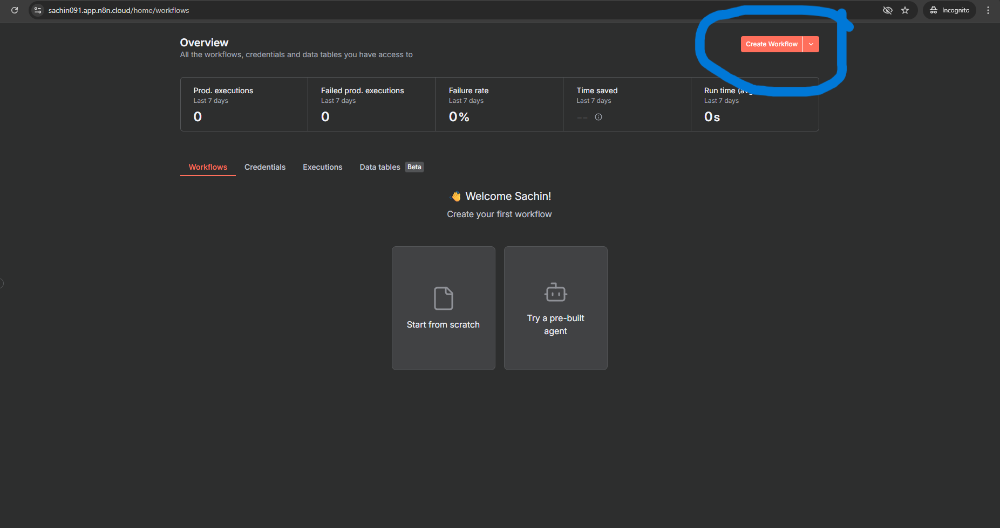

# Lab 2.2: Build Your First RAG Pipeline


Real contracts aren't short. A vendor agreement runs 40 pages. An enterprise SaaS contract hits 80. An M&A document can cross 200. Your agent from Week 1 handled a small sample file — but hand it a 150-page contract and it breaks. Not because the AI isn't smart enough. Because there's a hard limit on how much text any AI model can read in a single go. Dump the whole thing in and it either errors out or starts ignoring the parts that don't fit.

This lab fixes that.

By the end, you'll have a pipeline that breaks large contracts into searchable pieces, stores them, and retrieves exactly the right section when a user asks a question — without hitting context limits.

This is RAG. And once you build it, you'll see it in every serious AI product.

By the end of this lab, you will:

- Understand what RAG is and why it exists
- Build a two-workflow system — one that ingests large documents, one that retrieves from them
- Know what vector embeddings are and why they're not just a buzzword
- Have a live contract Q&A agent that handles large files and remembers what it's been given

---

## The Big Idea: Why RAG Exists

Before we touch n8n, there's a mental model worth having. It makes every step in this lab make sense.

An AI model knows a lot. But it only knows what it was trained on — and it can't learn from your specific documents. Hand it a contract it's never seen and it'll try to answer from general knowledge. That's not good enough.

**RAG — Retrieval Augmented Generation** — is the fix.

Here's how to think about it. Imagine you're a consultant who just joined a law firm. You're smart. You've read thousands of contracts. But you haven't read *this* firm's contracts, their deal history, their specific clients. Before you answer any question, you go to the filing room, pull the relevant folders, read the right pages, and *then* you answer.

That's RAG. The AI goes to the filing room first.

The filing room is a **vector store** — a database that doesn't organize documents alphabetically or by date, but by *meaning*. When the user asks a question, the system finds the chunks of text that mean the most similar thing to that question, pulls them out, and hands them to the AI. The AI answers from that retrieved context, not from general knowledge.

```
User asks a question
        ↓
System searches the vector store for relevant context
        ↓
Retrieved chunks land in the AI's prompt
        ↓
AI answers from that specific material
```

There are two pipelines in this system. You build both today.

**Pipeline 1 — Ingestion:** A user uploads a document. The system breaks it into chunks, converts each chunk into a vector embedding, and stores it in the vector store.

**Pipeline 2 — Retrieval:** A user asks a question. The system finds the most relevant chunks, passes them to the AI agent, and the agent answers.

These two pipelines run separately. The ingestion happens once. The retrieval happens every time someone asks a question. That's the architecture.

---

## Before You Start

✅ **n8n account** — the same one from Lab 2.1. You'll be creating new workflows inside it.

✅ **OpenAI API key** — already set up in n8n from Lab 2.1. You won't need to add it again unless you're starting fresh

✅ **A sample contract (PDF)** — [Download the contract in PDF format](https://pragyaallc-my.sharepoint.com/:b:/g/personal/sachin_parmar_legalgraph_ai/IQCIDp0RA0UYS7g3WGOXOH0uAaJOpNKBwgibUIiks0hCkpc?e=n0XlBh)

✅ **A sample contract (Docx)** — [Download the contract in Docx format](https://pragyaallc-my.sharepoint.com/:w:/g/personal/sachin_parmar_legalgraph_ai/IQAbCBMxqrFrT6hzD6t9oCdpAR8pdsHtVaZf2O5HiyGq5jY?e=4s3M8D)


---

**Quick Note**

If you are facing the issue below while running the workflow, follow these steps:


1. Open the default data loader and change the data format from PDF to Docx.


2. When uploading the document, ensure the file format is .docx, not .pdf.

If you are not facing this issue, you can continue with the current workflow.


---

### Two ways to complete this lab

**Option A — Import our workflow (faster)**

If you want to skip the step-by-step build and jump straight to testing, you can import the pre-built workflow JSON:

1. Log into n8n and open a blank canvas (click **"Create Workflow"**).



2. Click the **three-dot menu (⋮)** in the top-right corner of the canvas.
3. Select **"Import from file"**.


5. Choose the JSON file you downloaded from the prerequisite section above.
6. The two workflows (ingestion + retrieval) will load onto the canvas. Add your OpenAI credentials to the embedding and model nodes, then proceed to the **Test Everything** section.

**Option B — Build from scratch (recommended)**

Follow the step-by-step instructions below. You'll understand every node, every config choice, and why the system works the way it does.

---

## Phase 1: Build the Ingestion Pipeline

This is the filing system. When a user uploads a document, this pipeline processes it and stores it in the vector store — ready to be searched later.

### Create a new workflow

Log into your n8n account. Click **"Create Workflow"** in the top right to open a blank canvas.

You're not modifying the workflow from Lab 1.1. This is a fresh one, built specifically for ingestion.


> This workflow runs once per document. Every time someone uploads a new contract, this pipeline fires, processes the file, and adds it to the store. The retrieval workflow you'll build in Phase 2 then searches across everything that's been stored.

---

### Add the n8n Form trigger

Click **"Add Node"** on the canvas. Search for **"n8n Form"** and select it.

In the **Trigger** dropdown inside the node settings, select **"On new n8n Form event"**.


> **Why a Form trigger instead of a Chat trigger?** This pipeline is about uploading a document, not having a conversation. A form is the right tool — it gives the user a clean upload interface without a chat panel attached to it. Chat triggers are for back-and-forth. Form triggers are for "submit this, and the system will process it."

---

### Configure the form

Inside the Form settings, find the **Form Title** field and enter:

```
Upload Contract
```

Then click **"Add Form Element"**.


In the new element that appears:
- Set the **Label** field to `file0`
- Set the **Element Type** dropdown to **File**


> **Why `file0`?** n8n names uploaded files sequentially — the first file is `file0`, the second would be `file1`. When later nodes need to read the uploaded file, they look for it by this name. Labelling the form element `file0` keeps your naming consistent with what n8n expects downstream.

---

### Test the form trigger

Click **"Execute Step"** on the Form node. A new browser tab opens with your upload form.


Click **"Choose File"**, select your contract PDF, and click **"Submit"**.


Come back to n8n. The node should show a green checkmark — it ran successfully and captured the uploaded file.


> If the node doesn't show a result after you submit the form, make sure you're still in "Execution" mode in n8n — not editing mode. The form only captures data when the workflow is actively listening.

---

### Add the Simple Vector Store node

Click **"Add Node"**, search for **"Simple Vector Store"**, and select it. 


When prompted for an action, choose **"Add Document to Vector Store"**.


Connect it to the Form trigger node.


> **What is a vector store?** A normal database stores text as text — you search it by matching words. A vector store is different. It stores documents as numbers — specifically, as lists of coordinates in a high-dimensional space where meaning is preserved. Two sentences that mean the same thing land close to each other in that space, even if they use different words. This is what makes semantic search possible. When the user later asks "what are the payment terms?", the system finds relevant chunks not because the words match exactly, but because the *meaning* is close.

---

### Create the memory key

Inside the Simple Vector Store settings, find the **Memory Key** field. Click the **(+)** symbol next to it.

n8n will automatically generate a key — it will look something like `vector_store_key`. Leave it as is.


> **What is a memory key?** It's the label for this particular vector store. Think of it as the name of the filing cabinet. When the retrieval pipeline goes looking for stored documents, it opens the cabinet with this exact name. If the names don't match between the two pipelines, the retrieval finds nothing. Keep this key — you'll need to paste it into the retrieval workflow in Phase 2.

---

### Add the embedding model

Inside the Simple Vector Store node, click **"Embedding"**. Choose **"Embeddings OpenAI"** from the options.


In the credential field, select your existing OpenAI credential. If you haven't added it yet, click **"Create New Credential"**, paste your API key, and save.


**What is an embedding?**


This is where text becomes numbers. The embedding model reads each chunk and converts it into a vector — a long list of numbers that represents the meaning of that text in mathematical space. Chunks with similar meanings get similar numbers. That mathematical closeness is what the vector store searches when a user asks a question.

Think of it like a map. Every chunk of text gets plotted as a point. When a user asks "what are the payment terms?", the system calculates where that question sits on the map and finds the points closest to it — even if the exact words never matched.

**n8n built-in vs OpenAI — which one to use?**

n8n gives you two embedding options. Here is when to use each:

| | n8n Built-in Embeddings | OpenAI Embeddings |
|---|---|---|
| **Cost** | Free, runs locally | Billed per token via API |
| **Quality** | Good for testing and prototypes | Better accuracy for production |
| **Dimensions** | 384 | 1536 to 3072 depending on model |
| **When to use** | Building, testing, no API budget | When retrieval quality matters |

For this lab, use OpenAI.

**Which OpenAI embedding model to pick?**

When you select Embeddings OpenAI, you'll see a model dropdown. Here is what each option means:

| Model | What it is | When to use |
|---|---|---|
| `text-embedding-3-small` | Newer, fast, cost-efficient. Better than ada-002 on most benchmarks. | Default choice for most projects. Best balance of cost and quality. |
| `text-embedding-3-large` | Most powerful OpenAI embedding. 3072 dimensions vs 1536. | Use when retrieval accuracy is critical — complex legal docs, multi-language, nuanced queries. Costs more. |
| `text-embedding-ada-002` | The older model. Still works. Widely used. | Only use if you already have data embedded with ada-002 and need to stay consistent. For new projects, use 3-small instead. |

For this lab, select `text-embedding-3-small`. It's the right call for contracts.

> The golden rule: whatever embedding model you use to ingest, you must use the exact same model to retrieve. The vector store is indexed in that model's coordinate system. A different model speaks a different language — it will return wrong results or nothing at all. This is the most common silent mistake in RAG pipelines.

---

### Configure the document loader

Inside the Simple Vector Store node, click **"Document"**. 


Select **"Default Data Loader"**.


Now configure it with these specific settings:

- **Data Type** → set to **Binary**
- **Data Format** → set to **PDF**
- **Text Splitting** → set to **Custom**


Once you select Custom, a **Text Splitter** field appears below. Click it and select **Recursive Character Text Splitter**.


Set the **Chunk Overlap** to **100**.


---

**What is chunking — and why does it matter?**


Imagine tearing a 200-page contract into index cards. Each card gets one idea: one clause, one section, one paragraph. You file the cards, not the book. When someone asks a question, you pull only the relevant cards and hand them to the AI.

A text splitter is the tool that does this tearing. It takes the raw text of your document and cuts it into chunks that can be embedded and stored individually.

**Why Binary data type?**

The uploaded file arrives in n8n as a binary stream — raw bytes, not plain text. Setting Data Type to Binary tells the loader to accept the file as-is and handle the parsing itself. If you leave it on the default (Text), n8n tries to pass the file content as a plain string, which breaks for PDFs since PDFs are not plain text files — they're structured binary formats.

**Why PDF as the data format?**

Selecting PDF tells the loader to use a PDF parser that understands the internal structure of the file — pages, fonts, layout encoding. Without this, the loader would treat your contract as a generic binary blob and either fail or produce garbled text.

---

**What is the Recursive Character Text Splitter?**

There are several ways to split text. The simplest is to cut every N characters regardless of what's there — that's a character splitter. A better approach is to split on sentence boundaries. But for real documents like contracts, neither is ideal on its own.

The **Recursive Character Text Splitter** works differently. It tries to split text using a priority list of separators:

1. First, it tries to split on double newlines (paragraph breaks)
2. If the resulting chunk is still too large, it tries single newlines
3. If still too large, it tries sentence-ending punctuation
4. If still too large, it falls back to individual characters

It keeps trying smaller and smaller boundaries until the chunk fits within your target size. The result is chunks that respect the natural structure of the text wherever possible — paragraphs stay together, sentences don't get broken mid-word — and only fall back to hard cuts when there's no better option.

This is why it is the recommended splitter for legal documents. A clause in a contract is usually a paragraph. The recursive splitter will try to keep that clause intact as a chunk rather than slicing through it arbitrarily.

---

**How to choose chunk size**

Chunk size controls how much text goes into each stored piece. The right number depends on what you're retrieving and how specific the questions will be.

| Chunk Size | What it means | When to use |
|---|---|---|
| 200–400 chars | Very small pieces, single sentences or short clauses | High-precision Q&A where questions are narrow and specific |
| 500–1000 chars | One to two paragraphs | Most document Q&A use cases, including contracts |
| 1500–2000 chars | Several paragraphs | When answers require broader context across a section |
| 2000+ chars | Near-page-level | Summaries, not retrieval |

For contracts, **500–1000 characters** is the standard range. Clauses in legal documents typically run one to three sentences. A 700–800 character chunk captures most clauses cleanly without including irrelevant adjacent text.

**The signal to watch:** If retrieved answers feel vague or generic, your chunks are probably too large — the retrieval is pulling in too much surrounding text and diluting the relevant part. If answers feel cut off or missing a step, your chunks are probably too small.

---

**How to choose chunk overlap**

Overlap is the number of characters that two consecutive chunks share. If your chunk size is 800 and your overlap is 100, the last 100 characters of chunk 1 also appear as the first 100 characters of chunk 2.

This solves a specific problem: important information often sits at a boundary. A clause might start on the last line of one chunk and finish on the first line of the next. Without overlap, retrieval pulls one chunk and misses the conclusion. With overlap, both chunks contain the full clause — whichever one gets retrieved, the context is intact.

**Overlap = 100** is a conservative but reliable setting. It adds a small buffer without significantly inflating the number of chunks stored. For contracts, where clauses are typically self-contained, this is enough to prevent most boundary cuts.

| Overlap | Effect |
|---|---|
| 0 | No safety buffer. Works if your content is already well-structured (e.g., markdown with clear headers) |
| 50–100 | Small buffer, minimal storage overhead. Good default for most documents |
| 200–300 | Larger buffer. Use when documents are dense and clause boundaries are unpredictable |
| 500+ | Very high overlap. Use only if you're consistently losing context at chunk boundaries and other settings haven't fixed it |

> A high overlap does not hurt retrieval accuracy, but it does increase the number of stored chunks and the cost of ingestion. Keep it proportional — overlap should be roughly 10–20% of your chunk size.

---

**Default Data Loader vs Custom Text Splitter — what's the difference?**

| | Default Data Loader | Custom (Recursive Text Splitter) |
|---|---|---|
| **Setup** | Zero configuration | Requires choosing a splitter and setting parameters |
| **Chunk size** | ~1000 characters, fixed | You control it |
| **Overlap** | ~200 characters, fixed | You control it |
| **Splitter logic** | Basic character splitting | Recursive — respects paragraph and sentence boundaries |
| **File handling** | Works for plain text | Works for binary formats like PDF when configured correctly |
| **When to use** | Fast prototyping, plain text files, testing a pipeline | Production use, PDF documents, when retrieval quality matters |

For this lab, the custom configuration with Recursive Text Splitter gives you cleaner chunks from your PDF contract and gives you hands-on control over the most important tuning levers in a RAG pipeline.

---

### Test the full ingestion pipeline

Click **"Execute Workflow"** to run the entire pipeline from start to finish.


When the form opens, upload your contract and submit. Watch each node light up in sequence: Form → Vector Store.

If every node shows a green checkmark, your document has been processed and stored.


> ✓ If you see an error on the Vector Store node, the most likely cause is a missing or expired OpenAI credential. Check the Embeddings node and confirm the API key is valid.

---

## Phase 2: Build the Retrieval Pipeline

Now for the other side. A user asks a question. The system searches what's been stored and routes the right context to the agent.

This is a separate workflow — on the same canvas, but disconnected from the ingestion pipeline. Both workflows live side by side. One ingests. One retrieves.

---

### Add the Chat Trigger

Click **"Add Node"** on the canvas. Search for **"Chat Trigger"** and select it.

Inside the settings, click on the output point of the trigger node and set the event to **"On a new chat message"**.


> **Why start with a Chat Trigger here?** Because retrieval is a conversation — the user asks something and gets an answer. The Chat Trigger listens for that question and kicks off the retrieval pipeline. Every question routes through here before anything searches the vector store.

---

### Allow file uploads

Inside the Chat Trigger settings, click **"Add Field"** 


enable **"Allow File Upload"**.


> This keeps the chat flexible — users can drop in additional documents mid-conversation if needed. For now it's not required, but leaving it enabled means the workflow can grow later without a rebuild.


---

### Add the AI Agent node

Click **"Add Node"**, search for **"Agent"**, and select it. Connect it to the Chat Trigger node.


> The Agent node is the orchestrator. It receives the user's question, decides which tools to use (including the vector store), assembles the retrieved context and the question together, sends it all to the language model, and returns the answer. It's not the thinker — it's the coordinator.

---

### Write the system message

Inside the Agent node, click **"Add Option"** and add a **System Message** field.


Paste this exactly:

```
For every incoming user query, always call the Simple Vector Store tool first to retrieve relevant context, previous conversations, and related knowledge. Use the retrieved information to generate accurate, context-aware, and personalized responses. Never skip this tool call unless the query explicitly does not require external context.
```


> **Why does this instruction matter?** By default, an AI agent decides for itself whether to use a tool or just answer from its training knowledge. Without this instruction, it might skip the vector store for questions it thinks it can answer on its own — even when the stored context would give a better answer. This system message removes that ambiguity. It tells the agent: always check the filing room first. Every time.

---

### Add the language model

Inside the Agent node, click **"Chat Model"**. Select **"OpenAI Chat Model"**.

Choose the model you want to use — `gpt-5-mini` is recommended for reasoning quality — and confirm your OpenAI credential is connected.


> The model is swappable. You're using OpenAI today, but the agent node doesn't care what model sits underneath it. That's the point of the modular architecture — swap the model without touching anything else.


---

### Add the Simple Vector Store as a tool

Inside the Agent node, click **"Tools"**. Search for **"Simple Vector Store"** and select it.


Open the **Simple Vector Store** tool .


Leave the **Operation Mode** at its default. Then fill in these two fields:

**Description** — paste this exactly:

```
Use this tool to store, retrieve, and search vector embeddings from previously processed data. It helps the AI system find relevant context, documents, or past information based on semantic similarity to the user's query, enabling more accurate and context-aware responses.
```

**Memory Key** — select the same key you created in Phase 1 (`vector_store_key` or whatever n8n generated). This must match exactly.

**Limit** — set this to `5`. This controls how many chunks get retrieved per query.


> **Why does the description matter?** The agent reads this description to decide *when* to call this tool. It's not a label for you — it's an instruction for the AI. A vague description means the agent won't know when to reach for it. A precise one means it will. The description you pasted tells the agent exactly what this tool does and why it should use it: find things that *mean* the same as the user's question, not just things that match the exact words.

> **Why limit 5?** Every retrieved chunk takes up space in the prompt. Too many chunks and you're flooding the model with context it can't all use. Too few and you might miss the relevant part. 5 is a reasonable starting point. If answers feel incomplete or generic, try increasing to 8 or 10.

---

### Add the embedding model to the retrieval tool

Inside the Simple Vector Store tool, click **"Embedding"**. Select **"Embeddings OpenAI"** and confirm your credential.


> This must match the embedding model used during ingestion. If you ingested with OpenAI embeddings, you must retrieve with OpenAI embeddings. The coordinates that were stored were calculated by a specific model — only that same model knows how to search them correctly.

---

## Test Everything

### Run the ingestion workflow first

Go to your ingestion workflow (Phase 1) and click **"Execute Workflow"**. Upload the sample contract and submit. Confirm every node completes successfully.

This step must happen before testing retrieval. You can't search a store that hasn't been filled yet.


---

### Open the chat and ask a question

Go to your retrieval workflow (Phase 2). Click **"Execute Workflow"** to activate it, then click **"Open Chat"**.


Ask this:

*"What is this contract about?"*

Watch what happens in the background — the agent calls the vector store tool, retrieves the relevant chunks, and builds the answer from that context.


Try a few more:

*"What are the parties name in the contract?"*

*"Are there any auto-renewal clauses?"*

Every answer comes from the stored document — not from the model's general training. The agent is reading from the filing room.

> ✓ If answers seem generic or the agent says it doesn't have information, two things to check: (1) confirm the Memory Key in the retrieval tool matches the one from ingestion exactly, and (2) confirm the same OpenAI embedding credential is used in both workflows.

---

## What You Built


You built a two-pipeline system. One processes documents. One answers questions about them. Here's what to take away:

**RAG separates memory from reasoning.** The model doesn't remember your documents — the vector store does. The model's job is to reason over whatever context gets handed to it. Keeping these two concerns separate is what makes the system flexible and scalable. Swap the model, the store stays. Add more documents, the model doesn't change.

**Embeddings convert meaning into coordinates.** When you embed a chunk of text, you're converting its meaning into a location in mathematical space. Chunks that mean similar things end up near each other. That proximity is what search exploits. This is why the system can find "payment obligations" when a user asks about "invoice terms" — the words differ, but the meaning is close.

**The system message is a routing instruction.** Telling the agent to "always call the vector store first" is a product decision, not a technical one. Without it, the agent decides on its own — and it might not always make the right call. The system message is where you enforce behavior. This pattern applies to every agent you'll ever build.

**Chunking is the bridge between large documents and searchable answers.** You can't hand a 200-page contract to an AI in one go. Chunking breaks it into pieces small enough to embed and index. The chunk size controls the granularity of what gets retrieved. Too big and the AI gets buried in irrelevant text. Too small and the answer has no context to stand on. Getting this right is one of the highest-leverage decisions in a RAG system.

**Two workflows, one system.** Ingestion runs once per document. Retrieval runs once per question. Keeping them separate means you can update either side independently — change the chunking strategy without touching the chat interface, or upgrade the chat without reprocessing all your documents.

---

## What's Next

You've built the core of a document-aware AI system. The next labs will expand on this — adding memory across conversations, handling multiple document types, and improving retrieval quality when answers start to drift.

---

> **Quick Note**
>
> If you are facing the issue below while running the workflow, follow these steps:
>
> 1. Make sure you change the default data loader from **PDF** to **DOCX** format.
> 2. When uploading the document, ensure the file format is `.docx`, not `.pdf`.
>
> If you are not facing this issue, you can continue with the current workflow.

[Next Lab →](../2.3-agentic-ragembedding/Readme.md)
