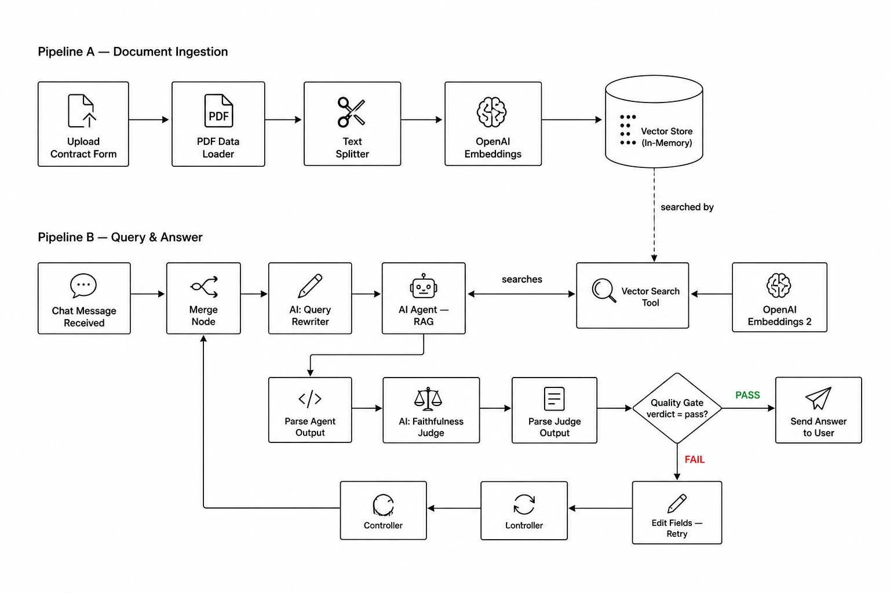
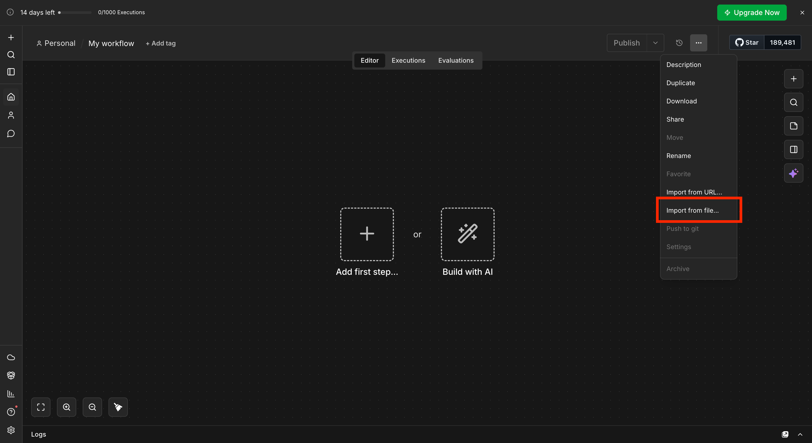
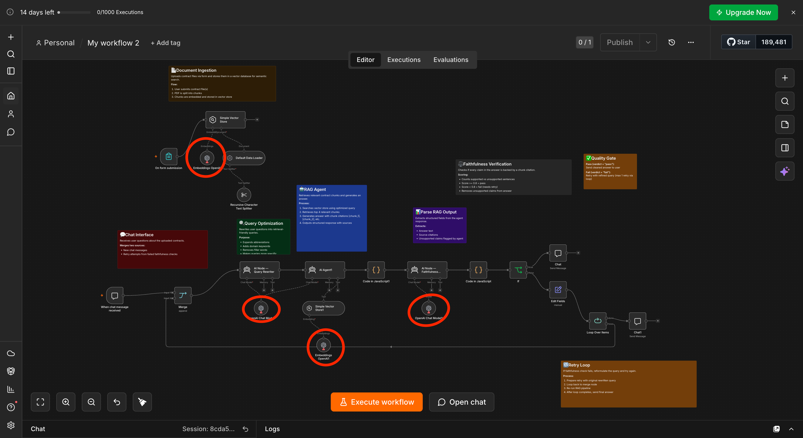
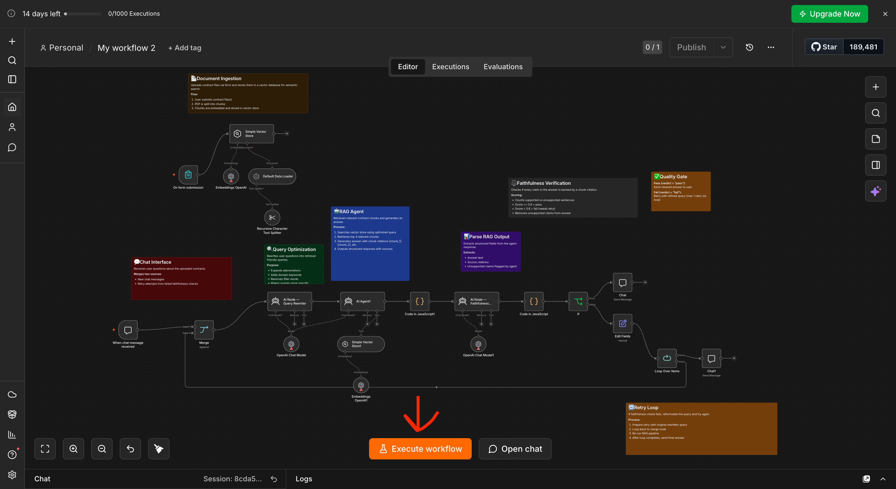
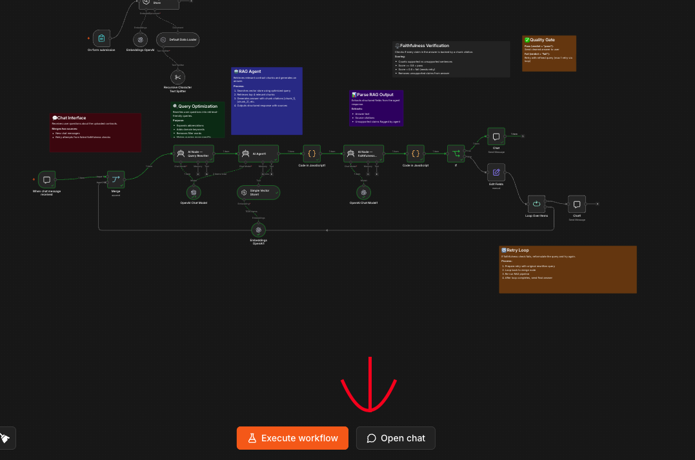
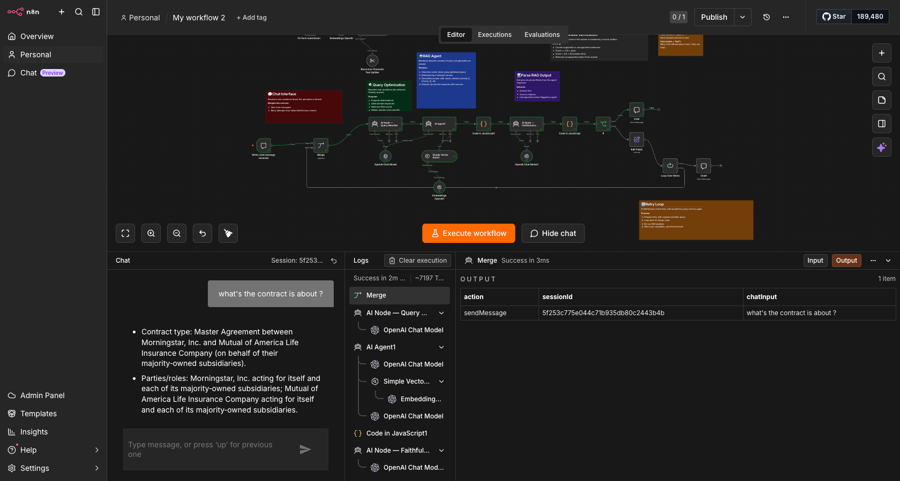

# Agentic RAG — Contract Intelligence Lab Guide

> **Who this is for:** Anyone curious about AI — no coding background needed. This guide gets you running the lab first, then explains every piece of it in plain English.

---

## Table of Contents

1. [The Problem We Are Solving](#1-the-problem-we-are-solving)
2. [The Solution — What This Workflow Does](#2-the-solution--what-this-workflow-does)
3. [Core Concept: What Is Agentic RAG?](#3-core-concept-what-is-agentic-rag)
4. [Step-by-Step Lab Setup in n8n](#4-step-by-step-lab-setup-in-n8n)
5. [The Big Picture — How the Workflow Flows](#5-the-big-picture--how-the-workflow-flows)
6. [Every Component Explained — Plain English](#6-every-component-explained--plain-english)
7. [Running Your First Query — What Happens Behind the Scenes](#7-running-your-first-query--what-happens-behind-the-scenes)
8. [Example Queries to Try](#8-example-queries-to-try)
9. [Why This Matters — Key Takeaways](#9-why-this-matters--key-takeaways)

---

## 1. The Problem We Are Solving

Imagine you are a property manager, a legal assistant, or a business operations lead. Every week you deal with **lease agreements, vendor contracts, and service agreements** — documents that are tens or hundreds of pages long.

When someone asks you a question like:

> *"Does our lease with Tenant A allow subletting?"*
> *"What is the notice period if we want to terminate the vendor contract?"*
> *"Are there any penalties for early exit in this agreement?"*

You have two choices:

- **Manually search** through the entire document yourself — slow, error-prone, and exhausting
- **Ask a generic AI chatbot** — which might confidently make up an answer that sounds right but is completely fabricated (dangerous in legal or financial contexts)

**Neither option is good enough.** The core problem has four parts:

| Problem | Why It Hurts |
|---|---|
| Contracts are long and dense | Humans can't quickly find the relevant clause among 50+ pages |
| Generic AI "hallucinates" | AI can invent clauses that don't exist, creating serious legal risk |
| No source traceability | You can't trust an answer if you don't know *where* it came from |
| Static answers | A simple AI lookup returns one answer and stops — it can't self-correct |

---

## 2. The Solution — What This Workflow Does



This n8n workflow builds an **intelligent contract Q&A system** that:

✅ Reads and understands your uploaded contract PDF
✅ Answers questions in plain English
✅ Always cites the exact section of the document it used
✅ Self-checks its own answers for accuracy before sending them to you
✅ Automatically retries if its first answer isn't reliable enough

Think of it as a **highly cautious legal research assistant** — one that refuses to guess, always shows its sources, and double-checks its own work before telling you anything.

---

## Pre-Session Downloads

Download the following files before starting the lab:

- ✅ **n8n Workflow file** — [Download the pre-built workflow JSON here](https://pragyaallc-my.sharepoint.com/:u:/g/personal/sachin_parmar_legalgraph_ai/IQA5OM4afrVkT6IPOVS7Tt1oAdqHaDatGQNsGPHzQDXwwus?e=nPtTb6) if you'd like to import it instead of building from scratch.
- [Reference Document](https://pragyaallc-my.sharepoint.com/:w:/g/personal/sachin_parmar_legalgraph_ai/IQAbCBMxqrFrT6hzD6t9oCdpAR8pdsHtVaZf2O5HiyGq5jY?e=4s3M8D) — Download the test Contract make sure you upload the contract is docx format
---

## 3. Core Concept: What Is Agentic RAG?

This is the most important concept in this lab. Let's break it down word by word.

### RAG — Retrieval-Augmented Generation

**"Retrieval-Augmented Generation"** is a technique for making AI smarter and more accurate by giving it a reference library to look things up in, rather than relying purely on what it memorised during training.

Think of the difference between:

- **A student taking an open-book exam** (RAG) — they look up answers in the textbook before writing
- **A student taking a closed-book exam** (standard AI) — they rely entirely on memory, which may be imperfect or outdated

In RAG, the "retrieval" step finds the most relevant pages/passages from your document, and the "generation" step uses an AI to write a clear answer *based only on those passages*.

```
User Question  →  Find relevant document sections  →  AI writes answer from those sections
```

### Agentic — What Makes It "Agentic"?

A standard RAG system does a single lookup and gives you one answer. It is passive.

An **Agentic** RAG system has *agency* — it can **reason, make decisions, use tools, and take multiple steps** to reach a better answer:

| Standard RAG | Agentic RAG |
|---|---|
| Looks up document once | Can search multiple times |
| Returns whatever it finds | Evaluates quality before responding |
| No self-correction | Retries with a better query if needed |
| No source verification | Checks every claim against sources |
| One fixed output | Structured output with confidence scoring |

In this workflow, the AI agent:
1. **Rewrites your question** to make it easier to search
2. **Searches the document** for relevant sections
3. **Drafts an answer** with citations
4. **Judges its own answer** for accuracy
5. **Retries automatically** if the answer isn't trustworthy enough

This loop of searching → answering → judging → (possibly) retrying is what makes it **agentic**.

---

## 4. Step-by-Step Lab Setup in n8n

Follow these five steps exactly to get the workflow running. No coding required.

---

### ▶ Step 1 — Create a New Workflow

1. Open n8n in your browser
2. Click the **"+ New Workflow"** button (or **"Create Workflow"**) in the top right corner
3. You will see a blank canvas — this is your workspace

> 💡 You should see an empty canvas with a hint that says "Add first step" or similar. This is normal — you will fill it in the next step by importing the file.

---

### ▶ Step 2 — Download and Import the n8n JSON File

1. Download the **n8n JSON workflow file** from the pre-session materials section
2. Back in your n8n blank canvas, click the **three-dot menu** (⋮) in the top right corner
3. Select **"Import from file"** (keyboard shortcut: `Ctrl+Shift+I` on Windows / `Cmd+Shift+I` on Mac)
4. Browse to the downloaded JSON file and select it
5. Click **Open / Import**
6. The full workflow will appear on the canvas with all the nodes already connected



> ✅ You should now see two groups of nodes: one cluster at the top (Document Ingestion) and one cluster running left-to-right below (Query & Answer Pipeline). Everything is pre-wired — you just need to add your API key in the next step.

---

### ▶ Step 3 — Open the OpenAI Nodes and Add Your API Key

This step connects the workflow to OpenAI's AI services. You need to do this for **three nodes**.

**For the OpenAI Chat Model node:**
1. Find and **click** the node labelled **"OpenAI Chat Model"** on the canvas
2. A settings panel opens on the right side of the screen
3. Under **"Credential"**, click **"Create New"** or select an existing OpenAI credential
4. Paste your OpenAI API key into the field and click **Save**

**For the two OpenAI Embedding nodes:**
1. Find the node **"Embeddings OpenAI"** (connected to the Vector Store in the top/ingestion section) → click it → assign the same API key credential
2. Find the second node **"Embeddings OpenAI1"** (in the lower query pipeline section) → click it → assign the same API key credential

> 💡 You only need to create the OpenAI credential once — then select it for each of the three nodes. They all share the same key.



> ⚠️ Don't have an OpenAI API key yet? Get one at [platform.openai.com](https://platform.openai.com). You will need to add a small amount of credit to your account before the key will work.

---

### ▶ Step 4 — Execute the Workflow and Upload Your Contract

1. Click the **"Execute Workflow"** button (the ▶ Play button at the bottom of the canvas)
2. The workflow activates and starts listening
3. Click on the **"On Form Submission"** node — a **"Test URL"** link will appear in its settings panel
4. Click that URL — it opens a simple web form in a new browser tab
5. In the form, click the file upload field and **select your contract PDF** (the sample contract from the pre-session materials)
6. Click **Submit**
7. Go back to the n8n canvas — watch as **green checkmarks appear** on each ingestion node one by one as your document is processed



> ✅ When all ingestion nodes show green, your contract is fully loaded and ready to be queried. This usually takes 5–15 seconds depending on the size of the PDF.

> 💡 What's happening during those seconds: the PDF is being read, cut into chunks, converted into numerical vectors, and stored in the AI's searchable memory. More on each of these steps in Section 6.

---

### ▶ Step 5 — Ask a Query and Watch the Workflow in Action

1. Find the **"When chat message received"** node on the canvas and click it
2. In the settings panel that opens, click **"Open Chat"** or **"Test Chat"**
3. A chat window will appear



4. Type a question about your contract — for example: *"Can the tenant sublet the apartment?"*
5. Press **Enter** and watch the canvas light up in real time

You will see each node glow green as it completes its work in sequence:
- The Query Rewriter rewrites your question
- The RAG Agent searches the contract
- The Faithfulness Judge checks the answer
- The Quality Gate decides: send it or retry?
- The final verified answer appears in your chat window

> ✅ The answer will come back as clean bullet points. Every claim is backed by a source from your contract. Any unsupported claims have already been automatically removed.




See **Section 8** for a full list of example queries to try.

---

## 5. The Big Picture — How the Workflow Flows

Now that you've run the lab, here is a full picture of what you just executed. The workflow has **two separate pipelines** that work together.

### Pipeline A — Document Ingestion (runs once, when you upload the contract)

```
┌─────────────────────────────────────────────────────────────────────────┐
│                     PIPELINE A: DOCUMENT INGESTION                       │
│                                                                          │
│  [Upload Form]  →  [PDF Loader]  →  [Text Splitter]  →  [Embedder]      │
│                                                              ↓           │
│                                                     [Vector Store]       │
│                                                  (Searchable Memory)     │
└─────────────────────────────────────────────────────────────────────────┘
```

### Pipeline B — Query & Answer (runs every time you ask a question)

```
┌──────────────────────────────────────────────────────────────────────────────────────────┐
│                            PIPELINE B: QUERY & ANSWER                                     │
│                                                                                           │
│  [Chat Message]                                                                           │
│       ↓                                                                                   │
│  [Merge Node]  ←──────────────────────────────────── (retry loop feeds back here)        │
│       ↓                                                                                   │
│  [Query Rewriter AI]  — makes your question search-friendly                               │
│       ↓                                                                                   │
│  [RAG Agent]  ←──── [Vector Search Tool] ←──── [Embedder]                                │
│       ↓              (searches contract, cites chunks)                                    │
│  [Parse Output]  — extracts answer, sources, unsupported claims                           │
│       ↓                                                                                   │
│  [Faithfulness Judge AI]  — checks every claim is cited                                   │
│       ↓                                                                                   │
│  [Parse Judge Output]  — scores: 0.0 – 1.0                                               │
│       ↓                                                                                   │
│  [Quality Gate]  ── PASS (score ≥ 0.8) ──→  [Send Answer to User] ✅                     │
│       │                                                                                   │
│       └────────── FAIL (score < 0.8) ──→  [Retry Loop] → back to Merge ♻️               │
│                                                                                           │
└──────────────────────────────────────────────────────────────────────────────────────────┘
```


---

## 6. Every Component Explained — Plain English

Here is every single "block" (node) in the workflow, explained as if you have never used n8n or AI before. They follow the order in which they appear in the workflow.

---

### 📋 Node 1 — On Form Submission
**What it is:** A web form that appears in your browser when the workflow runs.

**What it does:** Displays a simple page with a file upload field labelled "Upload Contract". You pick your PDF and click Submit. That action kicks off the entire document ingestion pipeline.

**Why it matters:** This is the front door of the workflow. Everything starts here — the contract you upload will be the document the AI learns from and searches through.

> 💡 *Think of it like uploading a file to Google Drive — but instead of storing it as-is, the system immediately starts processing it for AI search.*

---

### 📂 Node 2 — Default Data Loader
**What it is:** A component that reads your uploaded PDF file.

**What it does:**
- Opens and reads the PDF you submitted
- Pulls out all the text from every page
- Stamps each piece of text with metadata labels: `document_type = lease` and `chunk_type = lease_clause`

**Why it matters:** PDFs are image-like files to a computer — it can't just "read" them the way a human does. This component extracts the actual words and sentences so the AI can work with them.

> 💡 *Think of it like the OCR function on your phone when you photograph a receipt — it "reads" the document and turns the image into editable text.*

---

### ✂️ Node 3 — Recursive Character Text Splitter
**What it is:** A text-cutting tool.

**What it does:** Takes the full extracted text of your contract — potentially 50+ pages worth — and cuts it into smaller, manageable **"chunks"** of a few hundred words each. It's "recursive" meaning it tries to split at natural boundaries like paragraphs and sentences rather than cutting mid-word or mid-sentence.

**Why it matters:** AI models can only process a limited amount of text at once. Shorter, focused chunks also make searching more precise — instead of retrieving an entire 60-page document, the system retrieves only the exact clause that answers your question.

> 💡 *Think of it like turning a long textbook into individual index cards — one topic per card. When you need to find something, you search the cards, not the whole book.*

---

### 🔢 Node 4 — Embeddings OpenAI (Ingestion)
**What it is:** A converter that turns text into numbers.

**What it does:** Takes each text chunk and converts it into a long list of numbers called a **"vector"** or **"embedding"**. These numbers mathematically represent the *meaning* of the text. Two pieces of text with similar meanings produce similar numbers — even if they use completely different words.

**Why it matters:** Computers can't understand language directly — they work with numbers. By converting text to vectors, we unlock *semantic search*: finding the right contract clause even when your question uses different words than the clause itself.

> 💡 *If you ask "Can I sublet?" and the contract says "Assignment or subletting of the premises is prohibited without written consent", those two phrases will produce very similar number patterns. The system finds that match even though the wording is totally different.*

---

### 🗄️ Node 5 — Simple Vector Store (Insert Mode)
**What it is:** The AI's searchable memory for your document.

**What it does:**
- Receives all the text chunks along with their number vectors
- Stores them in an in-memory database (fast, temporary storage)
- Clears any previously stored data first so it always works with your latest upload

**Why it matters:** This is the "library" the AI will search every time you ask a question. Without this, the AI would have no knowledge of your specific contract whatsoever.

> 💡 *Think of it as a highly specialised filing cabinet where every document is automatically indexed by meaning — not just by title or keyword.*

---

### 💬 Node 6 — When Chat Message Received
**What it is:** The chat interface trigger — the start of Pipeline B.

**What it does:** Sits and listens for when you type a question in the n8n chat window. The moment you send a message, this node wakes up and passes your question to the rest of the query pipeline.

**Why it matters:** This is the second entry point. After uploading your contract (Pipeline A), all your questions come through this node to kick off the answering process.

---

### 🔀 Node 7 — Merge Node
**What it is:** A traffic controller that combines two possible incoming streams.

**What it does:** Accepts inputs from two sources and funnels them into one unified flow:
1. A fresh new question from you (first time through)
2. A question being retried after a failed faithfulness check (coming back from the retry loop)

**Why it matters:** The retry loop needs to re-enter the pipeline at the same starting point as new queries. The Merge node handles both paths gracefully — the rest of the pipeline doesn't need to know whether it's a new question or a retry.

> 💡 *Think of it like a roundabout — whether you're entering from the motorway for the first time or looping around again, you pass through the same junction.*

---

### ✏️ Node 8 — AI Node — Query Rewriter
**What it is:** An AI that improves your question before it is used to search.

**What it does:** Takes your raw, conversational question and rewrites it into a more search-friendly version by:
- Making it more specific and keyword-rich
- Expanding abbreviations (e.g., "TCV" → "total contract value")
- Adding relevant domain synonyms
- Removing filler words ("can you please tell me about...")
- Combining all aspects of complex questions into one comprehensive search query

**The AI's instruction (system prompt):**
> *"You are a query optimization expert. Rewrite the user's question into a retrieval-friendly form. Make it specific and keyword-rich. Expand abbreviations, add domain synonyms. Remove filler words."*

**Example transformation:**
- Your question: *"Can I get out of my lease early?"*
- Rewritten query: *"early lease termination clause penalty fee notice period tenant exit provisions break clause"*

**Why it matters:** Vector search works far better with precise, keyword-rich queries. A well-rewritten query dramatically increases the chance of finding exactly the right contract clause.

---

### 🧠 Node 9 — OpenAI Chat Model (gpt-5-mini)
**What it is:** The language model that powers all three AI agents in the workflow.

**What it does:** This is the actual "thinking" engine. When any AI agent node needs to write text, reason through a problem, or make a decision, it sends a request to this model and uses the response.

**Model used:** `gpt-5-mini` — a fast, capable OpenAI model well-suited for reasoning and structured output tasks.

**Why it matters:** The quality of the answers, the quality of the query rewriting, and the quality of the faithfulness judgement all depend on this model. It's the brain behind all three AI steps.

---

### 🤖 Node 10 — AI Agent (RAG Agent)
**What it is:** The main "brain" of the workflow — an AI agent that actively uses tools to find and compose an answer.

**What it does:**
1. Receives the rewritten query
2. Chooses to call the **Vector Search Tool** to look up relevant contract sections
3. Retrieves the top matching chunks from the vector store
4. Reads and reasons over those chunks
5. Composes an answer, citing which specific chunk supports each claim
6. If the first search wasn't sufficient, it can refine the query and search again (up to 4 times)
7. Returns a structured response in three parts: `ANSWER / SOURCES / UNSUPPORTED_CLAIMS`

**The AI's instruction (system prompt):**
> *"You are a precise research assistant. Never answer from your own knowledge — always retrieve first. Every fact must come from retrieved chunks. Cite the chunk supporting each key claim using [chunk_1], [chunk_2], etc. If evidence is lacking, say so."*

**Why "agentic"?** Unlike a simple search, this node *decides* how many times to search, *reasons* about what it found, and *structures* its output for the quality-checking step that follows. It's not just retrieving — it's thinking.

> 💡 *Think of it like a paralegal who goes to the filing cabinet, pulls out relevant documents, reads them, and writes a memo citing page numbers — and refuses to write anything they can't document.*

---

### 🔍 Node 11 — Simple Vector Store (Retrieve-as-Tool Mode)
**What it is:** The same vector store from ingestion, now used as a search tool *by* the RAG Agent.

**What it does:** When the RAG Agent wants to find information, it calls this node like a search engine. The node:
1. Converts the search query into a vector using the OpenAI Embeddings model
2. Compares that vector against all stored contract chunk vectors
3. Returns the most semantically similar chunks back to the agent

**Why are there two Vector Store nodes?** The first one (Node 5) is for *writing* data in during ingestion. This one is for *reading* data out during querying. Same underlying data, two different operations.

---

### 🔢 Node 12 — Embeddings OpenAI (Query Time)
**What it is:** A second embeddings converter, used during the search phase.

**What it does:** Same function as Node 4 — converts text into a vector of numbers. But this time it converts the *search query* (not the document chunks) so it can be compared against the stored chunk vectors.

**Why it matters:** The comparison only works if both the document chunks and the search query were converted using the *same embedding model*. Think of it like using the same ruler on both sides of a measurement.

---

### ⚙️ Node 13 — Code in JavaScript (Parse Agent Output)
**What it is:** A small automated script that reads and organises the RAG Agent's raw output.

**What it does:** The RAG Agent returns plain text in this format:
```
ANSWER: The tenant may not sublet...
SOURCES: [chunk_3], [chunk_7]
UNSUPPORTED_CLAIMS: none
```
This code reads that text and separates it into three clean, labelled data fields: `answer`, `sources`, and `unsupported_claims`.

**Why it matters:** The Faithfulness Judge (next node) needs clean structured data, not a blob of text. This is a translation layer between the agent's free-text output and the structured data the pipeline needs.

---

### ⚖️ Node 14 — AI Node — Faithfulness Judge
**What it is:** A second AI whose sole purpose is to audit the RAG Agent's answer for accuracy.

**What it does:**
1. Reads the answer produced by the RAG Agent
2. Examines every factual sentence
3. Marks a sentence **SUPPORTED** if it contains a `[chunk_X]` citation
4. Marks a sentence **UNSUPPORTED** if it makes a factual claim with no citation
5. Computes a **faithfulness score**: `number of supported sentences ÷ total factual sentences`
6. Delivers a verdict: **pass** (score ≥ 0.8) or **fail** (score < 0.8)
7. Returns a cleaned answer with all unsupported sentences removed, formatted as bullet points

**The AI's instruction (system prompt):**
> *"You are a strict faithfulness evaluator. Check whether every factual claim is backed by a chunk citation. Return valid JSON only. Score >= 0.8 = pass."*

**Example output:**
```json
{
  "faithfulness_score": 0.95,
  "verdict": "pass",
  "unsupported_sentences": [],
  "reasoning": "All 4 factual claims reference chunk citations.",
  "answer": "• The tenant may not sublet without written landlord consent\n• Early termination requires 60 days written notice"
}
```

**Why it matters:** This is the **anti-hallucination layer** — the automated quality control that ensures nothing goes to the user unless it can be traced back to the actual contract.

> 💡 *Think of it like a fact-checker at a newspaper. Before any article goes to print, someone reads every claim and asks: "Do we have a source for this?" If not, the claim gets cut.*

---

### ⚙️ Node 15 — Code in JavaScript (Parse Judge Output)
**What it is:** A second small script, this time to parse the Faithfulness Judge's JSON response.

**What it does:** Reads the JSON output from Node 14 and extracts `faithfulness_score`, `verdict`, `unsupported_sentences`, `reasoning`, and the cleaned `answer` as individual, usable data fields.

---

### 🚦 Node 16 — If Node — Quality Gate
**What it is:** A decision point that routes the workflow based on the judge's verdict.

**What it does:**
- If `verdict = "pass"` → sends the verified answer straight to the user ✅
- If `verdict = "fail"` → routes to the retry preparation step ❌

**Why it matters:** Nothing reaches the user without passing this gate. This is what makes the system trustworthy — every answer has been evaluated before it is delivered.

---

### 📨 Node 17 — Chat (Send Verified Answer)
**What it is:** The response node that delivers the final, verified answer back to you.

**What it does:** Sends the cleaned, bullet-pointed, citation-backed answer to the chat window — the same window where you typed your question.

---

### 🔁 Node 18 — Edit Fields — Retry Preparation
**What it is:** A data preparation step that sets up the retry when faithfulness fails.

**What it does:** Reformats the original rewritten query so it flows correctly when sent back through the pipeline from the beginning. It essentially resets the data to the state it was in after the Query Rewriter ran, ready for another full pass through the RAG Agent and Judge.

---

### 🔄 Node 19 — Loop Over Items — Loop Controller
**What it is:** A loop management node that controls how many retry attempts happen.

**What it does:**
- **First time through:** routes data back to the Merge node for a second full attempt
- **After the loop completes:** routes to the final Chat node to deliver whatever the best answer is

**Why it matters:** Without a loop limit, a failing pipeline could retry endlessly. This node enforces a maximum number of attempts, ensuring the workflow always terminates and always delivers something to the user.

---

## 7. Running Your First Query — What Happens Behind the Scenes

Let's trace exactly what happens when you type a question. We'll use this example:

> **Your question:** *"Can the tenant sublet the apartment?"*

---

**Step 1 — Chat Trigger fires**

The moment you press Enter, Node 6 (When chat message received) captures: `"Can the tenant sublet the apartment?"` and passes it to the Merge node.

---

**Step 2 — Merge routes it forward**

Node 7 (Merge) sees this is a fresh query and forwards it to the Query Rewriter.

---

**Step 3 — Query Rewriter transforms the question**

Node 8 (Query Rewriter) receives the casual question and thinks:
*"I need to make this keyword-dense and legally specific for better search results."*

Output: `"subletting assignment tenant premises written consent landlord approval prohibition restriction lease agreement"`

---

**Step 4 — RAG Agent searches and composes an answer**

Node 10 (RAG Agent) receives the rewritten query and calls Node 11 (Vector Search Tool).

The tool converts the query to a vector, compares it against all stored chunks, and returns the top 4 most relevant ones:

> *Chunk 3: "The Tenant shall not assign, sublet, or transfer the Lease or any interest therein without the prior written consent of the Landlord..."*
> *Chunk 7: "Any unauthorized subletting shall constitute a material breach of this Agreement and may result in immediate termination..."*

The agent composes:
```
ANSWER: The tenant may not sublet the apartment without the prior written
consent of the Landlord [chunk_3]. Any unauthorized subletting constitutes
a material breach and may result in immediate termination of the lease [chunk_7].

SOURCES: [chunk_3], [chunk_7]

UNSUPPORTED_CLAIMS: none
```

---

**Step 5 — Parse Output separates the three fields**

Node 13 (Code) reads the text and produces three clean fields:
- `answer` → the answer text
- `sources` → "[chunk_3], [chunk_7]"
- `unsupported_claims` → "none"

---

**Step 6 — Faithfulness Judge audits the answer**

Node 14 (Faithfulness Judge) reads both sentences and checks each for a citation:
- Sentence 1: has `[chunk_3]` ✅ — supported
- Sentence 2: has `[chunk_7]` ✅ — supported
- Score: `2 supported / 2 total = 1.0`

It returns:
```json
{
  "faithfulness_score": 1.0,
  "verdict": "pass",
  "unsupported_sentences": [],
  "reasoning": "Both factual claims reference chunk citations.",
  "answer": "• The tenant may not sublet without prior written consent from the Landlord\n• Unauthorized subletting is a material breach and may cause immediate termination"
}
```

---

**Step 7 — Parse Judge Output extracts the verdict**

Node 15 reads the JSON and surfaces `verdict = "pass"` and the clean `answer`.

---

**Step 8 — Quality Gate routes to the user**

Node 16 (If) sees `verdict = "pass"` and routes to Node 17 (Chat).

---

**Step 9 — You receive the answer**

In your chat window:

> • The tenant may not sublet without prior written consent from the Landlord
> • Unauthorized subletting is a material breach and may cause immediate termination

Verified. Cited. Ready to act on.

---

### What Happens If the Faithfulness Check Fails?

Suppose the agent produced: *"The subletting fee is $500"* — but this fact wasn't in any retrieved chunk. The Judge marks it unsupported. The score drops below 0.8 and the verdict becomes `"fail"`.

Node 16 routes to Node 18 (Edit Fields), which prepares the query for a retry. Node 19 (Loop Controller) sends it back to the Merge node for a complete second pass. If the retry passes, the clean answer goes to the user. If it still fails after the loop limit, the best available answer is sent anyway.

---

## 8. Example Queries to Try

Use these after uploading the sample contract to get started quickly.

---

### Query 1
> *"What is this contract about?"*

---

### Query 2
> *"Who are the parties involved in this contract?"*

---

### Query 3
> *"What are the key terms and obligations in this contract?"*

---

## 9. Why This Matters — Key Takeaways

### What You Have Built

You've just run a production-grade Agentic RAG pipeline. Here's what makes it special:

| Feature | What It Does | Why It Matters |
|---|---|---|
| **Semantic Search** | Finds meaning, not just keywords | Catches relevant clauses even when phrased differently |
| **Query Rewriting** | Improves questions before searching | Better queries → better results |
| **Agentic Retrieval** | Agent can search multiple times | Handles complex, multi-part questions |
| **Citation Enforcement** | Every claim must have a source | Eliminates hallucination risk |
| **Faithfulness Scoring** | Quantifies answer reliability | Gives you a measurable confidence score |
| **Automatic Retry** | Re-runs if quality is too low | Self-healing pipeline |

### Real-World Applications

This same architecture can be applied to:

- **Legal teams** — querying NDAs, contracts, IP agreements
- **HR departments** — querying employee handbooks, offer letters, policies
- **Finance teams** — querying loan agreements, vendor contracts, SLAs
- **Real estate** — querying lease agreements, property management contracts
- **Healthcare** — querying supplier agreements, compliance documents

### The Core Insight

The most important lesson from this lab is the difference between *retrieving information* and *generating answers responsibly*:

> A system that retrieves and cites is trustworthy.
> A system that generates without retrieval is dangerous.

By combining retrieval, agentic reasoning, and faithfulness verification, this workflow gives you the speed of AI with the reliability of a careful human researcher.

---

*This document was created for the Agentic RAG lab session. For questions, refer to the session facilitator or the n8n documentation at [docs.n8n.io](https://docs.n8n.io).*