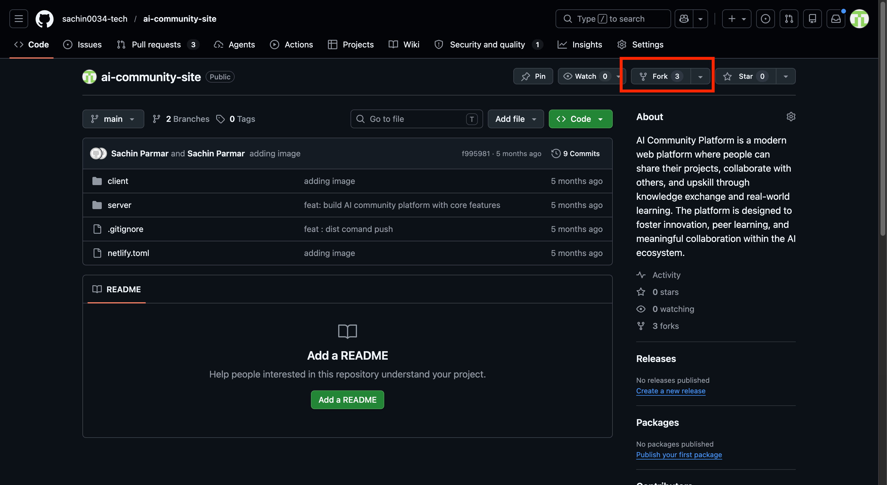
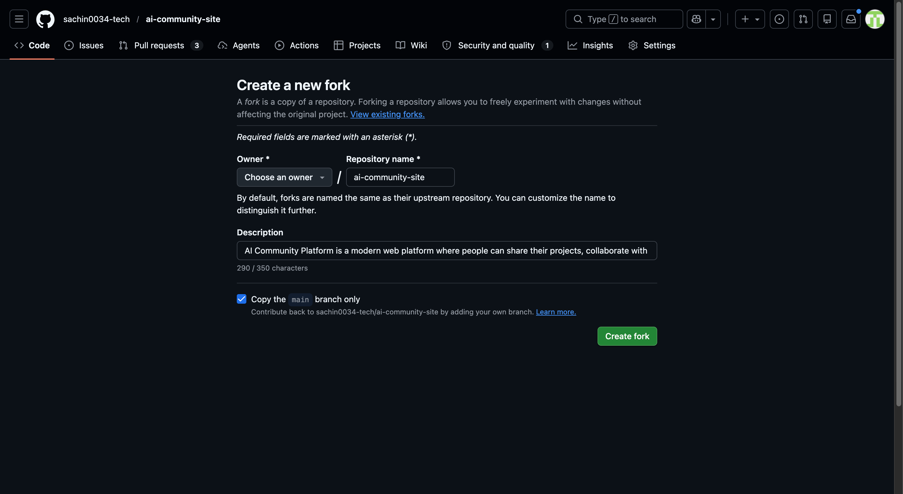
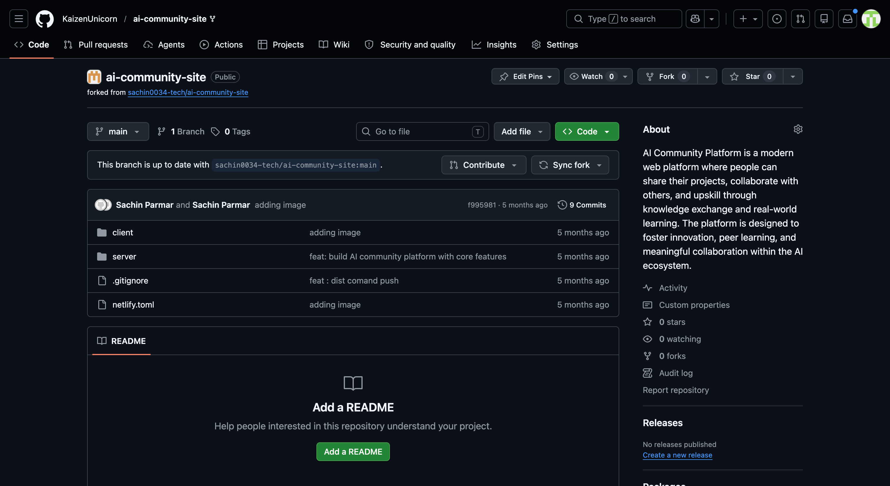

# Lesson 03 · Forking the Project Repository

## What is Forking?

When you **fork** a repository, GitHub creates a personal copy of it under your own account. That copy is entirely yours — you can edit files, push changes, and experiment freely without touching the original project.

Think of it like photocopying a document before marking it up. The original stays clean; you work on your own version.

---

## Why Fork Instead of Just Downloading?

| | Download ZIP | Fork |
|---|---|---|
| **Saves your changes** | ❌ No | ✅ Yes — pushed to your GitHub account |
| **Stays connected to original** | ❌ No | ✅ Yes — you can pull in future updates |
| **Can submit contributions** | ❌ No | ✅ Yes — via pull requests |
| **Shows up in your profile** | ❌ No | ✅ Yes |

> **Bottom line:** A fork is a living copy on GitHub. A ZIP is a frozen snapshot. For any real project work, always fork first.

---

## Prerequisites

| Requirement | Details |
|---|---|
| **GitHub Account** | You must be signed in to your GitHub account |

---

## Steps to Fork the Repository

### Step 1 — Go to the Project Repository

Open your browser and navigate to:

**[https://github.com/sachin0034-tech/ai-community-site](https://github.com/sachin0034-tech/ai-community-site)**

You'll land on the main page of the repository.



---

### Step 2 — Click the Fork Button

In the top-right corner of the repository page, click the **Fork** button.


---

### Step 3 — Create Your Fork

GitHub will open a "Create a new fork" page. Leave all the defaults as-is and click **Create fork**.



GitHub will take a moment to copy the repository to your account.

---

### Step 4 — Confirm the Fork is in Your Account

Once the fork is created, GitHub redirects you to your own copy of the repository. You'll know it worked because the URL now shows **your username**:

```
https://github.com/YOUR-USERNAME/ai-community-site
```

You'll also see a "forked from sachin0034-tech/ai-community-site" note just below the repo name.



---

> ✅ **You now have your own copy of the project on GitHub.** Any changes you make here won't affect the original repository.

---

## What You Learned in This Lesson

| Concept | What It Means |
|---|---|
| **Fork** | A personal copy of a repository created under your own GitHub account |
| **Original vs Fork** | Changes in your fork don't affect the original — and vice versa |
| **Why fork first** | Lets you push code, save progress, and eventually contribute back |
| **Forked from** | The label GitHub shows to track where your fork came from |

---

## Next Lesson

Your fork is ready. Now you'll set up GitHub Desktop to manage your code changes without needing the terminal.

**[→ Lesson 04: Setting Up GitHub Desktop](./lesson-04-setting-up-github-desktop.md)**
