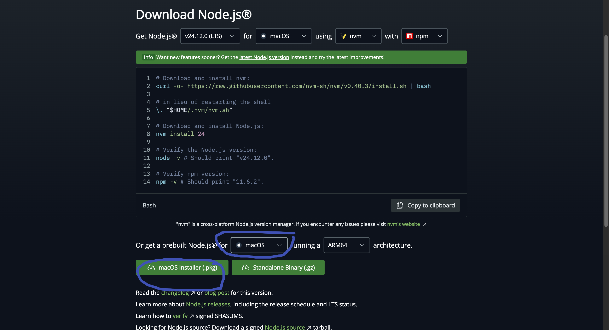
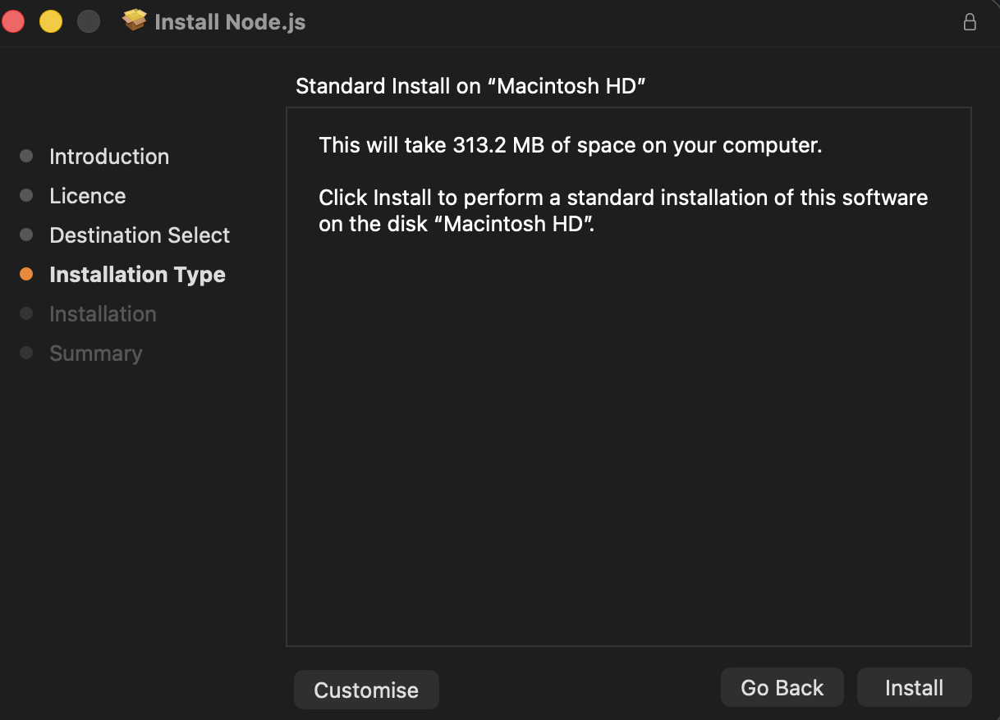
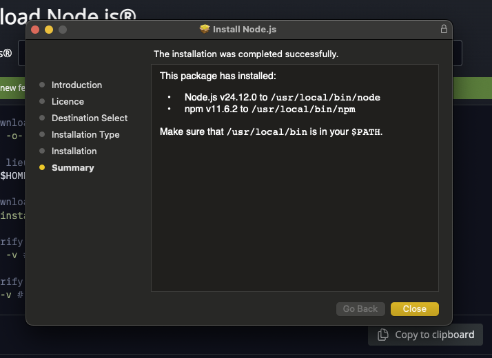
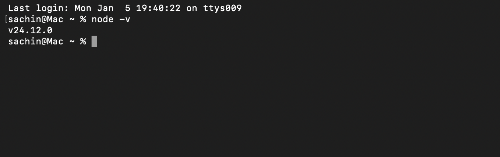
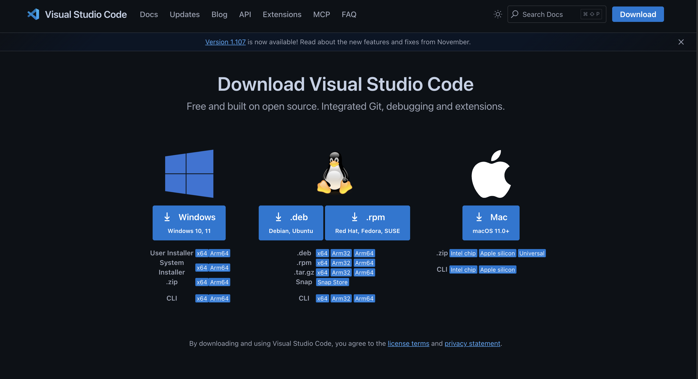
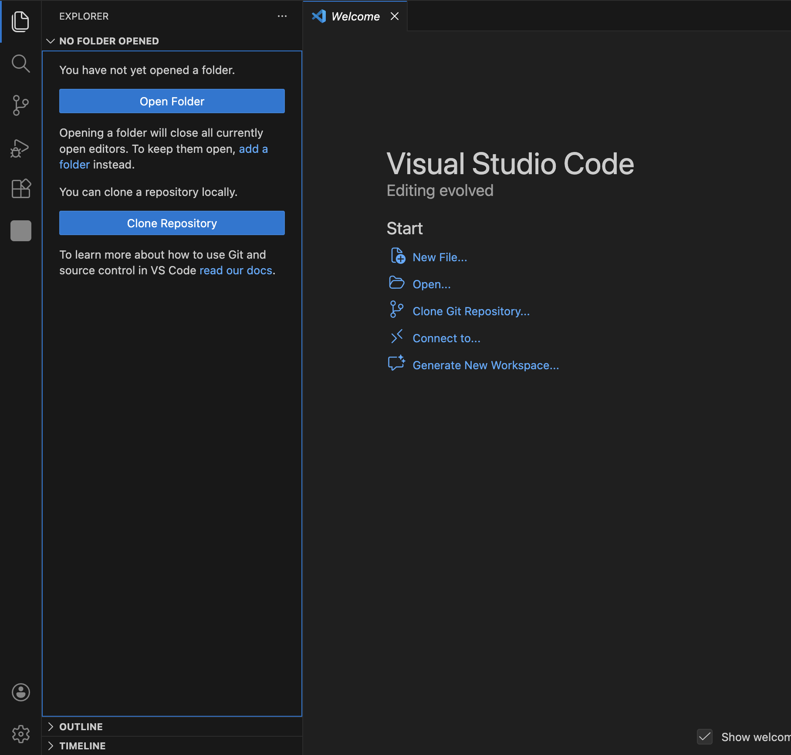

# Lesson 01 · Installing Node.js and VS Code

## What Are We Setting Up?

Before you can run Claude Code, your machine needs two foundational tools. Think of them as the **engine** and the **cockpit** — one runs the code, the other is where you work.

This lesson walks you through installing both, step by step.

---

## Why These Tools?

| Tool | What It Is | Why You Need It |
|---|---|---|
| **Node.js** | A runtime that lets your computer run JavaScript | Claude Code is built on it — won't run without it |
| **VS Code** | A code editor (like Word, but for code) | Where you'll write, view, and manage all your files |
| **Claude Code** | AI coding assistant inside your terminal | The tool you'll use to build and explore AI workflows |

> Even if you never write a single line of code, these tools give you a structured environment to follow along, run demos, and understand how AI workflows actually work.

---

## Prerequisites

| Requirement | Details |
|---|---|
| **Operating System** | macOS or Windows 10 and later |
| **Claude Subscription** | An active Claude.ai plan (required for Claude Code) |
| **Node.js Version** | 18 or higher |

---

## Phase 1 · Installing Node.js

Node.js is the engine that powers Claude Code behind the scenes. Without it, Claude Code simply won't run.

### Step 1 — Go to the Node.js Download Page

Visit **[https://nodejs.org/en/download](https://nodejs.org/en/download)**



---

### Step 2 — Select Your Operating System and Download

- **Mac** → click the **macOS Installer (.pkg)**
- **Windows** → click the **Windows Installer (.msi)**

Always choose the **LTS (Long Term Support)** version — it's the most stable and widely tested release.



---

### Step 3 — Run the Installer

Open the downloaded file and follow the on-screen prompts:

- **Mac:** Click **Continue** through each step → click **Install**
- **Windows:** Click **Next** through each step → click **Install**

The installer handles everything automatically — no manual configuration needed.



---

### Step 4 — Verify Node.js is Installed

Open your **Terminal** (Mac) or **Command Prompt** (Windows) and run:

```bash
node -v
```

You should see a version number like `v20.11.0` printed back. If you see a number, Node.js is installed correctly.



---

> ✅ **Node.js is installed.** You're ready for Phase 2.

---

## Phase 2 · Installing Visual Studio Code

VS Code is where you'll do all your work — browsing files, reading code, and running Claude Code. It's free, lightweight, and the most widely used code editor in the world.

### Step 1 — Go to the VS Code Download Page

Visit **[https://code.visualstudio.com/Download](https://code.visualstudio.com/Download)**



---

### Step 2 — Download and Install

- **Mac** → download the **.dmg** file → open it → drag VS Code into your **Applications** folder
- **Windows** → download the **.exe** file → open it → follow the installer prompts → click **Install**



---

### Step 3 — Launch VS Code

Open **Visual Studio Code** from your Applications folder (Mac) or Start Menu (Windows).

You'll land on the Welcome screen — your workspace is ready.

---

> ✅ **You're done!** Node.js and VS Code are both installed and ready on your machine.

---

## What You Learned in This Lesson

| Concept | What It Means |
|---|---|
| **Node.js** | The JavaScript runtime that Claude Code is built on — required for it to run |
| **LTS version** | "Long Term Support" — the stable, production-safe release to always choose |
| **VS Code** | A free, lightweight code editor — your primary workspace for the rest of this workshop |
| **Why both are needed** | Node.js is the engine; VS Code is the cockpit — Claude Code needs both to operate |

---

## Next Lesson

The tools are installed. Now you'll connect Claude to your account and run it inside VS Code for the first time.

**[→ Module 02, Lesson 01: Setting Up Claude Code](../module-02-installing-vscode-and-claude-code/lesson-01-setting-up-claude.md)**
