# Lesson 02 · Setting Up Claude Code

## What is Claude Code?

Claude Code is an AI assistant that lives directly inside your terminal and VS Code. Instead of switching between browser tabs and tools, you ask Claude questions, generate files, explore codebases, and run tasks — all without leaving your editor.

It's not a chatbot in a browser. It's AI built into your actual development workflow.

---

## Claude Code vs Other Ways to Use Claude

| | Claude.ai (Browser) | Claude API | Claude Code |
|---|---|---|---|
| **Where it runs** | Browser tab | Your own app | Terminal + VS Code |
| **Best for** | Quick questions, writing | Building AI products | Development workflows |
| **Sees your files** | ❌ No | ❌ Not by default | ✅ Yes — full project access |
| **Runs commands** | ❌ No | ❌ No | ✅ Yes |
| **Setup needed** | Just a login | API key + code | npm install + login |

> **Bottom line:** Claude Code is the most powerful way to use Claude if you're working inside a project — it sees your files, understands your codebase, and can take real actions.

---

## Prerequisites

| Requirement | Details |
|---|---|
| **Claude Subscription** | A paid Claude plan (Pro or Max) is required |
| **Node.js** | Version 18 or above must be installed |
| **VS Code** | Must be installed to run Claude inside the editor |

---

## Phase 1 · Getting a Claude Subscription

### Step 1 — Go to the Claude Code Page and Subscribe

Visit **[https://claude.com/product/claude-code](https://claude.com/product/claude-code)** and select a plan.

The **Pro plan** is sufficient for this workshop.

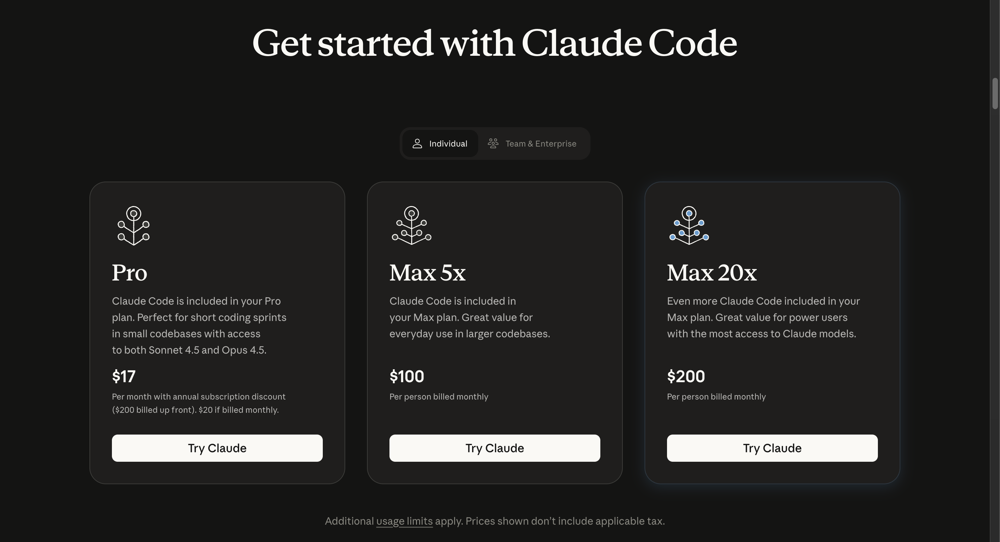

---

### Step 2 — Connect Claude to Your Email

After selecting Claude Code, you'll be prompted to sign in with your email address. Enter it and complete the sign-in process.

---

### Step 3 — Complete Your Subscription

Provide your payment details and choose a monthly or annual plan. Once payment is complete, your subscription is active.

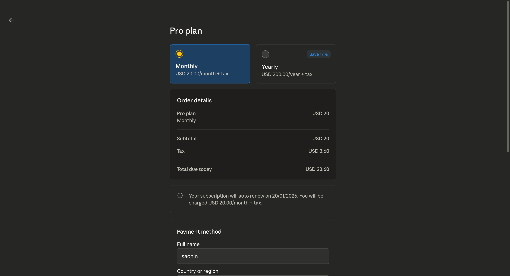

---

> ✅ **Your Claude subscription is active.** Now let's install Claude Code on your machine.

---

## Phase 2 · Installing Claude Code

### Step 1 — Open Your Terminal

| OS | How to Open Terminal |
|---|---|
| **Mac** | `Command + Space` → type `Terminal` → `Enter` |
| **Windows** | `Windows Key + R` → type `cmd` → `Enter` |

---

### Step 2 — Install Claude Code

Run this command in your terminal:

```bash
npm install -g @anthropic-ai/claude-code
```

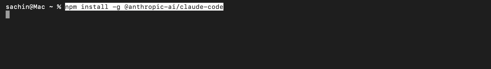

You'll see a success message once the installation finishes.

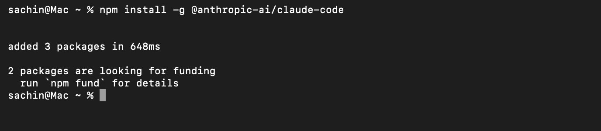

---

### Step 3 — Verify the Installation

Confirm Claude Code is installed correctly by running:

```bash
claude --version
```

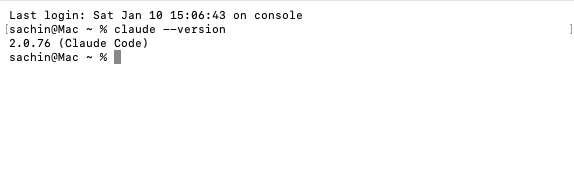

If you see a version number like `claude 1.0.0` — you're good to go.

---

### Troubleshooting — "claude: command not found"

If you get a command not found error, run these steps to fix your PATH:

**1. Create npm global directory:**
```bash
mkdir ~/.npm-global
npm config set prefix '~/.npm-global'
```

**2. Add to your PATH:**

For zsh (default on macOS):
```bash
echo 'export PATH=~/.npm-global/bin:$PATH' >> ~/.zprofile
source ~/.zprofile
```

For bash:
```bash
echo 'export PATH=~/.npm-global/bin:$PATH' >> ~/.bashrc
source ~/.bashrc
```

**3. Reinstall Claude Code:**
```bash
npm install -g @anthropic-ai/claude-code
```

---

### Troubleshooting — EACCES Permission Error

If you see an `EACCES: permission denied` error during install, follow these steps:

**1. Create a `.zshrc` file:**
```bash
touch ~/.zshrc
```

**2. Add nvm initialization:**
```bash
echo 'export NVM_DIR="$HOME/.nvm"' >> ~/.zshrc
echo '[ -s "$NVM_DIR/nvm.sh" ] && \. "$NVM_DIR/nvm.sh"' >> ~/.zshrc
source ~/.zshrc
```

**3. Install Node via nvm:**
```bash
nvm install 24
nvm use 24
```

**4. Reinstall Claude Code:**
```bash
npm install -g @anthropic-ai/claude-code
```


---

## Phase 3 · Running Claude Code in VS Code

### Step 1 — Open VS Code

Open **Visual Studio Code** from your Applications folder (Mac) or Start Menu (Windows).

---

### Step 2 — Open Your Forked Repository

In VS Code, click **File → Open Folder** (or `Cmd + O` on Mac / `Ctrl + O` on Windows).

Navigate to the folder where your forked `ai-community-site` repository was cloned by GitHub Desktop, select it, and click **Open**.

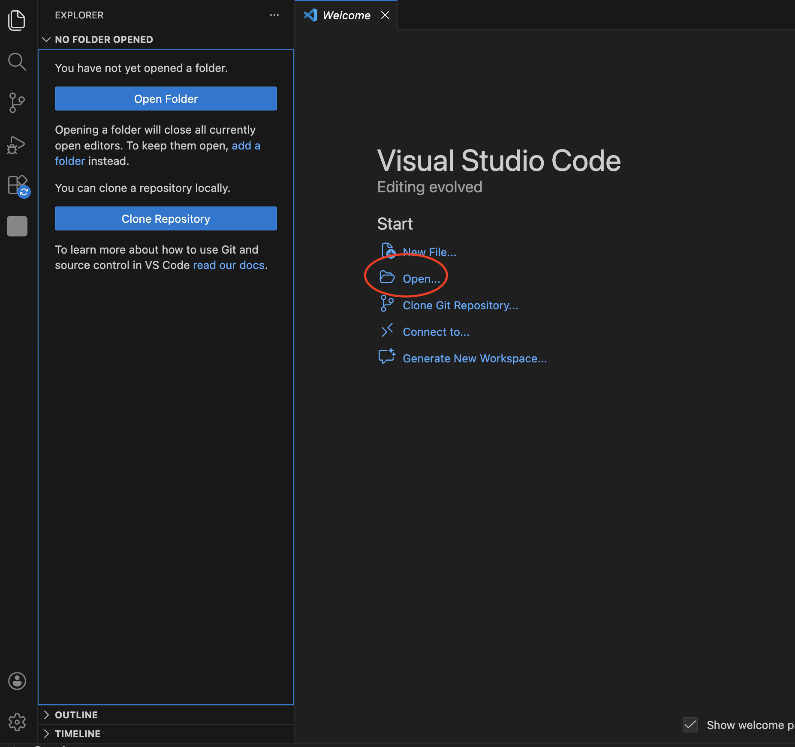

You'll see all the project files appear in the VS Code Explorer panel on the left.

---

### Step 3 — Open the Terminal Inside VS Code


Once the folder is opened Click **Terminal → New Terminal** from the VS Code menu.

The terminal will open at the root of your project folder.

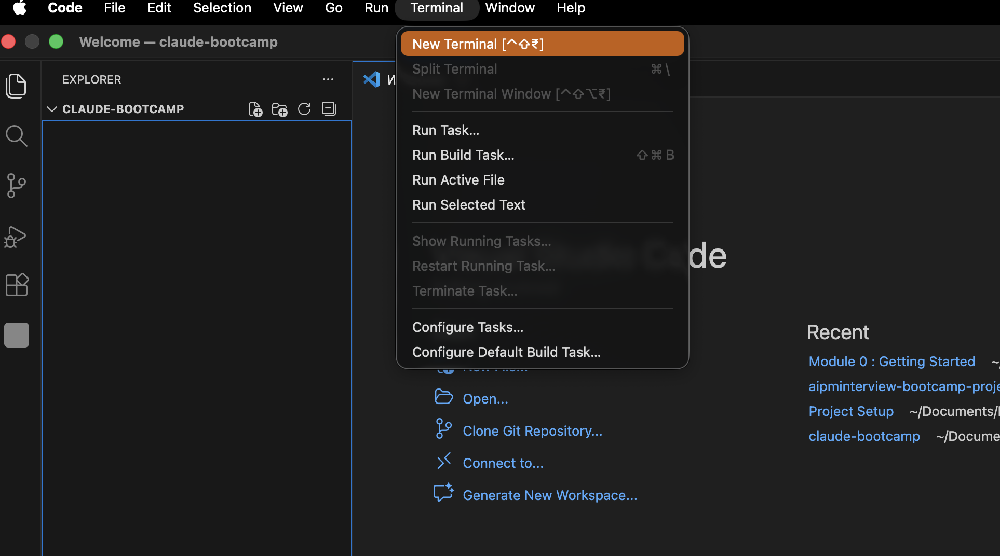

---

### Step 4 — Launch Claude

In the terminal, type:

```bash
claude
```

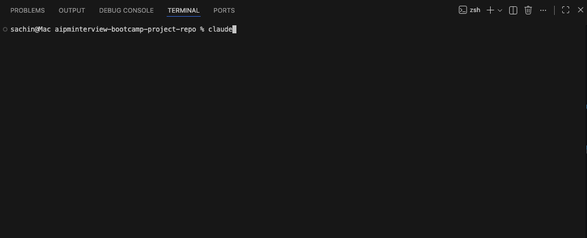

---

### Step 5 — Select a Theme

Use the **Up/Down arrow keys** to pick a theme, then press **Enter** to confirm. The dark theme is selected by default — just press **Enter** to keep it.

---

### Step 6 — Choose Account Type and Sign In

Claude will show two options — select **Claude account with subscription** (the default) and press **Enter**.

Your browser will open automatically. Log in with the account that has your active subscription and click **Authorize**.

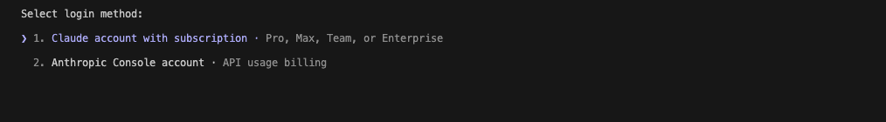

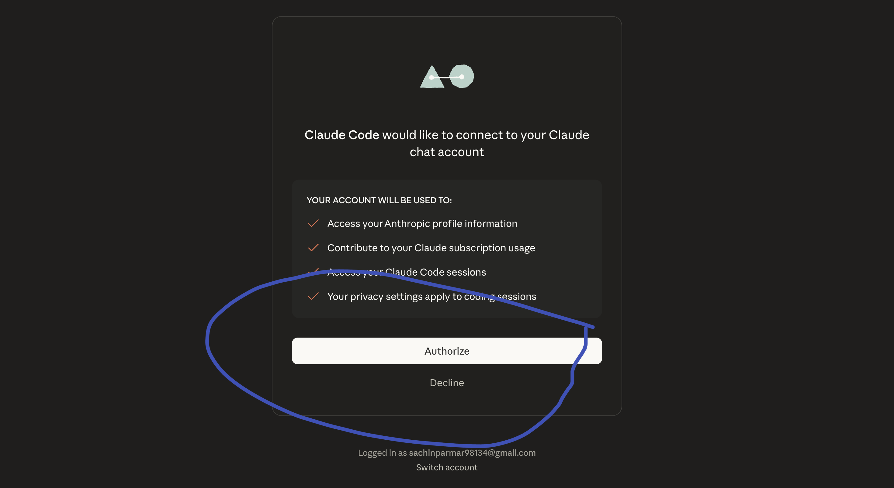

---

### Step 7 — Finish Login and Configure

1. You'll see **Login successful** — press **Enter**

   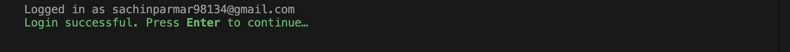

2. Claude will ask about settings — press **Enter** to accept defaults
3. Claude will ask about trusting files — click **Yes**

   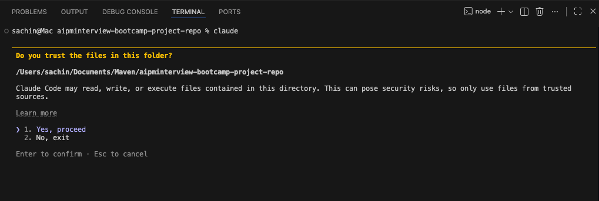

---

### Step 8 — Test That Claude is Working

Once you see the Claude prompt, type a test question:

```
What is 2+2?
```

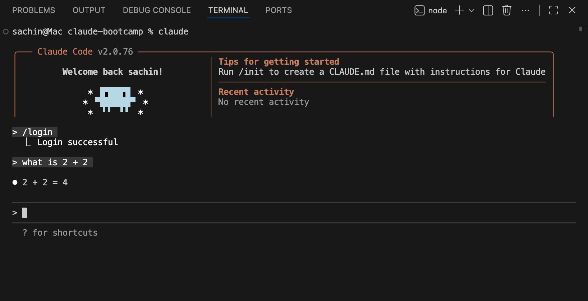

If Claude responds — you're fully set up.

---

> ✅ **You're done!** Claude Code is installed, authenticated, and running inside VS Code.

---

---

## What You Learned in This Lesson

| Concept | What It Means |
|---|---|
| **Claude Code** | An AI agent that lives in your terminal — it can read files, run commands, and edit code |
| **Claude vs Browser Claude** | Claude Code sees your entire project and can take real actions — the browser version cannot |
| **Authentication** | Claude uses your subscription credentials to connect — same account as claude.ai |
| **Permission model** | Claude always asks before doing anything — you stay in control of every action |
| **Active agent** | Once launched, Claude has file access and shell access — it's not just a chatbot |

---

## Next Lesson

Claude is running and authenticated. Now you'll learn how branches work — the foundation of every code change you'll ever make in a team.

**[→ Module 03, Lesson 01: Creating a Branch](../module-03-creating-branches/lesson-01-creating-a-branch.md)**

---

## Additional Resources

- [Claude Code Documentation](https://code.claude.com/docs/en/overview#npm) — Official setup and usage docs
- [Anthropic Claude Code in Action Course](https://anthropic.skilljar.com/claude-code-in-action) — Free deep-dive course from Anthropic
