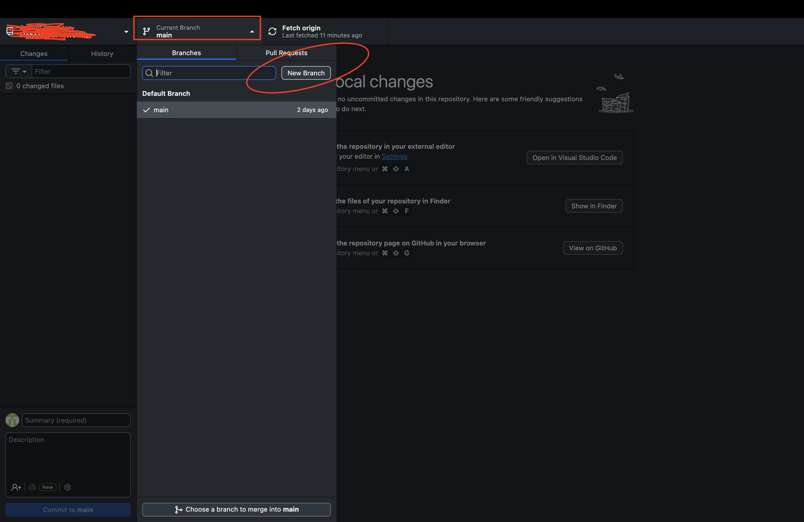
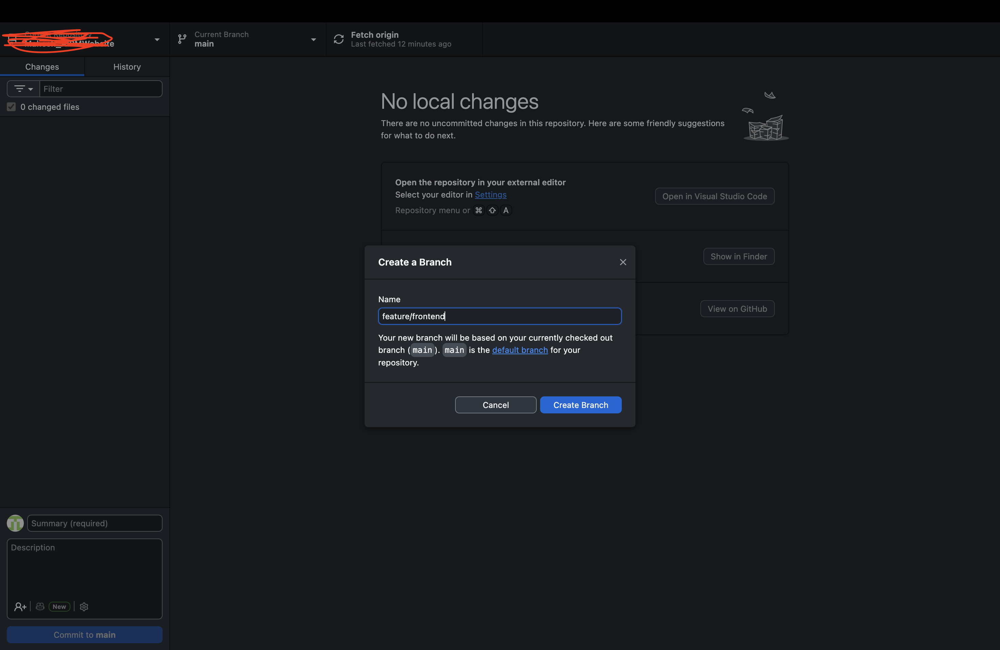
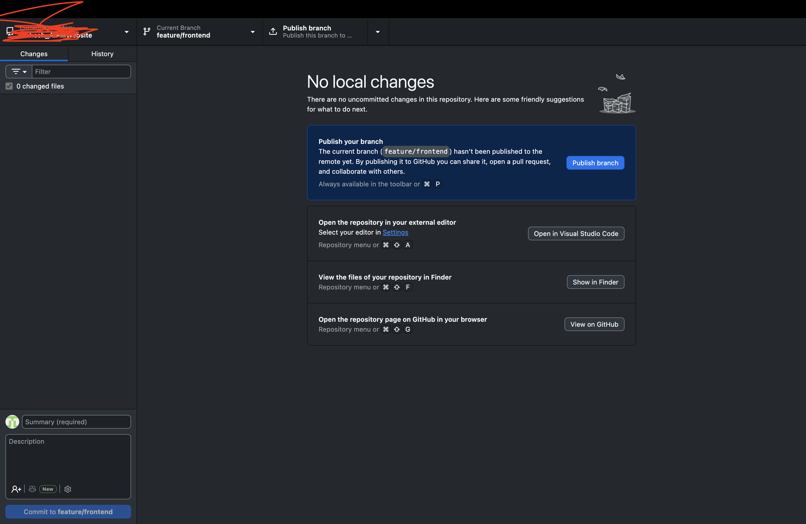

# Lesson 01 · Creating a Branch

## What is a Branch?

A **branch** is an independent copy of your project where you can make changes freely — without affecting the main version of the codebase.

Think of it like a **parallel universe** for your code. The original project stays safe and untouched on the `main` branch while you experiment, build, or fix things on your own branch. When your work is ready and reviewed, it gets merged back in.

---

## Why Branches Matter

| Without Branches | With Branches |
|---|---|
| Everyone edits the same files at the same time | Each person works in their own isolated space |
| One bad change breaks the whole project | Mistakes stay contained to your branch |
| No way to review work before it goes live | Changes go through review (Pull Request) before merging |
| Impossible to work on two things at once | Multiple features can be built in parallel |

> **As a PM**, understanding branches means you can track exactly what's being built, by whom, and review it before it ships. Every feature, fix, or experiment on your team lives in a branch.

---

## Branch Naming — Best Practices

A good branch name tells anyone on the team what the branch is for at a glance. Follow these conventions:

| Pattern | Example | Use When |
|---|---|---|
| `feature/description` | `feature/user-login-page` | Building something new |
| `fix/description` | `fix/broken-signup-button` | Fixing a bug |
| `update/description` | `update/homepage-copy` | Updating existing content |
| `your-name/description` | `mahesh/add-pricing-page` | Personal branches in a team |

**Rules to follow:**
- Use **lowercase only** — no capital letters
- Use **hyphens** to separate words, never spaces or underscores
- Keep it **short but descriptive** — 3 to 5 words is the sweet spot
- Never name a branch just `test` or `new-branch` — that tells no one anything

---

## Phase 1 · Creating and Publishing a Branch

### Step 1 — Open GitHub Desktop

Open the **GitHub Desktop** app on your machine.

Make sure you're inside the correct repository — you'll see the repo name displayed in the top-left corner of the app.



---

### Step 2 — Click on "Current Branch" and Select "New Branch"

At the top center of the app, you'll see a button showing **"Current Branch: main"**.

Click on it — a dropdown will appear. Click **"New Branch"** at the top of that dropdown.

> This is how you branch off from `main`. Whatever is currently in `main` becomes the starting point of your new branch.


---

### Step 3 — Name Your Branch

A dialog box will appear asking you to name the branch.

Type a descriptive name following the best practices above — for example:

```
feature/add-about-page
```

or

```
mahesh/update-hero-section
```

Then click **"Create Branch"**.



---

### Step 4 — Publish the Branch to GitHub

Your branch currently only exists on your local machine. To make it visible on GitHub (so your team can see it and review your work), you need to **publish** it.

Click the **"Publish branch"** button that appears in the top bar.

GitHub Desktop will push the branch up to GitHub — it now exists both locally on your machine and remotely on github.com.

> Once published, anyone on your team can see your branch, leave comments, and review your changes when you open a Pull Request.



---

> ✅ **Your branch is live.** It exists on GitHub and is ready for you to start making changes. Everything you commit from here will go to this branch — not `main`.

---

---

## What You Learned in This Lesson

| Concept | What It Means |
|---|---|
| **Branch** | An isolated copy of the project where you can make changes without affecting `main` |
| **`main` branch** | The official, production version of the project — always kept clean and working |
| **Branch naming** | Lowercase, hyphenated, descriptive names like `feature/add-about-page` signal intent instantly |
| **Publishing a branch** | Pushing your local branch to GitHub so the team can see it and review your work |
| **Why branches matter to PMs** | Every feature, fix, and experiment on your team lives in a branch — knowing this lets you track exactly what's being built |

---

## Next Lesson

Your branch is created and live on GitHub. Now you'll open the project in VS Code, use Claude Code to run the app, and make your first real UI change.

**[→ Module 04, Lesson 01: Running and Editing Your Repo with Claude Code](../module-04-making-changes-in-cloned-repo/lesson-01-running-and-editing-with-claude.md)**
