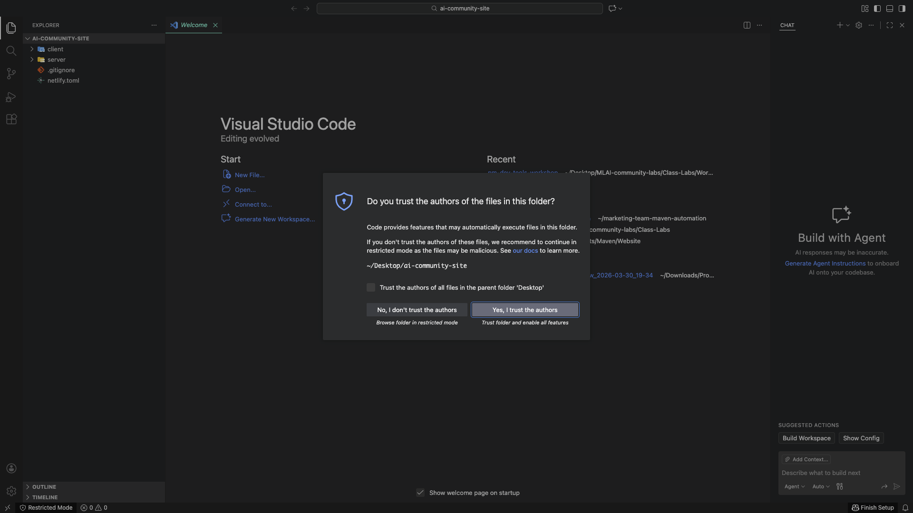
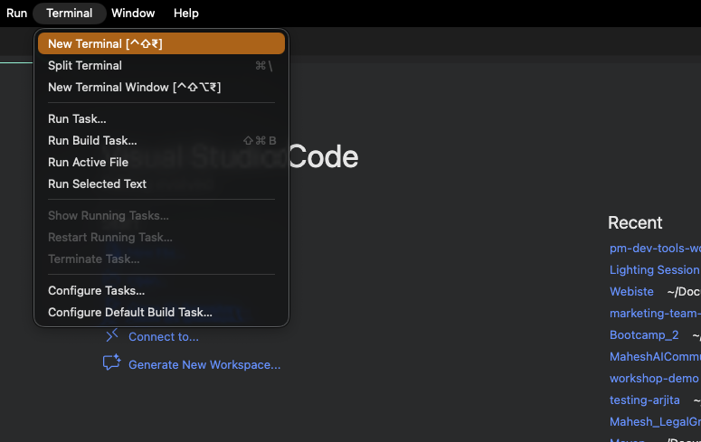
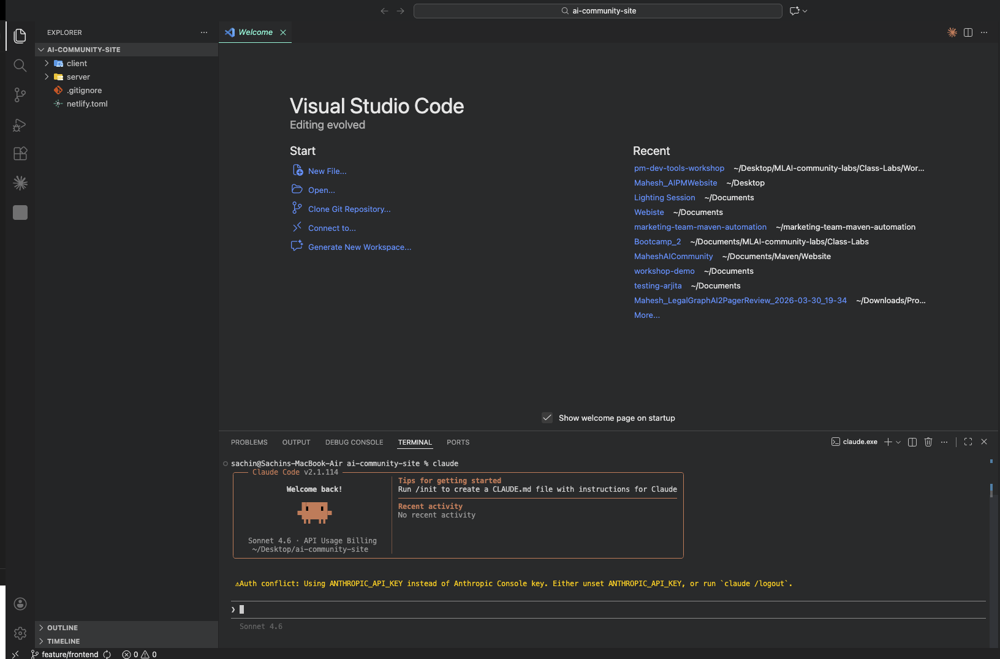
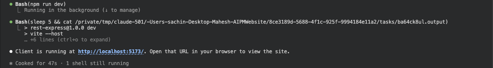
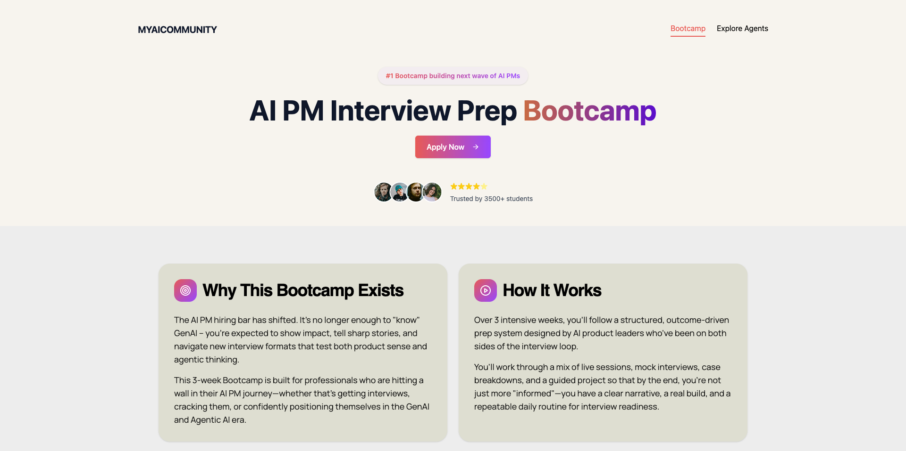
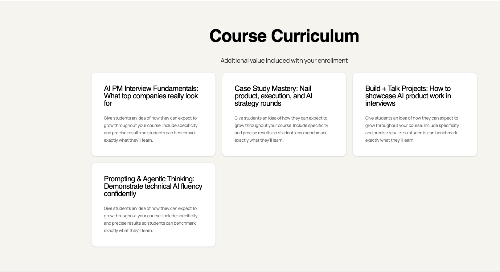
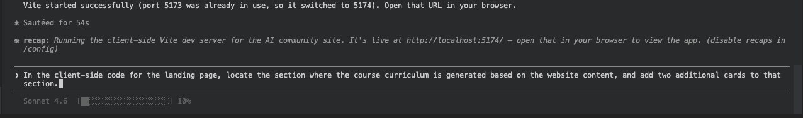

# Lesson 01 · Running and Editing Your Cloned Repo with Claude Code

## What You Will Do in This Lesson

In the previous modules you set up GitHub, installed VS Code and Claude Code, and created a branch. Now it's time to **actually work inside the code**.

In this lesson you will:

1. Open your cloned repository inside VS Code
2. Use Claude Code to run the project's client-side web app
3. View the live app in your browser
4. Give Claude a natural-language instruction to modify the UI — and watch it make the change for you

By the end of this lesson you'll understand how a PM can direct code changes without writing a single line of code manually.

---

## Why This Matters

Most PMs live outside the codebase — they write specs, review designs, and wait for engineers to deliver. Claude Code collapses that gap. You can:

- **Run the app** yourself to see exactly what users see
- **Make UI changes** by describing what you want in plain English
- **Understand what changed** by reading the diff Claude produces

This is not about replacing engineers. It's about being a more informed, faster-moving product leader who can prototype, validate, and communicate with precision.

---

## Phase 1 · Opening the Cloned Repository in VS Code

### Step 1 — Open VS Code

Launch **Visual Studio Code** from your Applications folder (Mac) or Start Menu (Windows).

You will see the VS Code Welcome screen.



---

### Step 2 — Open Your Cloned Repository Folder

Click **File → Open Folder** in the top menu bar.

> On Mac you can also use the keyboard shortcut: `Cmd + O`  
> On Windows: `Ctrl + K, Ctrl + O`

A file browser dialog will appear. Navigate to the folder where you cloned the repository in the previous module. Select that folder and click **Open**.


**What is happening here?**  
VS Code is loading the entire project folder into its workspace. It reads the folder structure, indexes all files, and makes everything accessible in the left-hand sidebar called the **Explorer**.

---

### Step 3 — Explore the Project in the Sidebar

On the left side of VS Code you will now see the **Explorer panel** — a tree view of every file and folder in the repository.


Take a moment to look at the structure. You will typically see folders like:

| Folder / File | What It Is |
|---|---|
| `client/` | The front-end web application (the landing page) |
| `server/` | The back-end API (handles data and logic) |
| `package.json` | Lists the project's dependencies and available commands |
| `README.md` | Documentation for the project |

> **As a PM**, this folder structure tells you the architecture at a glance. A `client/` + `server/` split means a **full-stack** app — a separate front end and back end. Any UI change lives in `client/`. Any data or API change lives in `server/`.

---

> ✅ **Your repo is open.** VS Code can now see every file in the project.

---

## Phase 2 · Launching Claude Code Inside VS Code

### Step 1 — Open a New Terminal in VS Code

Click **Terminal → New Terminal** from the top menu.

The terminal panel will slide open at the bottom of VS Code, already pointed at the root of your project folder. You do not need to navigate anywhere — you are already in the right place.



**Why use the terminal inside VS Code instead of a separate terminal window?**  
VS Code's built-in terminal is automatically positioned at your project's root directory. This means any command you run — including Claude — starts with full context of your project files. There's no risk of being in the wrong folder.

---

### Step 2 — Start Claude Code

In the terminal, type the following command and press **Enter**:

```bash
claude
```



Claude Code will start up. You will see the Claude prompt appear, indicating it is ready for your instructions.

**What is happening behind the scenes?**  
When you run `claude`, the Claude Code CLI:
1. Reads your current directory to understand the project context
2. Authenticates against Anthropic's servers using your subscription credentials
3. Initializes a session — Claude now has access to read, write, and execute within your project
4. Presents an interactive prompt where you can type natural-language instructions

Claude is not just a chatbot at this point — it is an **active agent** with file access and the ability to run shell commands inside your project.

---

> ✅ **Claude is running.** You now have an AI agent operating inside your project directory.

---

## Phase 3 · Running the Client-Side Application

### Step 1 — Give Claude the Command to Run the App

At the Claude prompt, type the following and press **Enter**:

```
Run the client-side code.
```



You are giving Claude a plain-English instruction. You are not specifying *how* to run it — Claude will figure that out by reading the project's configuration files.

---

### Step 2 — Grant Permissions When Claude Asks

Claude will inspect the project, identify the correct command to start the development server, and then ask your permission before executing it.

You will see a permission prompt similar to:

```
Claude wants to run: npm run dev
```


> Claude may ask for permission more than once — for example, once to read `package.json` and once to execute the dev server command. Grant all permissions as they appear.

**Why does Claude ask for permission?**  
Claude Code is designed with a **human-in-the-loop** model. It never takes an action — reading a file, running a command, editing code — without your explicit approval. This is a safety mechanism. You are always in control of what Claude does. This is especially important when Claude executes shell commands, because a shell command can start processes, install packages, or modify files.

**What is happening behind the scenes when you say yes?**  
Claude reads the project's `package.json` file to find the script that starts the development server. In most modern JavaScript/React projects this is `npm run dev` or a similar command. When you approve, Claude executes that command in the terminal. The command:
1. Launches **Vite** (or another bundler like Webpack) — the tool that compiles and serves the front-end code
2. Watches all files in the `client/` folder for changes
3. Starts a local HTTP server on your machine

---

### Step 3 — Confirm the Dev Server is Running

Once the server starts, you will see a message in the terminal:

```


  ➜  The client dev server is running at http://localhost:5174/                                         

```


The key line is:

```
The client dev server is running at http://localhost:5174/
```

**What does this mean?**  
Your computer is now acting as a **local web server**. The URL `http://localhost:5174/` points to your own machine — `localhost` means "this computer" and `5174` is the **port** (think of it as a specific door on your computer through which the web app is served). This is a private URL — only you can see it, running entirely on your machine. No internet connection to an external server is needed.

---

> ✅ **The app is running locally.** Your machine is serving the web application.

---

## Phase 4 · Viewing the App in the Browser

### Step 1 — Open Chrome

Open **Google Chrome** (or any browser).

---

### Step 2 — Navigate to the Local URL

In the browser address bar, type the following and press **Enter**:

```
http://localhost:5174/
```



You will see the landing page of the project — rendered live from the code on your machine.

**What is happening here?**  
Your browser sends an HTTP request to `localhost:5174`. The Vite development server receives that request and responds with the compiled HTML, CSS, and JavaScript that make up the landing page. Your browser renders it exactly as any website would — except this is running entirely on your local machine, not on the internet.

> **As a PM**, this is your **preview environment** — the same page your users will see, but running locally so you can safely experiment. Any changes you make (with Claude's help) will appear here in real time.

---

> ✅ **You can see the live app.** Everything is working end-to-end on your machine.

---

## Phase 5 · Making a UI Change Using Claude Code

Now comes the most powerful part of this lesson: directing Claude to modify the application's UI using a plain-English prompt — no manual code editing required.

### What You Will Change

The landing page has a **Course Curriculum** section that displays course topics as cards. You are going to instruct Claude to add **two additional cards** to that section.



---

### Step 1 — Give Claude the Modification Prompt

In the Claude terminal prompt, type the following exactly:

```
In the client-side code for the landing page, locate the section where the course curriculum is generated based on the website content, and add two additional cards to that section.
```



Press **Enter**.

**What is happening behind the scenes at this point?**  
Claude receives your instruction and begins a multi-step reasoning process:

1. **Understand the intent** — Claude parses your sentence and identifies the goal: find the Course Curriculum section and add two cards.
2. **Explore the codebase** — Claude reads the file tree inside `client/src/` and identifies which files are likely relevant. It looks for files named things like `LandingPage.jsx`, `Curriculum.jsx`, `App.jsx`, or similar.
3. **Read the relevant files** — Claude opens and reads those files to understand how the curriculum cards are currently structured — are they hard-coded objects? Generated from an array? Pulled from a data file?
4. **Form a plan** — Claude decides exactly what code to add and where to insert it.
5. **Ask for your permission** — before writing a single character to any file, Claude shows you what it intends to change and asks you to approve.

---

### Step 2 — Review and Grant Permission to Edit

Claude will display a **diff** — a before-and-after view of the proposed code change — and ask for your permission:

```
Claude wants to edit: client/src/components/LandingPage.jsx
Allow? (y/n)
```

The diff will look something like this:

```diff
  {
    title: "Module 3 – AI Tools for Research",
    description: "..."
  },
+ {
+   title: "Module 4 – Building with Claude Code",
+   description: "Use Claude to read, edit, and run real code projects."
+ },
+ {
+   title: "Module 5 – Shipping and Collaboration",
+   description: "Learn how to push changes, create pull requests, and collaborate."
+ },
```


Review the proposed change. When you are satisfied, type **`y`** and press **Enter**.

**Why does Claude show you the diff before making changes?**  
This is a core safety principle of Claude Code: **explicit human approval before any file modification**. Claude never silently rewrites your code. Showing the diff means:
- You can verify Claude understood your intent correctly
- You can catch any unexpected or incorrect changes before they happen
- You remain the final decision-maker — Claude is a collaborator, not an autonomous agent

**What happens when you approve?**  
Claude writes the changes to the file on disk. Vite (the development server still running in the background) detects that the file changed, instantly recompiles the affected module, and pushes an update to your browser — this is called **Hot Module Replacement (HMR)**. The browser refreshes automatically (or updates without a full refresh) to reflect the new UI.

---

### Step 3 — Verify the Change in the Browser

Switch back to Chrome. The page will have automatically updated (or you can manually refresh with `Cmd + R` / `Ctrl + R`).

Scroll to the **Course Curriculum** section of the landing page.


You will see the two new cards Claude added — rendered live in the browser, exactly as a user would see them.

**What just happened, end to end?**

| Step | What Occurred |
|---|---|
| You typed a prompt | Claude received a natural-language instruction |
| Claude explored the codebase | Claude read the project files to understand structure |
| Claude proposed a change | A diff was shown for your review |
| You approved | Claude wrote the change to the file on disk |
| Vite detected the change | The dev server recompiled the module automatically |
| Browser updated | Hot Module Replacement reflected the new UI instantly |
| You saw the result | Two new curriculum cards appeared on the landing page |

> **As a PM**, this workflow gives you a superpower: you can explore the UI, suggest changes, and validate them visually — in real time — before a single line goes to a pull request or a sprint. You are no longer dependent on waiting for an engineer to make a "quick change" to see if something looks right.

---

> ✅ **You have successfully modified the app using Claude Code.** The change lives in your local files and is visible in your browser.

---

## Summary — What You Learned in This Lesson

| Concept | What It Means |
|---|---|
| **Opening a repo in VS Code** | The Explorer panel gives you a full view of all project files |
| **VS Code terminal** | A terminal that starts inside your project root — no manual navigation needed |
| **`claude` command** | Launches Claude Code as an active agent with file and shell access |
| **Permission prompts** | Claude always asks before reading, writing, or running anything |
| **Local dev server** | Your machine serves the app at `localhost:5174` — private, instant, no deployment needed |
| **Natural-language editing** | You describe *what* to change; Claude finds the code, proposes the diff, and writes it |
| **Hot Module Replacement** | Vite watches for file changes and instantly updates the browser — no manual refresh needed |

---

## Next Lesson

The two new curriculum cards are sitting on your machine, saved in your branch. Now you'll push them to GitHub and open a Pull Request for your team to review.

**[→ Module 05, Lesson 01: Pushing Changes and Creating a Pull Request](../module-05-branching-and-pull-requests/lesson-01-creating-a-pull-request.md)**
