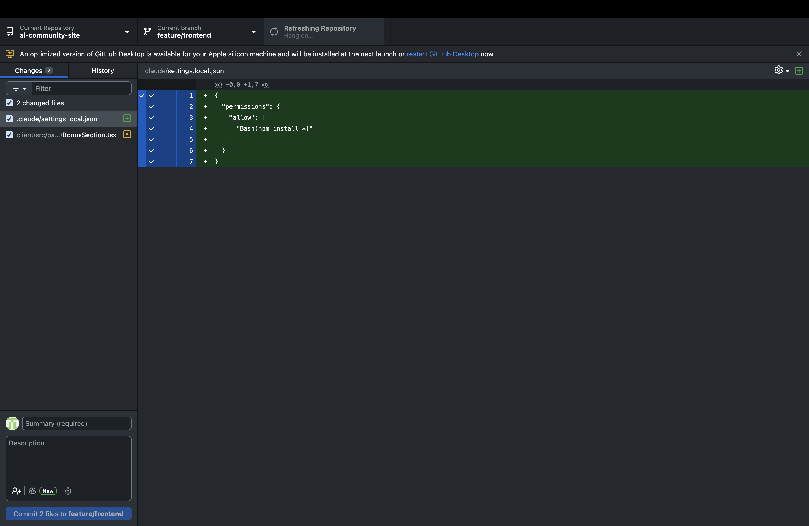
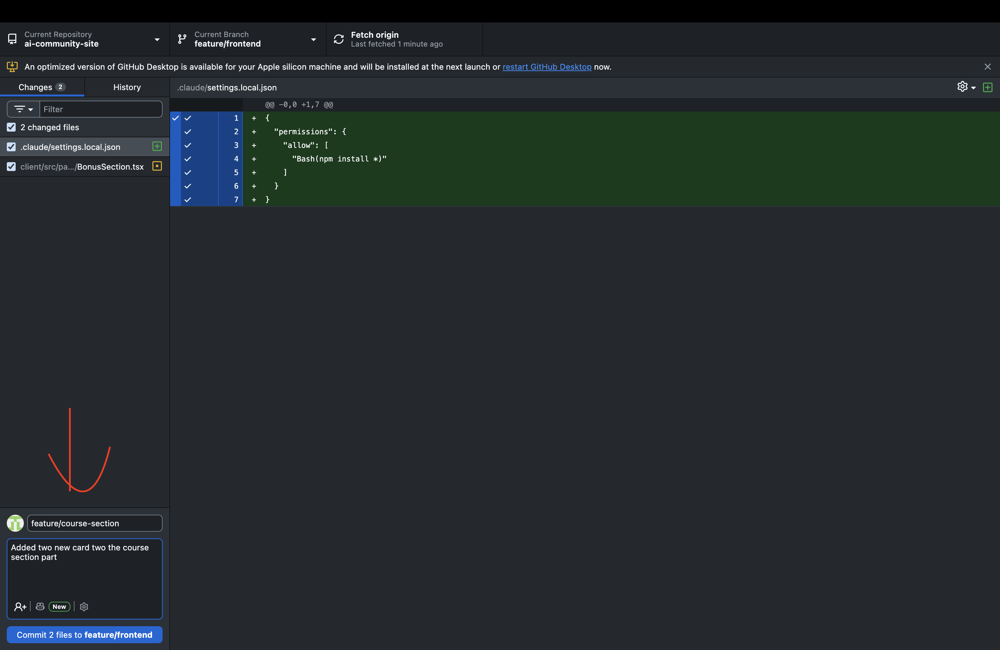
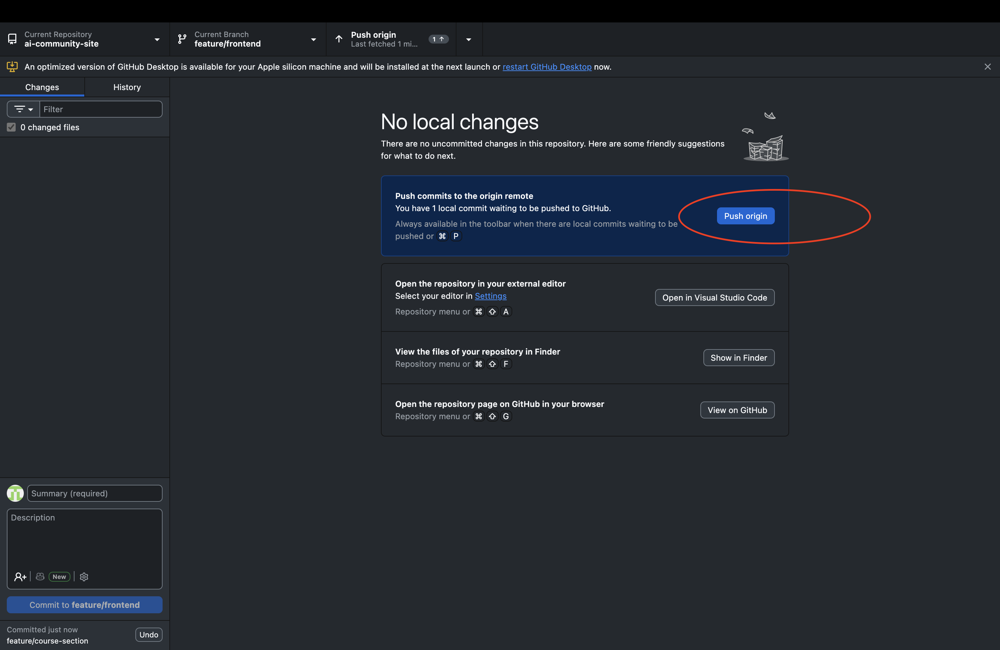
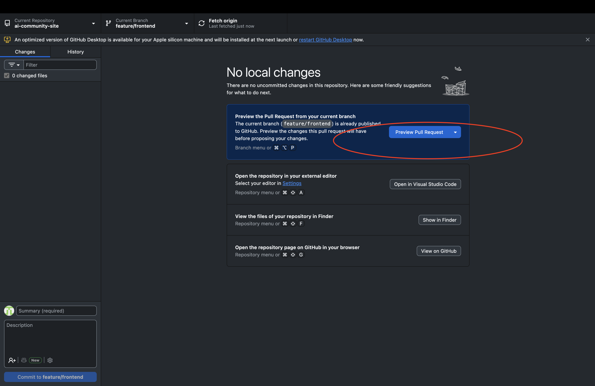
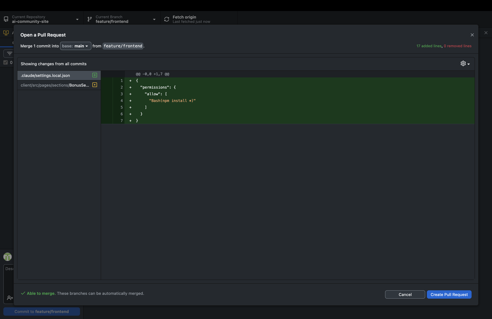
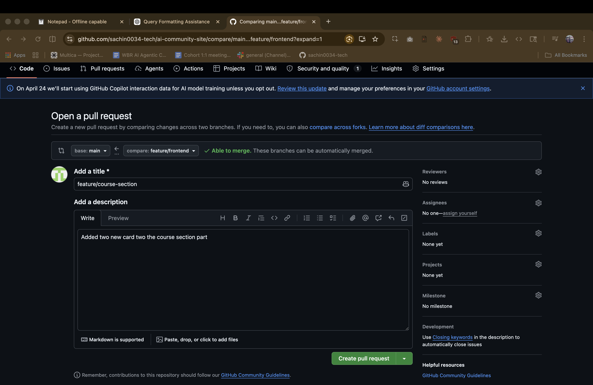

# Lesson 01 · Pushing Changes and Creating a Pull Request

## What You Will Do in This Lesson

In the previous lesson you used Claude Code to make a real change to the codebase — adding two new cards to the Course Curriculum section. That change currently lives only on your local machine. In this lesson you will:

1. See your changes inside GitHub Desktop
2. Write a commit message and commit your changes
3. Push your branch to GitHub
4. Open a Pull Request for your team to review
5. Understand what happens next — the review and merge process

By the end of this lesson your change will be visible on GitHub and ready for a teammate to review and approve.

---

## Why This Matters

Making a change locally is only half the job. The other half is getting that change reviewed, approved, and merged into the main codebase in a way the whole team trusts. That process is called a **Pull Request (PR)** — and it is one of the most important workflows in modern software development.

> **As a PM**, understanding the PR process means you can:
> - Track exactly when a feature ships from code to main branch
> - Review the actual change before it goes live — not just a spec
> - Write clear PR descriptions that give engineers the context they need to review quickly
> - Spot if a change is larger or smaller than what was asked for

---

## Key Concepts Before You Start

| Term | What It Means |
|---|---|
| **Commit** | A saved snapshot of your changes, with a message describing what you did |
| **Push** | Uploading your local commits to GitHub so others can see them |
| **Pull Request (PR)** | A formal request for your team to review your branch and merge it into `main` |
| **Merge** | Combining your branch's changes into the `main` branch |
| **Review** | A teammate reads your diff, leaves comments, and approves or requests changes |

Think of it like this: a **commit** is saving your work, a **push** is emailing it to the team, and a **Pull Request** is the meeting where everyone reviews and signs off.

---

## Phase 1 · Reviewing Your Changes in GitHub Desktop

### Step 1 — Open GitHub Desktop

Open the **GitHub Desktop** application on your machine.

GitHub Desktop will automatically detect that files in your repository have changed since your last commit. It reads your local file system and compares it against the last known state.



---

### Step 2 — Review What Changed

On the left side of GitHub Desktop you will see a list of every file that was modified. Click on any file to see the **diff** — a side-by-side or line-by-line view of exactly what changed.


Lines highlighted in **green** were added. Lines highlighted in **red** were removed.

**What is happening behind the scenes?**
GitHub Desktop runs `git diff` under the hood — it compares the current state of each file against the last commit using Git's built-in change-tracking. Git does not store full copies of files for every version — it stores only the *differences* between versions. This makes Git extremely efficient even on large codebases.

> **As a PM**, this diff view is your quality gate. Before you commit anything, read the diff. Confirm that the only changes present are the ones you intended. If you see unexpected modifications, stop and investigate before proceeding.

---

> ✅ **You can see exactly what changed.** Nothing will be committed until you explicitly approve it in the next step.

---

## Phase 2 · Committing Your Changes

### Step 1 — Write a Summary and Description

In the **bottom-left corner** of GitHub Desktop, you will see two text fields:

- **Summary** (required) — a short, one-line title for your commit
- **Description** (optional) — additional context about what changed and why



**Write a clear, meaningful summary.** This is not a throwaway field — commit messages are permanent. They become part of the project's history and are read by everyone who works on the codebase.

---

### Commit Message Best Practices

A good commit message follows this pattern:

```
<type>: <short description of what changed>
```

| Type | Use When |
|---|---|
| `feat:` | You added something new |
| `fix:` | You corrected a bug or broken behavior |
| `update:` | You changed existing content or copy |
| `refactor:` | You restructured code without changing behavior |
| `docs:` | You updated documentation |

**Good commit messages:**

```
feat: add two new cards to course curriculum section
update: expand module 4 and module 5 curriculum cards
```

**Bad commit messages:**

```
changes
wip
Claude did this
updated stuff
```

> **Why does this matter?** Six months from now, someone on your team will run `git log` trying to understand why the curriculum section looks the way it does. A clear commit message answers that question instantly. A vague one forces them to read the code diff from scratch.

The **Description field** is optional but recommended for any change that is not completely self-explanatory. Use it to answer: *Why* was this change made? Is there anything a reviewer should know?

---

### Step 2 — Click "Commit to [your-branch-name]"

Once your summary is written, click the blue **"Commit to [branch-name]"** button at the bottom of the left panel.


**What is happening behind the scenes?**
Git takes a snapshot of all the files you have staged and permanently records it in your branch's history. The commit includes:
- A unique identifier (called a **SHA hash**) — a 40-character string that fingerprints this exact change
- The author's name and email (from your Git config)
- The timestamp
- The commit message you wrote
- The diff — the exact lines added and removed

This commit is stored locally on your machine. It has not reached GitHub yet.

---

> ✅ **Your changes are committed.** They are saved in your local Git history with a permanent record of what changed and why.

---

## Phase 3 · Pushing Your Branch to GitHub

### Step 1 — Click "Push Origin"

After committing, GitHub Desktop will show a **"Push origin"** button in the top toolbar.



Click it.

**What is happening behind the scenes?**
GitHub Desktop runs `git push` — it uploads your local commit(s) to the remote repository on GitHub. Specifically:
1. GitHub Desktop contacts GitHub's servers over HTTPS
2. It authenticates using your stored credentials
3. It uploads only the new commits (the delta) — not the entire codebase
4. Your branch now exists on GitHub, exactly matching your local branch

Once the push completes, anyone with access to the repository can see your branch and your changes on github.com.

---

> ✅ **Your branch is on GitHub.** Your changes are no longer just on your machine — they are visible to your entire team.

---

## Phase 4 · Creating the Pull Request

### Step 1 — Click "Preview Pull Request"

After pushing, GitHub Desktop will show a new button: **"Preview Pull Request"**.

Click it.



A preview panel will appear showing:
- Which branch you are merging **from** (your branch)
- Which branch you are merging **into** (typically `main`)
- A summary of all commits included in this PR
- The full diff of all changes

Review this carefully. This is exactly what your reviewer will see.

---

### Step 2 — Click "Create Pull Request"

Once you have reviewed the preview and are satisfied, click **"Create Pull Request"**.



GitHub will open in your browser, taking you directly to the PR creation form.

---

### Step 3 — Write the PR Title and Description

You will see two fields:

- **Title** — a clear one-line summary of what this PR does
- **Description** — the full context a reviewer needs to understand and approve your change



---

### Pull Request Best Practices

A well-written PR is one of the highest-value things a PM can contribute to a technical team. It reduces back-and-forth, speeds up review, and creates a permanent record of intent.

**PR Title — follow the same rules as commit messages:**

```
feat: add two curriculum cards for modules 4 and 5
```

**PR Description — answer these four questions:**

```
## What changed
- Added two new cards to the Course Curriculum section on the landing page
- Cards cover Module 4 (Making Changes with Claude Code) and Module 5 (Creating Pull Requests)

## Why
- The curriculum section was missing these two modules
- Learners need to see the full course scope before enrolling

## How to test
- Open the landing page at http://localhost:5174/
- Scroll to the Course Curriculum section
- Confirm two new cards appear after the existing ones

## Notes
- Copy for the new cards is placeholder — final copy to be confirmed with content team
```

| PR Description Element | Why It Matters |
|---|---|
| **What changed** | Tells the reviewer what to look for in the diff |
| **Why** | Gives business context — reviewers can't approve what they don't understand |
| **How to test** | Allows the reviewer to verify the change works before approving |
| **Notes / Open questions** | Flags anything incomplete or needing discussion |

---

### Step 4 — Click "Create Pull Request"

Once your title and description are complete, click the green **"Create pull request"** button.


**What is happening behind the scenes?**
GitHub creates a PR object that links your branch to `main`. It:
1. Records the base branch (`main`) and the compare branch (your branch)
2. Generates a diff of all changes between the two branches
3. Notifies any configured reviewers or code owners
4. Opens a discussion thread where reviewers can leave inline comments on specific lines
5. Runs any automated checks (CI/CD pipelines, linters, tests) if the repository has them configured

Your PR is now live on GitHub and ready for review.

---

> ✅ **Your Pull Request has been created.** It is visible to your entire team on GitHub.

---

## Phase 5 · What Happens Next — Review and Merge

### The Review Process

Once your PR is open, teammates assigned as reviewers will:

1. Read your PR title and description to understand the intent
2. Review the diff — examining every line added and removed
3. Leave **inline comments** on specific lines if they have questions or suggestions
4. Either:
   - **Approve** — they are satisfied and the PR can be merged
   - **Request changes** — they need something adjusted before approving
   - **Comment** — they leave feedback without blocking the merge

You will receive email or GitHub notifications for each comment or review action.

---

### Responding to Review Feedback

If a reviewer requests changes:

1. Go back to VS Code and make the requested edits (with Claude's help if needed)
2. Commit the new changes with a clear message (e.g., `fix: address review feedback on card copy`)
3. Push again — GitHub Desktop → Push Origin
4. The PR automatically updates with the new commits — no need to open a new PR

---

### The Merge

Once all reviewers have approved:

1. A maintainer (or you, if you have permission) clicks **"Merge pull request"** on GitHub
2. Git combines your branch's commits into `main`
3. Your changes are now part of the main codebase
4. The branch can be safely deleted — its history is preserved in `main`

**What happens behind the scenes during a merge?**
Git takes all the commits on your branch and replays them onto `main`. If there are no **conflicts** (two people editing the same line of the same file), the merge completes automatically. If there are conflicts, Git will flag them and a human must resolve them manually before the merge can complete.

---

## What You Learned in This Lesson

| Concept | What It Means |
|---|---|
| **Commit** | A permanent, named snapshot of your changes stored in local Git history |
| **SHA hash** | A unique fingerprint Git assigns to every commit — lets anyone reference an exact version |
| **Push** | Uploading your local commits to GitHub so the team can see your branch |
| **Pull Request** | A formal review request — your branch vs `main`, with a discussion thread |
| **Diff** | The exact lines added (green) and removed (red) — your quality gate before committing |
| **Merge** | Replaying your branch's commits onto `main` — the change officially ships |
| **Conflicts** | When two people edit the same line — Git flags it and a human must resolve it |
| **Good PR description** | What changed + Why + How to test + Notes — reduces review back-and-forth |

---

## End-to-End Summary

| Step | Action | What Git Does |
|---|---|---|
| 1 | Open GitHub Desktop | Detects local file changes via `git status` / `git diff` |
| 2 | Review the diff | Shows exactly what lines changed in which files |
| 3 | Write commit message | Describes *what* changed and *why* |
| 4 | Click Commit | Snapshots the change permanently in local branch history |
| 5 | Click Push Origin | Uploads local commits to GitHub via `git push` |
| 6 | Preview Pull Request | Shows what will merge into `main` |
| 7 | Create Pull Request | Opens a review thread on GitHub linking your branch to `main` |
| 8 | Team reviews | Reviewers read diff, leave comments, approve or request changes |
| 9 | Merge | Branch commits are replayed onto `main` — change ships |

---

## Workshop Complete

You have finished the full PM Dev Tools Workshop. Here is everything you shipped:

| Module | What You Did |
|---|---|
| **01** | Created a GitHub account and cloned a repo using GitHub Desktop |
| **02** | Installed Node.js, VS Code, and Claude Code — authenticated and running |
| **03** | Created and published a branch — your isolated workspace for changes |
| **04** | Used Claude Code to run the app locally and modify the UI with a prompt |
| **05** | Committed, pushed, and opened a Pull Request — the full collaboration cycle |

You now operate the same toolchain used by engineers at every major tech company. You can run a live app, direct code changes in plain English, review diffs before they ship, and collaborate through Pull Requests — without writing a single line of code manually.

**[← Back to Workshop Home](../README.md)**
