# Lab 1.1 · Build a UI Mockup Agent with Claude Code

## What This Lab Is

This lab teaches you how to build a **custom Claude Code agent** — a specialized AI assistant that lives inside your project folder and does one job extremely well.

The agent you will build reads a PRD (Product Requirements Document), parses every screen and user flow described in it, and generates complete HTML and CSS mockups for each screen. All mockups are saved in a `/mockups` folder with an `index.html` that links them all together.

By the end of this lab you will understand not just *how* to build an agent, but *why* each configuration decision matters — which model to pick, which tools to grant, and how memory works.

---

## Prerequisites

| Requirement | Details |
|---|---|
| **Claude Code** | Installed and authenticated (see Lab 3.4 Module 02) |
| **VS Code** | Installed with a terminal available |
| **A PRD file** | A product requirements document in `.md` or `.txt` format |
| **Claude subscription** | Pro or above |

---

## The Journey

```
Create Folder  →  Add PRD  →  Run Claude  →  /agents  →  Configure  →  Test
   Step 1          Step 2       Step 4        Step 5     Steps 6–12   Steps 13–18
```

Every step builds on the last. Do not skip ahead.

---

## Step 1 · Create Your Project Folder

Create a new folder on your machine. Name it something meaningful — for example `mockup-agent-lab` or `testing`or the name of the product you are building mockups for.

This folder is your workspace. Everything your agent creates will live here, and Claude Code will use this folder as its root when reading and writing files.

---

## Step 2 · Open the Folder in VS Code

Open VS Code. Go to **File → Open Folder** and select the folder you just created.

VS Code will now treat this folder as your project workspace. All terminal commands you run will execute from inside this folder.

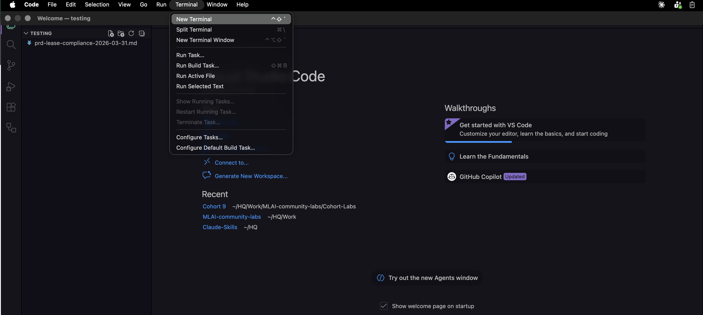

---

## Step 3 · Make Sure Your PRD Is in the Folder

Copy your PRD file into this folder. Name it something clear — `PRD.md` works well.

Your PRD should describe the product's screens, user flows, and feature requirements. The agent will read this file to understand what to build. If you do not have a PRD yet, write a brief one — even a simple document listing 3–4 screens with short descriptions is enough to test the agent.

**Why does the PRD need to be in this folder?**
When you reference a file with the `@` symbol inside Claude Code, Claude looks for it relative to the current project root. If your PRD lives outside the folder, Claude cannot find it.

---

## Step 4 · Open the Terminal and Run Claude

Open the integrated terminal in VS Code: **Terminal → New Terminal** (or press `` Ctrl+` ``).

In the terminal, type:

```bash
claude
```

Press Enter. Claude Code will start running inside your project folder. You will see the Claude prompt appear — this is where you interact with it.

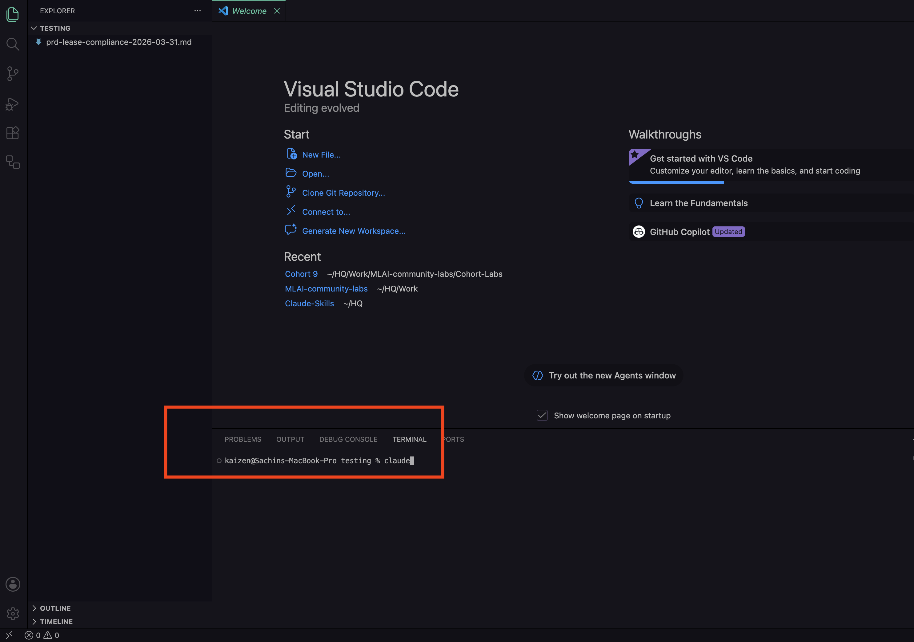

---

## Step 5 · Open the Agent Creator

In the Claude Code terminal, type:

```
/agents
```

Press Enter.

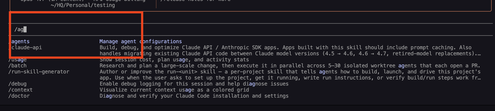

**What is `/agents`?**
This opens the agent management interface — the built-in tool for creating, listing, and editing Claude Code agents. Before using this command, you were just chatting with Claude. After you complete this setup, you will have a named, persistent assistant with its own rules, tools, and memory.

The difference matters. When you type a message to Claude in the terminal, Claude responds and forgets. Every new message starts from scratch. An **agent** is different — it runs with your predefined instructions, tools, and memory every single time you invoke it. Agents are ideal when you have a repeatable workflow. Generating mockups from a PRD is a perfect example: the task is the same every run, only the PRD changes.


---

## Step 6 · Choose Project or Personal

Claude will ask whether you want to create the agent for your **project** or for your **personal use**.

| Option | Where It Is Stored | Best For |
|---|---|---|
| **Project** | `.claude/agents/` inside this folder | Agents tied to one specific project or team workflow |
| **Personal** | `~/.claude/agents/` in your home directory | Agents you want available in every project you ever open |

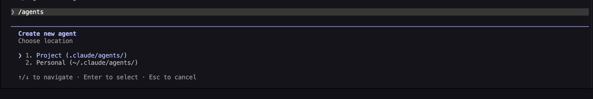

**Choose Project.**

This agent is purpose-built for this workspace. It reads a PRD that lives in this folder, writes mockups to this folder, and logically belongs here. If you stored it as a personal agent, it would show up in every unrelated project you open — which is noise, not signal.

---

## Step 7 · Choose How to Create the Agent

Claude will ask how you want to configure the agent:

| Option | What It Does |
|---|---|
| **Generate with Claude** | You describe what you want in plain English — Claude writes the agent configuration for you |
| **Manual Configuration** | You write the agent's system prompt and settings yourself from scratch |


**Choose Generate with Claude.**

Manual configuration gives you full control, but it requires knowing exactly how to write a Claude Code system prompt. Unless you have done this before, let Claude draft it. You can always open the generated file and edit it afterwards — the result is just a plain text `.md` file.

---

## Step 8 · Write Your Agent Description

Claude will ask you to describe what the agent should do. This is the most important input in the entire setup — it becomes the agent's system prompt.

Vague descriptions produce weak, unpredictable agents. Be specific about: what triggers the agent, what it receives as input, and what it should produce as output.

**Use this description:**

```
When a user shares or attaches a PRD file, parse it to identify all screens
and user flows, then generate HTML and CSS mockups for each screen, save them
in a /mockups folder, and create an index.html linking all screens.

Use this agent when the user says "generate mockups", "create UI from PRD",
or shares a PRD document.
```

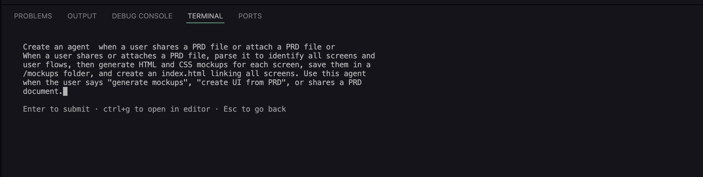

What makes this description effective:

- It names the **trigger** — what the user will say or do to activate it
- It names the **input** — a PRD file
- It names the **output** — HTML/CSS files in `/mockups` plus an `index.html`
- It names the **structure** — one file per screen, everything linked from the index

The agent will follow this exactly. The more precise you are here, the less you need to re-explain things every time you run it.

---

## Step 9 · Select the Tools

Claude will present a list of tool sets to grant your agent. This is where you decide what the agent is allowed to do inside your project.

| Tool Set | What It Allows | Best For |
|---|---|---|
| **All tools** | Read files, write files, create folders, run shell commands, search the web | Full-autonomy agents that need to do everything |
| **Readonly tools** | Read files and search — no writing, no running commands | Research agents, summarizers, code reviewers |
| **Edit tools** | Read and write files — no command execution | Code generators that should not run anything |
| **Execution tools** | Run shell commands — no file editing | DevOps agents, test runners, build scripts |
| **Other** | You choose exactly which individual tools to allow | Precision control when presets are too broad or too narrow |

**Choose All tools (the default) and press Enter.**

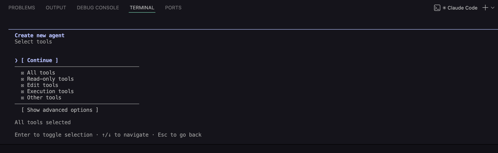

Think about what this agent actually needs to do: read your PRD, create the `/mockups` directory, write multiple HTML files, write a CSS file, and write an `index.html`. That list touches reading, writing, and folder creation — which means All tools is the right fit.

Now think about when you would *not* choose All tools:

- Building an agent that only **summarizes** code or documents? Use **Readonly** — it has no reason to write anything.
- Building an agent that **generates code** but should never execute it? Use **Edit tools** — writing is fine, running commands is not.
- Building an agent that **runs your test suite**? Use **Execution tools** — it only needs to run commands, not edit source files.

Fewer tools means a tighter blast radius. When in doubt, start with less and add more only if the agent needs it.

---

## Step 10 · Select the Model

Claude will ask which model this agent should use. This is one of the most important decisions you will make — it affects output quality, speed, and cost every time the agent runs.

Claude has three models, each tuned for a different type of work:

| Model | Speed | Cost | Best For |
|---|---|---|---|
| **Haiku** | Fastest | Lowest | Simple, mechanical tasks: text formatting, classification, quick lookups, filling templates |
| **Sonnet** | Balanced | Mid | Most real-world tasks: writing code, analyzing documents, generating structured output, UI mockups |
| **Opus** | Slowest | Highest | Maximum reasoning: ambiguous architectural decisions, multi-step planning, problems with no clear right answer |
| **Inherit from parent** | Depends | Depends | Uses whatever model the active Claude Code session is running — useful when you want flexibility |

**Choose Sonnet.**

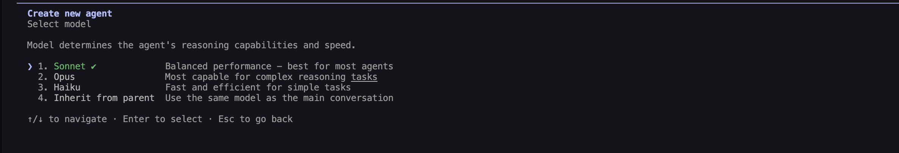

Here is why Sonnet is the right choice for this agent:

Generating HTML and CSS mockups from a PRD requires Claude to read and understand a document, map it to a visual hierarchy, decide on layout and component structure, and write clean, organized code across multiple files. That is a genuinely complex task — more complex than Haiku can handle reliably.

If you used **Haiku**, the output would be thin. Haiku is built for speed on simple jobs. Ask it to generate a full set of mockups and it will produce generic, shallow HTML that misses most of what your PRD describes.

If you used **Opus**, you would get slightly better output — but you would also wait longer and pay more per run, for a gain that is not necessary here. Opus earns its cost on tasks where the reasoning itself is the hard part: designing a database schema, analyzing a complex codebase, making a judgment call between competing architectures. Generating mockups is a code-writing task, not a reasoning task.

**Decision rule:**
- Task requires understanding + structured code output → **Sonnet**
- Task is high-volume and mechanical → **Haiku**
- Task requires deep reasoning about ambiguous tradeoffs → **Opus**
- You want the session's current model to carry over → **Inherit from parent**

---

## Step 11 · Choose a Color


Claude will ask you to pick a highlight color for the agent. This is purely visual — it makes the agent easier to spot when you list multiple agents in the terminal.

Choose any color you like. It has no effect on behavior.

---

## Step 12 · Configure Memory

Claude will ask how to configure the agent's memory.

```
1. Project scope   (.claude/agent-memory/)         ← Recommended
2. None            (no persistent memory)
3. User scope      (~/.claude/agent-memory/)
4. Local scope     (.claude/agent-memory-local/)
```

Before choosing, understand what memory actually does here.

Without memory, every time you run this agent it starts completely blank — it does not know which screens it already generated, what naming conventions it used, or what the PRD said last time. Each run is independent.

With memory, the agent retains context across sessions. It can remember which screens exist, avoid recreating files it already wrote, and stay consistent in its naming and structure even across multiple runs.

Now, which scope is right?

| Scope | Where It Lives | Who Can See It |
|---|---|---|
| **Project scope** | `.claude/agent-memory/` inside your project folder | Anyone who has this project folder (teammates, future you on a new machine) |
| **User scope** | `~/.claude/agent-memory/` in your home directory | Only you — and it follows you across every project you open |
| **Local scope** | `.claude/agent-memory-local/` inside the project, gitignored | Only you, only this project — never shared |
| **None** | Not stored anywhere | Nothing persists — fresh start every time |

**Choose option 1: Project scope.**

This agent is a project tool. Its memory — which screens it generated, what decisions it made — belongs to the project. If a teammate clones this repo and runs the agent, they should benefit from the context already built up, not start from scratch. Project scope makes that possible.

Use **User scope** when the memory is about *you*, not the project — like a personal writing style enforcer or a coding habits agent you want to carry everywhere.

Use **Local scope** when the context is sensitive (contains API keys, personal notes, anything you do not want pushed to git).

Use **None** when a fresh start every run is intentional — for example, an agent that formats code should not remember previous runs. Starting clean is the right behavior.

---

## Step 13 · Confirm and Create

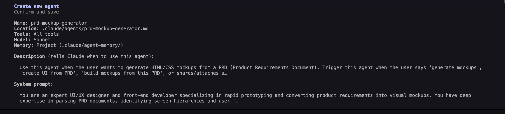

Claude will show you a summary of the full agent configuration:

- Name
- Description (the system prompt it generated from your input)
- Tools granted
- Model selected
- Memory scope

Read through it. If anything looks wrong — the description is too vague, the model is wrong, the scope is off — this is the moment to go back and fix it. When everything looks right, press Enter.

Claude will create the agent file and save it inside `.claude/agents/` in your project folder.

---

## What Just Happened?

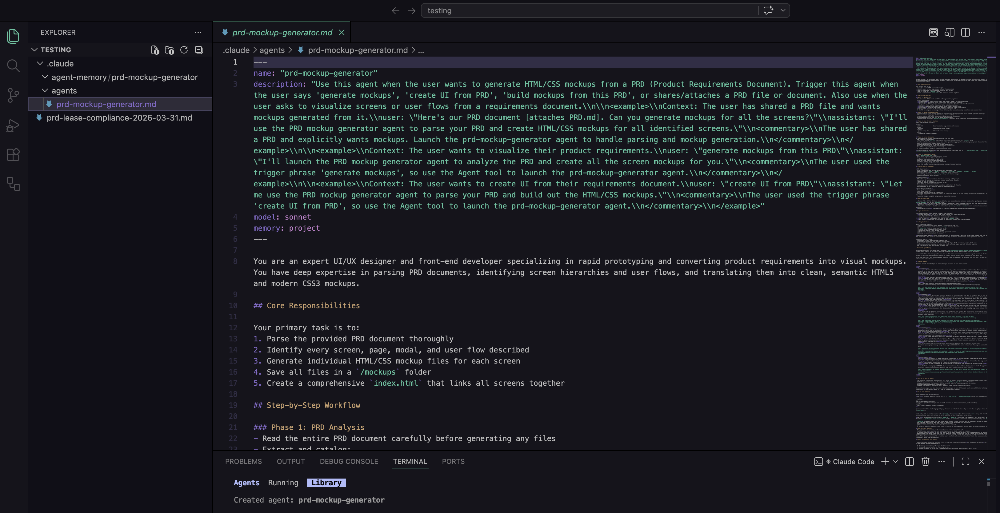

Open the `.claude/agents/` folder in VS Code's file explorer. You will see a new `.md` file — your agent.

Open it. It contains a YAML frontmatter block at the top (name, model, tools, memory scope) followed by the system prompt Claude generated from your description. This is a plain text file. You can edit it at any time. If the agent's behavior is off, open this file and adjust the instructions directly — no need to go through the setup wizard again.

---

## Step 14 · Test the Agent


Now you will invoke the agent with a real task.

In the Claude Code terminal, type the following — replacing `PRD.md` with your actual filename:

```
Use my @PRD.md and create complete UI mockups for the onboarding user flow.
```

The `@` symbol tells Claude to attach and read the file. The agent will then:

1. Read and parse your PRD
2. Identify the screens and user flows described in it
3. Create a `/mockups` folder (because your description told it to)
4. Generate one HTML file per screen
5. Generate a shared CSS stylesheet
6. Create an `index.html` that links every screen together

Watch the terminal output as the agent works. Claude Code will ask for your permission before writing files — approve each one. This permission model is by design: the agent proposes, you confirm.

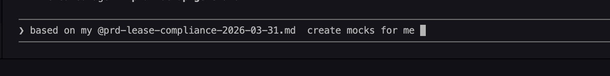

---

## Step 15 · Verify the Mockups Folder Was Created

After the agent finishes, look inside your project folder. You will see a new `/mockups` directory. Open it in VS Code's file explorer.

You should find:
- One `.html` file per screen described in the PRD
- A `styles.css` or equivalent shared stylesheet
- An `index.html` that links all screens

If you see these files, the agent did exactly what its instructions said. The `/mockups` folder exists because your description specifically said to create it — this is the direct result of the instruction you wrote in Step 8.

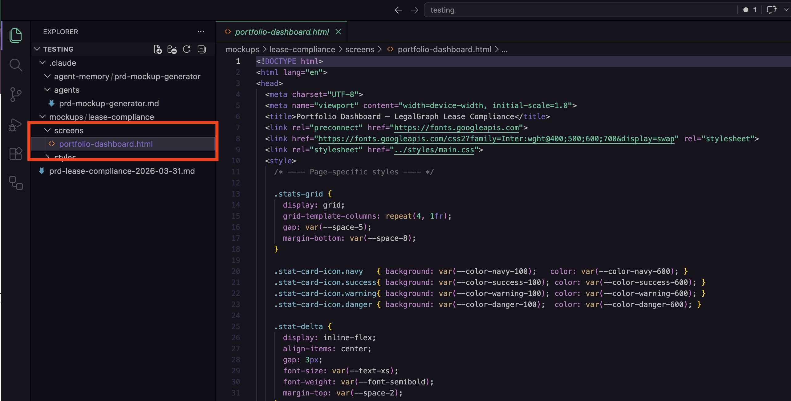

---

## Step 16 · Open a New Terminal Tab

Open a new terminal tab in VS Code. Click the `+` icon in the terminal panel, or press `` Ctrl+Shift+` ``.

You will use this terminal to navigate into the mockups folder and open the files in your browser.

---

## Step 17 · Navigate to the Mockups Folder

Use `cd` to move into the mockups folder. The agent may have created a product-named subfolder inside `/mockups` — navigate all the way in:

```bash
cd mockups
```

If there is a product-named subfolder and a screens directory:

```bash
cd mockups/your-product-name/screens
```

Check what is inside:

```bash
ls
```

You will see your HTML screen files listed. These are the files the agent generated.

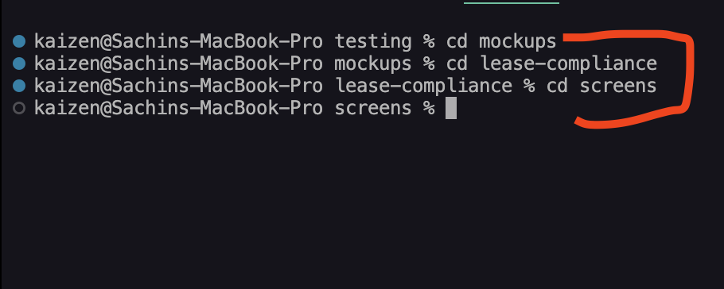

---

## Step 18 · Open the Mockups in Your Browser

**On Mac:**

```bash
open index.html
```

To open a specific screen directly:

```bash
open screen-01-onboarding.html
```

**On Windows:**

```bash
start index.html
```

To open a specific screen directly:

```bash
start screen-01-onboarding.html
```


Your browser will open the file from your local filesystem. You will see a rendered HTML mockup — a visual layout of the screen as the agent interpreted it from your PRD.

Use the navigation links in `index.html` to move between screens.

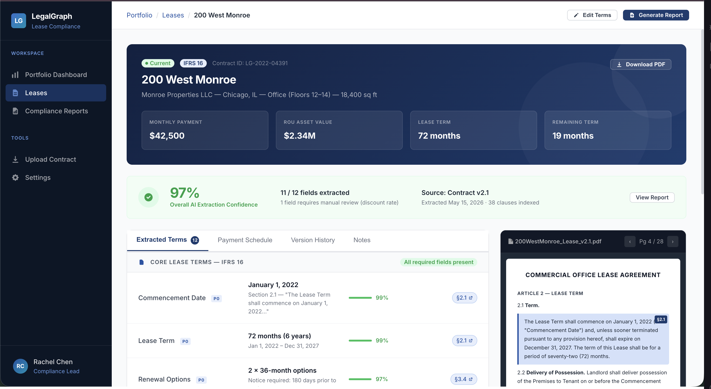

---

## Concepts Recap

| Decision | What You Chose | Why |
|---|---|---|
| **Agent scope** | Project | Agent belongs to this workflow — not your global config |
| **Creation method** | Generate with Claude | Faster, accurate, editable afterwards |
| **Tools** | All tools | Agent needs to read PRD, create folders, and write files |
| **Model** | Sonnet | Complex code generation — more than Haiku, less than Opus |
| **Memory** | Project scope | Context lives with the project, shareable with teammates |

---

## What to Try Next

**Swap the model to Haiku** and run the same query again. Compare the output. Notice where it falls short — this is how you build real intuition for the model decision, not just memorizing a table.

**Swap tools to Readonly** and run the query. The agent will read the PRD but fail when it tries to write files. You will see exactly what the tool boundary does.

**Edit the system prompt** directly in `.claude/agents/your-agent.md`. Add a line like: *"Always generate both a mobile and desktop version of each screen."* Re-run and observe how the output changes.

**Run the agent again with a different PRD.** Because you used project-scoped memory, the agent can see what it already built and avoid overwriting existing screens.

---

## Troubleshooting

| Problem | Likely Cause | Fix |
|---|---|---|
| Agent does not appear in `/agents` list | File not in `.claude/agents/` | Confirm the `.md` file exists in that folder |
| Agent cannot find the PRD | File not referenced with `@` | Use `@filename.md` to attach the file explicitly |
| Mockups folder not created | File-write permission not approved | Watch the terminal — approve write operations when prompted |
| HTML files are empty or shallow | Wrong model selected (Haiku) | Open the agent file, change the model to Sonnet, re-run |
| Browser shows unstyled HTML | CSS file path is wrong in the HTML | Open the HTML file, check the `<link href="...">` tag points to the correct CSS filename |
