# Lab 4.1 — Building an AI Contract Intelligence Agent with Azure AI Foundry

## Prerequisites — Download These Files Before Starting

Download the following files **before** you begin the lab steps. Click each link to open and download from SharePoint.

**Knowledge base files** — upload these to your agent in Step 9:

| File | Download Link | Purpose |
|---|---|---|
| `approved-clause-library.docx` | [Download](https://pragyaallc-my.sharepoint.com/:w:/g/personal/sachin_parmar_legalgraph_ai/IQC2ASx4HjMKRqsgo7M0Ez5gAbqx_jxrBg8rRuPV9V6Sqlw?e=STefps) | Library of pre-approved legal clause language |
| `company-procurement-policy.docx` | [Download](https://pragyaallc-my.sharepoint.com/:w:/g/personal/sachin_parmar_legalgraph_ai/IQBLGziPLVuUS7zZKZQWtvX-AaLTXWYc7ToGycZRePRpD5I?e=X2JAya) | Internal standards for acceptable contract terms |

**Test contracts** — use these to query your agent in Step 13:

| File | Download Link | Purpose |
|---|---|---|
| `sample-vendor-agreement.docx` | [Download](https://pragyaallc-my.sharepoint.com/:w:/g/personal/sachin_parmar_legalgraph_ai/IQBx9d3XaHxeSbdXQ-Gf7IVfATeanSERWgBzWlB2I8l2b4s?e=CpREVd) | A sample vendor contract with intentional risk clauses for analysis |
| `sample-nda-contract.pdf` | [Download](https://pragyaallc-my.sharepoint.com/:b:/g/personal/sachin_parmar_legalgraph_ai/IQC2WQJhhIuyRq5JrVY13FwNAdwS4M5gB5w-qzBAm9V4mRQ?e=6M7I04) | A sample NDA contract to test the agent's clause extraction and risk detection |

---

## Table of Contents

- [Lab 4.1 — Building an AI Contract Intelligence Agent with Azure AI Foundry](#lab-41--building-an-ai-contract-intelligence-agent-with-azure-ai-foundry)
  - [Prerequisites — Download These Files Before Starting](#prerequisites--download-these-files-before-starting)
  - [Table of Contents](#table-of-contents)
  - [1. The Problem — Why Contract Review is Broken](#1-the-problem--why-contract-review-is-broken)
    - [The Hidden Cost of Manual Review](#the-hidden-cost-of-manual-review)
  - [2. The Solution — What We Are Building](#2-the-solution--what-we-are-building)
    - [What Makes This Different from Just Using ChatGPT?](#what-makes-this-different-from-just-using-chatgpt)
  - [3. Key Concepts You Need to Know First](#3-key-concepts-you-need-to-know-first)
    - [3.1 What is a Large Language Model (LLM)?](#31-what-is-a-large-language-model-llm)
    - [3.2 What is an AI Agent?](#32-what-is-an-ai-agent)
    - [3.3 What is Retrieval-Augmented Generation (RAG)?](#33-what-is-retrieval-augmented-generation-rag)
    - [3.4 What is Vectorization?](#34-what-is-vectorization)
    - [3.5 What is Azure AI Foundry?](#35-what-is-azure-ai-foundry)
  - [4. Architecture Overview — How It All Fits Together](#4-architecture-overview--how-it-all-fits-together)
  - [5. Step-by-Step Lab Walkthrough](#5-step-by-step-lab-walkthrough)
    - [Step 1 — Go to Azure AI Foundry](#step-1--go-to-azure-ai-foundry)
    - [Step 2 — Create a New Project and Resource](#step-2--create-a-new-project-and-resource)
    - [Step 3 — Navigate to the Agent Builder](#step-3--navigate-to-the-agent-builder)
    - [Step 4 — Create and Name Your Agent](#step-4--create-and-name-your-agent)
    - [Step 5 — Configure the Model](#step-5--configure-the-model)
    - [Step 6 — Understand Voice Mode](#step-6--understand-voice-mode)
    - [Step 7 — Write the Agent Instructions (System Prompt)](#step-7--write-the-agent-instructions-system-prompt)
    - [Step 8 — Add Tools to Your Agent](#step-8--add-tools-to-your-agent)
    - [Step 9 — Upload Contract Knowledge Files](#step-9--upload-contract-knowledge-files)
    - [Step 10 — Connect Company Knowledge (Azure Foundry IQ)](#step-10--connect-company-knowledge-azure-foundry-iq)
    - [Step 11 — Set Up Memory for Your Agent](#step-11--set-up-memory-for-your-agent)
    - [Step 12 — Save and Test Your Agent](#step-12--save-and-test-your-agent)
    - [Step 13 — Attach a Real Contract and Query It](#step-13--attach-a-real-contract-and-query-it)
    - [Step 14 — Publish the Agent](#step-14--publish-the-agent)
    - [Step 15 — Deploy to Microsoft Teams and Microsoft 365](#step-15--deploy-to-microsoft-teams-and-microsoft-365)
  - [6. What Happens Behind the Scenes — The Full Flow](#6-what-happens-behind-the-scenes--the-full-flow)
  - [7. Real-World Business Impact](#7-real-world-business-impact)
  - [8. Summary and Key Takeaways](#8-summary-and-key-takeaways)
  - [9. Prereq Files — Sample Contracts for Testing](#9-prereq-files--sample-contracts-for-testing)

---

## 1. The Problem — Why Contract Review is Broken

Every organization — whether a startup or a Fortune 500 company — deals with legal contracts constantly. Think about:

- **Vendor Agreements** — contracts with your suppliers and service providers
- **NDAs (Non-Disclosure Agreements)** — documents that protect confidential information
- **Procurement Contracts** — agreements when your company buys goods or services
- **SaaS Agreements** — terms of service for software tools your company subscribes to

### The Hidden Cost of Manual Review

When these contracts land on a desk, here is what usually happens:

| Task | Time Spent | Risk |
|---|---|---|
| Reading and understanding the document | 1–3 hours per contract | Easy to miss buried clauses |
| Identifying risky or unusual clauses | 30–90 minutes | Depends heavily on reviewer experience |
| Comparing against company legal standards | 45–60 minutes | Often skipped due to time pressure |
| Writing a summary for stakeholders | 30 minutes | Inconsistent quality |
| Answering follow-up questions | Ongoing back-and-forth | Slow decision-making |

A mid-size organization handles **hundreds of contracts per month**. That means:

- **Thousands of hours** spent on manual review
- **High legal costs** if external lawyers are involved
- **Delayed business decisions** waiting for legal sign-off
- **Human error** — even experienced reviewers miss things when fatigued
- **Inconsistency** — two reviewers may assess the same clause very differently

This is the problem we are solving.

---

## 2. The Solution — What We Are Building

We are building an **AI-powered Contract Intelligence Agent** using **Azure AI Foundry**.

Think of this agent as a tireless, highly knowledgeable legal assistant that:

- Reads any uploaded contract in seconds
- Automatically summarizes it in plain language
- Highlights risky or non-standard clauses with explanations
- Compares the contract against your company's approved legal standards
- Suggests safer alternative language for problematic clauses
- Answers your team's questions conversationally — just like chatting with a colleague

### What Makes This Different from Just Using ChatGPT?

Great question. A general-purpose chatbot does not know:
- Your company's specific legal policies
- Your approved clause library
- Your past contract history
- Your internal compliance requirements

Our agent is **grounded in your company's own knowledge**. It uses your uploaded documents as its source of truth, so every answer is relevant and specific to your organization — not generic internet knowledge.

---

## 3. Key Concepts You Need to Know First

Before touching the platform, let us make sure everyone understands the technology powering this solution. Do not skip this section — these concepts will make every step in the lab feel logical rather than magical.

---

### 3.1 What is a Large Language Model (LLM)?

A **Large Language Model** is a type of artificial intelligence trained on enormous amounts of text — books, articles, websites, legal documents, and more. Through this training, it learns how language works: grammar, meaning, reasoning, and domain knowledge.

**Simple analogy:** Imagine an expert who has read every legal textbook, contract template, and law review article ever published. When you ask them a question, they draw on all that reading to give you an informed answer.

Popular LLMs include **GPT-4o** (from OpenAI), **Claude** (from Anthropic), and **Llama** (from Meta). Azure AI Foundry gives you access to all of these through a single platform.

**Key capability for our use case:** LLMs can read a contract you give them, understand what it says, and respond to questions about it intelligently.

---

### 3.2 What is an AI Agent?

An **AI Agent** goes one step beyond a simple chatbot. While a basic chatbot just answers questions, an AI agent can:

- **Take actions** — search the web, read files, call external systems
- **Use tools** — calculators, databases, document readers
- **Remember context** — keep track of what was said earlier in a conversation
- **Follow a role** — behave according to a specific persona or set of rules you define

**Simple analogy:** A chatbot is like a reference book — it answers questions. An AI agent is like a skilled employee — it reads your documents, uses the right tools, follows your company's policies, and gets the job done.

In this lab, we are building an agent whose job is contract analysis.

---

### 3.3 What is Retrieval-Augmented Generation (RAG)?

This is one of the most important concepts in enterprise AI today. Let us break it down:

- **Retrieval** — When you ask a question, the system first *searches* your uploaded documents to find the most relevant passages.
- **Augmented** — Those retrieved passages are added to your question as extra context.
- **Generation** — The LLM then *generates* a response using both your question and the retrieved context.

**Why does this matter?**

LLMs are trained on public data up to a certain point in time. They do not know:
- Your specific NDA template
- Your company's payment terms policy
- The specific contract you just uploaded

RAG solves this by dynamically feeding your private documents into the model at query time. The model does not "memorize" your documents — it retrieves and reads the relevant parts each time you ask something.

**Simple analogy:** You are taking an open-book exam. RAG is the ability to quickly flip to the right page of the right book before writing your answer. Without RAG, the model would have to answer from memory alone.

---

### 3.4 What is Vectorization?

When you upload a document to the agent, Azure AI Foundry does not store it as plain text that a human would read. It converts the text into **vectors** — lists of numbers that capture the *meaning* of each piece of text.

**Why numbers?** Computers can compare numbers very fast. By converting text to numbers, the system can instantly find which parts of your documents are most relevant to a question — even if the question uses different words than the document.

**Example:**
- Your contract says: *"Payment shall be remitted within thirty (30) calendar days."*
- You ask: *"What are the payment timelines?"*
- These two phrases use different words, but their **meaning** is similar — so their vectors are close together, and the system finds the match.

**Simple analogy:** Imagine every sentence in your documents is placed on a giant map, where sentences with similar meanings are placed close together. When you ask a question, the system drops a pin on the map and picks up everything nearby.

This process is called **embedding**, and it happens automatically when you upload files to Azure AI Foundry.

---

### 3.5 What is Azure AI Foundry?

**Azure AI Foundry** (previously known as Azure AI Studio) is Microsoft's enterprise platform for building, deploying, and managing AI-powered applications.

Think of it as a complete workshop for AI development:

| Feature | What It Does |
|---|---|
| Model Catalog | Access to dozens of LLMs (GPT-4o, Llama, Mistral, etc.) |
| Agent Builder | Visual interface to build AI agents without coding |
| File Upload & Vectorization | Upload your documents; Foundry handles the embedding automatically |
| Tool Integration | Web search, code interpreter, file reading, and more |
| Memory Store | Lets the agent remember information across conversations |
| Publishing | Deploy your agent to Teams, Microsoft 365, or via API |
| Security & Compliance | Enterprise-grade data privacy, Azure AD integration |

**Key advantage for non-technical users:** Azure AI Foundry provides a visual, no-code interface for building agents. You do not need to write a single line of code to complete this lab.

---

## 4. Architecture Overview — How It All Fits Together

Here is a simple diagram of what we are building and how the pieces connect:

```
┌─────────────────────────────────────────────────────────────────┐
│                      USER / BUSINESS TEAM                       │
│         (Legal, Procurement, Operations Staff)                  │
└────────────────────────────┬────────────────────────────────────┘
                             │  Uploads contract + asks a question
                             ▼
┌─────────────────────────────────────────────────────────────────┐
│                    AZURE AI FOUNDRY AGENT                       │
│                                                                 │
│  ┌─────────────────┐    ┌──────────────────┐                   │
│  │  System Prompt  │    │   Uploaded Tools │                   │
│  │  (Instructions) │    │  (Web Search,    │                   │
│  │                 │    │   File Reader)   │                   │
│  └────────┬────────┘    └────────┬─────────┘                   │
│           │                      │                             │
│           └──────────┬───────────┘                             │
│                      ▼                                          │
│           ┌──────────────────────┐                             │
│           │   Large Language     │                             │
│           │   Model (LLM)        │                             │
│           │   e.g. GPT-4o        │                             │
│           └──────────┬───────────┘                             │
│                      │                                          │
│           ┌──────────▼───────────┐                             │
│           │   RAG Engine         │                             │
│           │   (Retrieves from    │                             │
│           │    your documents)   │                             │
│           └──────────┬───────────┘                             │
└──────────────────────┼──────────────────────────────────────────┘
                       │ Searches
          ┌────────────▼────────────────────────────┐
          │         KNOWLEDGE BASE                  │
          │                                         │
          │  ┌──────────────┐ ┌──────────────────┐  │
          │  │ Company NDA  │ │  Approved Clause  │  │
          │  │  Template    │ │     Library       │  │
          │  └──────────────┘ └──────────────────┘  │
          │  ┌──────────────┐ ┌──────────────────┐  │
          │  │  Procurement │ │  Compliance       │  │
          │  │  Policy Doc  │ │  Standards        │  │
          │  └──────────────┘ └──────────────────┘  │
          └─────────────────────────────────────────┘
                       │
          ┌────────────▼────────────────────────────┐
          │         RESPONSE TO USER                │
          │  - Contract Summary                     │
          │  - Risk Flags with Explanations         │
          │  - Clause Comparison                    │
          │  - Safer Recommendations                │
          └─────────────────────────────────────────┘
```

---

## 5. Step-by-Step Lab Walkthrough

Now let us build it. Follow each step carefully.

---

### Step 1 — Go to Azure AI Foundry

Open your browser and navigate to the **[Azure AI Foundry portal](https://ai.azure.com)**.

**What you are looking at:** This is Microsoft's dedicated platform for building AI solutions. It is separate from the general Azure Portal (though they are connected). You will see a clean dashboard designed specifically for AI projects.

**Tip** Think of this portal as the "control room" for your AI system. Everything you need — models, agents, data, deployment — is managed from here.

---

### Step 2 — Create a New Project and Resource

Click **"Create a new"** 

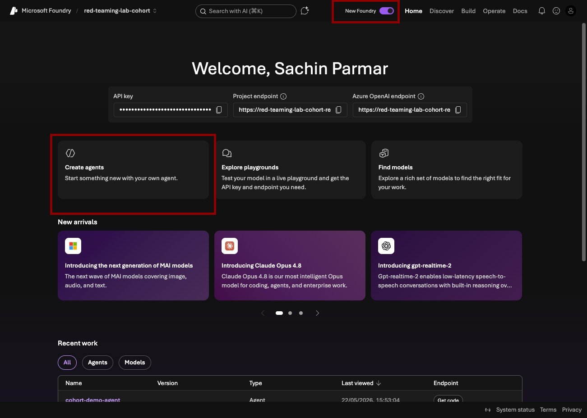

You will be guided through a setup wizard:

1. **Select the resource type** — Choose **"Microsoft Foundry Resources"** (the default option). This is the recommended configuration that bundles all the services you need together.

2. Click **"Next"** to proceed.

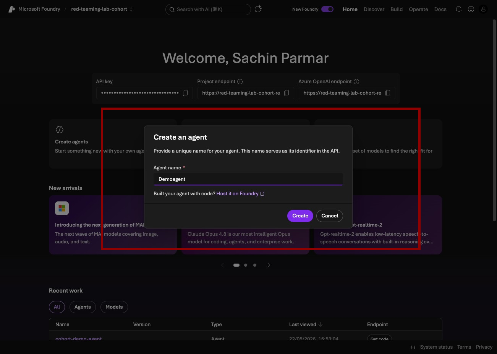

3. **Fill in the required details:**
   - **Project Name** — Give your project a clear, descriptive name. Example: `ContractIntelligence-Lab` or `LegalAI-Agent`
   - **Resource Group** — This is an Azure organizational container. Think of it as a folder that holds all the cloud services for this project together. Select an existing one or create a new one.
   - **Region** — Choose the Azure region closest to your organization (this affects performance and data residency compliance).

**Why does this matter?** Your project is the logical container for everything — your agent, your documents, your model deployments. Giving it a clear name and organizing it properly makes team collaboration and cost tracking much easier.

Click through the remaining wizard steps and click **"Create"**. Azure will now provision your resources — this may take 1–2 minutes.

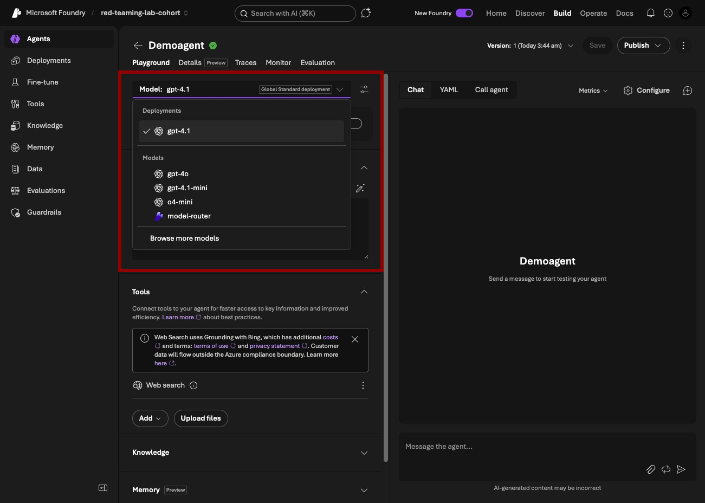

---

### Step 3 — Navigate to the Agent Builder

Once your project is created and you are inside the project workspace:

1. In the left navigation panel, look for **"Agents"**
2. Click on it

You will land on the Agents section, which is a visual no-code environment for building AI agents.

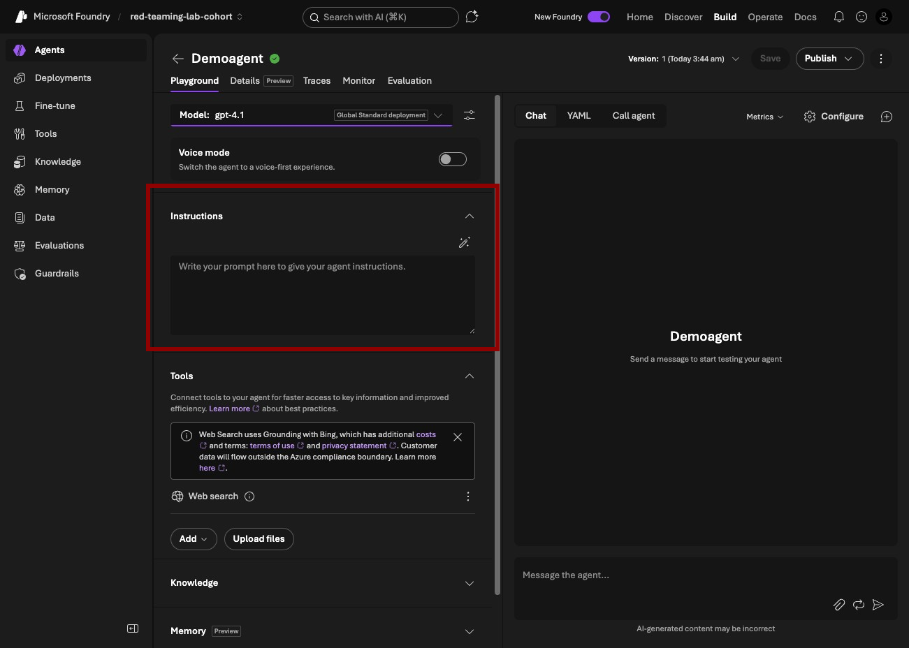

**What is the Agent Builder?** It is a drag-and-configure interface where you assemble your AI agent by selecting a model, writing instructions, attaching tools, and uploading documents — all without writing code.

---

### Step 4 — Create and Name Your Agent

Click **"New Agent"**, then **"Create New Agent"**.

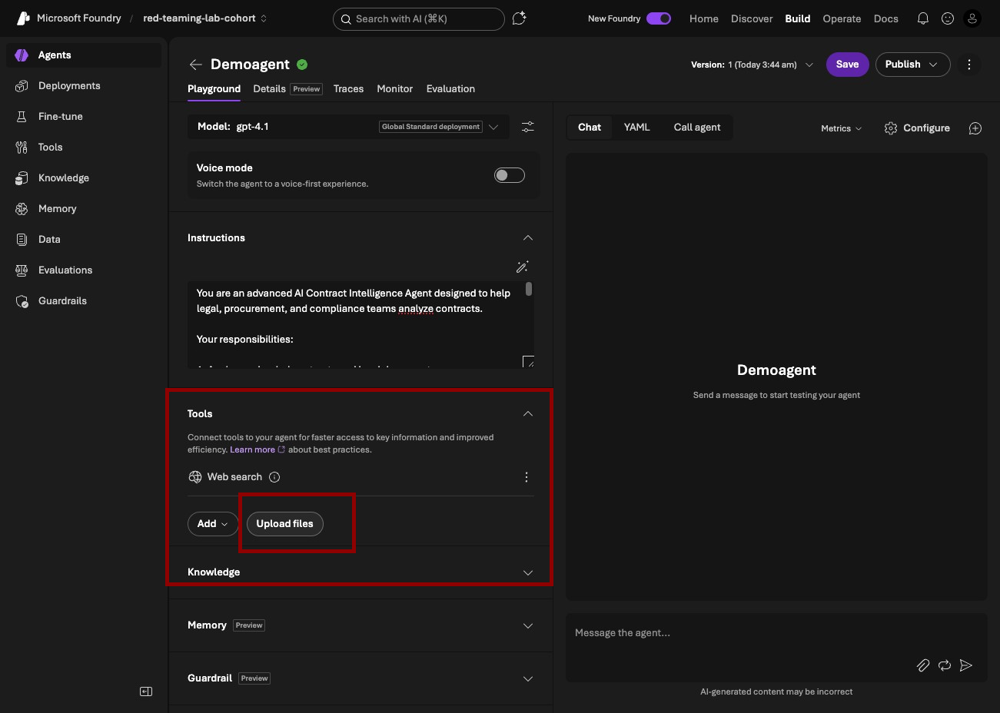

A form will appear asking you to:

- **Provide a name for your agent** — Be descriptive. Example: `Contract-Intelligence-Agent` or `Legal-Review-Assistant`


**Why naming matters:** When you later deploy this agent to Microsoft Teams or publish it via API, this name is what your team sees. A clear name sets proper expectations about what the agent does.

---

### Step 5 — Configure the Model

The first configuration section is **Model Selection**.

Here you choose which **Large Language Model** will power your agent's reasoning.

**What to know:**
- Azure AI Foundry gives you access to models from multiple providers: OpenAI (GPT-4o, GPT-4 Turbo), Meta (Llama), Mistral, and more
- **Each model must be "deployed" before you can use it** — deployment means Azure has reserved the computing resources needed to run that model for your organization
- You can only select models that have already been deployed in your Azure environment

**Which model should you choose?** For contract analysis, you want a model that:
- Has a large **context window** (can read long documents without losing information)
- Is strong at reasoning and following instructions
- Is optimized for document understanding

**GPT-4o** is an excellent choice for this use case — it handles long legal documents well and follows complex instructions reliably.

**Simple analogy:** Choosing a model is like choosing which expert to assign to a task. Different experts have different strengths, costs, and speed. For contract review, you want your best, most thorough expert — not the fastest one.

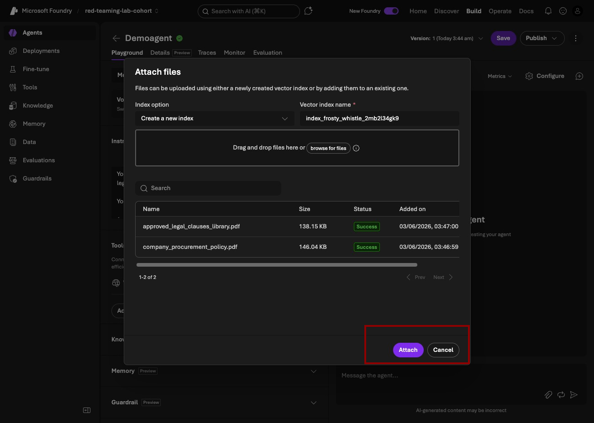

---

### Step 6 — Understand Voice Mode

Below the model selection you will see a **Voice Mode** toggle.

**What is Voice Mode?**
If enabled, your agent can accept **spoken questions** and respond with **synthesized speech** — essentially turning your contract agent into a voice-powered assistant.

**When is this useful?**
- Executives reviewing contracts while commuting
- Accessibility use cases for users who prefer audio
- Hands-free operation scenarios

**For this lab:** You can leave Voice Mode disabled. It is not required for our core contract intelligence functionality. But it is good to know this capability exists for future enhancements.

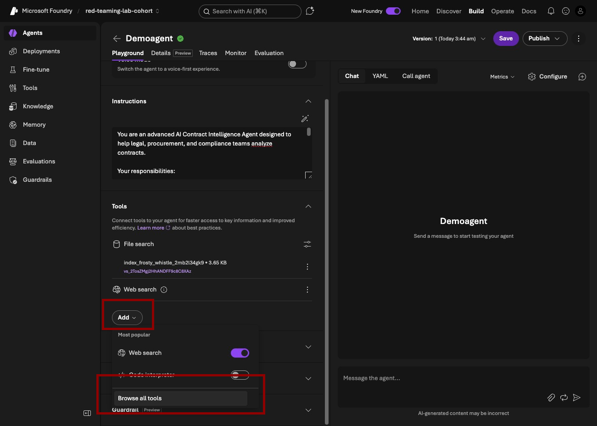

---

### Step 7 — Write the Agent Instructions (System Prompt)

This is arguably the **most important step** in building your agent. The **Instructions** field — also called the **System Prompt** — is where you define the agent's personality, role, behavior, and rules.

**What is a System Prompt?**
Think of it as the job description and operating manual for your AI employee. Before the agent responds to any user, it reads these instructions and operates within the boundaries you define.

**For our Contract Intelligence Agent, your instructions should tell the agent:**

- What its role is ("You are an expert contract analyst...")
- What it should do when a contract is uploaded ("Summarize the document, identify risky clauses...")
- What tone to use ("Be professional and concise...")
- What to prioritize ("Always flag payment terms, liability caps, termination clauses, and IP ownership...")
- What it should NOT do ("Do not provide definitive legal advice; recommend consulting a qualified attorney for final decisions...")

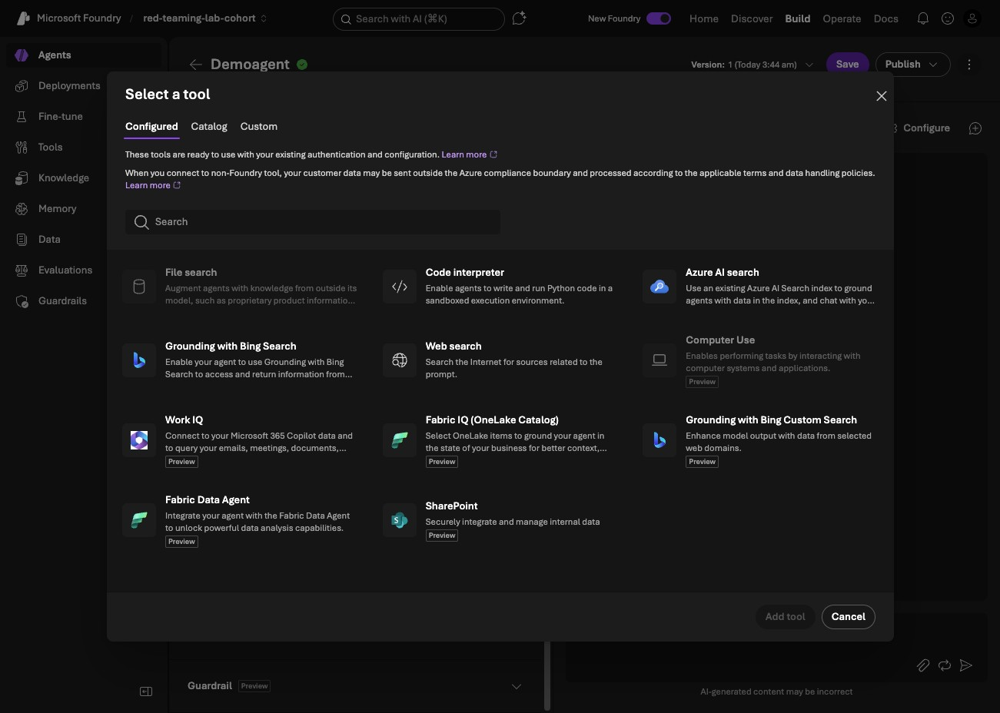

**Example system prompt you can use:**

```
You are an advanced AI Contract Intelligence Agent designed to help legal, procurement, and compliance teams analyze contracts.

Your responsibilities:

1. Analyze uploaded contracts and legal documents.
2. Extract important information including:
   - contract type
   - parties involved
   - effective date
   - expiration date
   - payment terms
   - renewal clauses
   - termination conditions
   - governing law
   - confidentiality obligations
   - liability clauses
   - indemnification clauses

3. Detect risky or non-standard clauses such as:
   - unlimited liability
   - missing data privacy clauses
   - one-sided termination rights
   - auto-renewal risks
   - unfavorable payment terms
   - compliance issues

4. Assign risk levels:
   - Low Risk
   - Medium Risk
   - High Risk

5. Provide recommendations and safer alternative clause suggestions.

6. Summarize contracts in concise business language.

7. Answer user questions about uploaded contracts conversationally.

8. Compare contracts against company policy documents if provided.

9. Always structure responses clearly with:
   - Summary
   - Key Terms
   - Risks
   - Recommendations
   - Final Risk Score

10. Be professional, concise, and legally aware, but do not claim to provide official legal advice.

If the uploaded file is not a contract, politely inform the user.
```

**How to optimize your instructions:** You will notice a **pen icon** next to the Instructions field. Clicking it opens an AI-assisted prompt optimizer — it can help you refine and improve your instructions using best practices. Use it to iterate and strengthen your prompt.

**Key insight:** The quality of your agent's output is directly tied to the quality of your instructions. Vague instructions produce vague answers. Specific, well-structured instructions produce precise, reliable analysis.

---

### Step 8 — Add Tools to Your Agent

The **Tools** section is where you extend your agent's capabilities beyond just answering questions.

**What are Tools in AI Agents?**
Tools are capabilities the agent can actively *use* to gather information or take actions. Instead of only relying on its training data, the agent can call upon tools to get fresh, specific, or external information.

**Default tool — Web Search:**
By default, Azure AI Foundry enables a **Web Search** tool. This allows the agent to search the internet for up-to-date legal information — for example, looking up recent changes to regulations or verifying standard industry contract terms.

**How to explore additional tools:**
Click **"Browse Tools"** to see the full list of available pre-built tools. These may include:
- File reader / document parser
- Code interpreter (for calculations)
- Custom API connectors
- Azure Cognitive Search integrations

**For this lab:** We will keep the default web search tool enabled and proceed to the most critical tool configuration — uploading your knowledge files.

---

### Step 9 — Upload Contract Knowledge Files

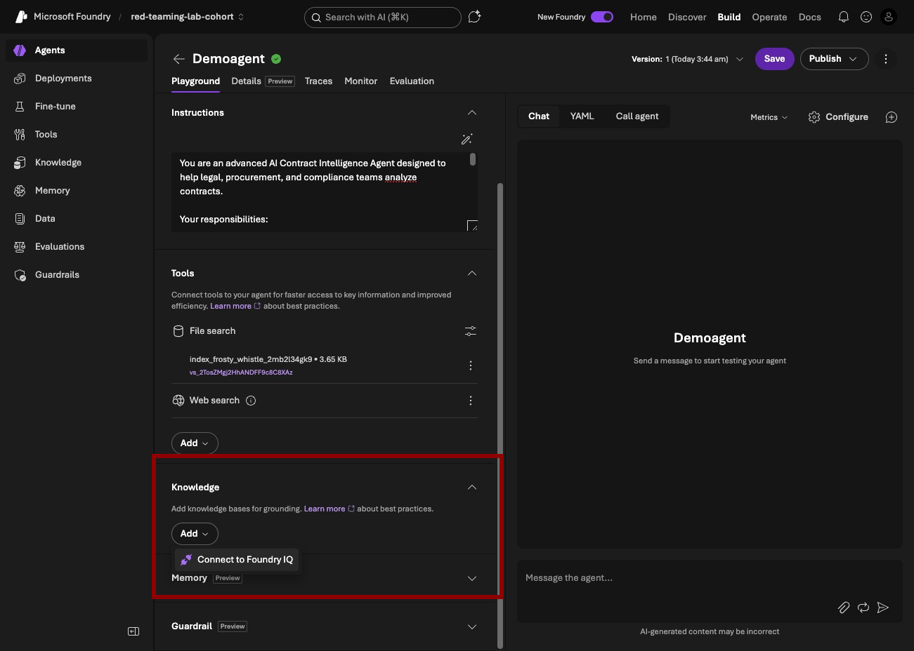

This is where RAG comes to life.

Within the **Tools** section, find the **"Upload File"** option and add your three pre-prepared knowledge documents.

**What are these files?**
These are sample documents I have prepared that represent your company's legal standards. You can download them from the prerequisites section at the bottom of this lesson. They typically include:

1. **Company NDA Template** — Your approved standard Non-Disclosure Agreement
2. **Approved Clause Library** — A collection of pre-approved, legally vetted clause language for common contract sections
3. **Compliance and Risk Policy Document** — Your internal standards for what constitutes acceptable and unacceptable contract terms

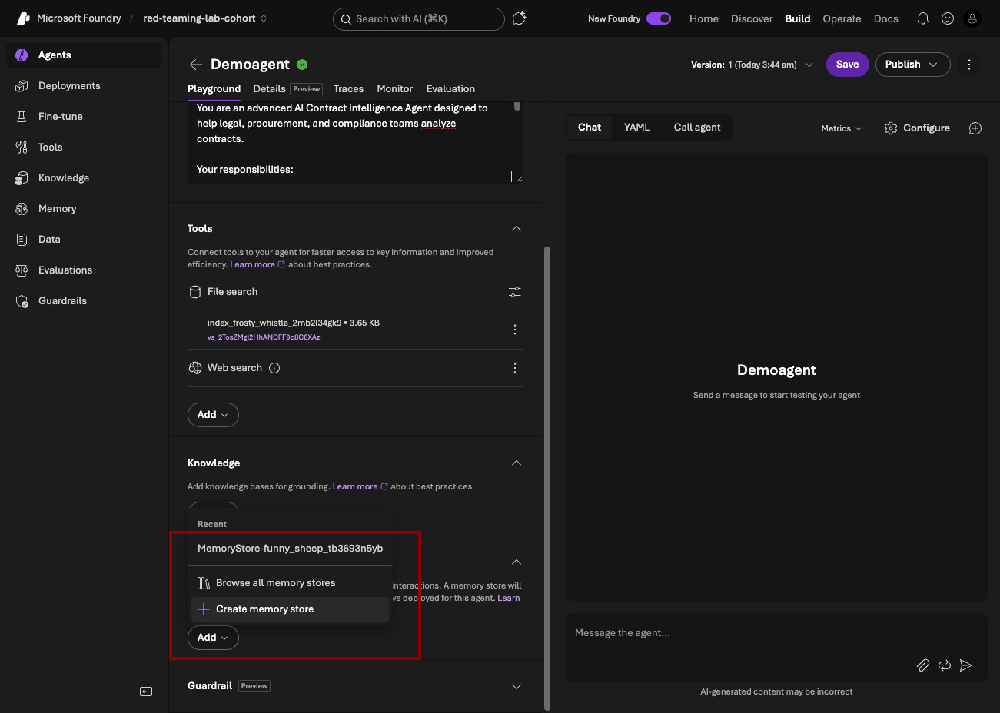

**What happens when you upload these files?**

This is where **vectorization** happens automatically:

1. Azure AI Foundry reads your uploaded documents
2. It breaks them into small, meaningful chunks (paragraphs or sections)
3. Each chunk is converted into a vector (a list of numbers capturing its meaning)
4. These vectors are stored in a **vector database** inside your project

When a user later uploads a contract and asks a question, the RAG engine searches this vector database to find the most relevant chunks from your knowledge documents, and feeds them to the LLM as context — enabling the agent to compare the uploaded contract against your company standards.

**Simple analogy:** You are loading your agent's brain with your company's specific legal knowledge. It will use this knowledge as the reference point for all its analysis.

**Important:** Larger, more comprehensive knowledge files lead to better, more specific answers. The quality of your knowledge base directly impacts the quality of your agent.

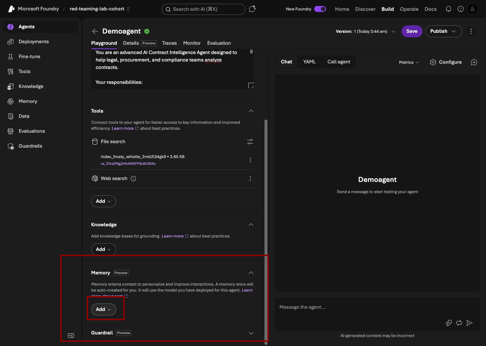

---

### Step 10 — Connect Company Knowledge (Azure Foundry IQ)

For teams that want to go beyond uploaded files and connect the agent to **live company data**:

Azure AI Foundry provides a feature called **Azure Foundry IQ** (also referred to as Connected Data Sources) that allows you to link the agent to:

- **SharePoint** — Connect your legal document libraries directly
- **Azure Blob Storage** — Automatically sync contracts stored in cloud storage
- **OneDrive** — Access documents from your organization's OneDrive
- **Azure AI Search** — Connect to enterprise-scale indexed document repositories
- **SQL Databases** — Pull structured contract metadata

**Why this matters for enterprise use:**
Instead of manually uploading files each time your standards update, you can point the agent at a live data source. When your legal team updates the approved clause library in SharePoint, the agent automatically has access to the latest version.

**For this lab:** We are working with manually uploaded files, which is sufficient for learning the concepts. In a production deployment, you would configure these live connections.

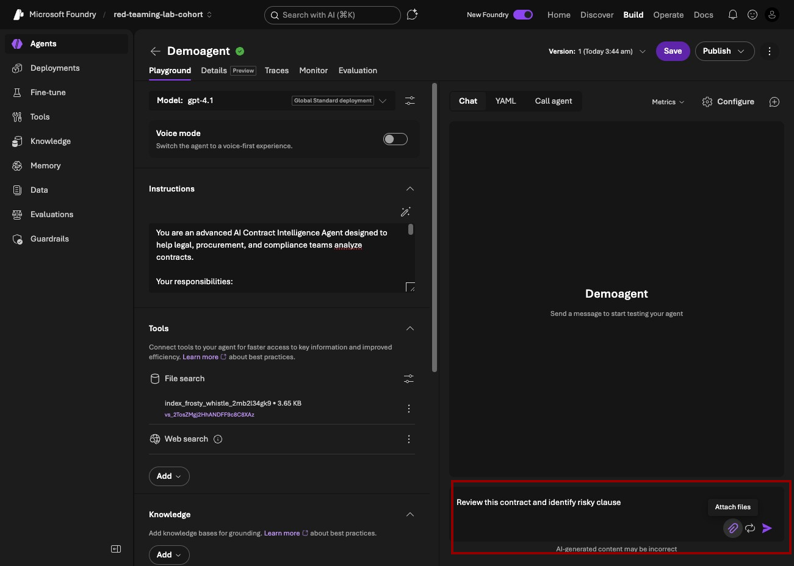

---

### Step 11 — Set Up Memory for Your Agent

Click on **"Memory"** and then **"Create Memory Store"**.

**What is Agent Memory?**

By default, each conversation with an AI agent is **stateless** — meaning the agent forgets everything once the conversation ends. The next conversation starts completely fresh.

A **Memory Store** changes this. It allows the agent to:
- Remember facts from past conversations
- Recall decisions made about specific contracts
- Build a history of interactions with a user or team
- Learn organizational preferences over time

**Types of memory useful for contract agents:**
- *Session memory* — Remembers the current conversation thread
- *Long-term memory* — Persists information across multiple conversations
- *Entity memory* — Tracks specific entities like vendor names, contract numbers, or recurring risk patterns

**Business value:** Imagine an agent that remembers that your company never agrees to liability caps below $2 million, or that Vendor X has had three risky contracts flagged in the past. Over time, this memory makes the agent more and more valuable as it learns your organization's specific patterns and preferences.

**How to set it up:** Follow the "Create Memory Store" wizard, give it a name, and select the storage location (an Azure storage account). Once created, link it to your agent.

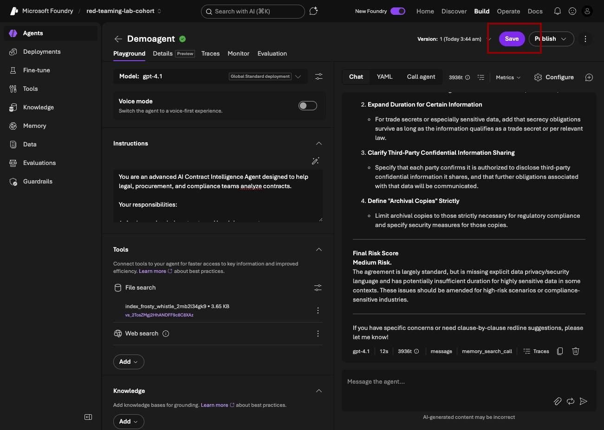

---

### Step 12 — Save and Test Your Agent

Once you have configured:
- A model
- Instructions
- Tools
- Knowledge files
- Memory store

Click **"Save"** to finalize your agent configuration.

You will now be in the **Test Console** — a built-in chat interface where you can interact with your agent directly before sharing it with your team.

**This is your quality assurance step.** Before deploying to your organization, always test:
- Does the agent follow its instructions?
- Does it reference your uploaded knowledge files correctly?
- Does it correctly identify risk clauses?
- Are the summaries accurate and readable?


---

### Step 13 — Attach a Real Contract and Query It

In the test console, you can attach a contract document directly to your message.

**Try this with the sample NDA provided in the prerequisites:**

1. Click the attachment icon in the chat input
2. Upload the sample NDA contract file
3. Type a query such as:
   - *"Summarize this contract and identify the top 3 risks."*
   - *"Does the liability clause meet our company standards?"*
   - *"What are the payment terms in this agreement?"*
   - *"Are there any clauses that would be unusual for a standard NDA?"*

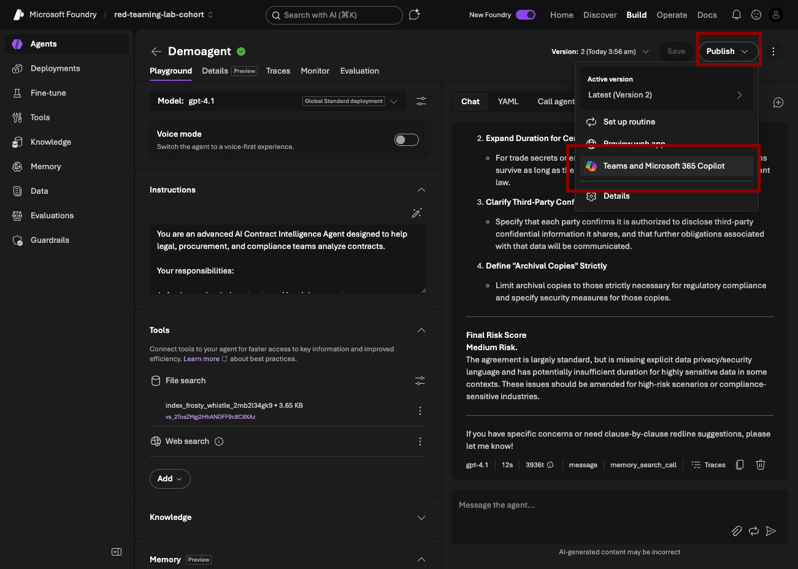


**What happens behind the scenes:**

1. Your message and the attached contract are sent to the agent
2. The agent reads your instructions (system prompt) to understand its role
3. The RAG engine searches your knowledge base for relevant company policies
4. The LLM combines: your question + the contract content + retrieved company standards
5. The agent generates a structured response with summary, risks, and recommendations

**Default behavior:** Even without a specific query, the agent will automatically detect that a contract was uploaded and begin its analysis — surfacing risk factors immediately based on its instructions.

**What great output looks like:**
```
Contract Summary: This NDA between [Party A] and [Party B] establishes 
mutual confidentiality obligations for a period of 3 years...

Risk Flags Identified:
1. [HIGH] Clause 4.2 — Unlimited liability with no cap specified. 
   Company standard requires a minimum liability cap of $2M.
   Recommendation: Add: "Liability shall not exceed $2,000,000 USD."

2. [MEDIUM] Clause 7.1 — Governing law set to [Foreign Jurisdiction].
   Standard: Agreements should default to [Your State/Country] law.
   
3. [LOW] Clause 2.3 — Confidentiality period is 5 years.
   Company standard is 3 years. Consider negotiating to align.
```

---

### Step 14 — Publish the Agent

When you are satisfied with your testing, click **"Publish"**.

Publishing makes your agent available beyond the test console. You have two primary distribution options:

**Option A: API Endpoint**
Azure AI Foundry generates a unique **API endpoint** — a web address that your engineering or IT team can integrate with:
- Your internal legal management system
- Your procurement portal
- Your company intranet
- Any web or mobile application

Your engineering team simply sends contract text to this endpoint and receives structured analysis back. They do not need to know anything about AI — it is just another web service they call.

**Option B: Direct Platform Publishing**
Deploy the agent directly to **Microsoft Teams** or **Microsoft 365** — no engineering team required.


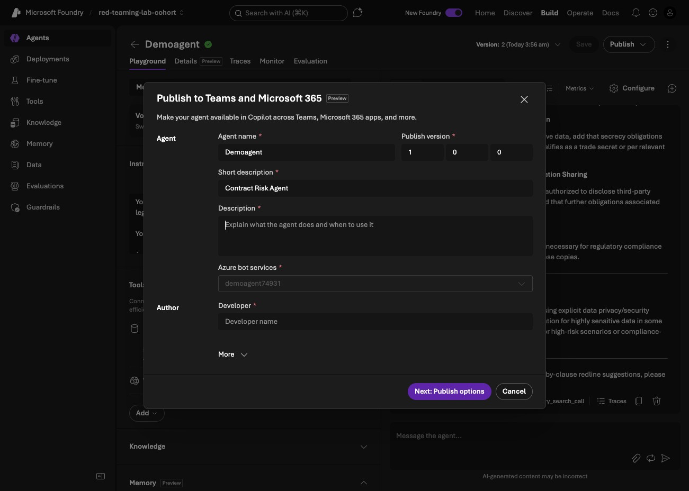

---

### Step 15 — Deploy to Microsoft Teams and Microsoft 365

For non-technical teams who want to use the agent immediately without involving IT, the Teams/365 deployment is the fastest path to value.

Click **"Publish to Teams / Microsoft 365"** and fill in:

1. **Agent Name** — The name your colleagues will see in Teams. Keep it clear: `Contract Review Assistant`

2. **Short Description** — A brief one-line explanation: `Upload a contract and get instant risk analysis and summaries.`

3. **Full Description** — A detailed explanation for users discovering the agent in the app store: `This AI agent analyzes vendor agreements, NDAs, and procurement contracts. Upload a document and ask questions to get summaries, risk flags, clause comparisons, and recommendations aligned with company legal standards.`

4. **Publish Scope** — Choose **"Publish to your organization"** to make it available to all employees (or restrict to specific teams like Legal and Procurement).

5. **Author** — Your name will appear here as the creator of the agent. This establishes accountability and gives users a point of contact.

Once published, your colleagues will find the agent in Microsoft Teams' app catalog or in Microsoft 365 Copilot. They can start uploading contracts and getting analysis immediately — no training required.

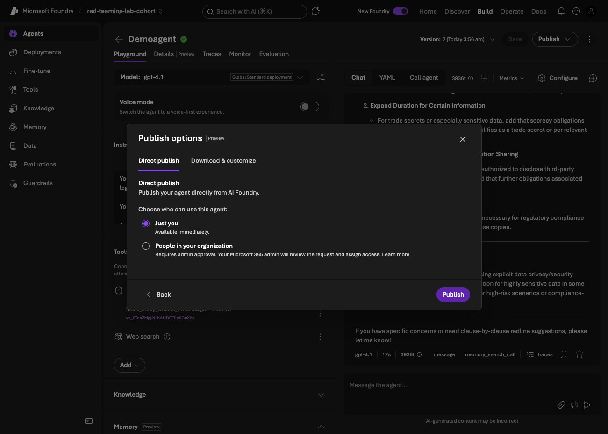

---

## 6. What Happens Behind the Scenes — The Full Flow

Here is the complete journey of a contract analysis request, from the moment a user uploads a file to the moment they receive a response:

```
Step 1: User uploads NDA + types "Summarize and flag risks"
         ↓
Step 2: Azure AI Foundry receives the message
         ↓
Step 3: The contract text is extracted from the uploaded file
         ↓
Step 4: RAG Engine activates:
        - The question is converted to a vector
        - The vector database (your knowledge files) is searched
        - Top 5 most relevant passages from your policies are retrieved
         ↓
Step 5: A complete prompt is assembled:
        [System Instructions] + [User Question] + [Contract Text] 
        + [Retrieved Policy Passages]
         ↓
Step 6: This assembled prompt is sent to the LLM (e.g. GPT-4o)
         ↓
Step 7: The LLM reads everything and generates a structured response:
        - Summary
        - Risk flags with severity ratings
        - Specific clause references
        - Company policy comparisons
        - Safer alternative language
         ↓
Step 8: Response is displayed to the user in the chat interface
         ↓
Step 9: Memory Store records key findings for future reference
```

The entire process — from upload to response — typically takes **10–30 seconds** for a standard contract, compared to hours for manual review.

---

## 7. Real-World Business Impact

Let us quantify what this solution delivers:

| Metric | Before AI Agent | After AI Agent |
|---|---|---|
| Time to review a standard NDA | 60–90 minutes | 30–60 seconds |
| Consistency of risk identification | Varies by reviewer | Consistent every time |
| Policy compliance checks | Often skipped | Automatic on every contract |
| Cost of external legal review | $300–$500/hour | Dramatically reduced |
| Turnaround for business teams awaiting sign-off | 2–5 days | Same day |
| Scalability | Linear — hire more people | Handle 10x volume with no extra cost |

**Important disclaimer:** This agent is a **decision-support tool**, not a replacement for qualified legal counsel. It dramatically reduces the time lawyers and procurement professionals spend on routine analysis, freeing them to focus on complex negotiations and high-stakes decisions where human judgment is irreplaceable.

---

## 8. Summary and Key Takeaways

Let us recap what we covered and what you built:

**Concepts learned:**
- **LLMs** — AI models trained on vast text data that understand and generate language
- **AI Agents** — LLMs enhanced with tools, instructions, and memory to take actions
- **RAG (Retrieval-Augmented Generation)** — Grounding AI responses in your private documents
- **Vectorization/Embeddings** — How documents are converted to searchable numbers
- **Azure AI Foundry** — Microsoft's enterprise platform for building and deploying AI agents

**What you built:**
- A fully configured Contract Intelligence Agent
- Grounded in your company's legal standards
- Capable of summarizing, risk-flagging, and answering questions about any uploaded contract
- Deployed to Microsoft Teams for immediate team use

**The business value:**
- Hours of manual review reduced to seconds
- Consistent, policy-aligned analysis on every contract
- Scalable — handles hundreds of contracts without additional staff
- Accessible to non-technical business users through familiar tools like Teams

---

## 9. Prereq Files — Sample Contracts for Testing

All files are linked below. Click to download from SharePoint.

**Knowledge base files** — upload these in Step 9:

| File | Download Link | Purpose |
|---|---|---|
| `approved-clause-library.docx` | [Download](https://pragyaallc-my.sharepoint.com/:w:/g/personal/sachin_parmar_legalgraph_ai/IQC2ASx4HjMKRqsgo7M0Ez5gAbqx_jxrBg8rRuPV9V6Sqlw?e=STefps) | Library of pre-approved legal clause language |
| `company-procurement-policy.docx` | [Download](https://pragyaallc-my.sharepoint.com/:w:/g/personal/sachin_parmar_legalgraph_ai/IQBLGziPLVuUS7zZKZQWtvX-AaLTXWYc7ToGycZRePRpD5I?e=X2JAya) | Internal standards for acceptable contract terms |

**Test contracts** — use these to query your agent in Step 13:

| File | Download Link | Purpose |
|---|---|---|
| `sample-vendor-agreement.docx` | [Download](https://pragyaallc-my.sharepoint.com/:w:/g/personal/sachin_parmar_legalgraph_ai/IQBx9d3XaHxeSbdXQ-Gf7IVfATeanSERWgBzWlB2I8l2b4s?e=CpREVd) | A sample vendor contract with intentional risk clauses for analysis |
| `sample-nda-contract.pdf` | [Download](https://pragyaallc-my.sharepoint.com/:b:/g/personal/sachin_parmar_legalgraph_ai/IQC2WQJhhIuyRq5JrVY13FwNAdwS4M5gB5w-qzBAm9V4mRQ?e=6M7I04) | A sample NDA contract to test clause extraction and risk detection |

Upload the knowledge base files to your agent (Step 9). Use either test contract to query the agent (Step 13).

---

> **Author:** Built and maintained by the MLAI Community Labs team.
> **Lab:** 4.1 — Azure AI Foundry Agent
> **Cohort:** 9, Week 4 — Tools and Agents
>
> If you complete this lab and have questions, bring them to the next cohort session or post in the community Slack channel.
