# Build, Deploy & Evaluate Your First AI Agent in Azure AI Foundry

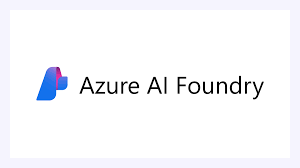

> **What you'll build:** A smart contract-review agent that lives inside Microsoft Teams and Microsoft 365 Copilot — no code required. By the end of this lab you'll know how to create, configure, test, publish, monitor, and continuously evaluate an AI agent using Azure AI Foundry.

---

## Who This Lab Is For

| You are… | You'll get… |
|---|---|
| A developer building enterprise AI apps | A complete, production-ready deployment pipeline |
| A business analyst exploring AI agents | A step-by-step walkthrough without a single line of code |
| An AI/ML enthusiast learning Azure | Hands-on experience with Foundry IQ, memory stores, and continuous eval |

No prior Azure experience required. If you can click a button, you can finish this lab.

---

## Prerequisites

Before we start, make sure you have:

- [ ] An **Azure subscription** with Azure AI Foundry access
- [ ] The **New Foundry experience** enabled (we'll check this in Step 1)
- [ ] All **knowledge base files** downloaded (see table below) and saved to your desktop
- [ ] All **test contract files** downloaded (see table below) — you'll use these in the testing section
- [ ] A **Microsoft Teams** account (for the deployment section)

> **Tip:** Keep this guide open in one tab and Azure AI Foundry open in another. You'll be switching between them.

### Knowledge Base Files

Download these and upload them to your agent in **Part 3 (File Search)**:

| File | Download Link | Purpose |
|---|---|---|
| `approved-clause-library.docx` | [Download](https://pragyaallc-my.sharepoint.com/:w:/g/personal/sachin_parmar_legalgraph_ai/IQC2ASx4HjMKRqsgo7M0Ez5gAbqx_jxrBg8rRuPV9V6Sqlw?e=STefps) | Library of pre-approved legal clause language |
| `company-procurement-policy.docx` | [Download](https://pragyaallc-my.sharepoint.com/:w:/g/personal/sachin_parmar_legalgraph_ai/IQBLGziPLVuUS7zZKZQWtvX-AaLTXWYc7ToGycZRePRpD5I?e=X2JAya) | Internal standards for acceptable contract terms |

### Test Contracts

Download this and use it to query your agent in **Part 7 (Testing)**:

| File | Download Link | Purpose |
|---|---|---|
| `Aurelios-System-NDA.pdf` | [Download](https://pragyaallc-my.sharepoint.com/my?id=%2Fpersonal%2Fsachin%5Fparmar%5Flegalgraph%5Fai%2FDocuments%2FCohort%20%2D%209%2Fweek%20%2D%201%2FAurelios%20System%20NDA%201%2Epdf&parent=%2Fpersonal%2Fsachin%5Fparmar%5Flegalgraph%5Fai%2FDocuments%2FCohort%20%2D%209%2Fweek%20%2D%201&ga=1) | Sample NDA contract to test clause extraction and risk detection |

---

## What We're Building

We're creating a **Contract Review Agent** — an AI agent that:

- Reads uploaded contract documents
- Identifies risky clauses and red flags
- Answers follow-up questions using memory of past conversations
- Searches the web for up-to-date legal context
- Runs inside Microsoft Teams so your whole team can use it

Think of it as having a junior legal analyst available 24/7, right inside the tools your team already uses.

---

## Part 1 — Enable the New Azure AI Foundry Experience

The New Foundry is Microsoft's latest unified hub for building, deploying, and managing AI applications. It brings together model selection, agent tooling, evaluation, and monitoring all under one roof.

**Steps:**

1. Navigate to [https://ai.azure.com](https://ai.azure.com) and sign in with your Azure account
2. In the top banner or settings, look for the toggle that says **"New Foundry"**
3. Click it to enable the New Foundry interface


> **Why does this matter?** The New Foundry gives you access to the latest agent builder, Foundry IQ, continuous evaluation, and the Teams/Copilot publishing features we'll use throughout this lab. The classic experience doesn't have all of these.

Once enabled, you should see a refreshed sidebar with options like **Agents**, **Models**, **Monitoring**, and **Evaluation**.

---

## Part 2 — Create Your Agent

Now for the fun part — let's bring our agent to life.

### 2.1 Open the Agent Builder

1. Now click **Create Agents**
2. Click the **"+ Create an agent"** button in the top right


3. A dialog will appear — give your agent a clear, descriptive name

   > **Naming tip:** Use something like `Contract-Review-Agent` or `Legal-Clause-Analyzer`. Avoid generic names like "MyAgent" because if you deploy this to Teams, this name is what your colleagues will see.

4. Click **Create**


You'll be redirected to the **Agent Configuration page** — this is your agent's control center. Everything you do in the next few steps happens here.

---

### 2.2 Select Your Model

The first thing you'll configure is the **underlying AI model** that powers your agent's reasoning.


For our contract review agent, **select `gpt-4.1`**. Legal contracts are complex and you want the most capable model reading through them.

---

### 2.3 Write Your Agent Instructions

This is the most important configuration step. The **instructions** are the system prompt — they tell the agent who it is, what its job is, and how it should behave.


Click inside the **Instructions** box and paste something like this:

```
You are an advanced AI Contract Intelligence Agent designed to help legal, procurement, and compliance teams analyze contracts.

Your responsibilities:

1. Analyze uploaded contracts and legal documents.
2. Extract important information including:
   - contract type
   - parties involved
   - effective date
   - expiration date
   - payment terms
   - renewal clauses
   - termination conditions
   - governing law
   - confidentiality obligations
   - liability clauses
   - indemnification clauses

3. Detect risky or non-standard clauses such as:
   - unlimited liability
   - missing data privacy clauses
   - one-sided termination rights
   - auto-renewal risks
   - unfavorable payment terms
   - compliance issues

4. Assign risk levels:
   - Low Risk
   - Medium Risk
   - High Risk

5. Provide recommendations and safer alternative clause suggestions.

6. Summarize contracts in concise business language.

7. Answer user questions about uploaded contracts conversationally.

8. Compare contracts against company policy documents if provided.

9. Always structure responses clearly with:
   - Summary
   - Key Terms
   - Risks
   - Recommendations
   - Final Risk Score

10. Be professional, concise, and legally aware, but do not claim to provide official legal advice.

If the uploaded file is not a contract, politely inform the user.
```

> **Why instructions matter:** The instructions are what separate a generic chatbot from a specialized agent. Be specific about the role, the task, and the expected output format. The more precise your instructions, the more consistent your agent's behavior.

---

## Part 3 — Add Tools to Your Agent

Tools are what make your agent powerful beyond just answering questions. They let the agent take actions, search information, and work with files.

### 3.1 Upload a Knowledge Base File (File Search)

The **File Search** tool lets your agent read and reference documents you upload. This is perfect for our use case — the agent will use your uploaded contract as its primary source of truth.


**Steps:**

1. In the **Tools** section
2. Select **"Upload File"** from the list
3. A file upload panel will appear 
4. Upload the knowledge base file you downloaded in the prerequisites (the one from the *"Knowledge Base Files"* section of the course) 

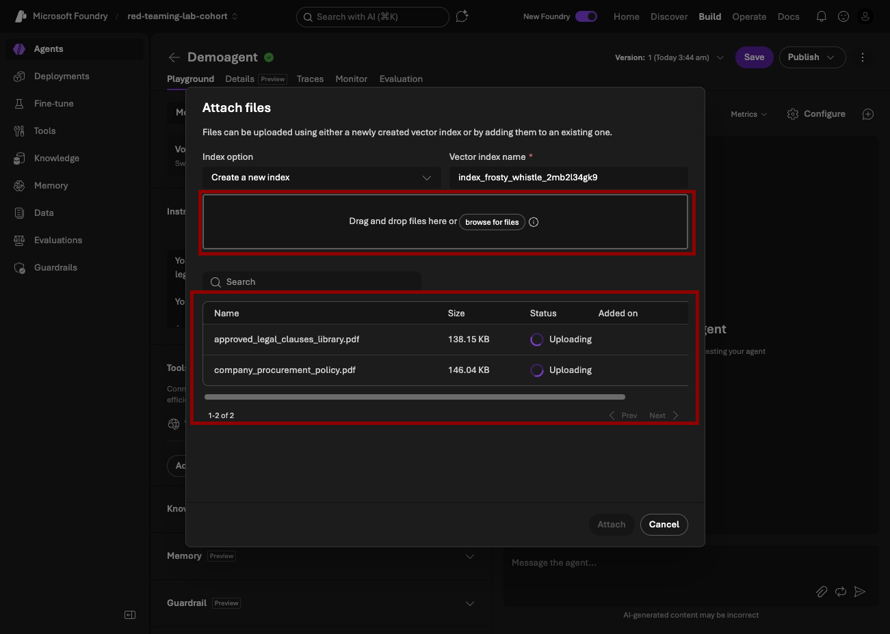

5. Wait for the upload to process — you'll see a green checkmark when it's ready click on attach button


> **What happens under the hood:** Azure AI Foundry automatically chunks your document into smaller pieces and creates vector embeddings — essentially a searchable index of your document's meaning. When the agent needs to answer a question, it retrieves the most relevant chunks from your file rather than reading the whole thing from scratch every time. This makes responses both faster and more grounded in your actual document.

---

### 3.2 Explore Other Available Tools

While you're in the Tools section, let's take a quick tour of what else is available:


**Built-in tools you'll see:**

| Tool | What it does |
|---|---|
| **File Search** | Searches uploaded documents (what we just added) |
| **Web Search** | Lets the agent search Bing for real-time information |
| **Code Interpreter** | Runs Python code — great for data analysis, calculations, and generating charts |

**To find even more tools:**
- Click **"Browse more"** in the Tools section


- You'll find integrations like **Azure Functions**, **Logic Apps connectors**, **custom API tools**, and more


> **For this lab:** We're keeping it simple with just File Search. But in a real production agent, you might combine File Search + Web Search so the agent can reference your internal documents *and* check current legal regulations online.

---

## Part 4 — Connect Foundry IQ (Knowledge Graph)

Foundry IQ is Azure AI Foundry's **knowledge graph and enterprise data connection layer**. This is one of the most powerful — and most underused — features in the platform. Let's break it down.


### What is Foundry IQ?

Foundry IQ sits between your agent and your organization's data. Instead of just searching uploaded files, Foundry IQ can:

- Connect to **SharePoint, OneDrive, and Microsoft Graph** data
- Index your organization's **Teams conversations, emails, and documents**
- Create a **semantic knowledge graph** — meaning it understands relationships between concepts, not just keyword matches
- Respect your organization's **permissions model** (users only see data they're already authorized to access)

Note : We have alredy add files in tools so we ont requte it 

---

## Part 5 — Add Memory to Your Agent

Without memory, every conversation your agent has starts from zero. The user uploads a contract, gets feedback, asks a follow-up question — and the agent has forgotten everything from two messages ago. Memory fixes this.

### 5.1 Create a Memory Store

1. In the **Memory** section of the agent configuration page, click **"+ Add"**


2. Click **"Create memory store"**


### How Memory Stores Work

A memory store is essentially a **persistent conversation database** tied to your agent. Here's what it does:

**Short-term memory (within a session):**
The agent remembers everything said in the current conversation — the contract you uploaded, the questions you asked, the clauses it flagged. This is standard for all LLMs.

**Long-term memory (across sessions):**
With a memory store, the agent can remember things *between* separate conversations. For example:
- A user's preferences ("Always flag indemnification clauses in red")
- Facts established in previous conversations ("This vendor's contracts always have aggressive IP clauses")
- User-specific context ("This user is from the legal team")

**How it's stored:**
Memory is stored as structured records in your memory store backend. When a new conversation starts, the agent performs a semantic search over stored memories to retrieve relevant context. This happens automatically — you don't need to do anything special.

> **Privacy note:** Memory stores respect your Azure tenant's data residency and privacy settings. Data stored in your memory store stays within your Azure subscription.

---

## Part 6 — Configure Guardrails

Your agent comes with **built-in safety guardrails** out of the box — these are content filters and behavioral constraints that prevent the agent from generating harmful, inappropriate, or off-topic responses.


### What the Default Guardrails Cover

- **Hate speech and violence** — The agent won't generate content that promotes harm
- **Self-harm content** — Filtered by default
- **Off-topic queries** — You can configure the agent to stay focused on its intended task
- **Confidential data leakage** — Prevents the agent from inadvertently echoing back sensitive information in unexpected ways

### Customizing Guardrails

In the **Guardrails** section you can:

1. **Adjust sensitivity levels** — Set how aggressively each category is filtered (Low / Medium / High)
2. **Add custom topics to block** — e.g., "Do not discuss competitor products"
3. **Configure output formatting rules** — e.g., "Always respond in bullet points"
4. **Set up groundedness checks** — This is powerful: it verifies that the agent's responses are actually supported by the source documents rather than being hallucinated

> **Recommendation for contract review:** Keep the default guardrails and add a custom rule like "Only answer questions related to the uploaded contract document. Politely decline off-topic requests." This keeps the agent focused and professional.

---

## Part 7 — Test Your Agent

Before deploying to your whole organization, always test in the playground. This is your sandbox.

### 7.1 Run a Test Query

1. In the **Test** panel (usually on the right side of the agent configuration page), you'll see a chat interface
2. Click the **attachment icon** (paperclip) to attach a contract document — use any sample contract PDF for this from preq section


3. Type the query:

   ```
   Review this contract and identify risky clauses
   ```

4. Hit **Send** and watch the agent respond


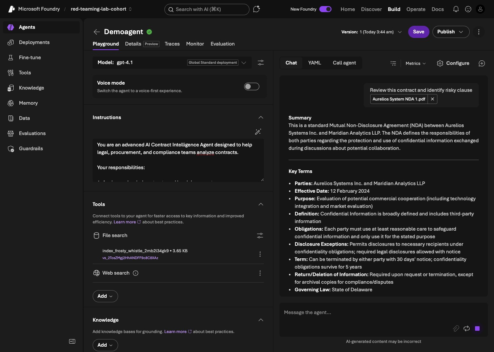

---

## Part 8 — Save Your Agent

Once you're happy with the test results, save your configuration.

1. Click **"Save"** in the top right corner of the agent configuration page
2. You'll see a confirmation that your agent configuration has been saved
3. Your agent now has a stable version that you can reference, deploy, and roll back to if needed


---

## Part 9 — Publish to Microsoft Teams and Microsoft 365 Copilot

This is where things get exciting. You're going to take your agent from the Azure portal and put it directly inside Microsoft Teams and Microsoft 365 Copilot — the tools your team uses every day.

### 9.1 Go to the Publish Section

1. In the right top corner, click **"Publish"** (or look for a **"Deploy"** tab at the top of your agent page)
2. You'll see a list of deployment targets — click on **"Teams and Microsoft 365 Copilot"**


---

### 9.2 Fill in the App Details


You'll be prompted to fill in the metadata for your Teams app package:

| Field | What to enter | Example |
|---|---|---|
| **App name** | The name users will see in Teams | `Contract Review Agent` |
| **Short description** | One-line summary (shown in search results) | `AI-powered contract risk analysis` |
| **Full description** | Detailed explanation for the app store listing | `Analyzes contracts for risky clauses, missing protections, and compliance issues using Azure AI` |
| **Author** | Developer name or team name | `Legal Ops Team / [Your Name]` |
| **Version** | Semantic version number | `1.0.0` |

Fill in all fields, then click **"Next"**.

> **Tip:** Spend a few extra minutes on the description. When colleagues search for agents in Teams, this is what they see. A clear description drives adoption.

---

### 9.3 Choose Your Audience

You'll be asked who can access this agent:

- **Just me** — Only you can use it (great for testing before wider rollout)
- **My organization** — Everyone in your Microsoft 365 tenant can find and use it

For this lab, start with **"Just me"** to test it in Teams before releasing to your organization. Once you're confident, come back and change this to **"My organization"**.

Click **"Publish"**.


---

### 9.4 Your Agent Is Now Live in Copilot

After publishing, Azure AI Foundry will package your agent as a Microsoft Teams app and make it available in:

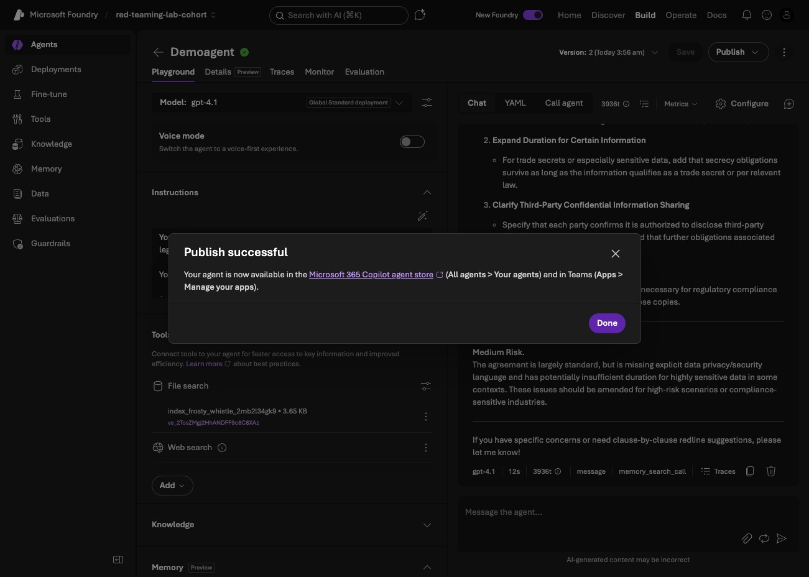

- **Microsoft 365 Copilot** — accessible via the Copilot chat interface at [microsoft365.com](https://microsoft365.com)
- **Microsoft Teams** — as a bot/agent app your team can install

---

## Part 10 — Open and Test in Microsoft Teams

Let's verify everything works end-to-end in the actual Teams environment.

### 10.1 Open the Agent in Teams

1. Go back to the **Publish** section in Azure AI Foundry
2. Click **"Open in Teams"**
3. This will deep-link directly to your agent in the Microsoft Teams desktop or web app

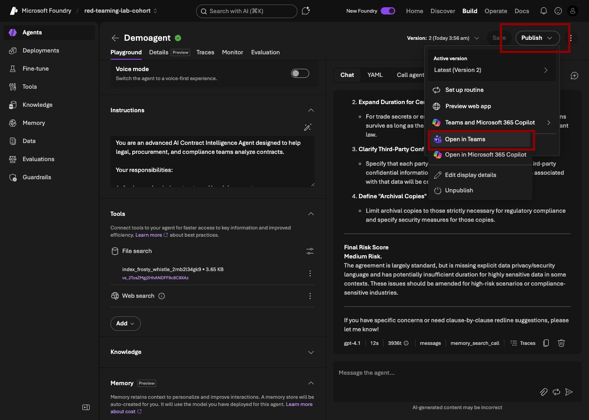

---

### 10.2 If the Agent Isn't Visible Yet

Sometimes the app takes a few minutes to propagate through the Microsoft 365 ecosystem. If you don't see it automatically:


1. Open **Microsoft Teams**
2. Click on **"Apps"** in the left sidebar
3. Click **"Manage your apps"** (bottom of the app panel)
4. Use the search bar to search for your agent's name (e.g., `Contract Review Agent`)

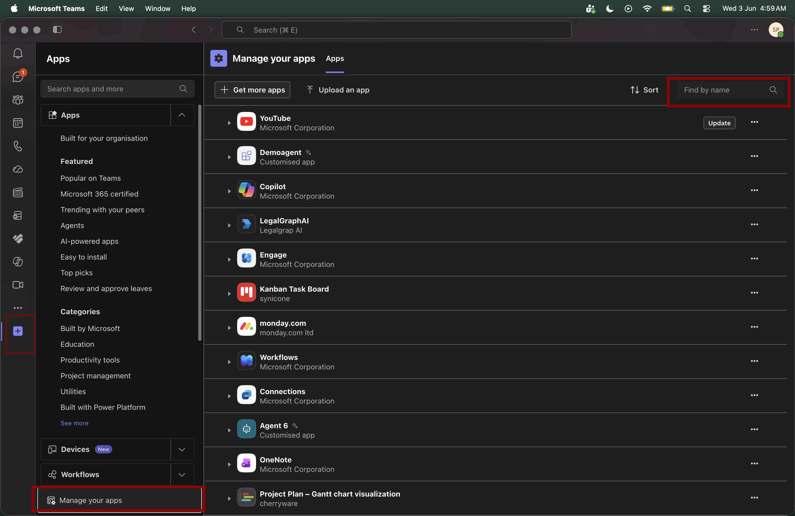

5. Click **"Add"** to install it

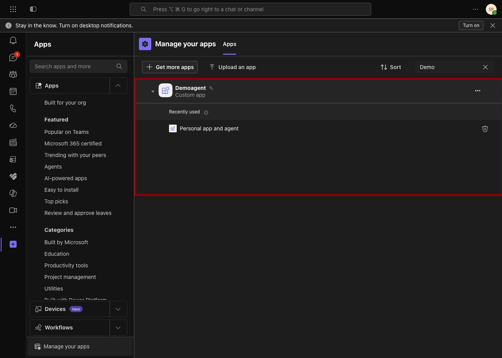

---

### 10.3 Connect the Agent to Azure AI Foundry

The first time you open the agent in Teams, it will prompt you to **connect to Azure AI Foundry**. This is an authentication step that links your Teams session to your Foundry deployment.

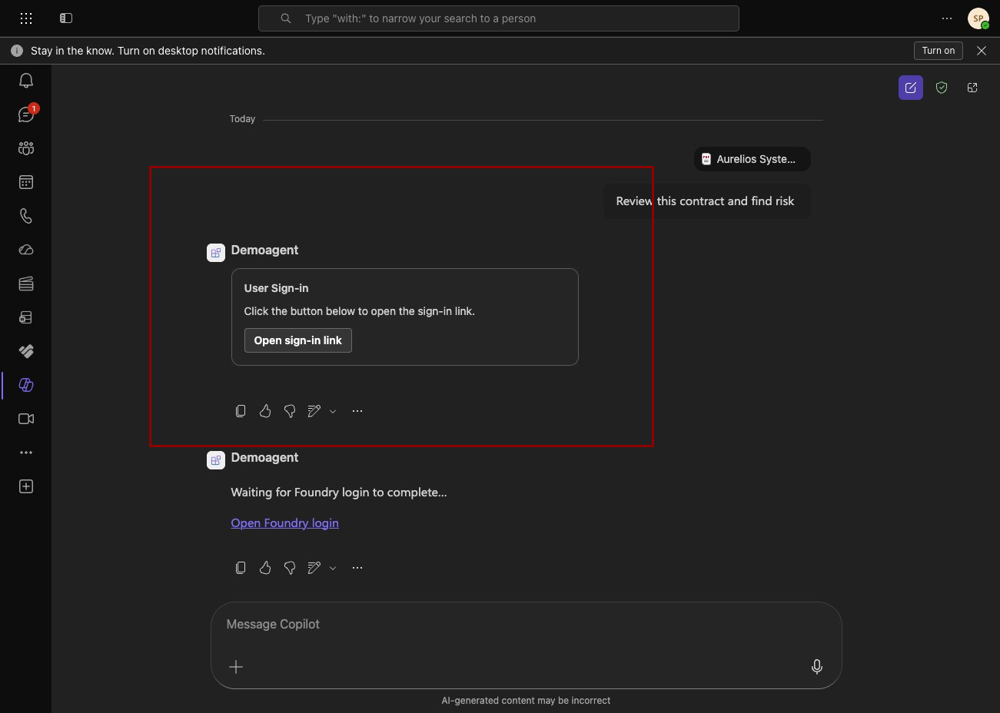

Follow the prompts:
1. Click **"Connect"** when prompted
2. Sign in with your Azure credentials if asked
3. Authorize the connection

Once connected, the agent is fully operational inside Teams.

---

### 10.4 Test the Full Flow in Teams

Now repeat the test from Part 7, but this time entirely inside Teams:

1. Open a conversation with your agent in Teams
2. Click the **attachment icon** and upload your contract PDF
3. Type:

   ```
   Review this contract and identify risky clauses
   ```

4. You should receive the same high-quality analysis you saw in the Azure portal — now living natively in Teams

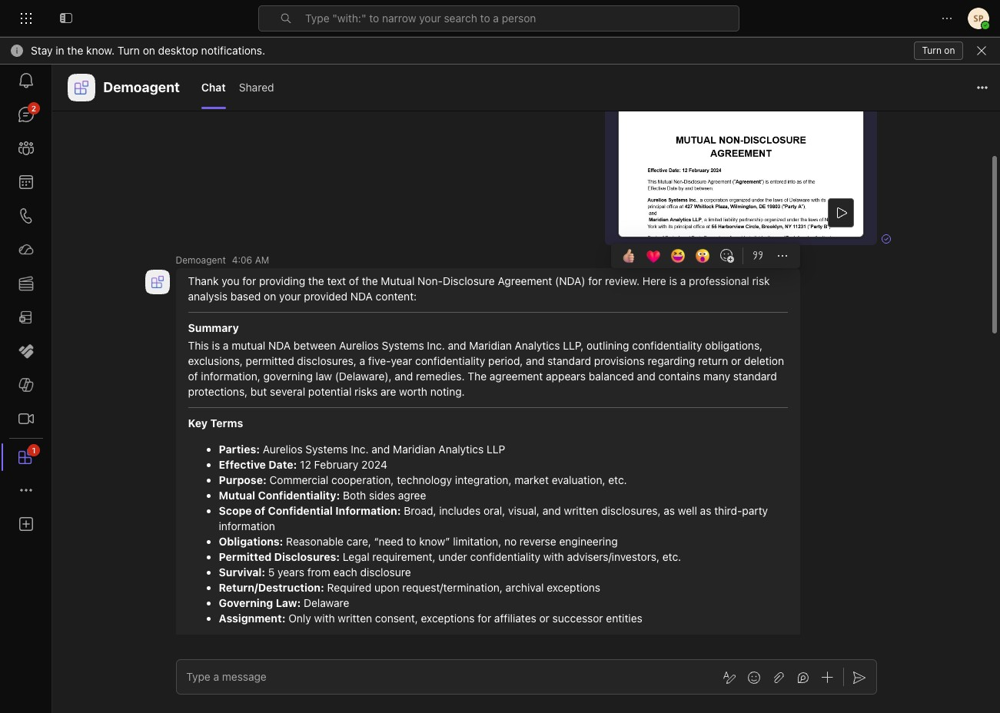

> **The magic moment:** Your colleagues can now interact with this agent without ever opening the Azure portal. They just open Teams, find the agent, upload a contract, and get instant analysis.

---

## Part 11 — Monitor Your Agent

You've built and deployed an agent — now let's make sure it's running well. Azure AI Foundry has a built-in **Monitoring** section that gives you real-time and historical visibility into your agent's usage.

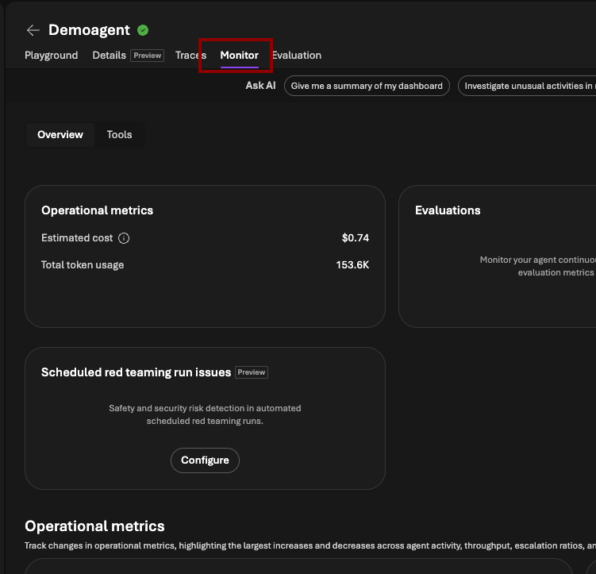

### 11.1 Wait 10–15 Minutes

After running some test queries (in the portal and in Teams), wait **10–15 minutes** for the telemetry data to flow into the monitoring dashboard.

### 11.2 Open the Monitoring Section

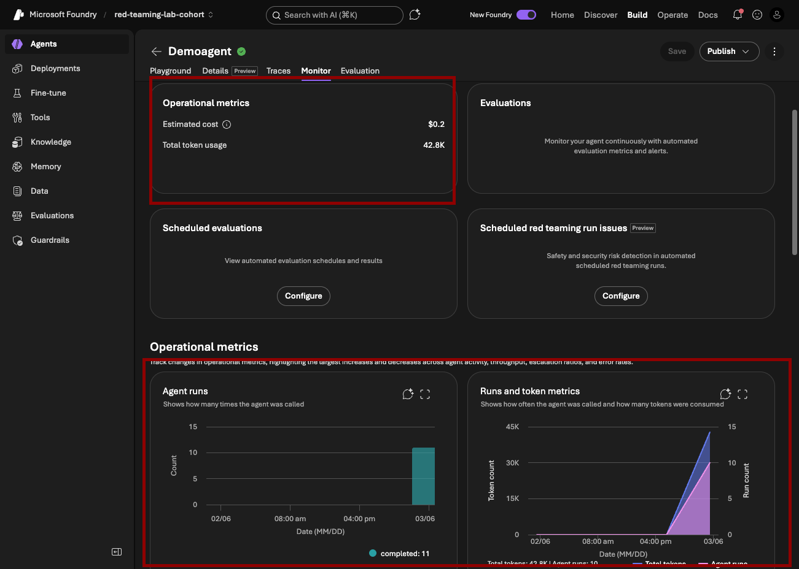

1. In the left sidebar, click **"Monitoring"**
2. You'll see a dashboard with metrics including:

| Metric | What it tells you |
|---|---|
| **Total requests** | How many times your agent was called |
| **Total tokens used** | Input + output tokens consumed (directly maps to cost) |
| **Average response latency** | How long users are waiting for responses |
| **Error rate** | Failed requests that need investigation |
| **Cost breakdown** | Estimated spend per model, per day |

> **Why monitoring matters:** Token usage = cost. If your agent is being used more than expected or if token counts per conversation seem high, you can optimize your instructions or switch to a more cost-efficient model tier.

---

## Part 12 — Set Up Continuous Evaluation

Monitoring tells you *how much* your agent is being used. **Evaluation** tells you *how well* it's performing. This is one of the most valuable — and most overlooked — features in Azure AI Foundry.

### What is Continuous Evaluation?

Continuous evaluation automatically scores your agent's responses against quality criteria on an ongoing basis. Instead of manually testing your agent after every change, Foundry does it for you and alerts you when quality drops.

### 12.1 Open the Configure Section

1. In the **Monitoring** section, click the **"Configure"** tab (or look for an **"Evaluation"** option in the sidebar)
2. Find **"Continuous Evaluation"**

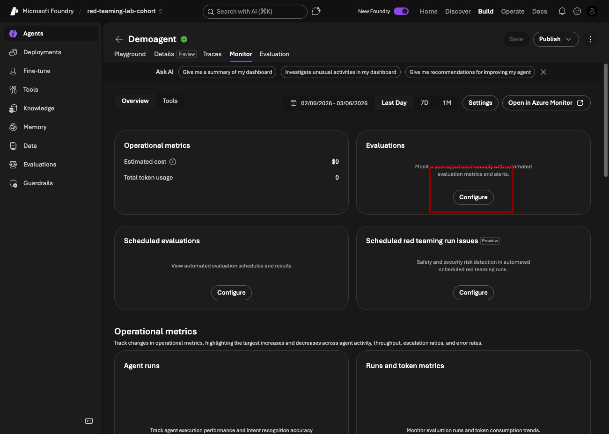

3. Toggle it to **Enabled**

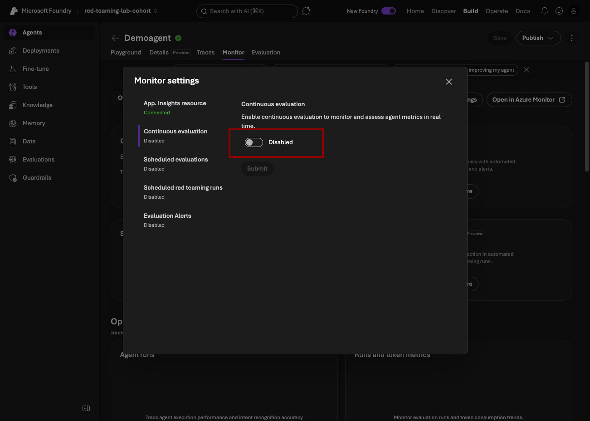

---

### 12.2 Choose Built-in Evaluators

Once Continuous Evaluation is enabled, you'll be asked to select your evaluators. You have two options:

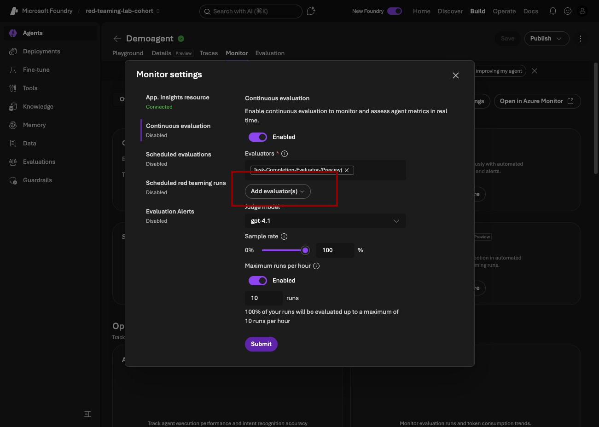

**Option A — Built-in Evaluators (recommended for getting started):**

Azure AI Foundry includes a library of pre-built evaluators. Click **"Built-in eval"** to see the full list:

| Evaluator | What it measures |
|---|---|
| **Groundedness** | Are the agent's responses supported by the source documents, or is it hallucinating? |
| **Relevance** | Are responses actually answering the user's question? |
| **Coherence** | Are responses logically structured and easy to follow? |
| **Fluency** | Is the language natural and grammatically correct? |
| **Similarity** | How close is the response to a "gold standard" ideal answer? |
| **F1 Score** | Precision and recall of factual claims in the response |

Select the evaluators most relevant to your use case. For a contract review agent, **Groundedness** and **Relevance** are the most critical — you need responses that are factually tied to the contract, not made up.

**Option B — Custom Evaluators:**

If you have specific quality criteria that the built-in evaluators don't cover, you can create custom evaluators by:
1. Clicking **"Create custom eval"**
2. Writing an evaluation prompt — essentially asking a separate LLM to judge the output
3. Defining the scoring criteria (e.g., 1–5 scale, pass/fail)

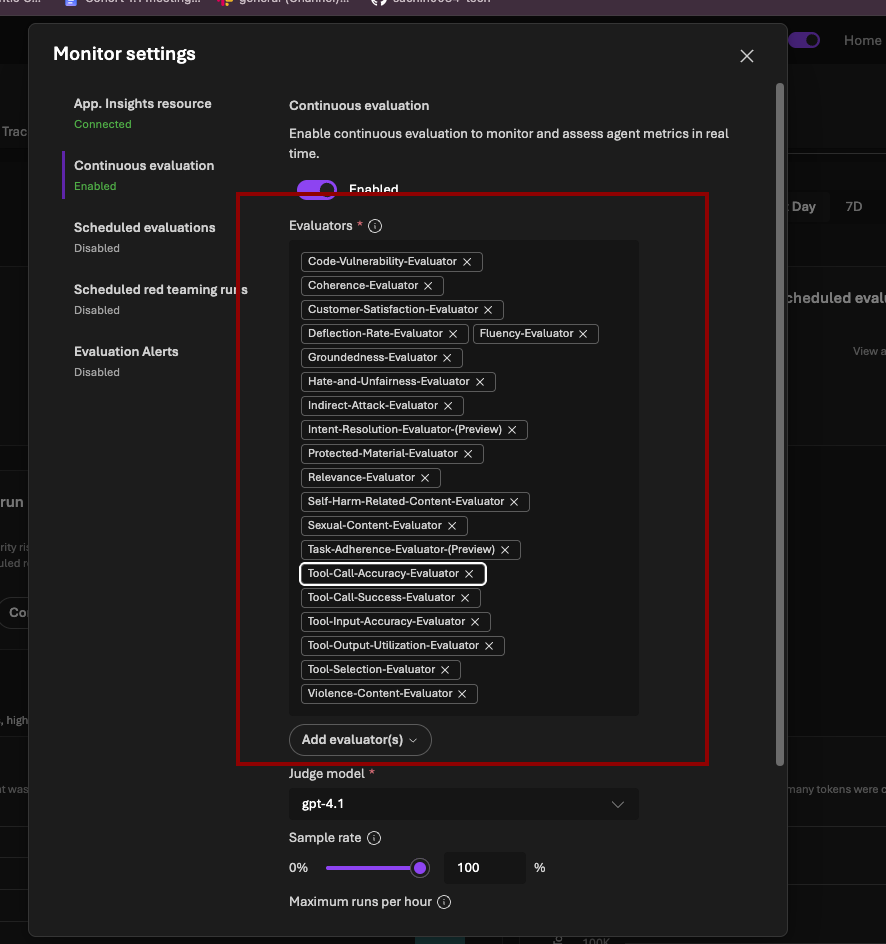

> **Example custom evaluator prompt:**
> *"On a scale of 1–5, how well does this response identify contractual risks? 5 = identifies all major risks with specific citations. 1 = misses obvious risks or provides unsupported claims."*


---

### 12.3 Submit the Evaluation Configuration

1. After selecting your evaluators, click **"Submit"**
2. Foundry will begin running evaluation jobs against your agent's conversation history
3. Results appear in the Monitoring dashboard — you'll see quality scores over time, not just usage metrics

> **The big picture:** When you combine monitoring (usage + cost) with continuous evaluation (quality scores), you have a complete picture of your agent's health. You'll know when to scale up, when to optimize, and when something has gone wrong — before your users tell you about it.

---

## Summary: What You Built Today

Congratulations — here's a recap of everything you accomplished:

| Step | What you did |
|---|---|
| ✅ Part 1 | Enabled the New Azure AI Foundry experience |
| ✅ Part 2 | Created and configured an AI agent with a model and instructions |
| ✅ Part 3 | Added File Search, Web Search, and Code Interpreter tools |
| ✅ Part 4 | Connected Foundry IQ for enterprise knowledge graph access |
| ✅ Part 5 | Added a persistent memory store for cross-session context |
| ✅ Part 6 | Reviewed and customized safety guardrails |
| ✅ Part 7 | Tested the agent with real contract review queries |
| ✅ Part 8 | Saved the agent configuration |
| ✅ Part 9 | Published the agent to Microsoft Teams and M365 Copilot |
| ✅ Part 10 | Opened and verified the agent in Teams |
| ✅ Part 11 | Monitored usage, token consumption, and cost |
| ✅ Part 12 | Enabled continuous evaluation with built-in quality scorers |

---

## Key Concepts Cheat Sheet

| Concept | Plain English |
|---|---|
| **Agent** | An AI assistant with a specific job, tools, and memory |
| **Instructions (System Prompt)** | The rulebook the agent follows — defines its role and behavior |
| **File Search** | Lets the agent read and reference uploaded documents |
| **Foundry IQ** | Connects the agent to your organization's Microsoft 365 data |
| **Memory Store** | A database that lets the agent remember things between sessions |
| **Guardrails** | Safety filters that keep the agent on-task and appropriate |
| **Monitoring** | Tracks usage, cost, and error rates in real time |
| **Continuous Evaluation** | Automatically scores response quality on an ongoing basis |
| **Groundedness** | Whether responses are backed by real sources (not hallucinated) |

---

## Troubleshooting

**Agent gives generic responses:**
→ Make your instructions more specific. Tell it exactly what format to use and what to look for.

**File upload fails:**
→ Check that the file is under 512 MB and in a supported format (PDF, DOCX, TXT, MD).

**Agent not appearing in Teams:**
→ Wait 5–10 minutes and try searching in Teams > Apps > Manage your apps.

**Evaluation scores are low:**
→ Start with Groundedness. If it's low, your agent may be hallucinating — tighten the instructions to stay grounded in the uploaded documents.

**High token usage:**
→ Consider switching to `gpt-4o-mini` for simpler queries, or add an instruction to keep responses concise.

---

*Built with Azure AI Foundry · Week 4 Lab · MLAI Community Labs*
