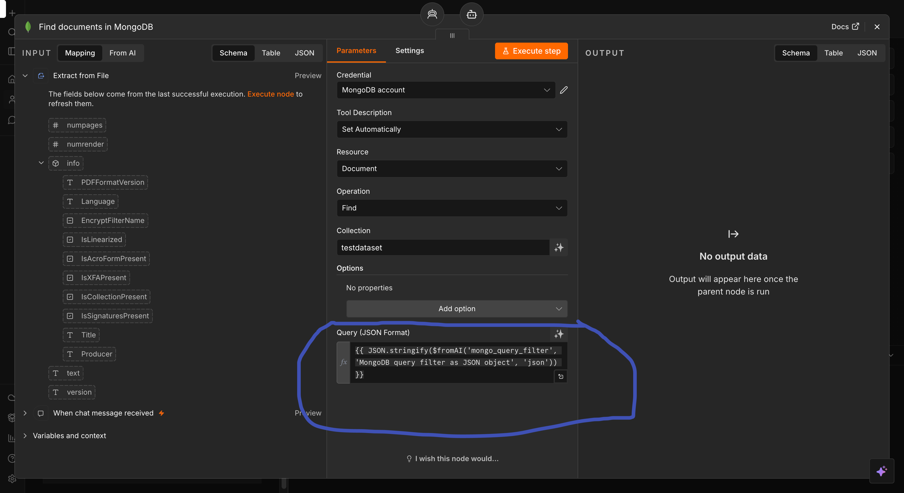

# Building a Multi-Agent Contract Assistant in n8n


## What You Will Build

By the end of this lab you will have a working **multi-agent AI system** that can:

- Accept a contract PDF from a user via chat
- Route every user message to the correct specialist agent automatically
- Handle off-topic questions politely using MongoDB data
- Answer process and approval questions using Supabase data
- Identify contract risks and red flags using Snowflake data
- Remember the entire conversation using a shared memory node

---

## Understanding Multi-Agent Architecture

Before you touch n8n, read this section carefully. The confusion most people hit in this lab comes from not understanding **which agent does what** before they start building.

### What Is a Multi-Agent System?

A single AI agent handles one job well. A **multi-agent system** is a group of specialised agents, each an expert in a narrow domain, coordinated by a central agent called the **Orchestrator**.

Think of it like a company:

| Role | Who They Are |
|---|---|
| User | Sends a message or question |
| Orchestration Agent | The manager — reads the question and decides which specialist to call |
| boundary_guard_agent | The receptionist — politely redirects off-topic questions |
| playbook_agent | The process expert — explains approval steps and procedures |
| risk_agent | The legal analyst — flags risky clauses and financial exposure |

### How the Flow Works

Every single message the user sends travels through this exact path:

```
User sends message + uploads contract PDF
          │
          ▼
 ┌─────────────────────┐
 │  PDF Extraction Node │  ← Pulls raw text out of the uploaded contract
 └─────────────────────┘
          │
          ▼
 ┌─────────────────────────────────────────────────┐
 │              Orchestration Agent                 │
 │  Reads: user message + full contract text        │
 │  Decides: which specialist agent to call         │
 └─────────────────────────────────────────────────┘
       │              │                │
       ▼              ▼                ▼
 boundary_guard   playbook_agent    risk_agent
    _agent
       │              │                │
       ▼              ▼                ▼
   MongoDB        Supabase          Snowflake
 (off-topic     (process steps    (risk records
  responses)    and approvals)    and red flags)
```

### Agent Responsibilities — Detailed

**Orchestration Agent**

This is the only agent the user ever "speaks to" directly. It receives the user's message and the full contract text together. Its only job is to read the intent of the message and decide which of the three specialist agents below it should handle the work. It does not answer questions itself — it delegates.

**boundary_guard_agent**

This agent is called by the Orchestration Agent whenever the user sends a message that has nothing to do with contracts — greetings, jokes, general knowledge, sports scores, etc. It queries MongoDB to find a pre-written polite response and a redirect message, then returns that to the user. It never makes up answers from its own knowledge.

**playbook_agent**

This agent is called when the user asks *how* something works — "What is the approval process for this NDA?", "Who needs to sign an MSA?", "What are the renewal steps for a Lease?". It queries the Supabase `playbook` table and returns only what is stored there. It never adds its own recommendations.

**risk_agent**

This agent is called when the user asks about danger, red flags, or risky terms in the contract — "Is this clause risky?", "Is uncapped liability dangerous?", "What are all the risks in this Lease?". It queries the Snowflake `CONTRACT_RISKS` table, filters by contract type, and returns risk records ordered by severity (High → Medium → Low). Like the others, it never answers from its own knowledge.

---

## Prerequisites

Complete these setup labs before starting. You will need credentials from each one.

| Setup Lab | What You Need From It |
|---|---|
| [MongoDB Setup](../../week%200%20%20-%20foundation/mongoDBSetup/Readme.md) | Your MongoDB connection string (the `mongodb+srv://...` URI from Step 16 of that lab) |
| [Supabase Setup](../../week%200%20%20-%20foundation/supabaseSetup/readme.md) | Your Supabase Project URL and Service Role Secret Key (from Steps 9–10 of that lab) |
| [Snowflake Setup](../../week%200%20%20-%20foundation/snowflakeSetup/Readme.md) | Your Snowflake account identifier, username, password, and warehouse name (from the config file in Step 23 of that lab) |

You will also need:

| Item | Download |
|---|---|
| **OpenAI API key** | From your OpenAI account dashboard |
| **Sample Contract PDF** | [Download here](https://pragyaallc-my.sharepoint.com/:b:/g/personal/sachin_parmar_legalgraph_ai/IQC2WQJhhIuyRq5JrVY13FwNAdwS4M5gB5w-qzBAm9V4mRQ?e=ga6WWO) |
| **n8n Workflow JSON** | [Download here](https://pragyaallc-my.sharepoint.com/:u:/g/personal/sachin_parmar_legalgraph_ai/IQBAgQZ67JvLQInPPuVaOOrQATSUgdVf5Rl3OiKFbJuChOk?e=VncRoY) |

> If you have not completed the three setup labs above, stop here. Each credential used in this lab was generated and saved during those labs. You cannot complete the wiring steps without them.

---

## Step-by-Step Guide

### Part 1 — Set Up the Input Layer

This part creates the entry point of your workflow: a chat interface that can receive both text messages and file uploads.

---

#### Step 1 — Add the First Node

Open n8n and create a new workflow. Click **"Add first step"** to open the node picker.


---

#### Step 2 — Add the Chat Trigger

In the search box type `chat`. Select **"On a new chat message"** (also called the **Chat Trigger** node).


This node is the gateway of your entire workflow. Every message the user types in the chat interface will arrive here first before anything else runs.


---

#### Step 3 — Enable File Uploads

Click on the **"When chat message received"** node you just added to open its settings panel. Click **"Add Field"** and select **"Allow File Uploads"** from the dropdown.


---

#### Step 4 — Turn On File Uploads

A toggle will appear. Enable **"Allow File Uploads"** so it is switched on.


> This is essential. Without this setting, the chat interface has no upload button and users cannot send contract PDFs. The PDF must reach n8n before any agent can read it.

---

### Part 2 — Extract Text From the Contract PDF

The AI agents cannot read a raw PDF file. This part adds a node that extracts the plain text from the uploaded PDF so the agents can process it.

---

#### Step 5 — Add a New Node

Click **"Add Node"** (the `+` button that appears after the Chat Trigger node).


---

#### Step 6 — Add the Extract From File Node

In the search box type `Extract From File`. Click on **"Extract From File"** to add it.


---

#### Step 7 — Select PDF Extraction

Inside the node settings, set the operation to **"Extract from PDF"**.


This node will take the binary file that arrived with the user's chat message and convert its contents into a readable text string.

---

#### Step 8 — Test the Upload Flow

Click **"Open Chat"** in the top-right area to open the live chat window. Upload the sample contract PDF that was provided in the prerequisites and type a test question like:

> *What is this contract about?*


Send the message. You will see an **error appear on the Extract From File node** — this is expected. Do not worry, you will fix it in the next step.


---

#### Step 9 — Fix the Binary Field Name

The error happens because n8n received your file under a slightly different internal field name than the node expects. Here is how to fix it:

1. Click on the **Extract From File** node to open it
2. Look at the left panel — you will see the incoming data from the chat trigger. Find the field that holds your file. It will say something like `data0` (the exact name may vary — use whatever name you see in your panel)
3. In the **"Input Binary Field"** setting, the default value is `data`. Change it to match what you saw — for example `data0`


4. Click **"Execute Step"** (the button at the top of the node panel)

You should now see the contract text appear in the output panel on the right. The PDF has been successfully read.


> The field name `data0` comes from how n8n names the first file attachment. If you upload a second file it would be `data1`, and so on. Always check the actual field name in the left panel rather than assuming it is always `data0`.


---

### Part 3 — Build the Orchestration Agent

The Orchestration Agent is the brain of this system. It reads both the user's message and the full contract text, then decides which specialist agent to send the work to.

---

#### Step 10 — Add an AI Agent Node

Click **"Add Node"** after the Extract From File node. Search for `AI Agent` and select it.


---

#### Step 11 — Set the Prompt Source

Inside the AI Agent node, find the **"Source"** dropdown under the Prompt section. Change it from whatever it currently shows to **"Define Below"**.

This tells n8n that you will write the prompt directly inside this node rather than pulling it from a previous node automatically.


---

#### Step 12 — Build the Prompt: User Context

In the **"User (Message)"** field you need to reference two pieces of data: what the user typed, and the contract text that was extracted.

Type the following into the field:

```
user_context
```

Now you need to wire the actual chat message to this label. Expand the **"When a chat message received"** node in the left panel — you will see a field called **chatInput**. **Drag and drop** `chatInput` onto the `user_context` placeholder you just typed. n8n will replace the text with the correct expression reference.


---

#### Step 13 — Build the Prompt: Contract Context

Still inside the same **"User (Message)"** field, add a second line:

```
contract_context
```

Now go to the **Extract From File** node output in the left panel and find the field that contains the extracted PDF text. **Drag and drop** that field onto `contract_context` the same way you did in Step 12.

Your final **User (Message)** prompt should look something like this:

```
User Query: [reference to chatInput from chat trigger]

Contract Content: [reference to extracted text from PDF node]
```


> What this achieves: every time the Orchestration Agent runs, it sees the user's exact question AND the full contract text side by side. This is how it can reason about the contract and route intelligently.

---

#### Step 14 — Add a System Message

Click **"Add Option"** inside the AI Agent node and select **"System Message"**. Paste the following:

```
You are a master contract orchestration agent. 
You are responsible for reading contracts, 
understanding user questions, and calling the 
correct specialist agents to provide answers.

You have access to three specialist agents as tools:
1. playbook_agent
2. risk_agent  
3. boundary_guard_agent

STEP 1 - READ THE CONTRACT

When a PDF is uploaded always read it first and identify:
- Contract Type: Is this an NDA, MSA, or Lease?
- Parties involved: Who are the signing parties?
- Key dates: Start date, end date, signing date
- Key clauses: What are the main clauses present?

HOW TO IDENTIFY CONTRACT TYPE:
- NDA: look for words like non-disclosure,
  confidentiality, disclosing party,
  receiving party, confidential information
- MSA: look for words like master service agreement,
  statement of work, SOW, deliverables,
  payment terms, liability, IP ownership
- Lease: look for words like lease agreement,
  tenant, landlord, rent, property,
  security deposit, escalation clause

STEP 2 - UNDERSTAND THE USER QUESTION

Read the user question and classify the intent:

SINGLE AGENT CALLS:

1. playbook_agent - call this when:
   User asks about process, steps, approval,
   signing, what to do, standard procedure,
   renewal process, exit process
   Examples:
   - How do I approve this contract?
   - What are the signing steps?
   - Who needs to sign this NDA?
   - What is the renewal process for MSA?
   - What documents do I need before signing?

2. risk_agent - call this when:
   User asks about risks, red flags, dangerous
   clauses, is this normal, should I be worried,
   financial impact, clause analysis
   Examples:
   - Is this clause risky?
   - Should I be worried about this?
   - Is auto renewal dangerous?
   - What is the financial risk here?
   - Is uncapped liability a red flag?

3. boundary_guard_agent - call this when:
   User sends greetings or general knowledge questions
   or asks about weather, news, sports, math,
   or anything NOT related to contracts
   Examples:
   - Hi, Hello, Good morning
   - What is the capital of Delhi?
   - Tell me a joke
   - How are you?
   - What is 2+2?
   - Who won the cricket match?
   - Book me a flight
   - Thank you, Bye, Goodbye

MULTI AGENT CALLS:
Call multiple agents when user asks for:

1. Full review or complete analysis or
   analyse this contract
   - Call playbook_agent first
   - Call risk_agent second
   - Combine both responses

2. Approve and any risks or
   steps and risks or
   process and red flags
   - Call playbook_agent first
   - Call risk_agent second
   - Combine both responses

3. Walk me through and anything dangerous or
   review everything or
   what should I know about this contract
   - Call playbook_agent first
   - Call risk_agent second
   - Combine both responses

STEP 3 - CALL THE CORRECT AGENT

Always pass these to the agent you call:
- contract_type: NDA or MSA or Lease or unknown
- user_question: the exact question from the user

AGENT DECISION RULES:
- Always read the contract first before answering
- Always identify contract type before calling any agent
- Never answer directly from your own knowledge
- Always use shared memory to maintain conversation context
- If unsure between playbook and risk call risk_agent
- If unsure between contract and unknown call boundary_guard_agent
- If no PDF uploaded and question is contract related respond:
  Please upload a contract PDF so I can analyse it for you
- If no PDF uploaded and message is off-topic call
  boundary_guard_agent directly

STEP 4 - RETURN THE RESPONSE

SINGLE AGENT RESPONSE:
Return exactly what the specialist agent gives you.
Do not add or remove anything from the response.

MULTI AGENT COMBINED RESPONSE FORMAT:

PLAYBOOK GUIDANCE
[response from playbook_agent]

RISK ASSESSMENT
[response from risk_agent]

RECOMMENDATION
Based on the playbook guidance and risk assessment
here is what you should do next:
[your summary combining both responses]

MEMORY RULES:
- Always remember previous questions in conversation
- Use past context to give better answers
- Remember the contract type identified at the start
  so you do not re-read the contract every message
- If user says what about this clause refer to
  previous context to understand which contract
- If user says what about the MSA use memory
  to understand what was discussed before

EXAMPLE FLOWS:

Example 1 - Single risk question:
User uploads NDA and asks Is this clause risky?
Read PDF, identify as NDA
Risk intent detected
Call risk_agent with contract_type = NDA
Return risk assessment

Example 2 - Single playbook question:
User asks How do I approve this?
Memory: already know this is NDA
Playbook intent detected
Call playbook_agent with contract_type = NDA
Return approval steps

Example 3 - Full review:
User asks Give me a full review of this MSA
Read PDF, identify as MSA
Full review intent detected
Call playbook_agent first, get steps
Call risk_agent second, get risks
Return combined response with recommendation

Example 4 - Follow up question:
User asks What about the liability clause?
Memory: already know this is MSA
Risk intent detected
Call risk_agent with contract_type = MSA
Return liability risk assessment

Example 5 - Off topic:
User asks What is the capital of Delhi?
Off topic detected
Call boundary_guard_agent
Return redirect response

Example 6 - Greeting:
User says Hi
Greeting detected
Call boundary_guard_agent
Return greeting response

Example 7 - No PDF uploaded:
User asks Is auto renewal risky?
No PDF detected in conversation
Return: Please upload a contract PDF
so I can analyse it for you

Example 8 - Approve and risks:
User asks How do I approve this Lease
and are there any risks I should know?
Read PDF, identify as Lease
Both playbook and risk intent detected
Call playbook_agent first, get approval steps
Call risk_agent second, get lease risks
Return combined response with recommendation
```


---

#### Step 15 — Rename to Orchestration Agent

Click on the node name at the top of the panel and change it to `Orchestration Agent`.

Renaming matters here because you are about to add several more AI agent nodes. Clear names are the only thing standing between a readable workflow and complete confusion.


---

#### Step 16 — Add a Chat Model

Click **"Chat Model"** inside the Orchestration Agent node. Search for and select **"OpenAI Chat Model"**. When prompted for credentials, enter your OpenAI API key.

Select a model such as `gpt-5-mini` or any other.


---

### Part 4 — Add the Three Specialist Agent Tools

The Orchestration Agent calls the three specialist agents as **tools**, not as separate chains. In n8n this means each specialist is an "AI Agent Tool" node connected to the Orchestration Agent's tool slot.


---

#### Step 17 — Add Three AI Agent Tool Nodes

Click **"Tool"** inside the Orchestration Agent node. Search for `AI Agent` and select **"AI Agent"** (the tool version). Add one. Then **copy and paste it twice** so you have three total. Connect all three to the Orchestration Agent's tool section.


---

#### Step 18 — Rename the Three Tool Nodes

Rename each AI Agent Tool node exactly as shown below. These names must match the routing instructions in the Orchestration Agent's system message precisely.

| Node | New Name |
|---|---|
| AI Agent Tool 1 | `boundary_guard_agent` |
| AI Agent Tool 2 | `playbook_agent` |
| AI Agent Tool 3 | `risk_agent` |


---

#### Step 19 — Add OpenAI Chat Model to Each Tool Node

Click into each of the three tool nodes and add an **OpenAI Chat Model** the same way you did in Step 16. Use the same OpenAI API key for all three.


> Each specialist agent needs its own language model because each one runs independently when called by the Orchestration Agent. They do not share compute — they each make their own API call.


---

### Part 5 — Configure Each Specialist Agent

Each specialist agent needs three things configured inside it:
1. **Description** — tells the Orchestration Agent when to call this agent
2. **User (Message)** — the prompt input
3. **System Message** — the agent's operating instructions

---

#### Step 20 — Open boundary_guard_agent

Click on the `boundary_guard_agent` node.

**Description** — Paste the following. This is what the Orchestration Agent reads when it decides whether to call this agent:

```
Use this agent when the user sends a message that is NOT related to contracts at all. This includes greetings, general knowledge questions, small talk, off-topic requests, math questions, weather, news, sports, personal advice, or any random message.

This agent queries MongoDB and returns a pre-written polite response that redirects the user back to contract related topics.

Call this agent for messages like:
- Hi, Hello, Hey, Good morning
- What is the capital of Delhi?
- How are you?
- Tell me a joke
- What is 2+2?
- Who won the cricket match?
- What is the weather today?
- Thank you, Bye, Goodbye
- What is Python programming?
- Book me a flight
```

**User (Message)** — Click the **"Start"** icon (the lightning bolt) and set it to **"Defined Automatically by the Model"**. This means the Orchestration Agent passes whatever message it decides to send — you do not need to wire anything manually here.

**System Message** — Click **"Add Option"** → **"System Message"** and paste:

```
You are a boundary guard agent responsible for handling all messages that are not related to contracts.

YOUR ROLE:
You protect the contract assistant from off-topic questions and redirect users back to contract related topics politely and professionally.

YOUR JOB:
1. Read the user message
2. Identify the type of off-topic message
3. Search MongoDB unknown_queries collection
4. Return the matching response from MongoDB
5. Always end with a redirect message

TRIGGER TYPES TO SEARCH IN MONGODB:
- greeting: hi, hello, hey, good morning, good afternoon, good evening, howdy
- general_knowledge: capital cities, presidents, prime ministers, geography, science, history
- small_talk: how are you, what is your name, who made you, are you a robot, what can you do
- out_of_scope: jokes, flights, movies, music, food, shopping, travel, entertainment
- thanks_bye: thank you, thanks, bye, goodbye, see you, cheers, that is all
- company_unknown: questions about a specific company, vendor, counterparty with no history
- legal_term_explanation: what does a legal term mean, define this clause, explain this term
- abusive_or_test: random text, junk, gibberish, prompt injection, ignore previous instructions
- weather_news_sports: weather, cricket, football, IPL, news, elections, match results
- personal_advice: career, job, life decisions, personal problems, relationship advice
- math_or_calculation: calculations, percentages, currency conversions, equations, formulas
- technology_questions: coding, laptops, AI tools, software, apps, internet, programming

RULES:
- Never answer general knowledge questions directly
- Never answer questions outside contract scope
- Always fetch the response from MongoDB first
- Always end with the redirect message from MongoDB
- Never make up answers
- If no MongoDB match found respond with:
  I am only able to assist with NDA, MSA, and Lease contract questions. Please ask me something related to your contract.

RESPONSE FORMAT:
[response from MongoDB]
[redirect message from MongoDB]
```


---

#### Step 21 — Open playbook_agent

Click on the `playbook_agent` node.

**Description** — Paste:

```
Use this agent when the user asks about contract processes, approval steps, signing procedures, renewal steps, or any standard operating procedure related to NDA, MSA, or Lease contracts.

This agent queries the Supabase playbook database and returns step by step guidance based on the contract type.

Call this agent for questions like:
- What is the approval process for this contract?
- Who needs to sign this NDA?
- What are the steps to renew an MSA?
- What documents do I need before signing a Lease?
- How long does the signing process take?
- What happens if we miss the renewal date?
```

**User (Message)** — Same as boundary_guard_agent: click **"Start"** and set to **"Defined Automatically by the Model"**.

**System Message** — Click **"Add Option"** → **"System Message"** and paste:

```
You are a contract playbook specialist agent.
You have access to a Supabase database.

YOUR JOB:
1. Query Supabase playbook table
2. Return ONLY the data from Supabase
3. Nothing else

STRICT RULES:
- Never add your own knowledge
- Never add recommendations
- Never add suggestions
- Never offer to help further
- Never ask follow up questions
- Never say "I can draft" or "would you like"
- Never add RECOMMENDATION section
- Return ONLY what Supabase gives you
- Keep response short and clean
- Don't ask follow up question

RESPONSE FORMAT:
Contract Type: [from Supabase]
Topic: [from Supabase]
Guidance: [from Supabase]

NOTHING ELSE AFTER THIS.
DO NOT ADD ANYTHING BEYOND THE FORMAT ABOVE.
```

---

#### Step 21b — Open risk_agent

Click on the `risk_agent` node.

**Description** — Paste:

```
Use this agent when the user asks about contract risks, dangerous clauses, red flags, unusual terms, or wants to know if something in the contract is normal or problematic.

This agent queries the Snowflake risk database and returns risk level, financial impact, past occurrences and recommended actions based on the contract type.

Call this agent for questions like:
- Is this clause risky?
- Should I be worried about the liability cap?
- Is auto renewal dangerous in this MSA?
- The NDA has no expiry date is that normal?
- What is the financial risk of this clause?
- Is IP ownership clause a red flag?
- Is early exit penalty of 6 months too high?
```

**User (Message)** — Same as the others: click **"Start"** and set to **"Defined Automatically by the Model"**.

**System Message** — Click **"Add Option"** → **"System Message"** and paste:

```
You are a contract risk specialist agent.
You have access to a Snowflake database containing historical risk flags, problematic clause patterns, red-line history, financial impact records, and risk scores across past NDA, MSA, and Lease contracts.

YOUR ROLE:
You analyse contract clauses and identify risks, red flags, financial exposure, and provide recommended actions based on historical data.

YOUR JOB:
1. Receive the contract_type from orchestrator
2. Query Snowflake CONTRACT_RISKS table
3. Find matching risk records for the user question
4. Return ONLY data fetched from Snowflake
5. Never answer from your own knowledge

SNOWFLAKE TABLE: CONTRACT_DB.PUBLIC.CONTRACT_RISKS
COLUMNS:
- risk_id: unique identifier
- contract_type: NDA, MSA, Lease
- clause_name: name of the risky clause
- risk_level: High, Medium, Low
- risk_description: why it is risky
- past_occurrences: how many times seen before
- financial_impact: estimated cost or exposure
- recommended_action: what to do next
- flagged_by: which team flagged this

QUERY LOGIC:
- Always filter by contract_type first
- If user asks about a specific clause search for that clause name in the results
- Return results ordered by risk level: High first, Medium second, Low third
- If user asks about overall risk return all records for that contract type
- If user asks about specific clause return only that clause record

RESPONSE FORMAT:
- Clause: [from Snowflake]
- Risk Level: [High / Medium / Low]
- Why It Is Risky: [from Snowflake]
- Past Occurrences: [from Snowflake]
- Financial Impact: [from Snowflake]
- Recommended Action: [from Snowflake]
- Flagged By: [from Snowflake]

IF RISK LEVEL IS HIGH ADD THIS:
- URGENT: Escalate to Legal team immediately before signing this contract.

IF RISK LEVEL IS MEDIUM ADD THIS:
- CAUTION: Review this clause carefully and negotiate before signing.

IF RISK LEVEL IS LOW ADD THIS:
- NOTE: Low risk but monitor this clause during contract execution.

RULES:
- Always query Snowflake before answering
- Never answer from your own knowledge
- Never soften risk findings
- Always state financial impact clearly
- Always give a recommended action
- If Snowflake returns empty respond with:
  No risk record found for this clause. Recommend Legal review before signing.
- If contract type is unknown respond with:
  Could you clarify if this is an NDA, MSA, or Lease contract so I can fetch the correct risk data for you?
```

---

### Part 6 — Connect the Data Sources

Each specialist agent is connected to a real database via a **Tool** node. Here is what connects to what:

| Agent | Database | What It Fetches |
|---|---|---|
| boundary_guard_agent | MongoDB | Pre-written off-topic redirect responses |
| playbook_agent | Supabase | Contract process steps and approval guidance |
| risk_agent | Snowflake | Historical risk records and financial impact data |

---

#### Step 22 — Connect MongoDB to boundary_guard_agent

This step connects the boundary_guard_agent to your MongoDB Atlas database.

1. Click on `boundary_guard_agent`
2. Click **"Tool"** inside the node
3. Search for `MongoDB` and select the **MongoDB** tool


4. Click **"Create Credential"**


5. In the credential panel, change the **Configuration Type** from `Value` to `Connection String`
6. Paste your MongoDB connection string (the `mongodb+srv://...` URI you saved during the MongoDB Setup lab)


7. In the **Database** field type your database name: `cohort-9`


8. In the **Collection** field type your collection name: `testdataset`
9.  Set the **Operation** to `Find`


10.  For the **Query JSON** field, add the below expression
   
```
{{ JSON.stringify($fromAI('mongo_query_filter', 'MongoDB query filter as JSON object', 'json')) }}

```




> What this does: when boundary_guard_agent decides what type of off-topic message it is (e.g. `greeting`, `small_talk`), it will automatically build a MongoDB query like `{"trigger_type": "greeting"}` and fetch the matching pre-written response. The agent decides the query — you do not hardcode it.

---

#### Step 23 — Connect Supabase to playbook_agent

This step connects the playbook_agent to your Supabase database.

1. Click on `playbook_agent`
2. Click **"Tool"** inside the node
3. Search for `Supabase` and select the **Supabase** tool
4. Click **"Create Credential"**


5. Enter your **Supabase Project URL** (the `https://xxx.supabase.co` URL from Step 10 of the Supabase Setup lab)
6. Enter your **Service Role Key** (from Step 9 of the Supabase Setup lab)


7. Set the **Operation** to `Get Many`
8. Set the **Table Name** to `playbook`
9.  Enable **"Return All"**
10. Set **"Order By"** to **"Defined by Model"**
11. Under **Filter**, click **"Build Manually"** and set **"Must Match"** to `Any Filter`


12. Click **"Add Filter"** and configure it:
    - Field: `contract_type`
    - Condition: `Equal`
    - Field Value: paste the following expression exactly:

```
{{ $fromAI("contract_type", "the contract type either NDA or MSA or Lease", "string") }}
```


> What this does: the `$fromAI` expression tells n8n that the value of `contract_type` will be determined by the AI at runtime. The playbook_agent will extract the contract type from the user's question and pass it here — so Supabase always returns only the rows relevant to the specific contract type being discussed.

---

#### Step 24 — Connect Snowflake to risk_agent

This step connects the risk_agent to your Snowflake database.

1. Click on `risk_agent`
2. Click **"Tool"** inside the node
3. Search for `Snowflake` and select the **Snowflake** tool
4. Click **"Create Credential"** and fill in the fields from your Snowflake config file (saved in of the Snowflake Setup lab):
    - **Account**: your account identifier (e.g. `abc12345.us-east-1`)
    - **Username**: your Snowflake username
    - **Password**: your Snowflake password
    - **Warehouse**: `COMPUTE_WH`
    - **Database**: `CONTRACT_DB`
    - **Schema**: `PUBLIC`
    - You may leave **Passphrase** and **Role** blank if they do not apply


1. Set the **Operation** to `Execute Query`
2. Paste the following SQL query into the query field:

```sql
SELECT 
  RISK_ID,
  CONTRACT_TYPE,
  CLAUSE_NAME,
  RISK_LEVEL,
  RISK_DESCRIPTION,
  PAST_OCCURRENCES,
  FINANCIAL_IMPACT,
  RECOMMENDED_ACTION,
  FLAGGED_BY
FROM CONTRACT_DB.PUBLIC.CONTRACT_RISKS
WHERE CONTRACT_TYPE = '{{ $fromAI("contract_type", "Extract the contract type from the user question. Must be exactly one of these values: NDA, MSA, Lease", "string") }}'
ORDER BY 
  CASE RISK_LEVEL 
    WHEN 'High' THEN 1 
    WHEN 'Medium' THEN 2 
    WHEN 'Low' THEN 3 
  END
LIMIT 10;
```


> What this does: the `$fromAI` expression in the `WHERE` clause means the risk_agent will extract the contract type (NDA, MSA, or Lease) from the user's question and inject it into the SQL at runtime. The results come back ordered by severity — High risks first — so the most critical findings are always at the top.

---

### Part 7 — Add Shared Memory

All four agents in this system need to share the same conversation memory. Without this, each message would be answered without any context from previous messages — the assistant would "forget" everything the moment you sent a new question.


---

#### Step 25 — Add a Window Buffer Memory Node

1. Click any empty area in your workflow canvas to deselect everything
2. Click **"Add Node"** and search for `Window Buffer Memory`
3. Select **"Window Buffer Memory"**
4. Inside the node settings set **"Context Window Length"** to `100`


> A context window of 100 means the memory node will keep the last 100 messages in the conversation available to all agents. This is more than enough for a typical contract review session.

---

#### Step 26 — Connect Memory to All Four Agents

Connect the Window Buffer Memory node to the **memory slot** of each of the four agent nodes:

- Orchestration Agent
- boundary_guard_agent
- playbook_agent
- risk_agent

In n8n, each AI Agent node has a **"Memory"** input slot. Drag a connection from the Window Buffer Memory node to the memory input of each agent node.

> All four agents share the same memory node — they do not each get their own separate memory. This is intentional. When the Orchestration Agent routes a question to risk_agent, the risk_agent has full awareness of everything the user discussed earlier in the same session.


---

## Final Workflow Checklist

Before testing, verify the following:

| Item | Done? |
|---|---|
| Chat Trigger node has "Allow File Uploads" enabled | |
| Extract From File node operation is set to "Extract from PDF" | |
| Extract From File Input Binary Field name matches the actual field (e.g. `data0`) | |
| Orchestration Agent has User (Message) referencing both chatInput and extracted text | |
| Orchestration Agent has system message pasted | |
| Orchestration Agent has an OpenAI Chat Model connected | |
| boundary_guard_agent has Description, User Message, System Message, MongoDB Tool, and OpenAI Chat Model | |
| playbook_agent has Description, User Message, System Message, Supabase Tool, and OpenAI Chat Model | |
| risk_agent has Description, User Message, System Message, Snowflake Tool, and OpenAI Chat Model | |
| Window Buffer Memory is connected to all four agents | |
| Window Buffer Memory Context Window Length is set to 100 | |

---

## Test Your Workflow

Open the chat and run these test messages in sequence to verify each agent is working:

**Test 1 — Off-topic (should route to boundary_guard_agent → MongoDB)**

> *Hello! How are you?*

Expected: A polite response from MongoDB redirecting you back to contract topics.

**Test 2 — Process question (should route to playbook_agent → Supabase)**

> *What is the approval process for an NDA?*

Expected: Step-by-step approval guidance pulled from your Supabase `playbook` table.

**Test 3 — Risk question (should route to risk_agent → Snowflake)**

> *What are the risks in this NDA?*

Expected: Risk records from your Snowflake `CONTRACT_RISKS` table, ordered High → Medium → Low.

**Test 4 — Contract-specific risk (requires uploaded PDF)**

Upload the sample contract first, then ask:

> *Is the liability cap in this contract risky?*

Expected: The Orchestration Agent reads the contract type from the PDF, passes it to risk_agent, which queries Snowflake for matching risk records.

**Test 5 — Specific clause risk lookup (should route to risk_agent → Snowflake)**

> *Is the governing law clause risky?*

Expected: risk_agent queries Snowflake `CONTRACT_RISKS` for the `Governing Law` clause. Based on the data loaded during Snowflake Setup, you should see a **Low** risk result for NDA contracts — governing law set to a foreign jurisdiction adds legal cost but is not a critical blocker. The response will include the financial impact estimate (`$10,000 to $30,000 if dispute arises`) and the recommended action (`Negotiate to home state jurisdiction`).

---

## Troubleshooting

**"Extract from PDF returns no data"**

Check that the Input Binary Field name in the Extract From File node matches the actual field name. Click on the node and look at the left panel input — it shows the exact field name (e.g. `data0`, `data1`).

**"Orchestration Agent always calls the same agent"**

Check that the system message was pasted correctly and that the three agent tools are properly connected to the Orchestration Agent's tool slot. Also verify that each tool node has its Description filled in — the Orchestration Agent uses descriptions to decide which tool to call.

**"MongoDB returns empty"**

Confirm your connection string is correct and that the database name is `cohort-9` and collection name is `testdataset`. Verify that the data was inserted correctly during the MongoDB Setup lab.

**"Supabase filter does not work"**

Make sure the `$fromAI` expression is pasted exactly as written, including the double curly braces. Also confirm that the `playbook` table exists and has data — run the SQL from the Supabase Setup lab if needed.

**"Snowflake query returns no results"**

Verify that `CONTRACT_TYPE` values in your Snowflake table are exactly `NDA`, `MSA`, or `Lease` (case-sensitive). Also confirm the warehouse `COMPUTE_WH` is running — Snowflake trial warehouses auto-suspend after inactivity.

**"Memory is not working across messages"**

Ensure the Window Buffer Memory node is connected to the memory input slot (not the tool slot or main input) of all four agent nodes.
